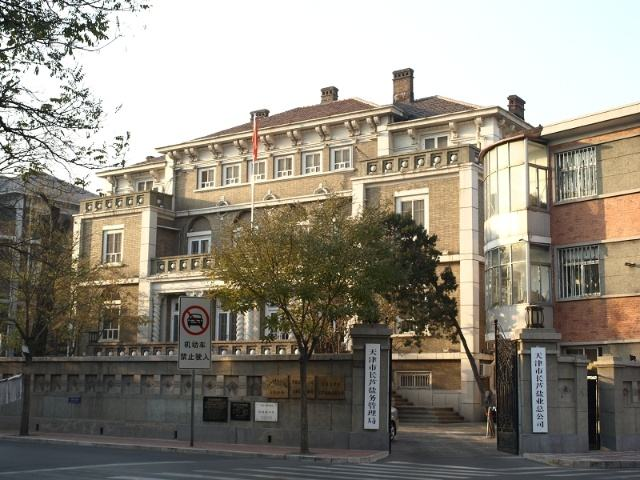
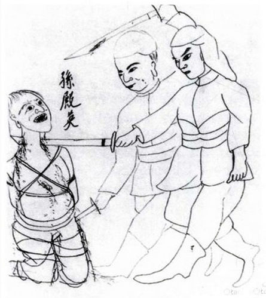
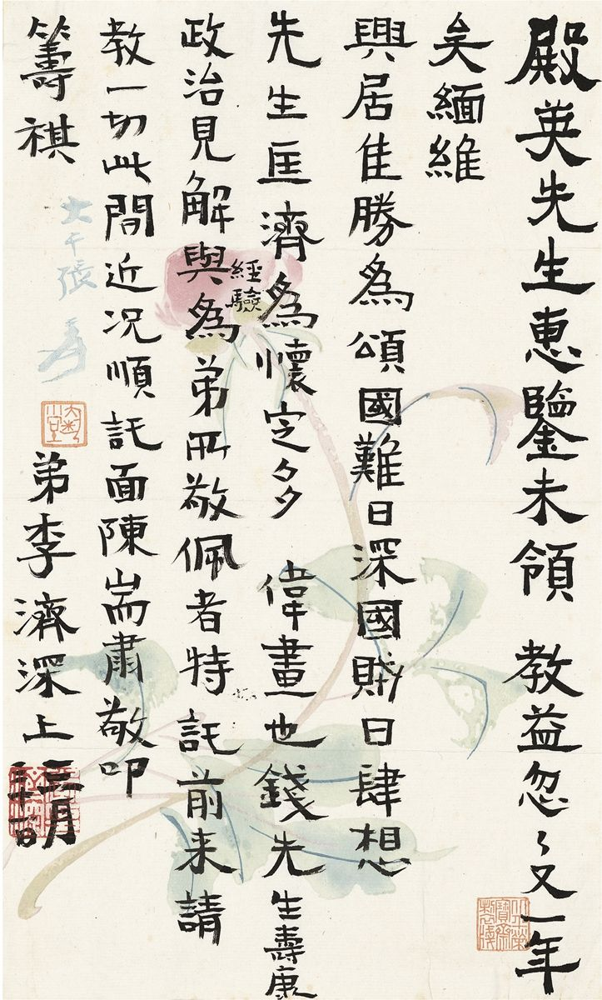
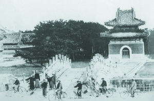

## nnnn姓名（资料）

### 成就特点

- 盗掠清东陵
- 多次投降​
- ​

### 生平

70年前的今天，堪比冯玉祥八姓家奴，盗挖慈禧墓的东陵大盗孙殿英毒瘾发作而死

孙殿英（1889年－1947年），字魁元，又字科元，乳名金贵，河南永城人，民国初年军阀，初为直系，历降镇嵩军、国民军、奉军、国民革命军、日军、汪精卫政府，二次大战日本投降后，又归顺蒋介石，成为国民革命军中将，国共战争中被解放军所俘，毒瘾发作而卒。其部队军纪败坏，杀掠无数，还曾盗掠清东陵，侵吞、毁损文物无数，恶名昭彰，人称东陵大盗。

讽刺的是，其子孙天义曾任陕西省政协副主席、黄帝陵基金会会长，专门保护、收藏古文物。

【烧学校房子的坏小孩】

1889年，孙殿英出生于河南永城马牧乡孙庄村。因出过天花，得外号“孙大麻子”。父亲为乡里出头与旗人争执，被打死于狱中。幼年在私塾学习时，因和同学吵架，被老师批评，乃放火烧私塾校舍，被勒令退学。以后，青年孙殿英成为赌徒，并染上鸦片烟瘾。

他参加民间秘密组织“庙道会”，并成为会首。1922年，他拉着会众投入属于直系军阀的河南陆军第一混成团，先当副官，后升任机枪连连长。

（清东陵）

【投降投降再投降】

1924年，第二次直奉战争，他扩大队伍到数千人。直系战败后，在陕西、河南等地掠夺维持军队，不久加入刘镇华的镇嵩军憨玉琨部。

1925年3月，憨玉琨部被国民军击败，孙殿英投降国民军，升任师长。不久，又脱离国民军，投入奉系山东张宗昌的部下，得到张宗昌赏识，先后任鲁联军第二十五师师长，第十四军军长。

1928年，在与国民党北伐军的战争中，张宗昌最终败北。5月，孙殿英向蒋介石投诚，被收编为国民革命军第六军团第十二军军长；

（孙殿英天津故居）

【真实版的盗墓笔记】

他率部队驻扎蓟县马伸桥，与清东陵只有一山之隔。孙殿英为筹措军饷，以军事演习为名，向遵化县征调大车30辆，盗挖了乾隆皇帝的裕陵与慈禧太后的定陵，收罗了大批珍宝。

孙殿英掘墓盗宝被发现后，满人哗然。部分旗人团体，以及逊清皇室，包括居住在天津日租界(张园)的溥仪等满人上告到蒋介石那里，要求严惩。此事一时轰动全国。

（东陵地宫）

1928年8月4日，孙殿英部三名逃兵被抓，查获其携带的宝珠36颗。据交待，其还在天津卖了10颗，得币1200元，这46颗宝珠是在慈禧地宫捡到的。一个士兵尚且能拥有46颗宝珠，那连、营、团、旅、师、军长所得的宝物就可想而知了。

1928年12月中旬，东陵盗案由军事法庭开庭调查，此后即归于沉寂。直至次年4月20日再开庭预审，至6月8日终审。因案情盘根错节，难以判决。这桩民国最大盗墓案，最终不了了之。

（东陵慈禧棺椁）

【与日军英勇作战】

1930年春，阎锡山和冯玉祥联合反蒋，声势极大，孙殿英离开蒋介石，依附于冯阎名下，被委任为第四方面军第五路总指挥。9月，张学良南下支援蒋介石，阎锡山败退。孙殿英改投入张学良，任第四十师师长，后升任第四十一军军长。

1933年2月，日军三万余人进攻热河，孙殿英奉张学良之命，率第四十一军由山西驰援热河，向赤峰前进；孙殿英进抵赤峰，展开阻击战，相持达七昼夜，后退往猴头沟门，继续与敌作战十余日，最终战败而后撤察哈尔；孙殿英趁机吞并了汤玉麟的两个骑兵旅、一个步兵团。孙殿英同日军勇敢作战赢得了舆论称赞。

（1933年，孙殿英（左一）与张学良（左四）等人合影）

【被“四马”击败隐退】

1933年5月，蒋介石委任孙殿英为“青海屯垦督办”；那时青海是军阀马步青、马步芳，马鸿宾、马鸿逵的“四马”天下。1934年1月，在蒋介石支持下，孙殿英部自绥远省欲进入宁夏省。“四马”联合起来共4万余人，武力抗拒孙殿英7万人，双方作战三个月，孙殿英战败。

1934年3月，孙殿英军队回退时，被阎锡山手下的傅作义晋绥军攻击，而缴械投降，军权被剥夺。自此孙殿英隐退山西晋祠及太原。

（菩陀峪定东陵明楼）

【投降日军的和平救国司令】

1936年6月，宋哲元任命孙殿英为察北保安司令。第二年，抗日战争爆发，孙殿英任冀北民军司令，抗击日军，队伍到一万多人。1938年夏，蒋介石委任他为新编第五军军长。孙殿英同日军交战，战绩良好，八路军和日本傀儡政权都想争取他。

1943年4月，日军出动二十万人进攻太行山区，包围孙殿英的防地（林县），孙殿英率部投降，当上“和平救国军”司令。

,孙殿英(前右)与日军.jpg)

【被俘毒瘾发作而死】

1945年8月，日本投降后，孙殿英又投诚蒋介石，被免去汉奸罪名。孙殿英任新编第四路军总指挥，收夺华北的汪精卫政权公有财产。1946年7月，第二次国共内战开始，孙殿英任第3纵队司令官。

1947年4月，在豫北战役中，同解放军在河南省汤阴激战，5月2日败北被俘。9月30日，孙殿英在河北省武安县解放军战俘营中，因毒瘾发作而死去，时年58岁。

（溥仪手绘《杀孙殿英》图）

【】

### 照片

