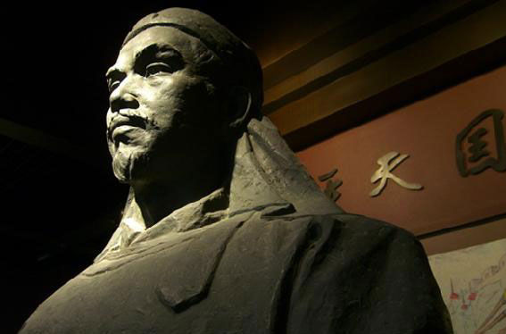
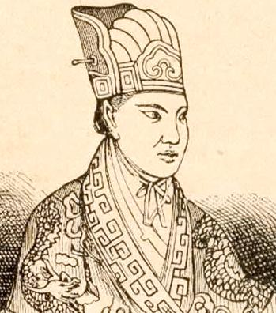
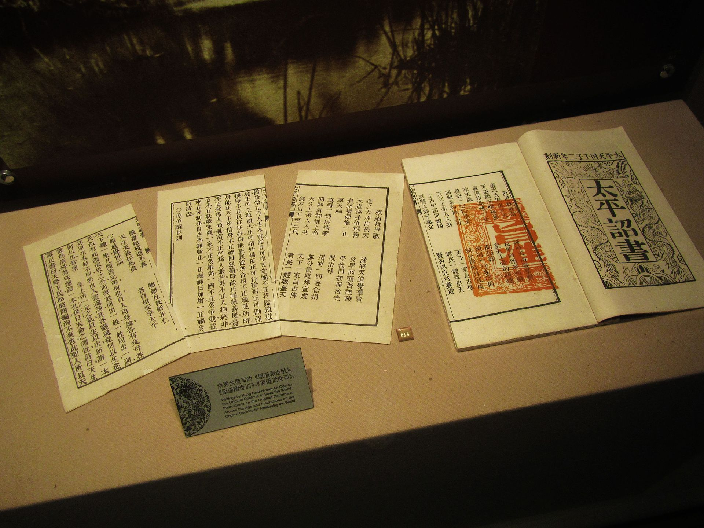
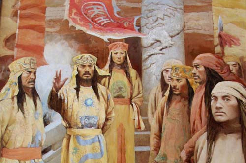
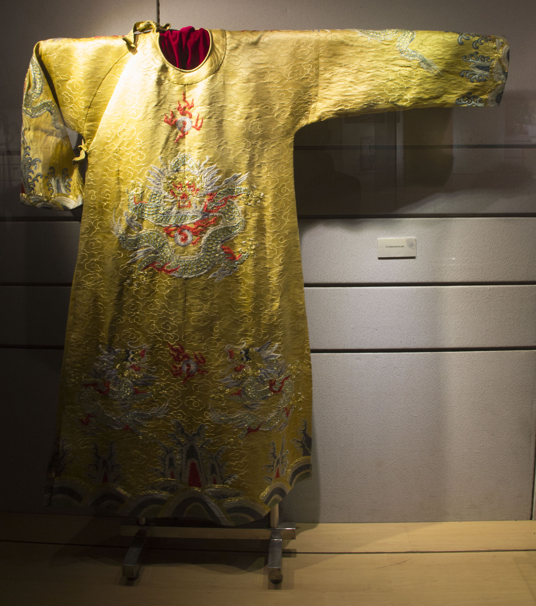

## 203年前的今天，自称天王的太平天国建立者洪秀全出生

适合所有人的历史读物。每天了解一个历史人物、积累一点历史知识。三观端正，绝不戏说，欢迎留言。  

洪秀全小传：87个妻妾，主张男女平等，一炮轰得灰飞烟灭的天王

【1814年1月1日】204年前的今天，上帝的二儿子，下凡诛妖的天王洪秀全生于元旦

洪秀全（1814年1月1日－1864年6月1日），广东花县（今广州市花都区）人，客家人。清末宗教组织拜上帝会创始人、太平天国的天王。

【下凡诛妖的耶稣幼弟】

1814年1月1日，洪秀全于生于广东花县（今广州市花都区）福源水村，原名洪仁坤，小名火秀。7岁起，在村中私塾上学。在经历三次府试都失败落选后，洪秀全生了一场大病，痊愈后，声称梦见天父着白袍，赐宝剑“云中雪”、印玺给他。耶和华在中文名为耶火华，天父指他名须避讳，必须用全（全拆字为人王，有自称君王之意）代替火字，洪秀全因而得名。

洪秀全1843年春天第四次参加了广州的府试，结果还是落选告终。回乡后，洪秀全翻阅偶尔得到的《劝世良言》一书，自认为是受上帝之命下凡诛妖，自认是上帝的幼子，耶稣的幼弟，称上帝耶和华为“天父”，称耶稣为“天兄”，把家里的孔子牌位换成了上帝的牌位。

（洪秀全画像）

虽然未曾读过《圣经》，洪秀全开始宣传他所理解的基督教教义，称之为“拜上帝会”。1844年，30岁的洪秀全和同乡冯云山转至广西一带传教。

不久洪秀全返回广东，冯云山留下发展。1845年后，在家乡的洪秀全写下《原道醒世训》、《原道觉世训》、《百正歌》等作品。1847年初，洪秀全来到传教士罗孝全在广州的礼拜堂学习了几个月，曾要求受洗，但罗孝全认为洪秀全对教义的认识不足够，拒绝为他施洗。洪秀全4个月后离开，其后再到广西会合冯云山，并陆续制订拜上帝会的规条及仪式。

（洪秀全所撰写的《原道救世歌》、《原道醒世训》和《原道觉世训》）

【仿照十诫编写的太平天国军规】

洪秀全说：“人心太坏，政治腐败，天下将有大灾大难，唯信仰上帝入教者可以免难。入教之人，无论男女尊贵一律平等，男曰兄弟，女曰姊妹。”洪秀全的“拜上帝会”在教义上模仿基督教，结合中国传统道德信条，仿照《旧约全书》所编的天条十诫，成为太平天国的军规。

第一，崇拜皇上帝
第二，不好拜邪神
第三，不好妄题皇上帝之名
第四，七日礼拜，颂赞皇上帝恩德
第五，孝顺父母
第六，不好杀人害人
第七，不好奸邪淫乱
第八，不好偷窃劫抢
第九，不好讲谎话
第十，不好起贪心

【妻妾成群的解放妇女先锋】

洪秀全的拜上帝会与地方衙门的矛盾日渐加深。1851年1月11日，在广西桂平的金田村举行起义，建号太平天国，洪秀全称天王；9月攻克永安后，分封东、西、南、北、翼诸王，各王均受东王杨秀清节制。1852年，太平军离开广西，1853年攻占南京，改名天京并定都于此。

太平天国举行第一次科举考试时，有史以来第一次特为妇女设立女科，拔取了女状元、女进士等。具有讽刺意味的是，洪秀全共有妻妾87人，皆称王娘。正室赖莲英称又正月宫，妃嫔依次有副月宫、又副月宫两等。

（金田起义）

【天京事变盛极而衰】

天王洪秀全与东王杨秀清的矛盾日渐加深。洪秀全密诏北王韦昌辉、翼王石达开、燕王秦日纲三人诛东王。1856年9月，发生天京事变，东王、北王与燕王先后被诛。翼王石达开在天京主政一段时间，1857年带领大军出走，脱离天王指挥。太平天国开始走下坡。

清军开始进迫天京，在陈玉成和李秀成等人支撑下，太平军在数年间挡住了清军的多次攻势。

1859年，族弟洪仁玕抵达天京，洪秀全封仁玕为军师、干王，名义上总理天国朝政。由于洪仁玕未有立功而封王，洪秀全怕其他人不服，再次大肆封异姓为王。

【刀戮火焚灰飞烟灭】

1862年，英王陈玉成被杀后，形势急转直下，天京附近据点逐一陷落。1864年3月，天京遭到包围后，城内粮食不足，洪秀全带头吃“甜露”（草团）充饥，因而致病。1864年6月1日，洪秀全病逝天京。洪秀全死后尸体被秘密葬在天王府的后花园内。

1864年7月30日，天京陷落之后，得到一个天王府宫女告密，在她的指引下，曾国荃从天王府的大殿内挖出了洪秀全的尸体。8月1日，曾国藩断然下达了最严厉的惩处方式：“戮尸，举烈火而焚之！”。焚尸后，曾国藩命人把骨灰和以火药，装入炮弹，然后接连发射出去，目的是要让洪秀全彻底灰飞烟灭，阴魂无归。

（洪秀全的龙袍）