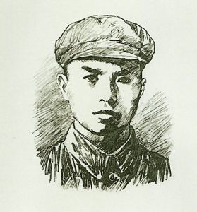
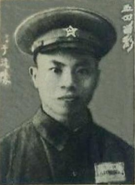
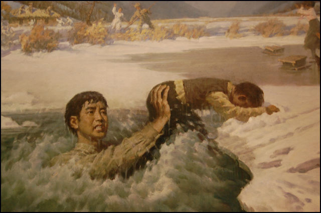
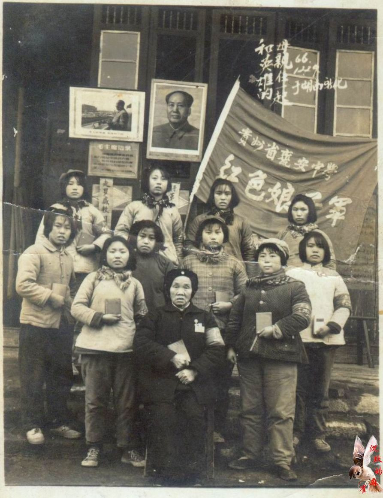

## 65年前的今天，从混饭吃的道士到国际主义战士的罗盛教因为救助落水儿童逝世

适合所有人的历史读物。每天了解一个历史人物、积累一点历史知识。三观端正，绝不戏说，欢迎留言。  

### 成就特点

- ​
- 罗盛教小传：从混饭吃的道士到国际主义战士，抢救朝鲜儿童的英雄
- 【1952年1月2日】66年前的今天，零下20度，跳入冰窟，抢救朝鲜落水儿童的罗盛教英勇牺牲
- 

罗盛教（1931年－1952年1月2日 ），湖南新化人，中国人民志愿军战士。1952年1月2日清晨，罗盛教在朝鲜，冒着零下20度的严寒，跳入冰窟，为抢救落水的朝鲜儿童而牺牲，年仅21岁。

1952年2月3日，为表彰罗盛教伟大的国际主义和革命英雄主义精神，追记特等功，并追授“一级爱民模范”称号。1953年6月25日，朝鲜追授一级国旗勋章和一级战士荣誉勋章。

罗盛教的故事曾入选小学语文教材，教育和激励了一代年轻人。

【从道士到解放军战士】

1931年，罗盛教出生于湖南新化一个贫苦农民家庭。由于家境贫寒，罗盛教11岁时才上小学，只念了一年半就失学了。为了有口饭吃，父亲将他送去当了道士。14岁那年，他到镇上叔叔开的杂货铺帮工。1946年，入湖南省立九师附小（吉首）就读，毕业后考入省立十三中学（高中部）。

1949年（18岁），罗盛教的家乡湘西重镇沅陵解放了。这年11月，罗盛教和几位同学步行来到沅陵，参加了中国人民解放军第四十七军，并考入湘西军政干校学习。

1950年3月毕业，分配在四十七军文书训练班学习。同年7月1日，加入中国新民主主义青年团。学习期满后，派在四十七军一四一师直属侦察连任文书。旋随部投入湘西武陵山地区的剿匪战斗，被分配到沅陵县乌宿区及毗邻的古丈县，参加四十七军司令部直属侦察队剿匪。

（1950年“五四青年节”摄于湖南省沅陵县）

【为救落水儿童而牺牲】

1951年4月，抗美援朝战争爆发，罗盛教响应党的号召，参加了中国人民志愿军，并随部队奔赴朝鲜，任志愿军第47军141师侦察队文书。参加了朝鲜战争秋季防御作战。

1952年1月2日清晨，罗盛教去河边练习投掷手榴弹。正值隆冬季节，河面已被厚厚的冰雪盖住，4名朝鲜少年在平安南道成川郡石田里附近的栎沼河上滑冰，笑声阵阵。忽然，传来了呼救声，一个名叫崔莹的少年不慎掉入了冰窟，另3名少年大声呼救。

罗盛教听到喊声，立即向出事地点飞奔，冒着－20℃的严寒，纵身跳入冰窟。过了好一会，罗盛教才浮出河面，深深吸了口气，又钻进水里。又过了一会，罗盛教终于将落水的崔莹托出水面。当崔莹两臂扒住冰面往上爬时，突然，哗啦一声，冰又塌了，少年连人带冰又落入水中。

几经周折，罗盛教冻得全身发紫，浑身打颤，体力很快消耗殆尽。他以惊人的毅力再次潜入水中，用尽最后的气力，将崔莹顶出水面。崔莹被拉上了岸，罗盛教因气力耗尽，无力浮出水面，献出了自己年轻的生命，牺牲时年仅21岁。

【获金日成题词的国际主义战士】

全村老百姓都赶到了河边，沉痛哀悼这位英雄的志愿军战士。村民们将罗盛教安葬在村庄边的佛体洞山。

1952年2月3日，为表彰罗盛教伟大的国际主义和革命英雄主义精神，人民志愿军为他追记特等功，并追授“一级爱民模范”称号。同年4月1日，团中央追授他“模范青年团员”称号。

1953年6月25日，朝鲜追授他一级国旗勋章和一级战士荣誉勋章。并将其献身的栎沼河改名为“罗盛教河”，崔莹的家乡石田里改名为“罗盛教村”，安葬他的佛体洞山改名为“罗盛教山”。他去世后，朝鲜人民在“罗盛教山”上修建了“罗盛教纪念亭”和“罗盛教纪念碑”，碑上镌刻着金日成的题词“罗盛教烈士的国际主义精神与朝鲜人民永远共存”。

（金日成为罗盛教题词）

（1966年，英雄的母亲与贵州省瓮安中学学生合影）