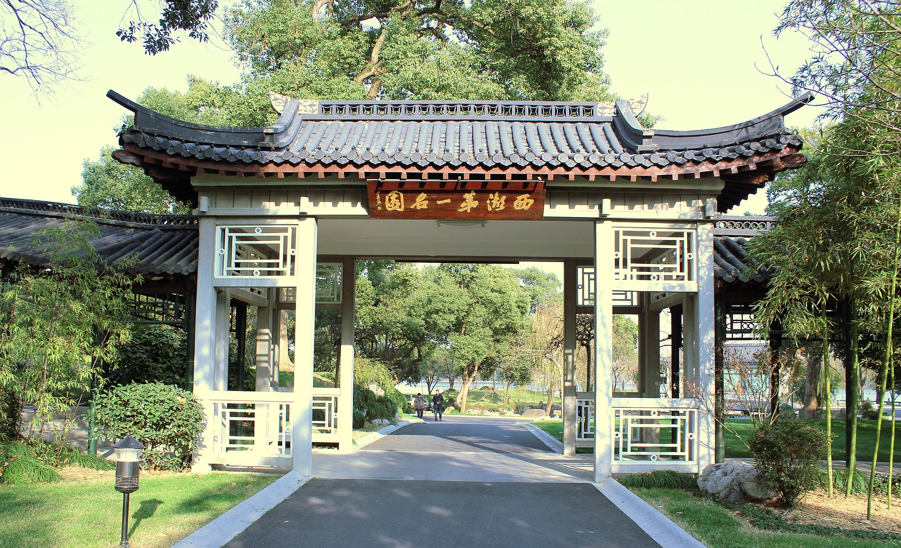
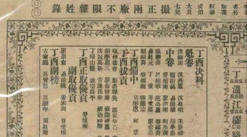
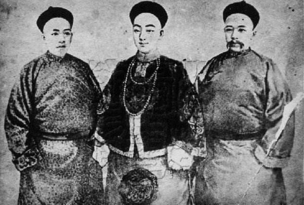
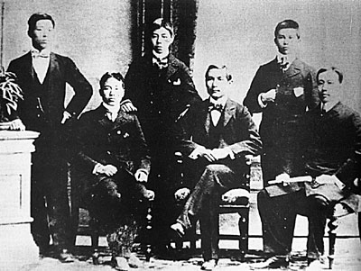

## 82年前的今天，文可华国，富可敌国，妾可倾国的晚清“两面人”刘学询去世。

适合所有人的历史读物。每天了解一个历史人物、积累一点历史知识。三观端正，绝不戏说，欢迎留言。

  刘学询小传：文可华国，富可敌国，妾可倾国的晚清两面人

【1935年1月3日】82年前的今天，资助孙中山，想要当皇帝的刘三国刘学询去世

（李鸿章与港督卜力会面。站于李鸿章右侧者即为刘学询）

刘学询（1855年－1935年1月3日），广东省香山县人（今中山市），孙中山的同乡，曾任李鸿章的顾问，私下捐助孙中山革命。刘学询身上折射了光怪陆离的晚清乱象：他是李鸿章的幕僚，但绝非清廷的捍卫者；他与康有为交恶，却并不是共和的拥趸；他是革命的参谋和资助者，却怀有一个皇帝的梦想。

冯自由《革命逸史》记载，1900年惠州起义时，孙中山为了向刘学询借钱，答应让他当总统或者皇帝。孙中山的书信写道：“今特遣深信人周君平山来见足下，面托足下主持内局，先立一暂时政府，以权理政务。政府之格式，先以五人足矣：主政一人，或称总统，或称帝王，弟决奉足下当之，故称谓由足下裁决。”

策反、谋杀、密谈，玩腻了晚清的政治万花筒后，渐渐老去的刘学询退隐于西子湖畔，创建了一座奢华的“西湖第一名园”来消减自己的惆怅，人称“西湖刘庄”。解放后，这里一度成为毛泽东的西湖行馆，现为“西湖国宾馆”。

【靠聚赌而致富的刘三国】

刘学询（1855—1935），广东省香山县人（今中山市），孙中山的同乡。

1879年中举人。1886年中进士。因不愿在京城苦等官缺，便回乡经商，在广州承办“闱姓”赌局。“闱姓”，是贩卖彩券，猜每年中科举的上榜人姓名的一种赌博。

刘学询因聚赌而致富，又加上其善文、娶美妾。人称刘三国；文可华国，富可敌国，妾可倾国。

【向慈禧推荐孙中山】

刘学询的回忆录《总理史实访问记》中记载，他与孙中山最早在澳门见面，二人的合作由此开始。那时，孙中山在澳门行医。“（刘学询）资助了共计三十几个电汇款项，数目从五千到五万不等。每笔款子他都保留了存根。”

1895年，孙中山在广州创办农学会，刘学询加入。农学会名为研讨农桑之事，实为革命策划机构。

1899年，刘学询在奉命出使日本前，曾上密折荐孙中山，“加保荐总理才堪大用，万不宜任其浪迹海外”。慈禧看后表态：“今联日已妥，新政待举，正需孙文回国效用。”

【铲平康梁祖坟的监督人】

1896年，康有为考中进士，弹劾控告其他大臣，牵连到刘学询，两人因此结下梁子。1899年，刘学询出使日本名义是考察商务，实际目的是引渡康梁。岁末，刘学询成了李鸿章的幕僚。1900年3月，李鸿章奉命铲平康梁祖坟，监督人就是刘学询。

当时康梁也展开了刺杀、绑架刘学询的计划。梁启超构思了两种针对刘学询的计划。一是派刺客扮成记者刺杀。一种是绑架刘学询，索要10万元存款，将刘学询争取过来。最终，刺杀方案被采纳。“（1900年4月24日），（刘学询）从澳门返回广州时中枪，枪打在扣子上了，皮肤受伤。”

【没能成功的两广独立】

“两广独立”构想最初是孙中山的老师何启提出，但具体运作中的活跃者却是刘学询，虽然没有确切的史料证明他的直接动机。

1900年5月24日，李鸿章被任命为两广总督。6月21日，清廷发布招抚义和团和向八国联军宣战的上谕。何启建议利用港督卜力，劝李鸿章独立，孙中山同意了这个设想。刘学询获悉后，一跃成了“两广独立”操盘手。他一边劝李鸿章参与“两广独立”，一边给孙中山写信，让他到广东来协商。

但是，李鸿章还是迟疑观望。7月8日，清廷任命李鸿章为直隶总督兼北洋大臣，催促他北上。权衡后，李鸿章同意担任议和全权大臣。之后卜力在香港和李鸿章举行会谈。会谈中，李鸿章对孙中山态度大变，劝告卜力禁止颠覆分子利用香港作为基地，“两广独立”计划告吹。

【没收到的“鸡毛信”】

“两广独立”未遂后，郑士良领导的惠州三洲田起义爆发。起义初期连连告捷，俘虏了数百清军，还在短期内聚集了两万人马。孙中山抵达台湾，筹集军资和人力支援惠州。

一月前，孙中山写了一封信，委托日本人平山周送给在上海的刘学询。但平山周没有将信送到，而是回到日本，试图说服日本当局援助惠州起义，但未成功。这封信的直接动机，是要求刘学询提供惠州起义急需的巨额资助。信中写道：“故求足下及杨、李同志等，即速代筹资百万交周君汇带弟处，以便设法挽回大局，而再造中华也。”

在这封信中，孙中山除了陈列具体的起义计划外，还作出了许诺，让刘学询在起义成功后当总统或者皇帝，“今特遣深信人周君平山来见足下，面托足下主持内局，先立一暂时政府，以权理政务。政府之格式，先以五人足矣：主政一人，或称总统，或称帝王，弟决奉足下当之，故称谓由足下裁决。”

满怀帝王梦想的刘学询，没有看到这封承载着帝王梦的“鸡毛信”。1900年10月下旬，惠州起义失败。信中的设想成了空谈。

【隐居刘庄国宾馆】

45岁那年，刘学询带着他破碎的政治野心，在杭州西湖隐居。保皇、君主立宪、共和，这些字眼，对他陌生而遥远。他凄然写道：“自惭转蓬身世，盖自卅年养晦，早已万念皆空。”

1935年1月3日，刘学询在刘庄去世，终年80岁。数十年前，在这位奇人的庄园内有一副楹联，概括了他烟雨人生后的复杂心境：“先生何许人，天半朱霞，云中白鹤；君言不得意，风情张日，霜气横秋。”

解放后，这里一度成为毛泽东的西湖行馆，现为“西湖国宾馆”。刘学询身后，刘庄发生过两件大事：新中国第一部宪法草案在这里诞生，《中美联合公报》在这里草签。

