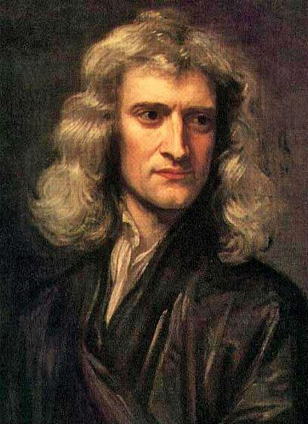
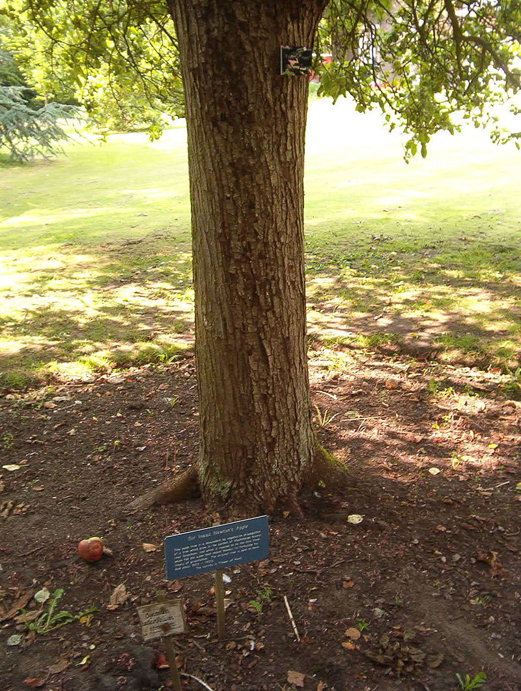
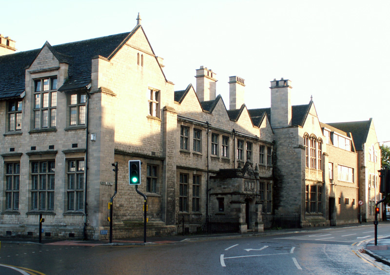
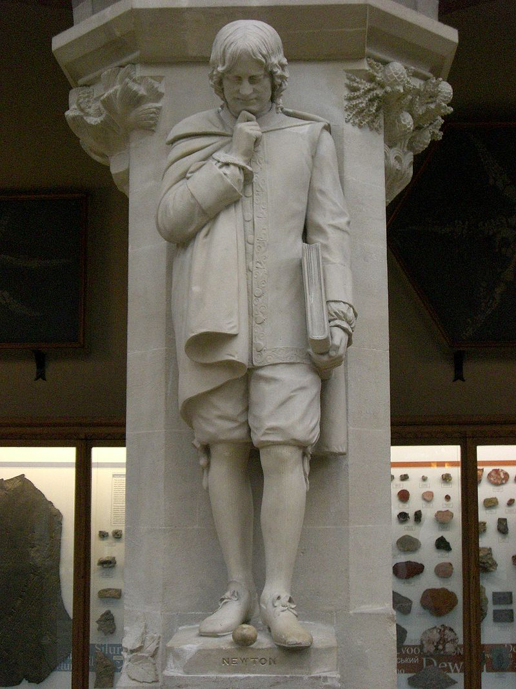
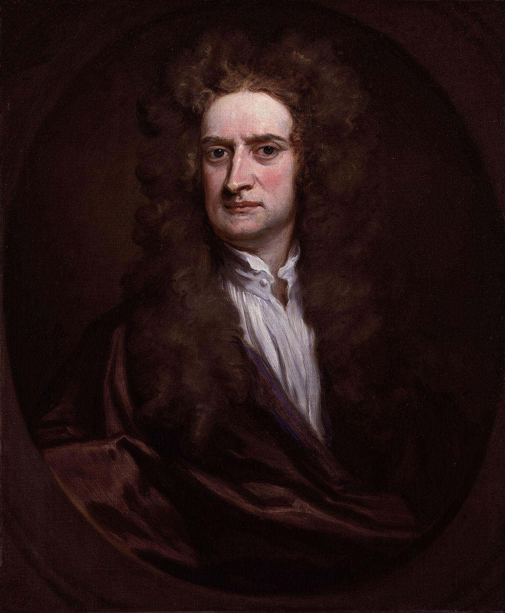
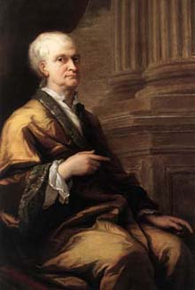
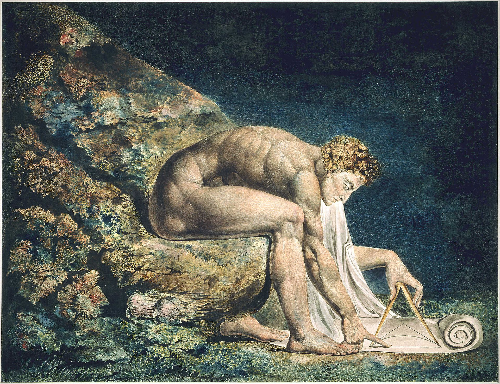
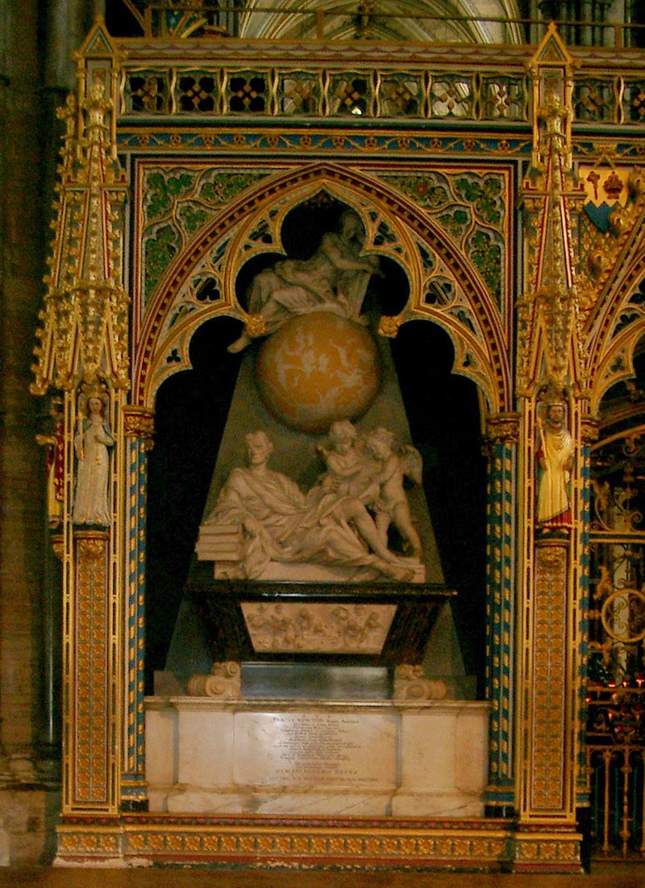

## 364年前的今天，最后一位伟大的炼金术士牛顿出生

适合所有人的历史读物。每天了解一个历史人物、积累一点历史知识。三观端正，绝不戏说，欢迎留言。  

牛顿小传：炼金术士、皇家铸币厂的老大、被国葬的科学家

【1643年1月4日】364年前的今天，最后一位的炼金术士和最伟大的科学家牛顿出生

牛顿（1643年1月4日－1727年3月31日），英格兰物理学家、数学家、天文学家、自然哲学家和炼金术士。

他发表《自然哲学的数学原理》，阐述了万有引力和三大运动定律，奠定了此后300年里力学和天文学的基础。他论证了地面物体与天体运动遵循着相同的自然定律；为太阳中心学说提供了强而有力的理论支持，推动了科学革命。

在力学上，牛顿阐明了动量和角动量守恒的原理。在光学上，他发明了反射望远镜，并基于对三棱镜将白光发散成可见光谱的观察，发展出了颜色理论。在数学上，牛顿与莱布尼茨分享了发展出微积分学的荣誉，证明了广义二项式定理，提出了“牛顿法”以趋近函数的零点，为幂级数的研究作出了贡献。

牛顿的墓志铭写到：“自然和自然的法则隐藏在黑暗之中。上帝说：让牛顿出世吧，于是一切豁然开朗。”在2005年，英国皇家学会进行了一场“谁是科学史上最有影响力的人”的民意调查，牛顿当选为第一名。

（被称为牛顿苹果树后代的一颗苹果树）

【一生唯一的罗曼史】

1643年1月4日，牛顿出生于英格兰。牛顿3岁时，他的母亲改嫁，年幼的牛顿不喜欢他的继父，他甚至曾经写下：“威胁我的继父与生母，要把他们连同房子一齐烧掉。”

从12岁左右到17岁，牛顿都在国王中学学习，他寄宿在当地的药剂师威廉·克拉克家中，并与药剂师的继女安妮·斯托勒订婚。之后斯托勒小姐嫁给了别人。此后牛顿再也没有其他的罗曼史，终生未娶。

（牛顿曾就读的国王中学）

【国王批准的数学教授】

1661年6月，他进入了剑桥大学的三一学院。牛顿开始阅读笛卡儿、伽利略、哥白尼和开普勒等先进的思想著作。

1667年（24岁），牛顿获得奖学金，作为研究生重返剑桥大学三一学院。按照规定，只有被正式任命的牧师才有资格成为剑桥大学的研究生。但是牛顿持有非正统的宗教观点，不愿意成为牧师。因此牛顿牧师职位的任命被无限期地延后。

后来牛顿被任命为卢卡斯数学教授席位时，就不可能回避牧师职位这一问题了。牛顿最终获得了查理二世的许可，才绕开了这一限制。

（牛津大学里的牛顿雕像）

【广泛的伟大成就】

他发现了广义二项式定理，还发现了牛顿恒等式、牛顿法，分类了立方面曲线，首次使用了分式指数和坐标几何学得到丢番图方程的解。他用对数趋近了调和级数的部分和，首次使用幂级数和反转幂级数。他还发现了π的一个新公式。

他研究了光的折射，表明棱镜可以将白光发散为彩色光谱，也可以将彩色光谱重组为白光。牛顿还注意到，我们观察到的颜色是物体与特定有色光相合的结果，而不是物体产生颜色的结果。他还发明了反射望远镜（现称作牛顿望远镜）。

《自然哲学的数学原理》于1687年7月5日出版。该书中牛顿阐述了被视作真理的三大运动定律。牛顿使用拉丁单词“gravitas”（沉重）来为引力命名。在这本书的出版使牛顿成为当时最有影响力的科学家。

（牛顿自己的《自然哲学的数学原理》副本）

【最后的炼金术士】

牛顿在与神智学家亨利·莫尔接触后，燃起了对炼金术的兴趣，并改用源于赫密斯神智学中，粒子相吸互斥思想的神秘力量来解释，替换了先前假设以太存在的看法。拥有许多牛顿炼金术著作的经济学大师凯恩斯曾说：“牛顿不是理性时代的第一人，他是最后的一位炼金术士。” 

但牛顿对炼金术的兴趣却与他对科学的贡献息息相关，在那个时代炼金术与科学没有明确的区别。如果他没有依靠神秘学思想来解释穿过真空的超距作用，他可能也不会发展出他的重力理论。

【30年皇家铸币厂的监管】

1696年，牛顿通过了当时的财政大臣的提携，迁到了伦敦，任皇家铸币厂的监管，一直到去世，长达31年。他主持了英国最大的货币重铸工作。

1703年，牛顿成为皇家学会会长和法国科学院的会员。

（1712年，牛顿的肖像画）

【沾污了的微积分之争】

多数现代历史学家都相信，牛顿与莱布尼茨分别独立发明了微积分学。1699年初，皇家学会（牛顿也是其中的一员）的成员们指控莱布尼茨剽窃了牛顿的微积分成果，这导致了激烈的牛顿与莱布尼茨的微积分学论战。

最终英国皇家学会宣布牛顿是微积分真正的发明者，斥责莱布尼茨剽窃。但后来人们发现该调查评论莱布尼茨的结语是牛顿本人书写。这场持续多年的激烈纠纷，沾污了牛顿与莱布尼茨声誉，直到莱布尼茨在1716年去世后才暂时停止。

【国葬的自然科学家】

牛顿于1727年3月31日在伦敦逝世，于西敏寺举行国葬，成为史上第一个获得国葬的自然科学家。1970年代，对牛顿头发的化学分析显示其中水银含量比正常值超出50多倍，最可能的解释是他从事炼金术所致。

英格兰诗人亚历山大·蒲柏为牛顿写下了以下这段墓志铭：“自然和自然的法则隐藏在黑暗之中。上帝说：让牛顿出世吧，于是一切豁然开朗。”

（威斯敏斯特教堂内的牛顿之墓）