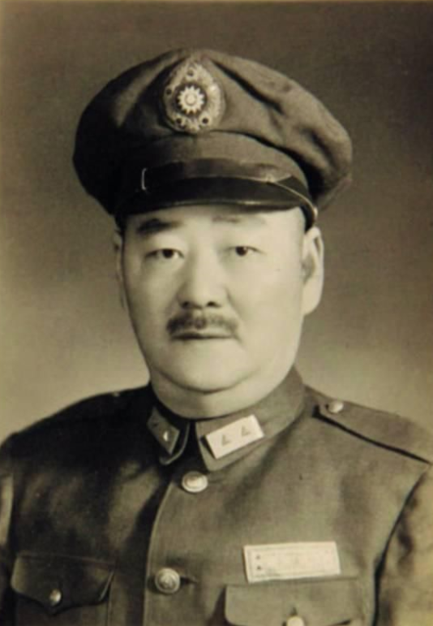
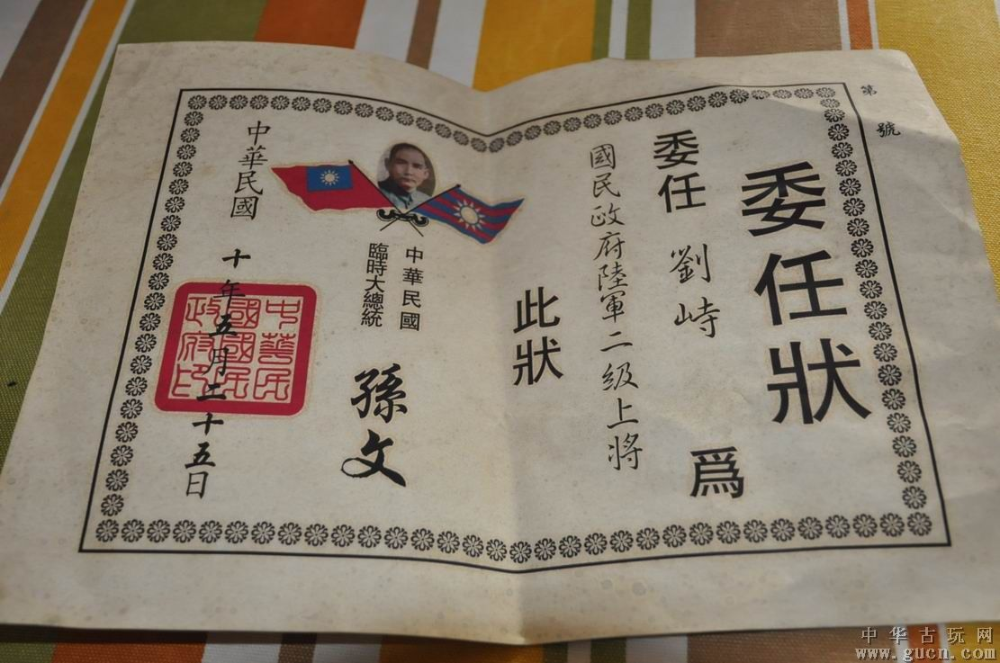
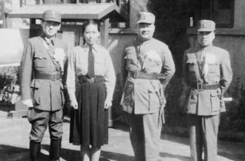
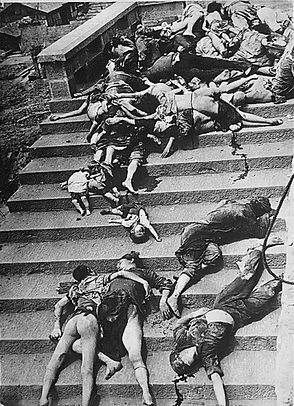
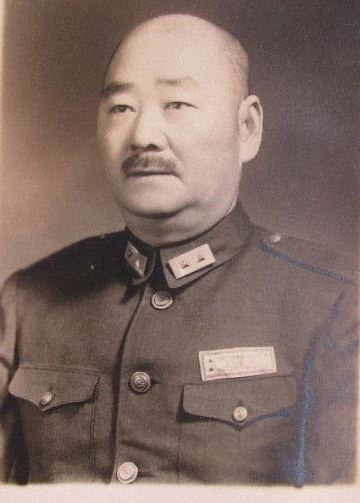
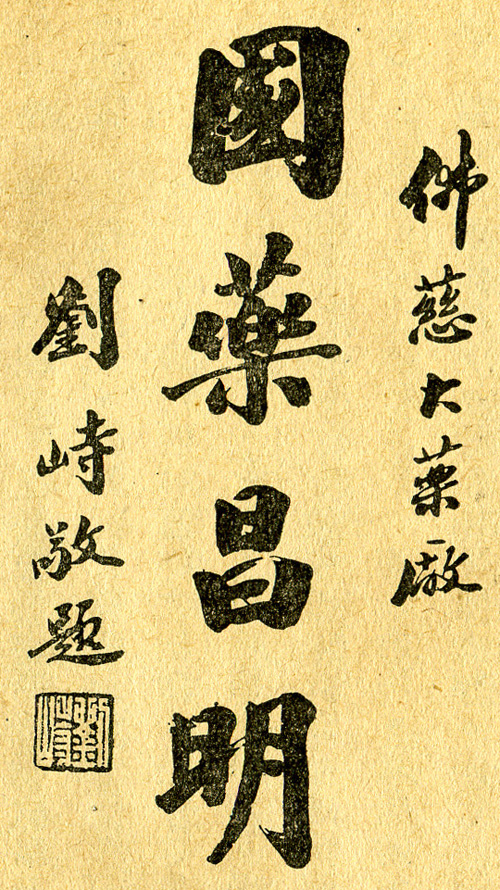

## nnnn姓名（资料）

适合所有人的历史读物。每天了解一个历史人物、积累一点历史知识。三观端正，绝不戏说，欢迎留言。 

刘峙小传：北伐的福将、中原大战的常胜将军、抗战的长腿将军、内战的猪将军

【1971年1月5日】 47年前的今天，听话的福将、长腿将军和猪将军刘峙去世

刘峙（1892年6月30日－1971年1月5日），江西吉安人。国民革命军陆军二级上将，曾任黄埔军校教官，参与北伐、中原大战等多场战事，甚得蒋介石赏识。抗战时曾任第一战区第二集团军司令，第五战区司令。1948年被任为徐州剿共总司令，被解放军全线击败。1954年到台湾，1971年病逝。

刘峙是民国江西五上将之一，素有北伐战争中的“福将”、中原大战中的“常胜将军”、抗日战争中的“长腿将军”和国共内战中的“猪将军”之称。

抗日战争中，刘峙虽屡战屡败，但很受蒋介石重用，连宋美龄都劝道：“外边闲话很多，刘峙恐不能再指挥作战吧？”但蒋介石却不以为然说：“刘峙打仗是不行，可你说，将领中还有谁比他更听话呢？”

（刘峙委任状）

【北伐战争中的“福将”】

1892年6月30日，刘峙出身一农民家庭，父亲早亡，由祖父养育。年幼时受私塾教育，曾东渡日本，恰逢日本驱逐中国留学生而回国。之后入读湖南陆军小学，进入武昌陆军中学。

1914年底（22岁），入保定军校，第二期步兵科毕业。毕业后到广东，先在岑春煊部下任参谋，后到云南滇军朱培德部下任连长。护法时期，随军到广东，曾与陆荣廷、陈炯明等作战。

黄埔军校成立后任战术教官，兼参谋科长。黄埔官兵成立教导团时，刘峙任营长，与陈炯明作战立有战功。1927年，黄埔党军改为国民革命军第一军，刘峙任第一师副师长，后升任师长，北伐时攻打武昌、南昌等地，升任第一军军长，被称为北伐战争中的“副将”。

.jpg)

【中原大战中的“常胜将军”】

北伐成功后，国军缩编，刘峙被任为第一师师长。之后蒋介石与桂系之间发生中原大战，刘峙被蒋介石任命为第二路军总指挥，进攻武汉，成功击败桂系，成为中原大战中的“常胜将军”。

1930年（38岁），中原大战结束后，刘峙任驻豫绥靖公署主任，兼河南省政府主席。1932年至1934年，参与对红军围剿，成功击破红四方面军根据地。蒋介石曾将河南新集改名为经扶县，作为嘉奖。

（张治中（左一）、刘峙（左三）等接见杨惠敏）

【抗日战争中的“长腿将军”】

1937年，抗日战争爆发。抗战初期，刘峙任第一战区副司令，兼任第二集团军总司令，在平汉铁路北段地区指挥作战。他被日军击败，从保定一直撤退至石家庄，事后被撤职，改任重庆卫戍司令。

1941年6月，日军对重庆发动大空袭。军民在进入防空洞躲避空袭时，发生严重拥挤踩踏事故，死亡人数一般认为2000人至3000人，史称隧道惨案。身兼防空司令的刘峙被撤职。

1945年2月，接任李宗仁为第五战区司令。

（重庆隧道惨案中遭践踏致死者）

【国共内战中的“猪将军”】

1946年，第二次国共内战全面爆发，任郑州绥靖公署主任的刘峙率部进攻位于中原地区的李先念部军队，结果是被包围的5万中国共产党的军队成功摆脱了30余万国民政府军的围剿。

1947年，刘伯承、邓小平突破刘峙封锁，成功作战略转移，进至大别山一带，威胁南京。刘峙被免去所有职务。

1948年5月，刘峙被推荐为徐州“剿总”总司令。当时国军将士对其能力已多有不服。《杜聿明回忆录》记录，第五军军长邱清泉就不屑的说：“徐州是南京的大门，应派一员虎将（指薛岳）把守。不派一虎，也应派一狗（指顾祝同）看门。今派一只猪，眼看大门守不住。”

果然国军在淮海战役中战败，而刘峙单独得以安全脱离，再被撤职。

【逃到台湾的晚年】

1949年到香港，1950年到印尼以教中文为生。1953年（61岁），获准赴台，任总统府国策顾问，获颁青天白日勋章。定居台中。著有《我的回忆》等。

1971年1月5日（79岁），病逝于台中。

