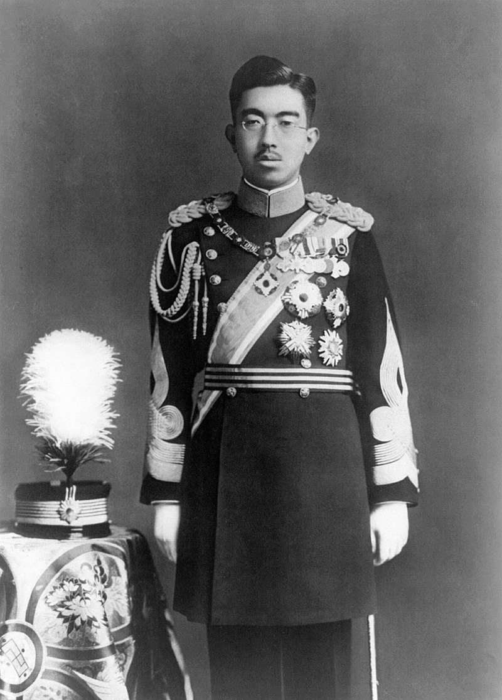
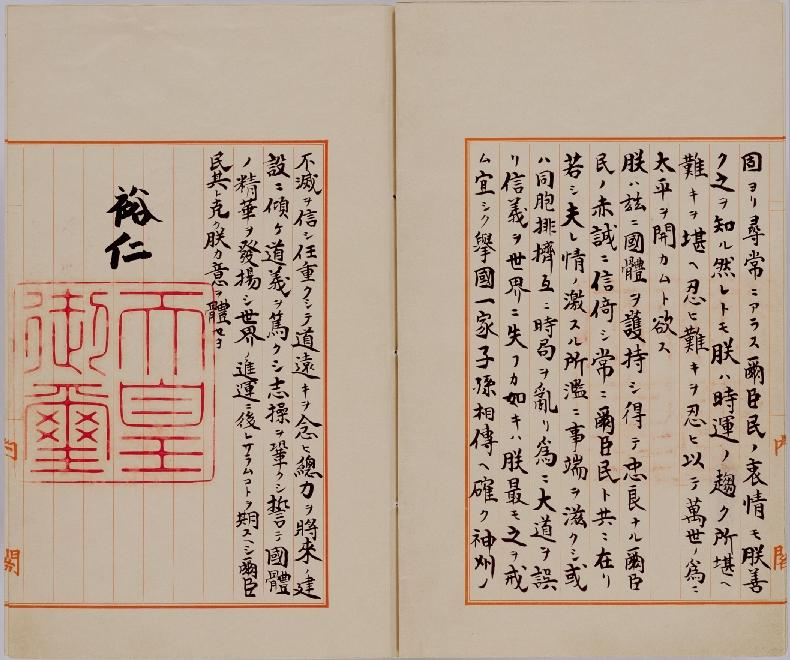
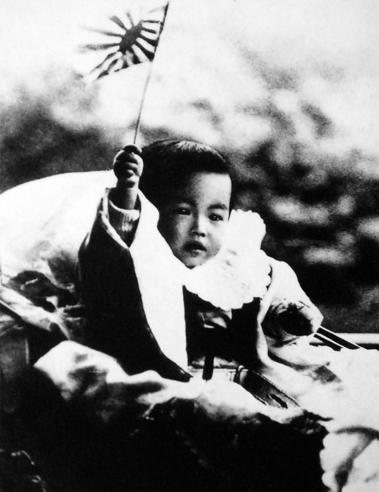
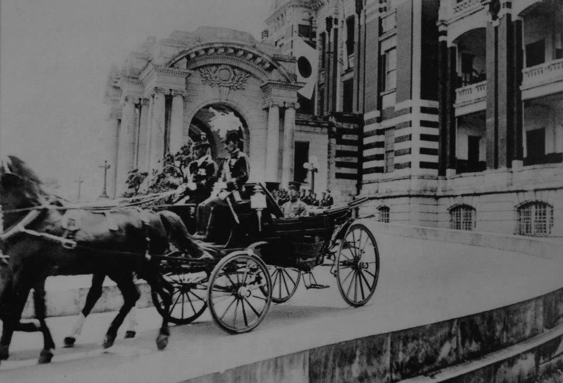
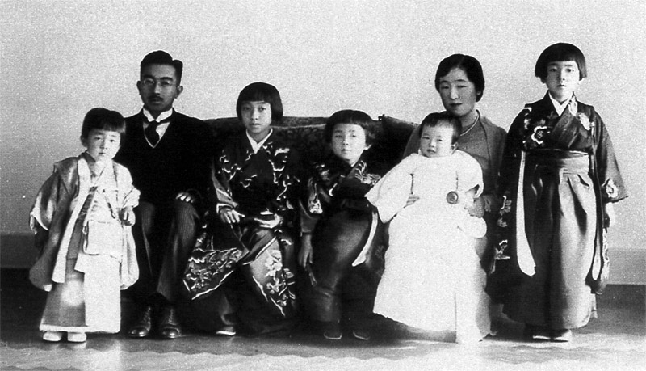
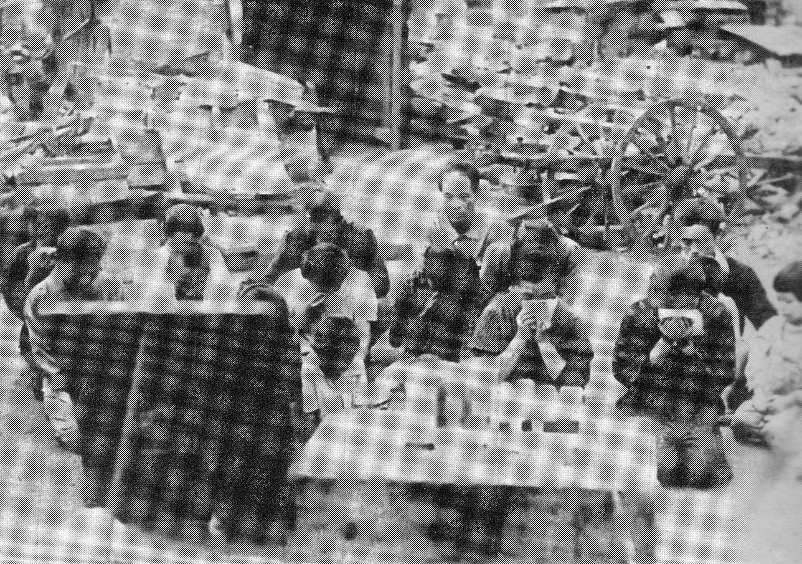
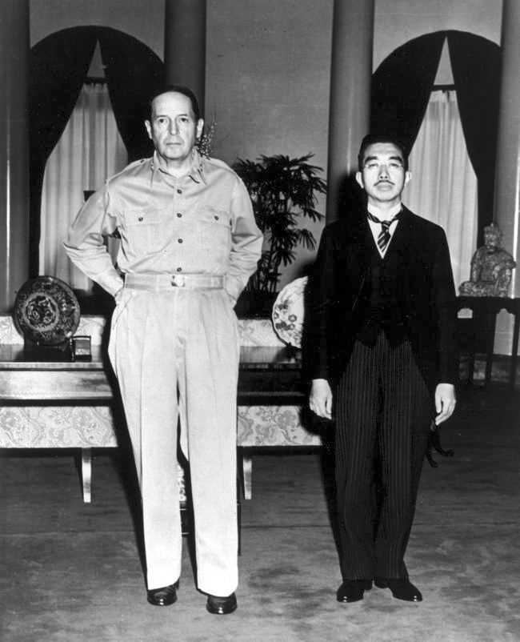
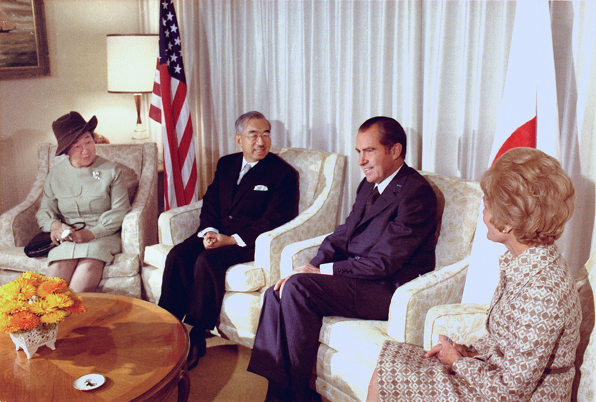

## 28年前，逃过二战战犯刑罚的昭和天皇逝世

适合所有人的历史读物。每天了解一个历史人物、积累一点历史知识。三观端正，绝不戏说，欢迎留言。  

### 成就特点

昭和天皇小传：在位时间最长、最长寿的天皇，此后天皇变成了凡人

【1989年1月7日】29年前的今天，宣布投降、逃过惩罚的“头号战犯”昭和天皇裕仁去世

### 

昭和天皇（1901年4月29日－1989年1月7日）是日本第124代天皇（1926年－1989年在位），名裕仁，为现任天皇明仁的父亲。出生时称号为迪宫，徽印印号为若竹。除了日本神话中的天皇外，他是历代天皇中在位时间最长、寿命最高者，也是史上在位时间最长的国家元首之一。

其在位期间经历第二次世界大战，日本战败后，裕仁在1945年8月14日发表《终战诏书》，宣布无条件投降，并亲自宣读和录音。日本投降后，中国、英国、苏联、澳大利亚、新西兰等国都要求将裕仁列为日本头号战犯。最后在麦克阿瑟操纵下，不但天皇免于审判，连同23名担任高级将领的皇族亲王也受到保护，全体不起诉。

战后依照新宪法昭和天皇失去政治上的实权，以作为日本国家与国民象征而存在。1989年1月7日，裕仁因患十二指肠癌去世，终年87岁。昭和天皇有一句名言：“问题不在我们干了什么，而在于全世界对我们所干的事情有什么反应”。

（《终战诏书》手稿——昭和天皇同意无条件投降的诏书）

【尚武教育下的明治皇孙】

昭和天皇在1901年（明治34年）4月29日生于东京赤坂区青山御所，父亲是皇太子嘉仁亲王（后来成为大正天皇），母亲是皇太妃九条节子（后来成为贞明皇后），祖父是当时的明治天皇。明治天皇对于这个小孙子宠爱有加，当日命令宫内的御用文人为皇孙取名裕仁、号迪宫。

作为一个充斥军国主义思想国家的准皇储，裕仁从小就被有意识地培养尚武的性格。刚刚出生70天，就被寄养在海军中将川村纯义的家里长达4年。

1908年（7岁），裕仁进入了“皇室”学习院，院长是日俄战争中的乃木希典陆军大将。明治天皇亲自指示乃木要努力将裕仁培养为“质实刚健”之辈。如此教育之下，裕仁自小就被种下了崇尚武力的想法。

（1902年，手举旭日旗的迪宫裕仁亲王）

【继续学习的皇太子】

1912年7月30日，明治天皇崩御，嘉仁亲王继位成为了大正天皇，11 岁的裕仁成为了皇太子。在明治正式大葬的前两天，乃木希典突然拜见裕仁，赠予他《中朝事实》和《中兴鉴言》。两日后，乃木与妻子一起在家中为明治天皇自裁殉死，这个事件给年幼的裕仁造成了极大的刺激。

1914年，裕仁从学习院初等科毕业，前往“东宫御学问所”继续学习7年，“东宫御学问所”的总裁是东乡平八郎海军大将，而东乡平八郎的军国主义路线较乃木希典有过之而无不及。裕仁继续走在军国主义的路上。

（自杀之日的乃木希典夫妻）

【旅行欧洲后的摄政王】

1918年， 久弥宫良子被内定为太子妃。1921年，刚满20岁的裕仁前往欧洲，展开长达半年的旅行访问，裕仁特地去了拿破仑墓地，并带回了一个拿破仑的半身像，将其摆在自己书房内（战后多摆了一个林肯像，后来又摆了达尔文像）。在这次出巡中，他接见了驻欧洲的十几个日本武官的参拜，获得了以永田铁山、小畑敏四郎、冈村宁次为首的日本青年军官宣誓效忠。

欧行后两个月，因大正天皇重病，1921年11月25日，裕仁开始摄政。由于发生国难 “关东大地震”，裕仁和久弥宫良子的婚礼延至1924年1月26日才正式举行。

（台湾总督府前面的摄政皇太子）

【走向军国主义的天皇】

1926年12月25日（25岁），大正天皇驾崩，裕仁登上皇位。当时日本正日益民主化，于是裕仁采用昭和作为年号，出自《尚书》的“百姓昭明，协和万邦”。尽管年号中包含和平的含义，但日本却很快地走上了军事扩张之路。1931年日本侵略中国东北，建立了“满洲国”傀儡政权。

1936年2月26日，“皇道派”极端狂热的法西斯主义少壮派军官发动了“二二六兵变”，在裕仁的严令下被镇压，结果是日本军部内部的“统制派”抬头，完全控制了中央政府和军队，走向了军国主义的道路。

（1928年，登基大典时的昭和天皇）

（1936年，日本皇室家族合影）

【原子弹下的共荣圈】

1937年，中日战争开始，日本很快吞并了大部分东亚地区，使其加入“共荣圈”。裕仁被指责同意导致这场战争的对外政策，并批准近卫文麿与纳粹德国希特勒、意大利墨索里尼结成法西斯主义轴心国，发动第二次世界大战亚洲战场战争，侵略中国等国家。

1941年12月7日，日本突然袭击美国夏威夷群岛珍珠港海军基地。第二天，裕仁颁布《对英美两国宣战诏书》，致使美国及其盟国加入对日战争，开启太平洋战争序幕。

1945年8月，美国向日本投下两颗原子弹后，裕仁同意投降接受波茨坦公告，其中“无条件投降”暗含一个条件：不废除天皇。8月15日，裕仁通过无线电广播，史无前例地向日本民众解释投降原因。此段广播被称为“玉音放送”。然而，《终战诏书》使用了大量汉语文言，大多日本平民无法理解广播内容。

【未被惩罚的战犯】

战后，包括苏联在内许多国家要求日本取消君主制，并让天皇接受战犯审判，但是美国因策略需要，麦克阿瑟最终表示，裕仁对第二次世界大战并不负主要责任。这一观点得到日本人极大欢迎。

1946年元旦，昭和天皇发布《人间宣言》，否定天皇神圣地位，承认自己与平民百姓一样也是人类，并不是神。
在驻日盟军总司令麦克阿瑟的干预下，1947年通过新的日本宪法，使天皇这一最高统治者的位置变为了一个虚位元首，而提出最高统治权归人民所有，真正实行立宪民主。

（1945年，裕仁会见麦克阿瑟）

【拒绝参拜甲级战犯】

1952年至1975年，昭和天皇曾八度参拜靖国神社。但在1978年靖国神社合祀甲级战犯后，就不再去参拜。1987年9月22日，昭和天皇被诊断出十二指肠癌。1989年1月7日早6时33分，昭和天皇于吹上御所驾崩，享寿87岁。

2月24日，昭和天皇的葬礼在新宿御苑举行，包括中国外交部长钱其琛在内的数十国代表出席了葬礼。昭和天皇于当天下午被葬在八王子市的武藏野陵，陪葬品达一百余件，其中包括昭和天皇生前采集的贝类标本、生前爱用的显微镜等。

（裕仁与尼克森，1971年）