## nnnn姓名（资料）

适合所有人的历史读物。每天了解一个历史人物、积累一点历史知识。三观端正，绝不戏说，欢迎留言。  

### 成就特点

- ​
- ​

### 生平

梁思成小传：我的父亲梁启超，我的妻子林徽因，我就是我

【1972年1月9日】46年前的今天，中国古建筑的保护神梁思成逝世

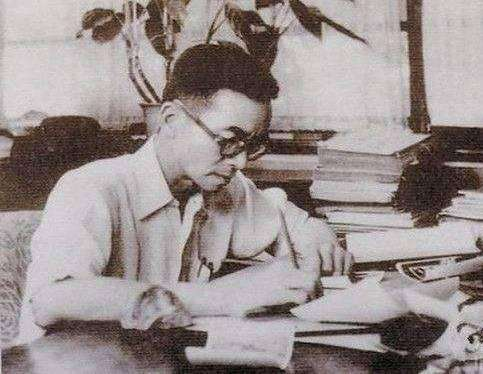

梁思成（1901年4月20日－1972年1月9日），籍贯广东新会，生于日本东京。父亲梁启超，妻子林徽因。中国著名建筑史学家、建筑师、城市规划师和教育家，一生致力于保护中国古代建筑和文化遗产。

他考察发现的许多古建筑，现在都成为当地引为自豪的文化古迹。盟军进攻日本本土时，他曾建议保护京都、奈良的古建筑。平津战役中，他绘制北平古物保护的地图区块，避免受到炮击。建国后，他坚决主张保护北京古建筑和城墙，建议在西郊建新北京，保护旧北京城，可惜未被采纳。

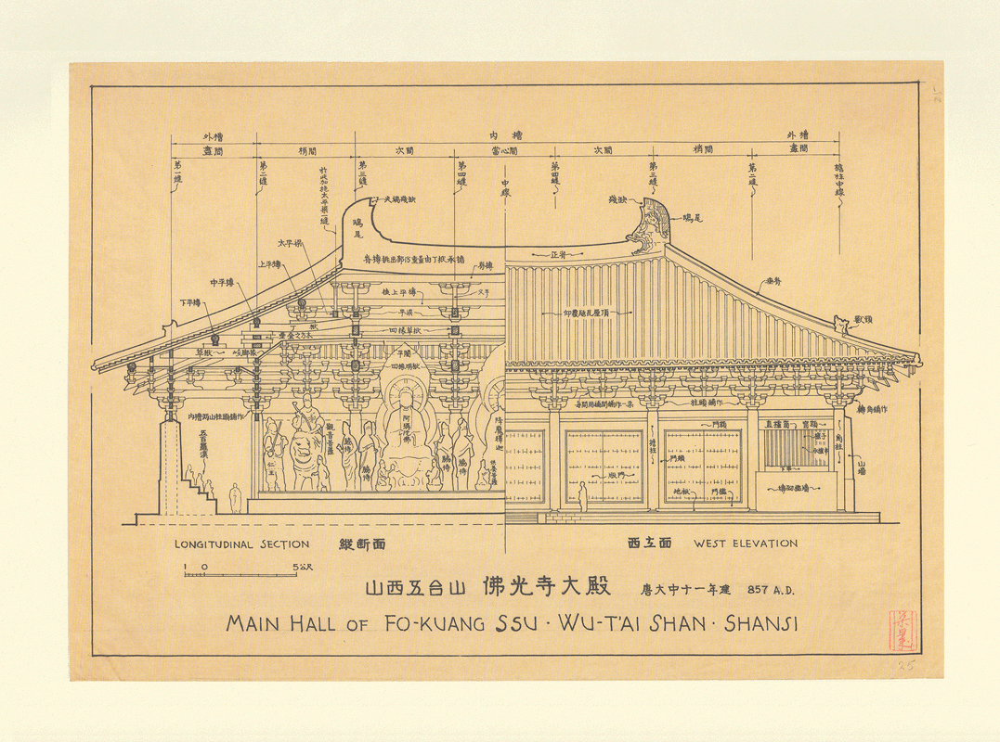

（《图像中国建筑史》梁思成的手绘图）

【父亲梁启超和妻子林徽因】

1901年4月20日，梁思成出生于日本东京。因为父亲梁启超，在戊戌变法后，流亡到东京。1912年辛亥革命后，随父母从日本回国，曾在北京崇德国小及汇文中学就学。1915年入北平清华学校，1923年毕业于清华学校高等科。

1924年，和林徽因一起赴美国费城宾夕法尼亚大学建筑系学习，1927年获得学士和硕士学位，又去哈佛大学学习建筑史（未毕业）。1928年3月21日， 梁思成与林徽因在加拿大渥太华的中国总领事馆举行婚礼，婚后赴欧洲游玩考察。

8月18日回国后，在沈阳东北大学（张学良时任校长）任教，创立了中国现代教育史上第一个建筑学系。他成立了建筑师事务所，设计建造了东北大学主楼。当时曾试图保护沈阳钟鼓楼，但不被当地政府采纳，终于被拆毁。

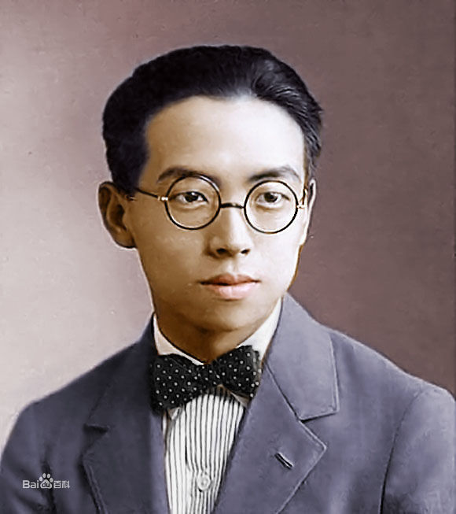

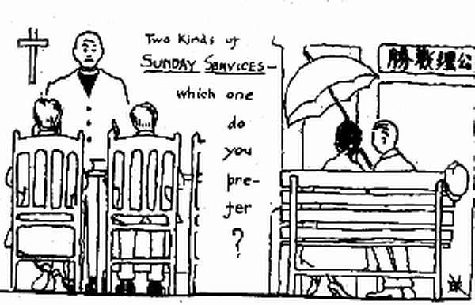

（梁思成绘漫画：周末是谈恋爱还是去教堂？）

【中国营造学社的民间组织】

日本侵略东北后，梁思成于1931年回到北平，进入中国营造学社工作。梁思成的第一件工作，就是在1932年主持故宫文渊阁的修复工程。

中国营造学社是一个专门从事中国传统建筑研究和保护的民间学术组织，成立于1930年，创办人是北洋政府的交通系大员朱启钤。营造学社成立后，以天安门内的旧朝房为办公地点。营造学社内设法式、文献二组，分别由梁思成和刘敦桢主持。

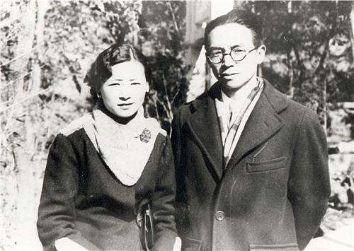

（1931年，梁思成、林徽因抵京加入中国营造学社）

【天书一般的《营造法式》】

梁思成原计划马上着手研究宋代《营造法式》，不料“这部漂亮精美的巨著，竟如天书一样，无法看得懂”。为了深入研究古代，他首先从比较近的《清工部工程做法则例》着手，拜北京老木匠和彩画匠为师，配合研究北平大量清代建筑，在1932年著成《清式营造则例》手稿（1934年出版）。

为了着手研究《营造法式》，必须收集宋代建筑的资料。梁思成决定到中国各地去找寻中国古代建筑的实例。在交通不便、兵荒马乱时代，他和林徽因等一起，在十几年间，踏遍中国十五省，二百多个县，测绘和拍摄二千多件从唐、宋、辽、金、元、明、清各代保留下来的古建筑遗物。

他所考察发现的许多古建筑，现在都成为当地引为自豪的文化古迹。包括天津蓟县辽代建筑独乐寺观音阁，宝坻辽代建筑广济寺，河北正定辽代建筑隆兴寺，山西辽代应县木塔，大同辽代寺庙群华严寺、善化寺等，河北赵州隋朝建造的安济桥，山西五台山最古老的木构建筑物佛光寺等等。

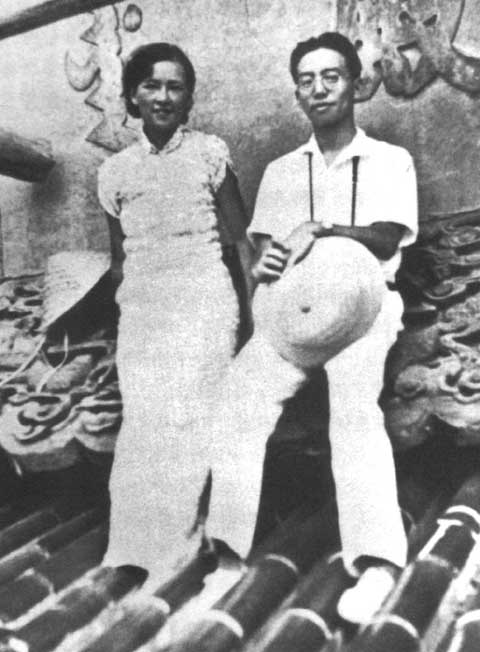

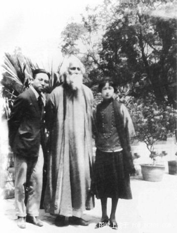

（梁思成、泰戈尔、林徽因合影）

【日本古都的恩人】

盟军对日本国土进行总攻击时，梁思成透过美驻重庆办事处联络官布朗森上校，陈述了保护京都、奈良古建筑的重要性，并提交了一份关于奈良古建筑的图纸，以及这样一段见解：“建筑是社会的缩影，民族的象征，但绝不是某一民族的，而是全人类的共同财产。如奈良唐招提寺，是全世界最早的木结构建筑，一旦炸毁，是无法补救的。”

美军接受了梁思成的建议，并请其助手在军用地图上标绘出区块，进而保护日本古都免于原子弹轰炸。奈良被宣布为世界历史文化名城三十周年纪念日时，《朝日新闻》特刊一文《日本古都恩人梁思成氏》。

关于梁思成保护京都免于盟军空袭说法目前尚存争议，日本《朝日新闻》记者古谷浩一经过调查后表示，虽然“很难断定京都奈良免于轰炸就是因为梁思成的建议”，但他的建议对中日之间意义重大。

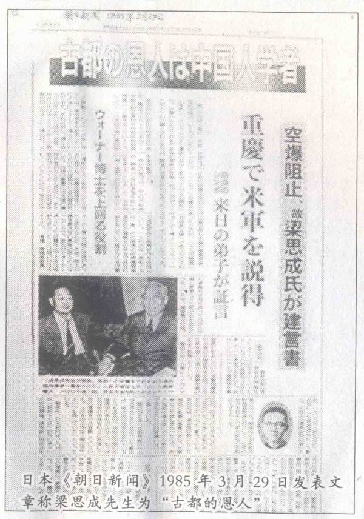

【古都北京的保护神】

1945年抗战胜利后，他回北平担任清华大学建筑系主任，创办营建（建筑城市规划）学系，毕生致力教育工作。平津战役中，绘制北平古物保护的地图区块，避免受到炮击。1949年共和国成立后，梁思成兼任北京市规划委员会副主任，主持了首都人民英雄纪念碑的建筑设计。

1950年，和陈占祥发表《关于中央人民政府行政中心位置的建议》（梁陈方案）。他坚决主张保护北京古建筑和城墙，建议在西郊建新北京，保护旧北京城，不在旧城建高层建筑，他的远见不能为那时代的人理解，这些建议没有被采纳。之后他多次上书，挽救了北海的团城。

如果他的所有建议都被采纳，北京古城会成为世界上保存最完好的古都和建筑博物馆，北京城的发展也可以避免现在的极度集中与拥挤。

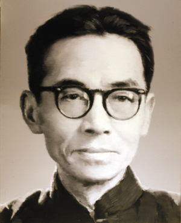

【唯一的鉴真和尚纪念堂】

1959年，梁思成加入中国共产党。文化大革命中，他被作为“复古”的典型而被批判并抄家。抄家时，在他家中发现属于其故妻林徽因的胞弟林桓的中正式军刀，上刻有“中正赠”字样，这也成了他的一大罪状。

1972年（71岁），梁思成在贫病交加中去世。文革后，中共中央对梁思成恢复名誉。

1973年，他设计的唯一唐代风格的建筑作品是扬州大明寺的鉴真和尚纪念堂，在他死后建成。

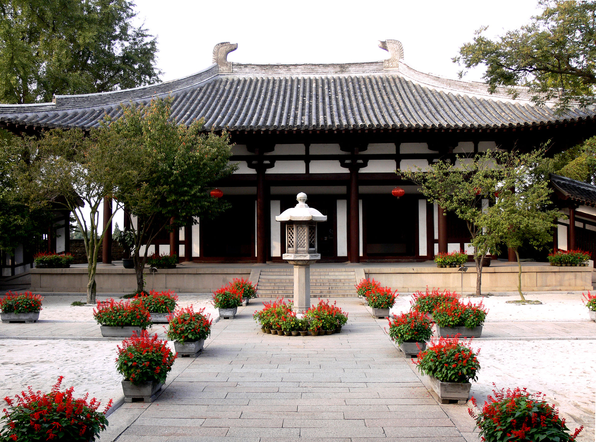

（梁思成设计的扬州大明寺鉴真和尚纪念堂）

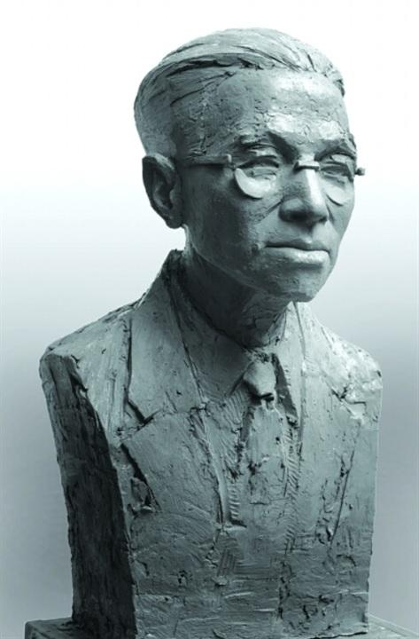

