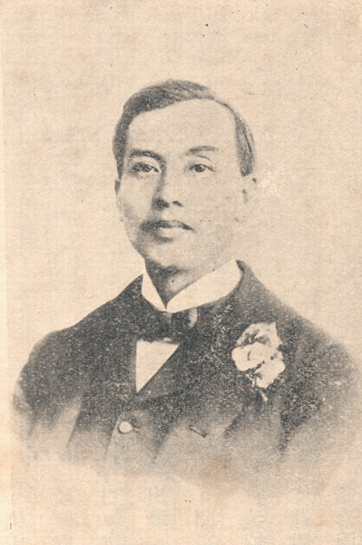
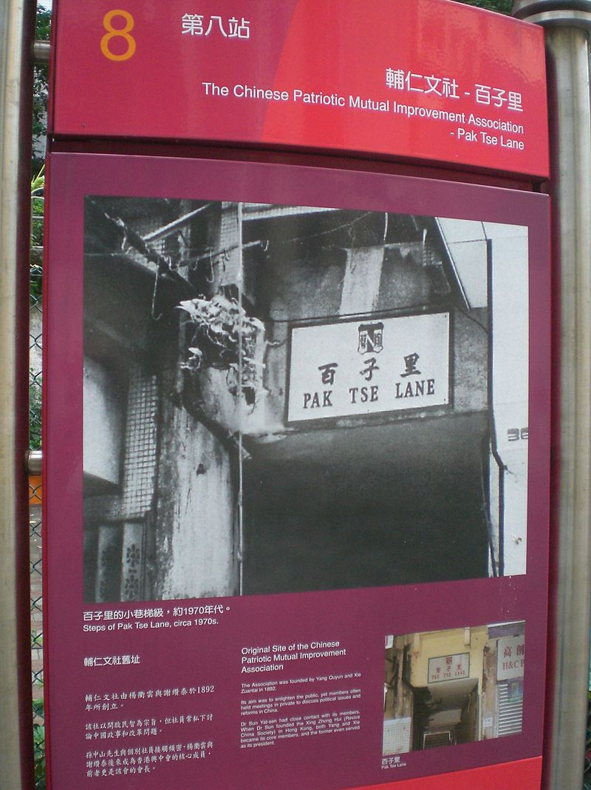
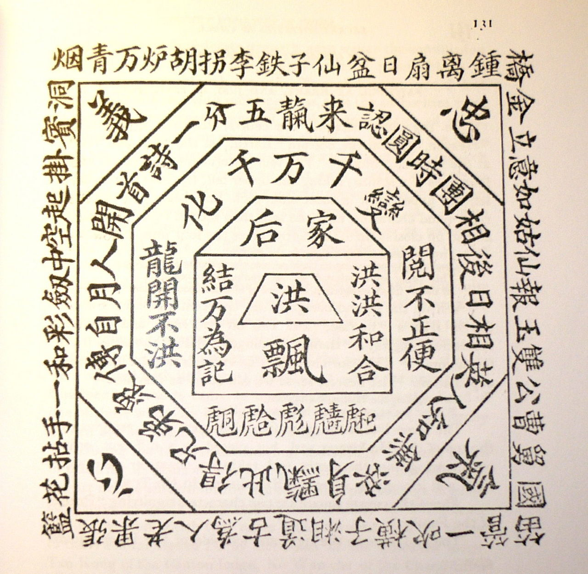
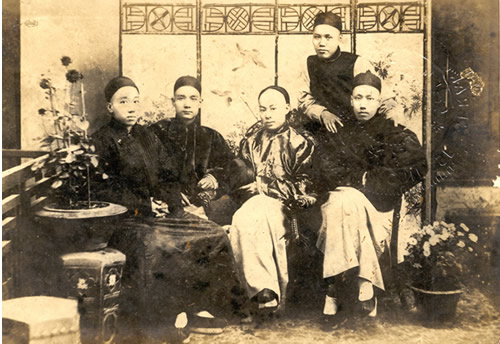
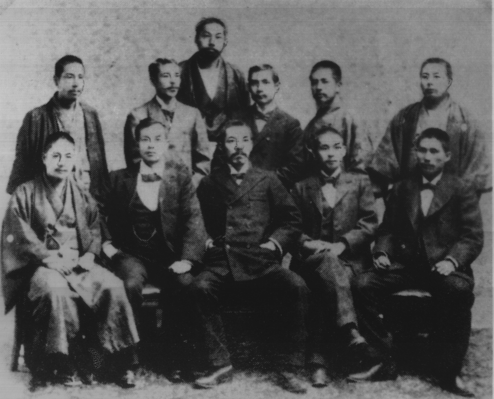
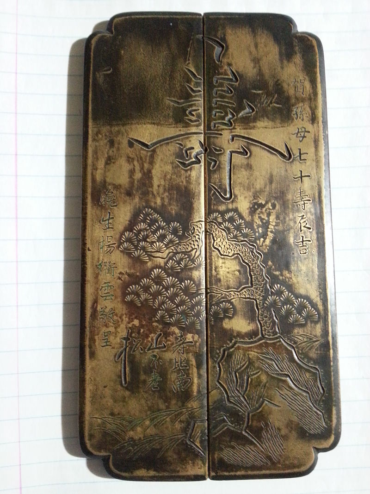
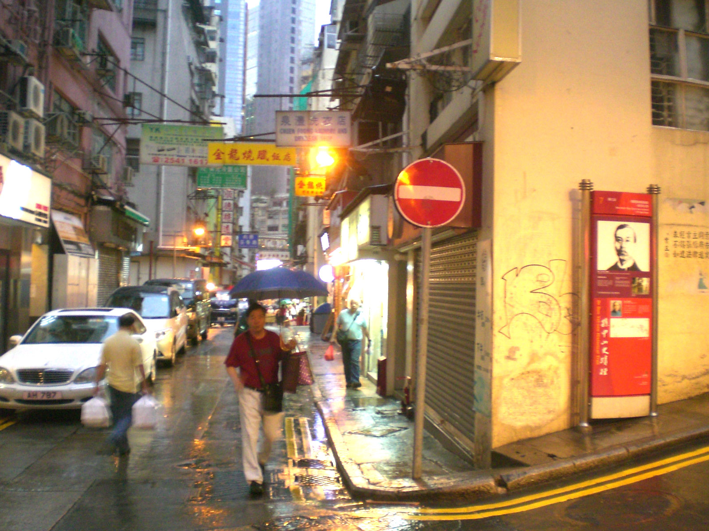
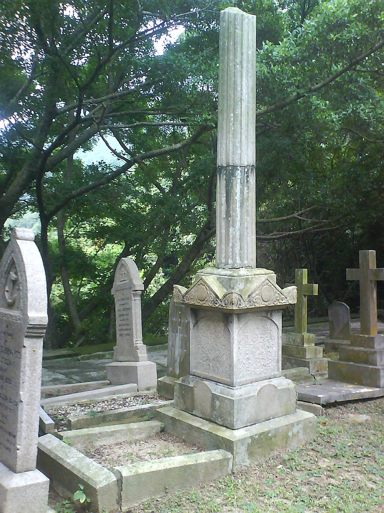

## nnnn姓名（资料）

适合所有人的历史读物。每天了解一个历史人物、积累一点历史知识。三观端正，绝不戏说，欢迎留言。  

### 成就特点

- ​
- ​

### 生平

杨衢云小传：我当兴中会会长，孙中山只能当秘书，死了却墓碑无名

【1901年1月11日】117年前的今天，中国近代革命的第一人杨衢云被清政府刺杀

杨衢云（1861年12月6日－1901年1月11日）

【加入天地会的革命元老】

杨衢云年幼随父亲到香港，在圣保罗书院接受教育。14岁进入船厂学习机械，因工伤失去了右手三指。后学习英文，当过老师，之后转任招商局总书记，沙宣洋行副经理。

1890年（一说为1892年），杨衢云与谢缵泰等十余人组织辅仁文社，担任社长，以“开通民智”、“尽心爱国”为宗旨。文社购买新学书报，讨论中国的发展及改革路向，主张推翻满清，建立合众政府。辅仁文社是香港首个革命组织。

杨衢云同时也加入志在反清的洪门。洪门，又称天地会，与袍哥会、青帮为清朝三大秘密结社。

（孙中山史迹径第8站百子里辅仁文社旧址）

（19世纪末厦门洪门三房腰牌）

【被赶出香港的兴中会会长】

1895年1月，孙中山到香港，经辅仁文社成员尢列撮合；将孙中山1894年11月在檀香山设立的兴中会与辅仁文社合并。合并后的组织仍叫兴中会，杨衢云为会长，孙中山为秘书，在香港中环以商号“乾亨行”作为掩饰。

（注：尢列（1865年－1936年），广东顺德人，与孙中山、陈少白、杨鹤龄被清政府合称“四大寇”。）

1895年10月，兴中会计划在广州起义，由杨衢云在香港任总指挥。由于计划泄露，七十多人被捕，杨和孙同被通缉。香港迫于清政府的压力，令二人离境，5年内不得入境。杨衢云经新加坡，前往南非，之后再转往日本，辗转各地继续发展兴中会。

（四大寇前排左起：杨鹤龄、孙中山、陈少白、尢列，后立者为关景良，1890年摄于香港）

（1898年，杨衢云（前排左二）、孙中山（后排左四）在日本的合影）

【被刺杀的私塾先生】

1900年1月，杨衢云辞去兴中会会长一职，改由孙中山担任。同年从日本到香港，发动惠州起义。失败后，杨衢云返回香港，开设私塾教授英文，以养妻儿。

1901年1月10日，杨衢云于结志街52号2楼寓所（其私塾）内，被清政府派出的刺客开枪刺杀，并于翌日1月11日，逝世，享年40岁。

（杨衢云送给孙中山母亲七十岁生日贺寿的铜牌）

（孙中山史迹径第7站结志街52号，1901年杨衢云被暗杀地点）

【6348的无名碑】

辅仁文社发起人之一，绘制过著名“时局图”的谢缵泰，将杨衢云安葬于跑马地香港坟场，并为杨衢云设计墓碑，碑上没留名字，只刻有编号6348。

2009年，谢缵泰的后人专程到台湾忠烈祠拜祭杨衢云，她说：“虽然就一块木牌写上名字，但也算开国烈士中的一分子，而香港、大陆连这个都没有，很遗憾！

2011年9月，香港在6348号墓碑竖立杨衢云生平说明牌，以肯定他为中国革命作出的贡献。

（杨衢云的无字墓碑）

