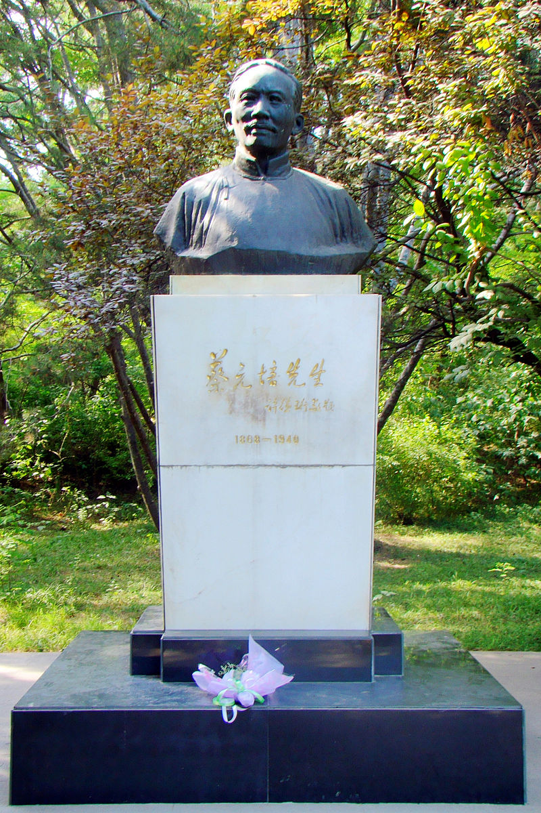
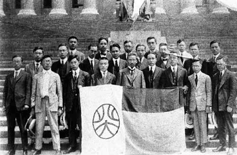
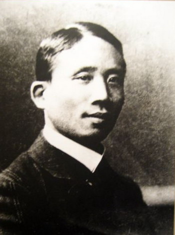
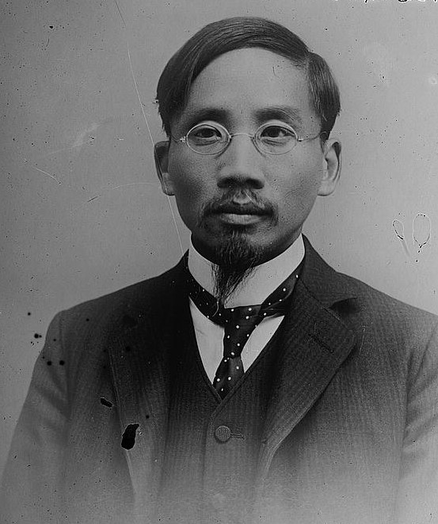
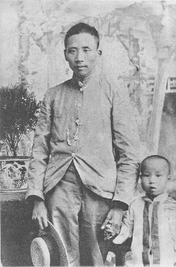
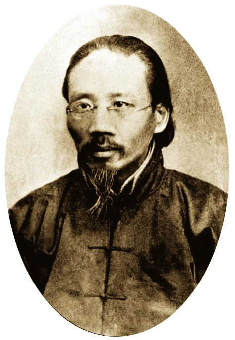
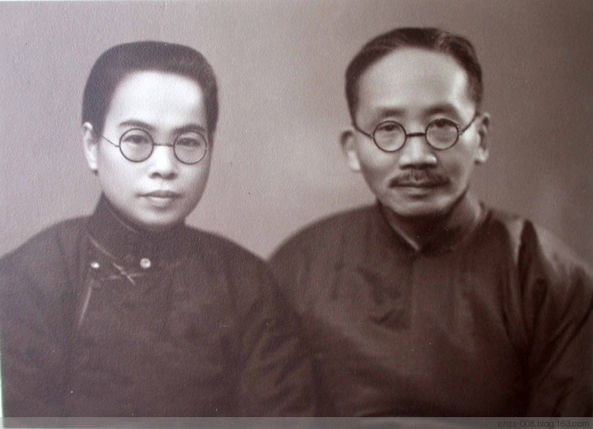
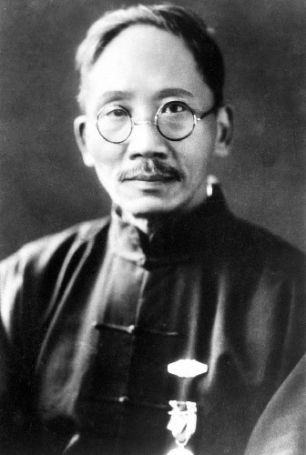
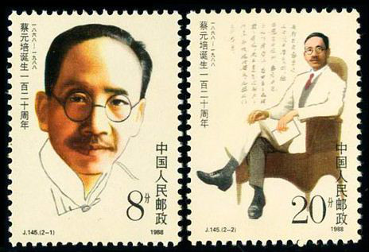

## nnnn姓名（资料）

适合所有人的历史读物。每天了解一个历史人物、积累一点历史知识。三观端正，绝不戏说，欢迎留言。  

### 成就特点

- ​
- ​

### 生平

蔡元培小传：光复汉族的教育部长，几年北大校长改变中国

【1868年1月11日】150年前的今天，促成新文化运动中心的北京大学校长蔡元培出生

蔡元培（1868年1月11日－1940年3月5日），浙江绍兴人，近代革命家、教育家、政治家，也是中国近代民族学研究的先驱。

蔡元培是中华民国首任教育总长，1916年担任北京大学校长，进行革新，开“学术”与“自由”之风，使得北大成为五四运动，新文化运动的中心。

国民政府定都南京后，他主持教育行政委员会，创立现代教育制度，筹建中华民国大学院、中央研究院，帮助创建国立音乐院（即现上海音乐学院）、国立艺术院（即现中国美术学院）。

【提倡新学的旧秀才】

1868年1月11日（清同治六年），蔡元培出生于浙江绍兴。

6岁入读私塾，17岁考取秀才，设馆教书。1890年（22岁），考取贡士。1892年，补殿试，中二甲进士，任翰林院庶吉士。两年后，翰林院散馆，他留任编修。

1898年（30岁），戊戌变法失败，他所崇拜的谭嗣同被杀害，他断然离开翰林院南下，任绍兴中西学堂监督，提倡新学。

【不留学日本的爱国人士】

1902年（34岁），在上海与章太炎等发起成立中国教育学会，担任会长。同年，到日本留学。

当时，吴稚晖在广东办学招生，带了26个少年赴日本，因入学问题与清驻日公使大吵。吴稚晖被以“妨害治安”罪名，驱逐出境。蔡元培闻讯，与吴稚晖一同登上法国邮轮回国。

同年秋，在上海办爱国学社和爱国女学，创办《俄事警闻》（后改名《警钟日报》），提倡民权，倡导革命。

【光复汉族的会长】

1904年10月（36岁），陶成章、蔡元培等发起，基于留日学生组织的军国民教育会，建立了光复会。会址设于上海，推蔡元培为会长，陶成章任副会长。光复会主要由江浙人组成，宗旨为“光复汉族，还我山河，以身许国，功成身退”。章太炎、徐锡麟、秋瑾等人相继入会。

1905年，同盟会成立后，光复会多数成员加入同盟会。1907年，徐锡麟因发动安庆起义失败而牺牲，秋瑾也在绍兴遇害，光复会活动一度停顿。5月，蔡元培到德国留学，在柏林一年学德语，后来在莱比锡大学研究了三年哲学、文学、心理学和民族学。

而光复会的陶成章不久与孙中山发生分歧，1910年2月，章太炎、陶成章与同盟会正式分裂，在东京成立光复会总部。后因陶成章在上海被蒋介石刺杀，光复会遂解体。

【中华民国的教育部长】

1911年（43岁），辛亥革命爆发，应陈其美来电催促，取道西伯利亚回国。孙中山组织南京临时政府，第三天就任命蔡元培作教育部长，后出任北京政府的教育总长。蔡元培主张教育应从造成现世幸福出发，提出废除读经等改革措施，摹仿西方教育制度。

不久，因不满袁世凯的专制统治而辞职。1913年，旅居德国、法国，在里昂创办中法大学。1915年，与李石曾等组织留法勤工俭学，次年与吴玉章等组织华法教育会。

【北京大学的校长】

1917年1月（49岁），蔡元培回国就任北京大学校长。他改革北大领导体制和学科、学制设置，创办科研机构，倡导平民教育，首行男女同校。

他采取“囊括大典，网罗众家，思想自由，兼容并包”的方针，大量引进新人物，不拘一格招聘众家，包括李大钊、陈独秀、鲁迅，辜鸿铭等。北大很快开学术研究、思想自由的风气，并成为“五四”时期新文化运动的中心。

【参加北伐的大学院长】

1923年1月（55岁），因当时教育总长附和北京政府，逮捕北京大学教授，蔡元培愤而辞职。1924年11月，蔡元培到德国求学，专攻民族学。

1926年2月回国，参加中国国民党主持的国民革命军北伐。1927年，倡议成立大学院作为全国最高学术教育行政机关，任大学院长。

他在这期间创办了中央研究院。11月27日，和萧友梅于上海创办国立音乐院（即现上海音乐学院），是中国最早的高等音乐院校。1928年，于杭州西子湖畔创立国立艺术院（即现中国美术学院）。10月以后，专任中央研究院长。

【反侵略大会的名誉会长】

1931年九·一八事变后，他奔走呼号，倡导抗日。12月15日，蔡元培在南京中国国民党中央党部，遭北平请愿学生绑架，并遭殴打致伤。1932年，与宋庆龄、鲁迅等组织中国民权保障同盟，反对国民政府的特务政治，拥护国共合作，被选为副主席。

1933年，蔡元培倡议创建国立中央博物院（今南京博物院前身），并亲自兼任第一届理事会理事长。1936年，与陶玄、张静江、李石曾等人在上海创办世界学校。

1937年（69岁），蔡元培与厉麟似、胡愈之等组织成立了上海文化界救亡协会。1938年，被推为国际反侵略大会中国分会名誉会长。

【永远坟场中的教育家】

1937年11月27日，从上海移居香港。1940年3月3日，72岁的蔡元培在寓所失足跌倒，3月5日病逝，葬于香港华人永远坟场。

蔡元培认为教育是国家兴旺的根本，是国家富强的根基。“教育者，养成人格之事业也。”他主张教育应注重学生，反对呆板僵化，提倡美育、健康教育、人格教育等。

他认为大学教育有两大弊端：一曰极端国民教育，使得受教育者迁就于政府的主义；二曰极端实利教育，把大学作为一个职业训练所，所有人都是生产流水线上的小零件，永远不发问。

