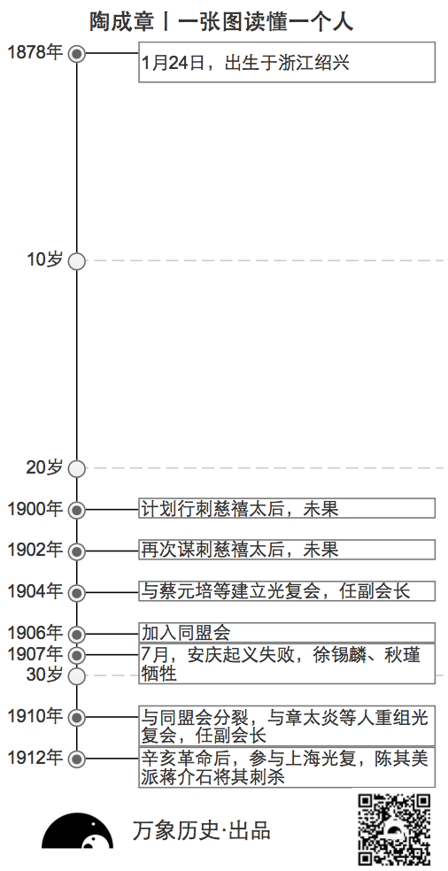
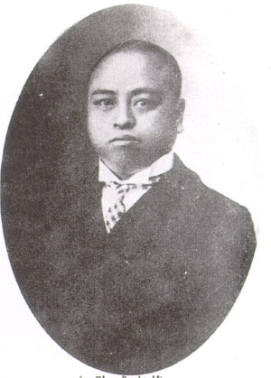
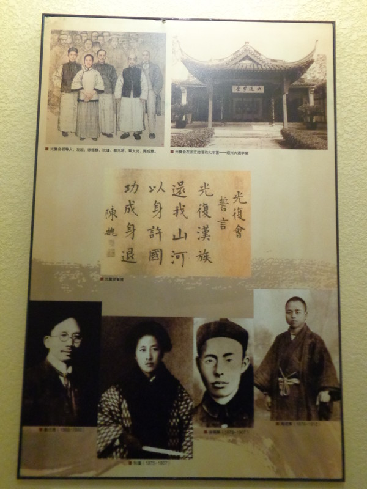
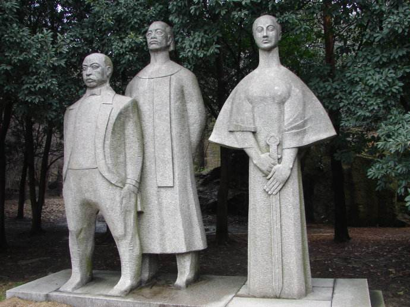
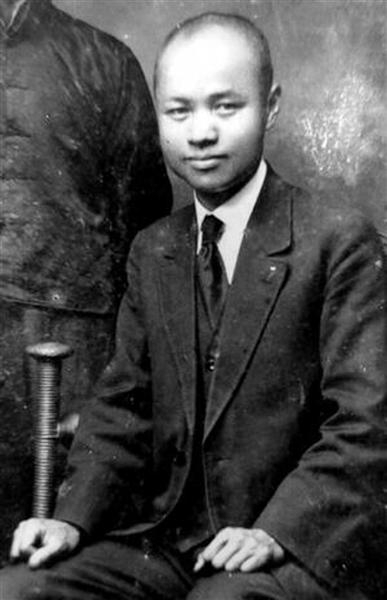
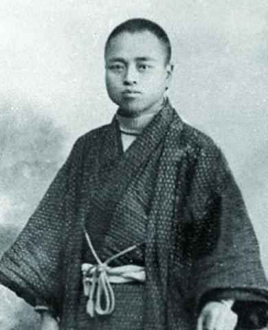
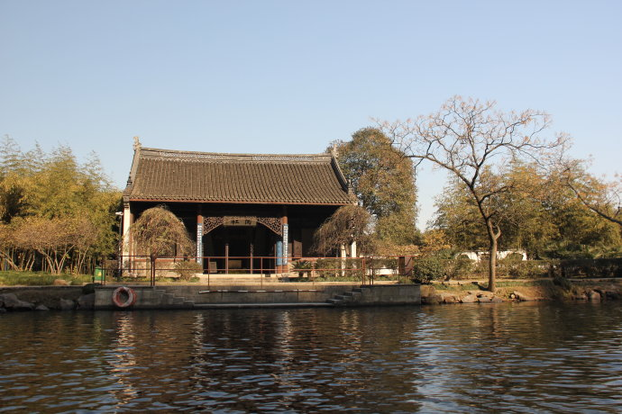

## nnnn姓名（资料）

适合所有人的历史读物。每天了解一个历史人物、积累一点历史知识。三观端正，绝不戏说，欢迎留言。  

### 成就特点

- ​
- ​

### 生平

陶成章（1878年1月24日－1912年1月14日），浙江绍兴人。清末革命团体光复会的创始人、领导人之一，1912年被蒋介石所暗杀。

【一张图读懂一个人】

【两度刺杀慈禧】

1878年1月24日，出生于浙江绍兴。幼时家境贫寒，但天资聪颖，受到良好的旧学教育，15岁便在家乡设馆任塾师。

1900年，义和团运动下，八国联军侵华，陶成章欲乘乱刺杀慈禧太后。赴奉天、蒙古等地察看地势，归途中经费缺乏，步行七昼夜，几乎被饿死。

1902年，再次北上谋刺慈禧太后，未果。八月，得蔡元培帮助，东渡日本。

【创立光复会】

1904年10月，与蔡元培等在上海发起建立反清革命团体“光复会”，蔡元培为会长，陶成章任副会长，负责联络会党。入会誓词“光复汉族，还我山河，以身许国，功成身退”。

1904年底，陶成章在东京成立了光复会分部，鲁迅和许寿裳就是在这时加入光复会。

陶成章在东京学习催眠术，并著有《催眠术讲义》一书。

【徐锡麟、秋瑾殉难】

1906年，在东京加入同盟会。联络闽、皖各省，成立光复军，被推为5省大都督，与徐锡麟、秋瑾加紧皖浙起义准备。

1907年7月，安庆起义失败后，徐锡麟、秋瑾相继殉难，陶成章悲痛欲绝，因遭清廷通缉，再度亡命日本。

【与同盟会破裂】

1908年，转赴南洋，几遍南洋群岛。因没有足够筹款，与孙中山矛盾激化。陶成章在新加坡发表《同盟会七省意见书》，即所谓的《孙文罪状》。指责孙中山“谎骗营私”，在汇丰银行有巨额存款，贪污两万革命经费，有“残贼同志”、 “蒙蔽同志”、“败坏全体名誉”等三种十二项“罪状”，提出九条善后办法，要求“开除孙文总理之名，发表罪状，遍告海内外”。

陶成章与同盟会破裂。

【重组光复会】

1910年，在日本东京，与章太炎等人重组光复会，章太炎为会长，陶成章为副会长。

新入会者仿洪门三十六誓，在神位前跪誓。“第一誓诚心入会，不敢反悔，如有反悔，天诛地灭。第二誓入会以后，协力同心，不敢畏避，如有畏避，雷殛火烧。第三誓会中秘密，不敢漏泄，如有漏泄，身受千刀。第四誓祭旗起义，闻命必到，如有不到，命尽五殇。第五誓兄弟同心，如同手足，如生外心，身死五刑。”

【被蒋介石刺杀】

1911年，辛亥革命后回国，积极筹划光复行动。浙江光复后，被举为省临时参议会议长。参与上海光复行动，是上海大都督的最有力竞争者。

1912年1月，陶成章因病于上海法租界广慈医院疗养。陈其美命令部下蒋介石对陶成章执行暗杀。陶成章中弹，血如涌泉，医治无效，1月14日夜间2时去世。

1月21日，上海各界盛大追悼，计有4000余人参加祭典。骨灰被迎回杭州。

（陶社，为纪念辛亥革命烈士陶成章所建。位于绍兴东湖西）

【气壮山河的陶社】

1912年1月28日，章太炎在《大共和日报》发表《致孙中山公开信》，谴责同盟会与光复会之间相残。

孙中山发电报给陈其美，要他缉捕凶手“明正其罪”。蒋介石自言成功暗杀陶成章是其获得孙中山信任的开始。

1916年8月，孙中山亲自莅临绍兴东湖陶社祭奠 ，称其“奔走革命不遗余力，光复之际陶君实有巨功”，题“气壮山河”匾额。

