## nnnn姓名（资料）

适合所有人的历史读物。每天了解一个历史人物、积累一点历史知识。三观端正，绝不戏说，欢迎留言。  

### 成就特点

- ​
- ​

### 生平

【历史今天】陆征祥小传：谈判《21条》让日本外相辞职，却被视为卖国贼

【一图读懂陆征祥】谈判21条，不签巴黎和约的外交家，去当了神父，身葬异乡

陆征祥（1871年6月12日－1949年1月15日），上海人，中华民国外交家。关键词：《二十一条》、巴黎和会、五四运动、比利时神父、“弱国无外交”。

【大清驻俄公使】

1871年6月12日，陆征祥出生，原籍江苏太仓。就读于上海广方言馆，后入北京同文馆习外文，尤精俄文。

1893年，担任中国驻俄罗斯大使馆翻译官。陆征祥结识比利时外交官的女儿培德女士，他不顾使馆反对，于1899年结婚。

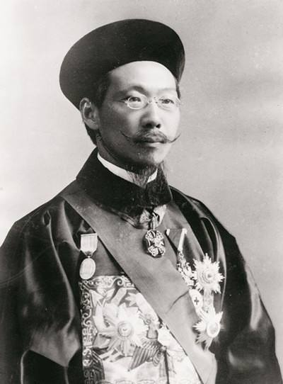

【袁世凯的外交总长】

武昌起义后，陆征祥联合一些驻外使臣，电请清帝逊位。

1912年中华民国建立，应总统袁世凯电命，回国出任外交总长，推动了中国现代外交机构改革。6月，国务总理唐绍仪辞职，陆征祥任国务总理，9月因不容于临时参议院而辞职。

（合影中前排右一为陆征祥，中间为徐世昌）

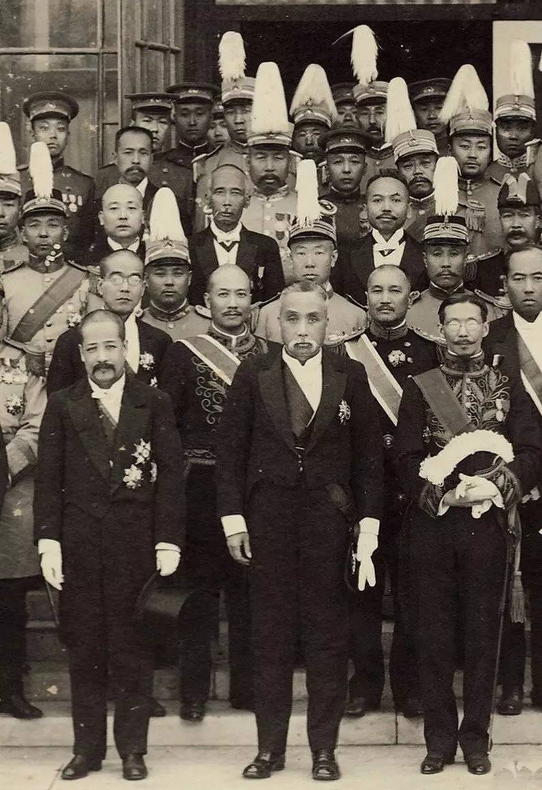

【谈判《二十一条》】

1915年，复任外交部长，与外交次长曹汝霖，与日本谈判《二十一条》。

1914年，第一次世界大战爆发，日本对德宣战，出兵占领了德国在中国的势力范围——山东半岛。袁世凯政府向日本提出撤军要求。1915年2月2日，日本秘密向袁世凯提出了五号共计二十一个条款（简称《二十一条》）的要求。

5月7日，日本向袁世凯政府发出最后通牒，并摆出大战姿态。5月9日23时，袁世凯政府对外宣布接受《二十一条》中一至四号的部分要求，总称《中日民四条约》。

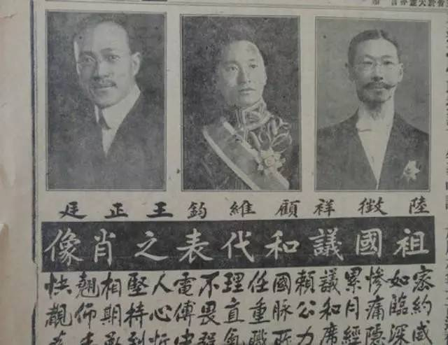

【弱国外交的胜利】

消息传出，举国震怒。签约当天，湖南学生彭超留下血书，愤然投江自杀。北京二十万人到今中山公园集会。当时17岁的周恩来上街演讲，号召誓雪国耻。袁世凯下令要求全国学校以每年5月9日为国耻纪念日，称为“五九国耻”。

二十一条共分为5号，其中第五号，要求中国政府聘用日本人担任军事和财政顾问；中国警察聘用日本顾问；中国军队武器从向日本采购等等。最后签订的是《中日民四条约》只接受了一至四号的部分要求。与《二十一条》原案比较，中国损失已尽可能减小到最低程度。

胡适称《二十一条》的谈判是弱国外交的胜利。在此次交涉后，日本方面，外相加藤高明下野以示负责。

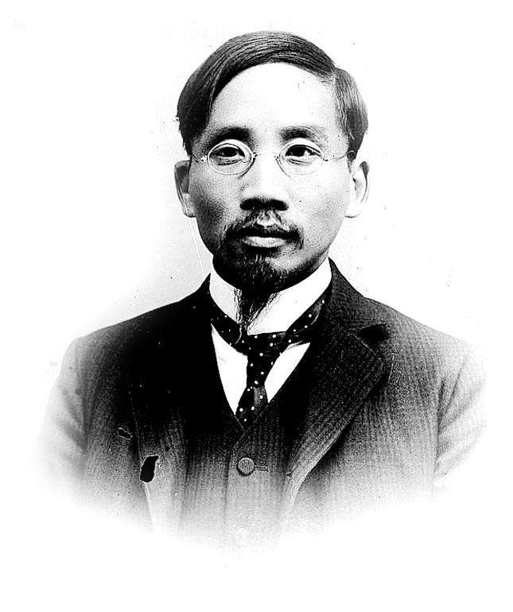

【没有签字的巴黎和约】

1919年，任外交总长，率领中华民国代表团参加巴黎和会。日本坚持继承德国在中国的权益，战胜列强不顾中国反对，接受日本要求，中国爆发五四运动。中华民国代表团最终未能签署和约，成为战胜国中唯一未签字者。

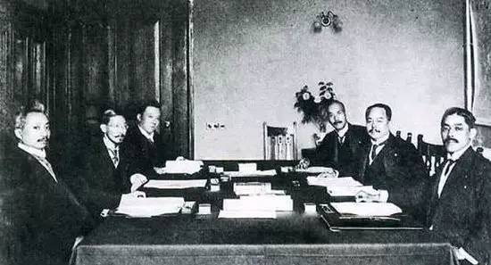

【照料比利时妻子的神父】

巴黎和会后，陆征祥辞去职务，留在比利时，照料病妻。培德女士1926年病逝后，陆征祥参加天主教本笃会，成为修士，专心教会事务，1935年6月25日晋为神父。

图为：康有为给培德夫人写的对联

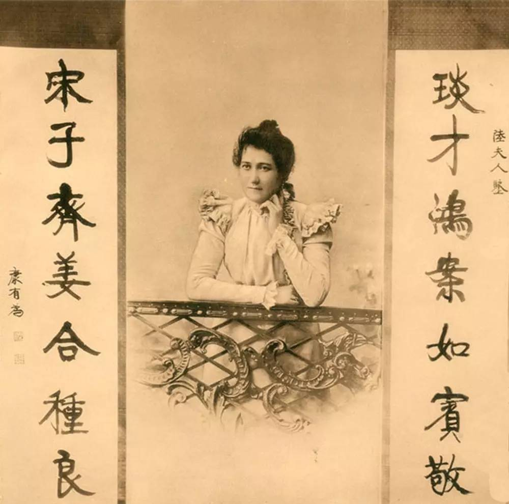

【弱国无外交】

1945年，曾有中国记者采访陆征祥，陆征祥一方面对于“二十一条”向国人表示忏悔，另一方面对中国取得抗日战争的胜利异常兴奋，感慨终于“在有生之年得见祖国一雪前耻”。同时，陆征祥对未来国情提出简短而著名的警语：“弱国无外交”。

1949年，陆征祥病逝于比利时，葬于比利时布鲁日圣安德肋修院。

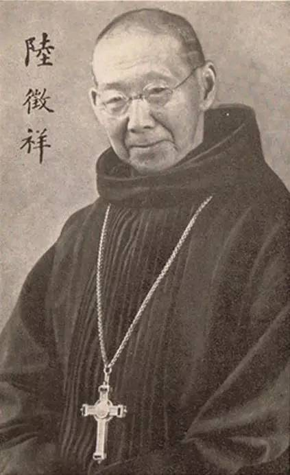

【】

### 照片

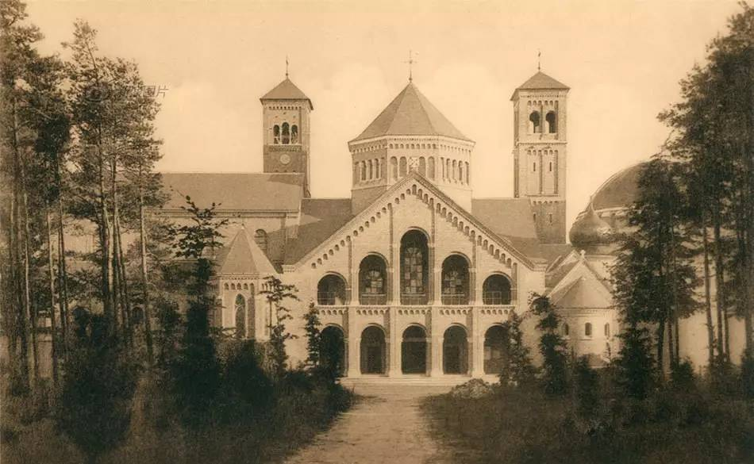

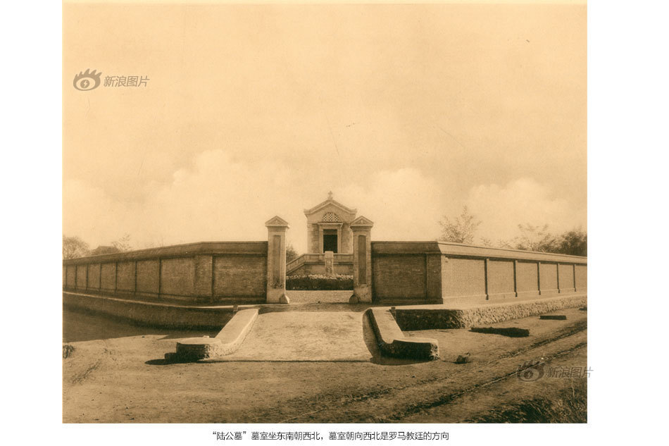

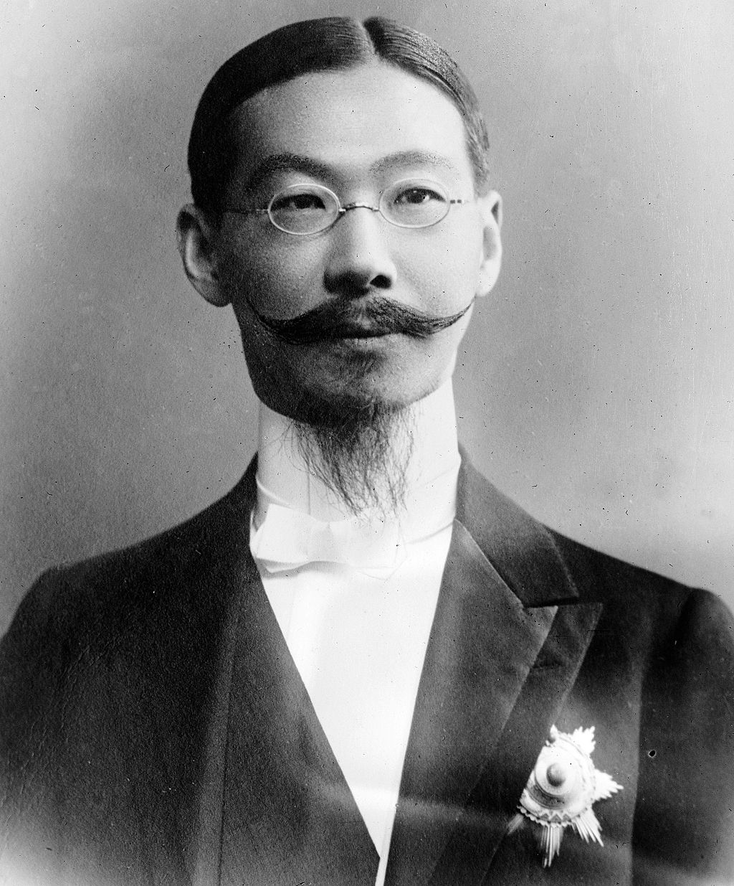

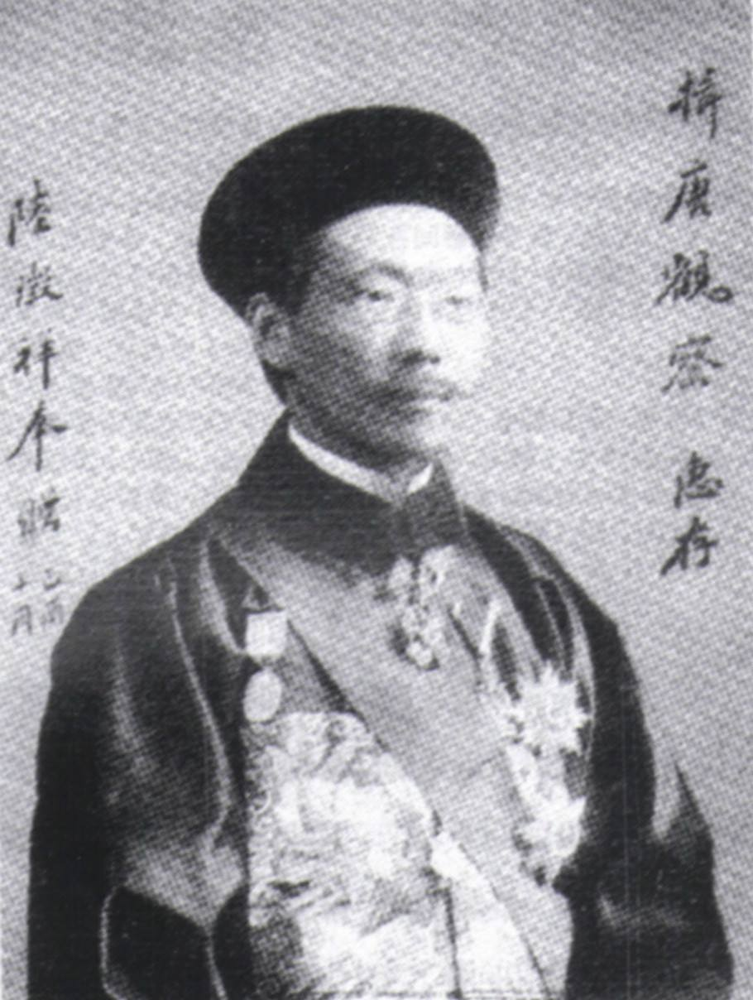

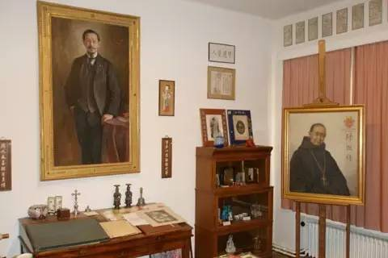

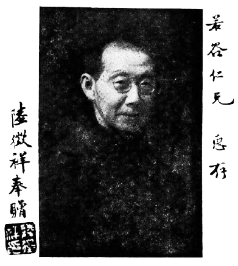

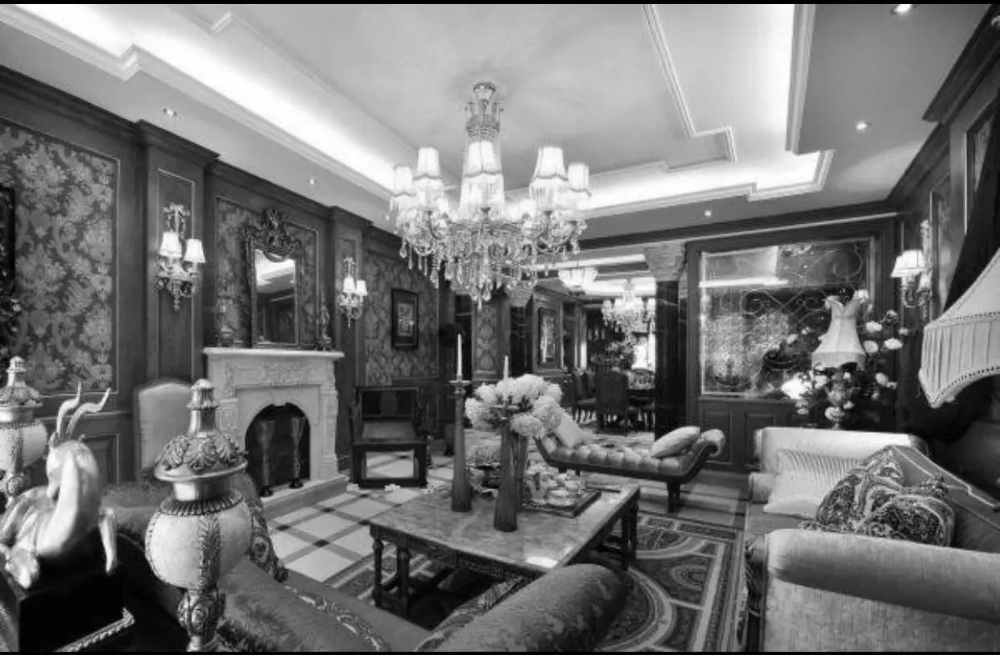

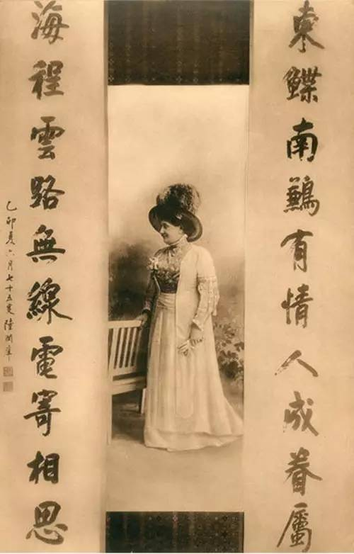