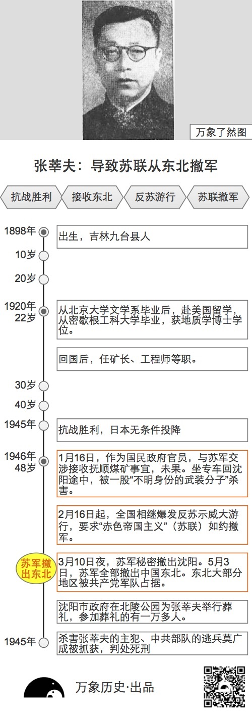
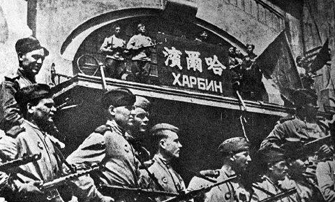
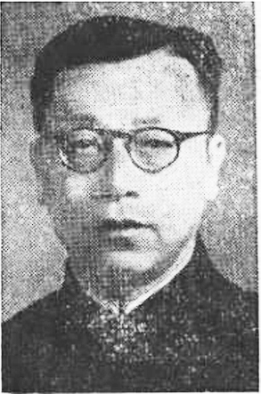
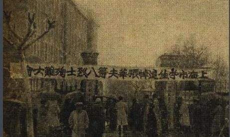
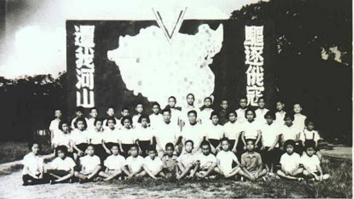
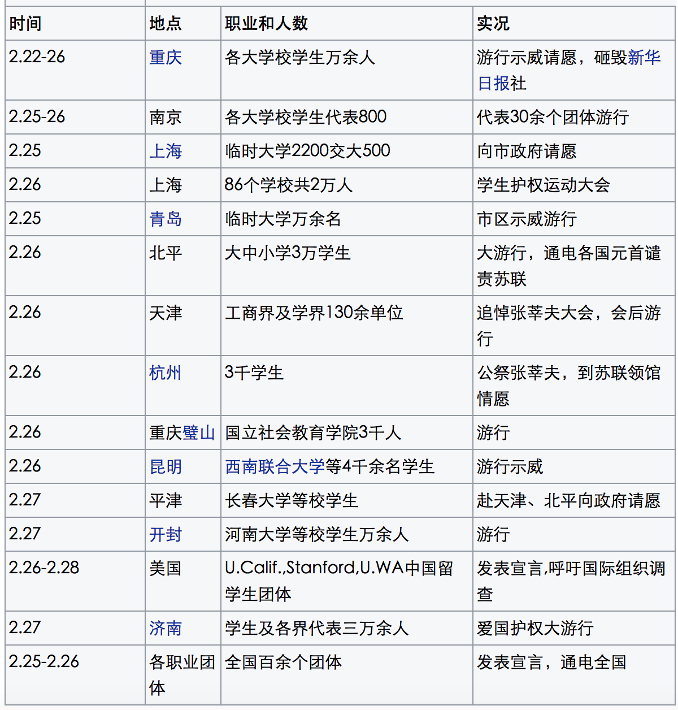
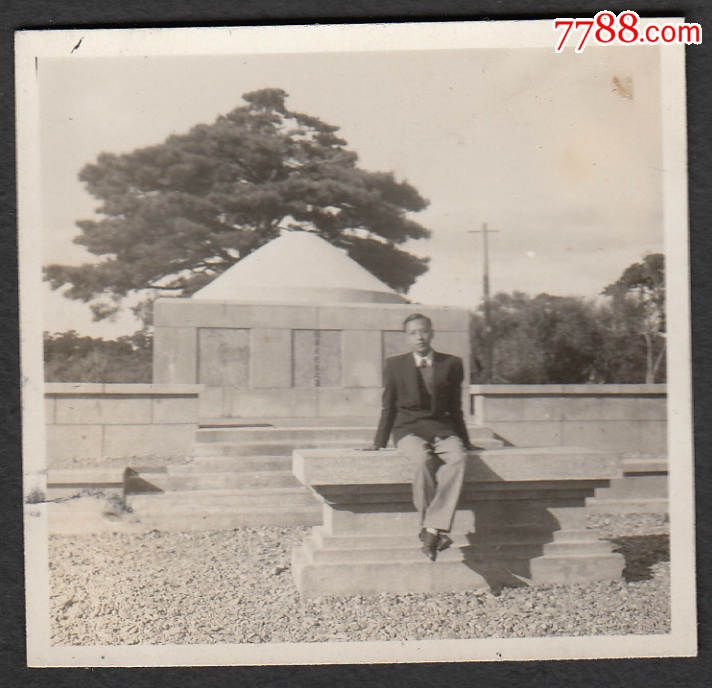
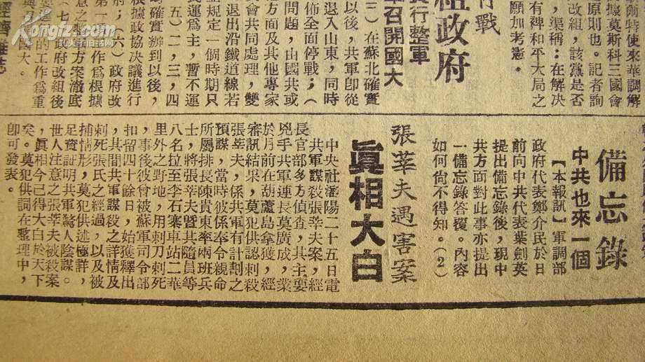
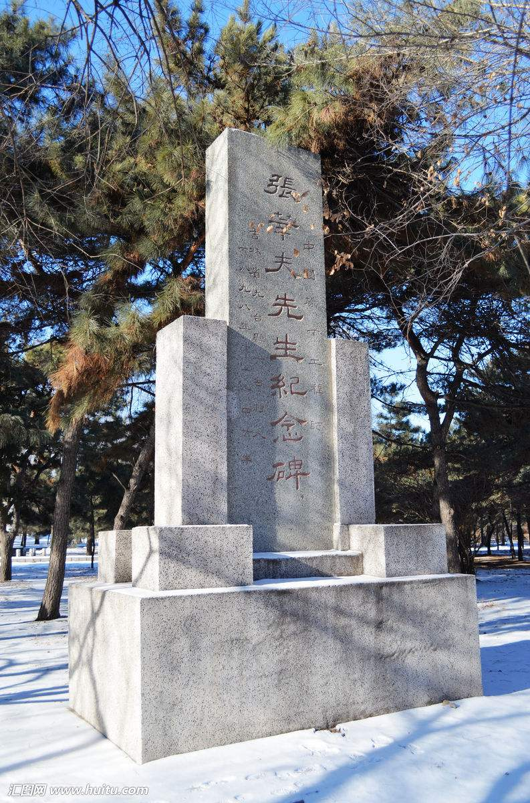

## nnnn姓名（资料）

适合所有人的历史读物。每天了解一个历史人物、积累一点历史知识。三观端正，绝不戏说，欢迎留言。  

### 成就特点

- ​
- ​

### 生平

一张图读懂张莘夫：使得百万苏联红军撤出东北的一条性命

张莘夫小传：一个人的性命逼退百万苏联红军

【1946年1月16日】72年前的今天，引发全国游行、逼退百万苏联红军的张莘夫被杀害

【不愿撤离东北的苏联】

1945年日本投降后，苏联红军控制了东北地区，张莘夫被国民政府任命为经济部东北行营工矿处副处长，负责东北工矿接收事宜。

虽然约定2月1日，苏军撤军。但1946年1月，蒋介石在日记中写下：“俄军似已决心拖移撤兵日期，其意有二：甲，必须经济合作条件达成其要求目的而后撤兵。乙，或待美国在华北陆战队撤退时，彼乃同时撤退。”

【被暴徒杀害】

1946年1月7日，张莘夫奉命，从长春抵达沈阳，准备赴苏联红军占领的抚顺交涉接收抚顺煤矿事宜。1月14日，乘苏军专列抵达抚顺，居住在抚顺煤矿事务所。1月15日，张莘夫一行人的枪支被苏军缴走，失去人身自由。当天，张莘夫曾电话通知沈阳方面称：“苏军仅能保证二十四小时，望设法……”，但电话中途遭掐断。

1946年1月16日，苏军方面表示抚顺煤矿不能由其接收，并劝其尽快返回沈阳。当晚，张莘夫等8人被迫搭乘原专列自抚顺回沈阳，当行驶至抚顺以西25公里的李石寨站时，一股“不明身份的武装分子”登上列车，将张莘夫等人拖下专列杀害。

【引发游行的导火索】

1946年2月1日，苏军未按照约定撤离中国东北。苏方开始拆迁东北的工矿设备，搬运至苏联。

1946年2月11日，经美国总统杜鲁门提议，披露了1945年美国、英国、苏联秘密签订的有损中国利益的《雅尔塔协定》。

这引起了中国舆论哗然。加上此前张莘夫遇害事件、苏联拆运东北工矿设备的刺激，自2月16日起，重庆、上海、北平、南京、杭州、贵阳等中国大中城市相继发生反苏示威大游行，要求“赤色帝国主义”（苏联）如约撤军。

【蔓延全国的大游行】

2月下半月开始，各地反苏活动层出不穷。22日，重庆26所大中学校学生及教师等两万余人，展开大游行，口号包括“苏军必须立即退出东北”，“苏联必须归还在东北抢夺的物资”。

更为严重的是，标语更直指中共，例如“所谓‘民主联军’不容存在”，“铲除一切非法地方政权”，“不容任何籍口割据东北”。游行队伍捣毁中共机关报新华日报营业处及民盟机关报“民主报”馆。此后，游行继续扩大，运动蔓延至全国，不仅学生上街，各职业团体也积极参与。

【苏联红军的迅速撤军】

反苏运动直接导致中苏关系恶化，美国、英国也向苏联正式提出抗议。3月10日夜，苏军秘密撤出沈阳。5月3日，苏军全部撤出中国东北。

苏军不与国民政府协商而迅速撤军，导致东北大片地区被共产党军队占有。该事件对中国近代史产生了重大影响。

（民国时期的张莘夫墓）

【真相大白的凶手】

1946年5月1日，沈阳市政府在北陵公园为张莘夫举行葬礼，参加葬礼的有一万多人。

1948年7月1日，中共部队的逃兵莫广成在葫芦岛被国军抓获，承认是杀害张莘夫的主犯。《救国日报》、《中央日报》做了相关报道。1948年11月29日，国防部判决莫广成死刑。

【遥相呼应的沈崇案】

1946年12月24日圣诞夜，北京大学女学生沈崇遭到两名美军士兵强暴。中共领导发动了全国范围内声势浩大的反美游行，造成中国国民政府与美国关系紧张。

不久，美军陆续撤离北京、天津、青岛等地，并停止对华援助，马歇尔发表了“离华声明”。最终，绝大部分美军从中国裁撤。

