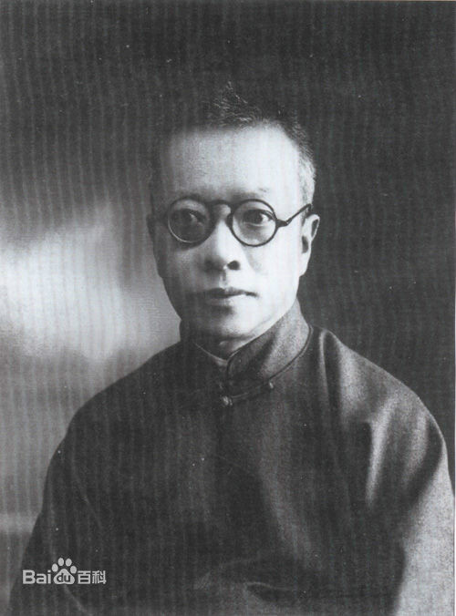
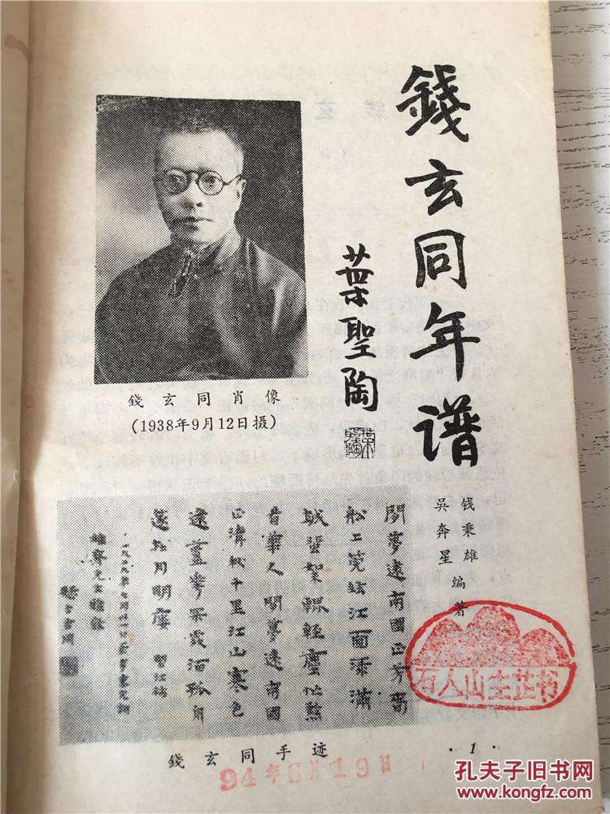
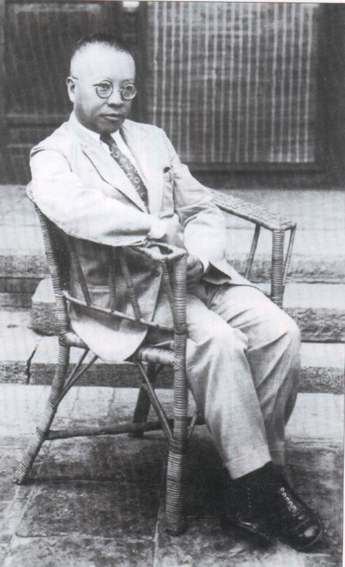
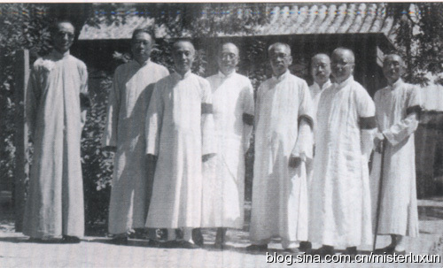
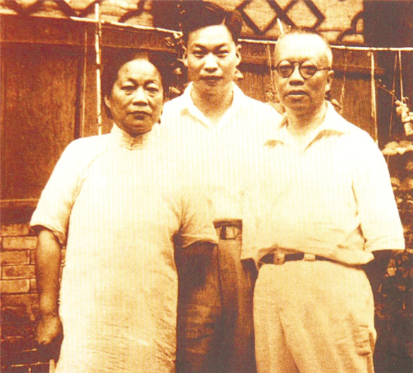
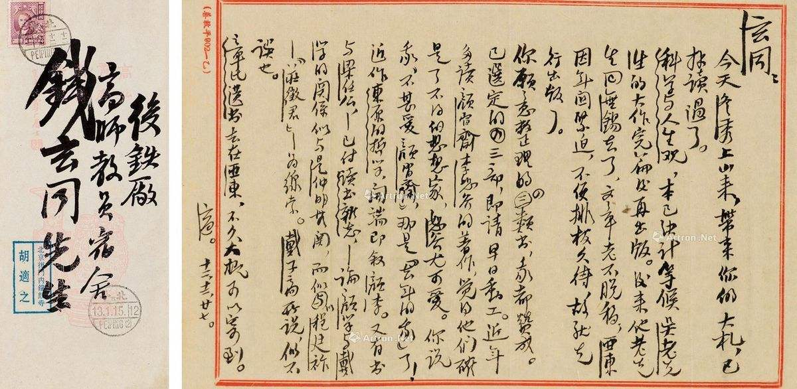
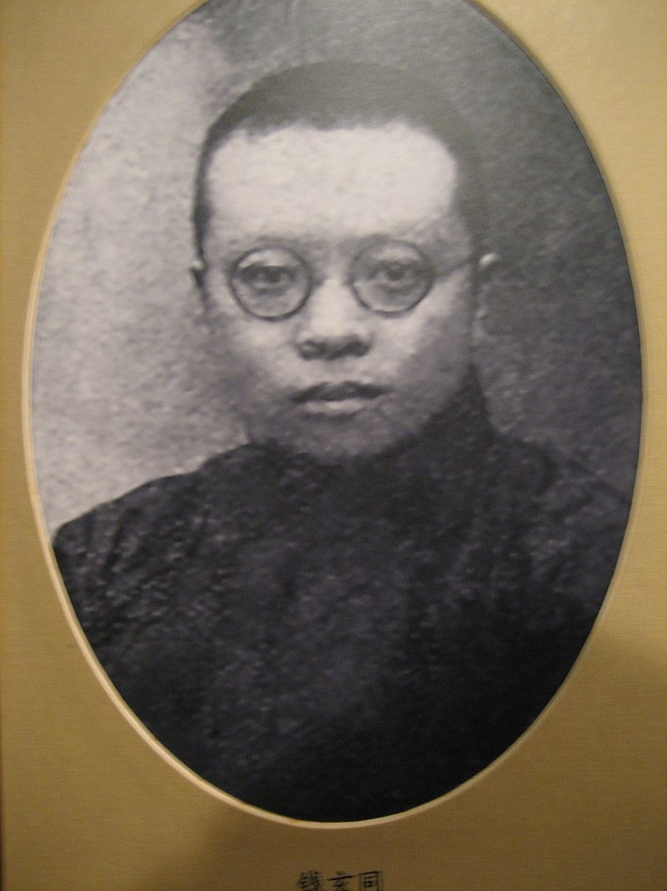

## nnnn姓名（资料）

适合所有人的历史读物。每天了解一个历史人物、积累一点历史知识。三观端正，绝不戏说，欢迎留言。  

### 成就特点

- ​
- ​

### 生平

钱玄同小传：我鼓励鲁迅写出狂人日记，推行国语罗马字

【1939年1月17日】79年前的今天，推行普通话，简化汉字的先驱钱玄同病逝

钱玄同（1887年9月12日－1939年1月17日）浙江湖州人。新文化运动的先驱，汉字改革的先驱。鼓励鲁迅写成《狂人日记》。

【拜章太炎为师的愤青】

1887年9月12日，出生于今浙江湖州，父亲是清朝同治年间进士。

1904年（17岁），剪掉辫子，与朋友共办《湖州白话报》，封面上只写“甲辰年”、不写光绪三十年。

1906年，赴日本留学，入早稻田大学。拜章太炎为师，与黄侃、鲁迅、周作人等人结识，加入同盟会。

【鼓励鲁迅写出《狂人日记》】

1910年（23岁），回国后任中学教员。1913年到北京，在国立北京高等师范学校任教授，长达二十余年，同时长期在国立北京大学兼课。

1917年（30岁），他向陈独秀主办的《新青年》杂志投稿，倡导文学革命，成为“五四”新文化运动的揭幕人之一。随后两年，钱玄同是《新青年》的轮流编辑之一。

在这期间，他曾动员鲁迅给《新青年》写文章。鲁迅的小说《狂人日记》就是钱玄同催促他写出的第一篇作品，并且第一次用“鲁迅”作笔名。

【致力于国语运动】

1917年（30岁），钱玄同加入中华民国国语研究会，致力国语运动。会长是蔡元培。该会宗旨是研究本国语言选定标准，以备教育界采用。他所著的《文字学音篇》是中国高等学校最早的音韵学教科书，数十年来，影响颇大。

1919年，他成为“国语统一筹备会”的常驻干事。同年，中华民国国语研究会出版了《国音字典》，最终由教育部公布成为教育标准，其中钱玄同起了关键作用。

【国语罗马字】

1922年（35岁），钱玄同提出了《减省现行汉字的笔画案》。1925年，钱玄同与黎锦熙一起创办《国语周刊》。“国语统一筹备会”于1928年改组为“筹备委员会”，于1935年又改组为“国语推行委员会”，他都一直任常务委员。

国语罗马字由林语堂倡议，钱玄同、赵元任拟定，1928年9月26日由国民政府大学院公布。

该方案使用复杂的拼写规则来标示声调，虽使用不广，但直至今天在某些场合下仍被使用，如为区别山西与陕西，将陕西写作Shaanxi。华人姓名也常用到，如陈省身（Shiing-Shen Chern）、马英九（Ma Ying-jeou）、蔡英文（Tsai Ing-wen）等。

【推行简化字】

1934年（47岁），钱玄同又提出《搜采固有而较适用的简体字案》，并自己起草了“第一批简体字表”，共2300多字。1935年，大学院公布了其中的324个字。这是历史上由官方公布的第一批简化汉字。为新中国推行“简化字”立下先例。

不过，此次简化却引起了轩然大波。考试院院长戴季陶尤为反对。戴季陶说：“简化汉字十分荒谬，破坏了中国文化”，并三个月拒绝参加国民党会议。1936年2月，教育部奉行政院命令“简体字应暂缓推行”。

【文字改革的先驱】

此外，钱玄同还倡导使用新式标点符号、阿拉伯数字、公元纪年法、汉字横行书写等。

可以说，建国以后文字改革的三大任务：简化汉字、推广普通话、制定和推行《汉语拼音方案》，钱玄同早在半个世纪以前就做过很多坚实的奠基工作，称得起是文字改革工作的前驱。

1939年1月17日（52岁），钱玄同忽然右脑部溢血，在北京的德国医院逝世。著名物理学家钱三强是他的儿子。

【四十岁该枪毙】

钱玄同说话喜欢直来直去，从不转弯抹角。他以为中年以上人大都是固执而专制的，曾经激愤地说：“人到四十就该死，不死也该枪毙。”

但是他自己过了四十岁还没有死。到了他四十一岁生日的时候，胡适便给他作了一首《亡友钱玄同先生成仁周年纪念歌》。内容是：

该死的钱玄同，怎么至今未死。一生专杀古人，去年轮到自己。可惜刀子不快，又嫌投水可耻。这样那样迟疑，过了九月十二。可惜我不在场，不曾来监斩你。今年忽然来信，要作成仁纪念。这个倒也不难，请先读封神传。回家先挖一坑，好好睡在里面。用草盖在身上，脚前点灯一盏。草上再撒把米，瞒得阎王鬼判。骗得四方学者，哀悼成仁大典。年年九月十二，到处念经拜忏。度你早早升天，免在地狱捣乱。

【】

### 照片

与北大同事(由左至右)马裕藻,钱玄同,沈士远.jpeg)

