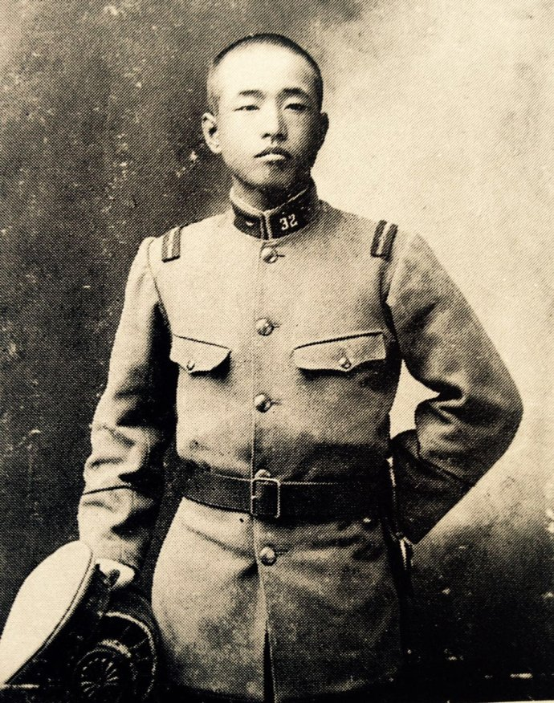
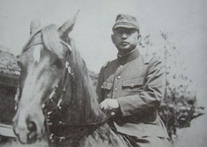
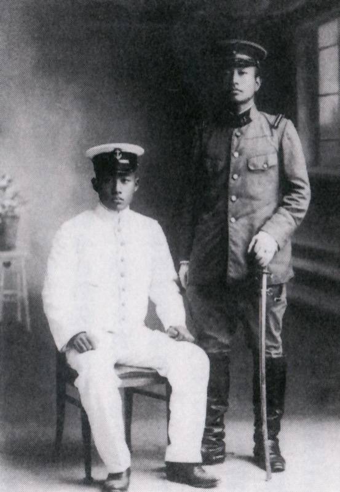
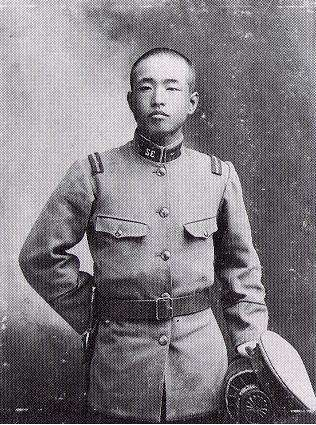
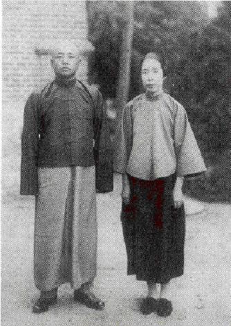
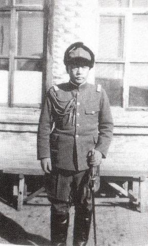
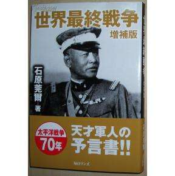
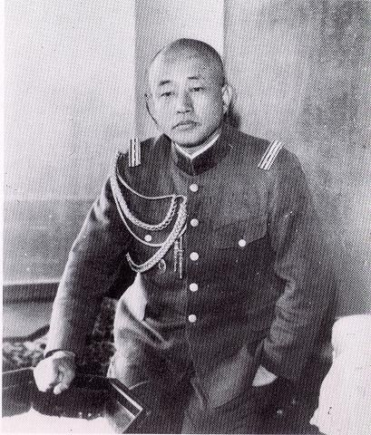
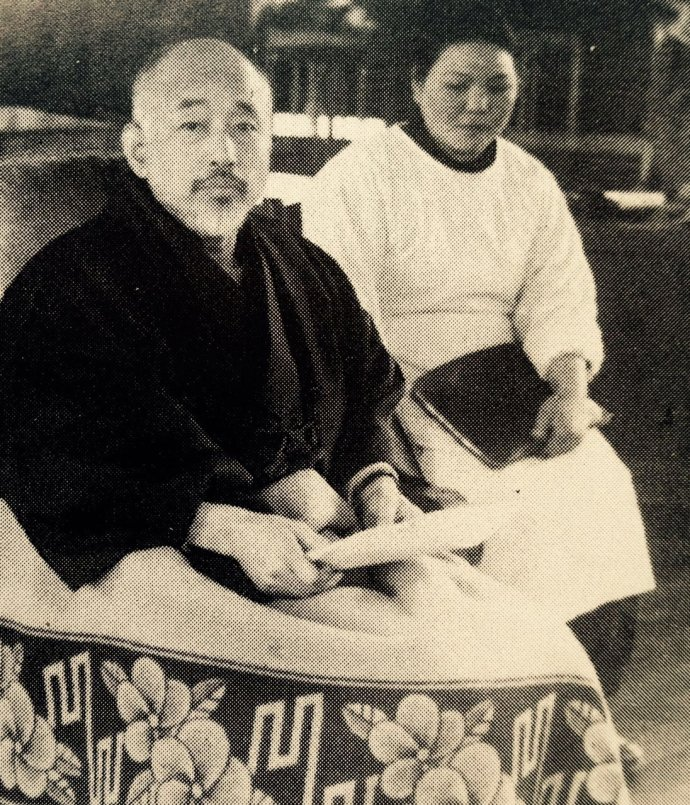

## nnnn姓名（资料）

适合所有人的历史读物。每天了解一个历史人物、积累一点历史知识。三观端正，绝不戏说，欢迎留言。  

### 成就特点

- ​
- ​

### 生平

石原莞尔小传：我谋划九一八，却反对侵略中国，因为东西方终有一战

【1889年1月18日】129年前的今天，不是战犯的九一八主谋东条英机出生

石原莞尔（1889年1月18日－1949年8月15日），日本陆军中将，军事思想家。任关东军参谋时，与板垣征四郎一起策动了九一八事变。他认为日本应该满足于满洲国，不应全面侵略中国，因为他相信“世界最终战论”，也就是东方跟西方终须一战，因此日本需要和中国结成盟友。因战略与东条英机对立，后被边缘化，甚至曾策画暗杀东条英机。二战结束后，他没有被当成战犯起诉。

【成绩优异的另类】

1889年1月18日，石原莞尔出生于日本山形县。1902年，考入了仙台陆军幼年学校，成绩一直名列前茅。1905年进入了陆军中央幼年学校。

石原莞尔早年是个另类，一年到头不洗澡，把身上的虱子装在铅笔盒中养起来作为观赏。学校安排了写生课，石原莞尔的作业让老师瞠目结舌，他画了一根男性生殖器，又写一行字：我的宝贝，画于厕所，11月1日。

（晋升为少尉的石原莞尔与弟弟次郎）

【鸣枪高呼中华民国万岁】

1907年12月，进入日本陆军士官学校第21期步兵科，以第6位毕业。

1911年，辛亥革命胜利，驻扎在朝鲜的石原兴奋异常，向部下说明革命的意义，又一起鸣枪高呼“中华民国万岁”。

1915年，考入陆军大学第30期。1918年，以第2名的成绩从陆军大学毕业。

（陆军士官学校年代的石原莞尔）

【认为中国是失败的民族】

1920年4月，被派到驻汉口的华中派遣队司令部，上司是板垣征四郎少佐。石原莞尔逗留了一年多，考察了湖南，四川，南京，上海和杭州等地，总结出应对军阀最好的办法是：“比起武力会战，收买和宣传具有更大的价值”。他认为当时的中国“官乃贪官，民乃刁民，兵乃兵痞；政府欺压民众，官民对立；若外国入侵，民众不会支持政府”；“中国的爱国学生是世界上最乱的，就是他们起哄闹事，把老百姓推到最前线，然后他们转身就走了。总而一句话就是说，中国是一个政治失败的民族。”

1921年5月，被调到陆军大学任教官。1922年7月，去德国进修两年，回国后继续在陆大任教官。

（石原莞尔与太太在中国）

【九一八事变的主谋】

1928年8月，经河本大作（皇姑屯事件的主谋）的推荐，到满洲任关东军作战主任参谋，1929年5月，板垣征四郎也被调到关东军任高级参谋。两人经常碰头，研究满洲的问题，形成了“满蒙占有论”。

1931年9月18日，策动了918事变。在柳条湖炸毁了一小段南满铁路，并进攻张学良军队的北大营。在石原莞尔劝说下，关东军司令本庄繁同意立即出动关东军，于19日占领了奉天（今沈阳）。最终，一万多人的关东军占领了相当于日本国3倍大小的满洲。

最初，参谋本部顾及国际影响，不同意在满洲建立政权的方案，并劝阻关东军停止作战。石原莞尔提出“关东军就是全体放弃日本国籍，改编为满洲合众国国军，也要拿下全满洲”。 1932年8月，石原莞尔晋升大佐，同年10月去日内瓦参加国联大会，在这次会议上日本宣布退出国联。

在建立了满洲国之后，石原从原来的“满蒙占有论”转向了“满蒙独立论”，建议部分日本人放弃国籍成为满洲人。

（石原莞尔在东北）

【东西文明的决战构想】

他在“最终战争论”中曾写到，“发源于中亚的人类文明分为东西两支，几千年来各自发挥其特长和特点，不断进步，而最近两三个世纪的发展更是突发猛进。时至今日，这两个文明已形成隔着太平洋而相互对峙的局面。这种局面必将导致战争，战争之后将走向统一，最终创造最后最高的文明的“黄金时代”，人类最后的大战争是以日美为中心而进行的世界大战争，首先是持久战争，然后是决战战争”。

石原在《最终战争论》中提出了“满蒙生命线”的理论，他认为日本应该先将满蒙拿到手，再以此为基地征服苏联，再联合中国，最终代表黄种人与以美国进行一场东西文明的对决。

【被边缘化的中将】

1937年3月，石原莞尔晋升少将，任参谋本部作战部部长。七七卢沟桥事变时，他反对把战线再扩大。同年9月，被调任为关东军的参谋次长，他的“不扩大方针”、“满洲国自立”的想法，与当时的关东军参谋长东条英机矛盾激烈。他常常直骂东条为“东条上等兵”和“白痴”。

石原莞尔被逐渐边缘化。1938年12月，被任命为京都府舞鹤市的司令官。1939年8月晋升中将，并调任京都的陆军第十六师团的师团长。1941年3月1日，石原莞尔被免除师团长职务，被迫从军队退役。

【密谋刺杀东条英机】

1944年6月，柔道家牛岛辰熊和津野田知重少佐，得知日军的惨败，他们向皇族递交了一份让东条下台信件。他们将信件也递给了石原。石原考虑一晚后，在信件上写上“作为非常手段，迫不得已时只好杀了东条”。

第二天两人用红铅笔在末尾上写上“同意动手”。就暗杀的手段，两人打算采用习志野的化学学校秘密开发的氰化钾炸弹“茶瓶”，但这时东条因为战局不利辞职下台了，之后两人的计划走漏，于9月被捕。

【不是战犯】

1945年8月15日，日本战败后，因为曾和东条的对立，免于被起诉为战犯。但仍以证人的身份出席了远东国际军事法庭。

1949年8月15日，石原莞尔在家中口述完名为《新日本的进路》的遗书后，因膀胱癌等病在家中去世，终年60岁。

（信奉佛教日莲宗的石原莞尔）

