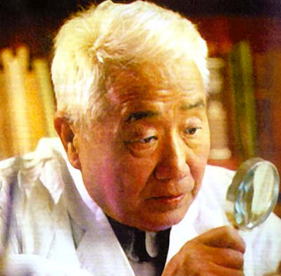
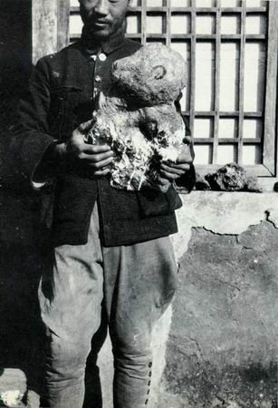
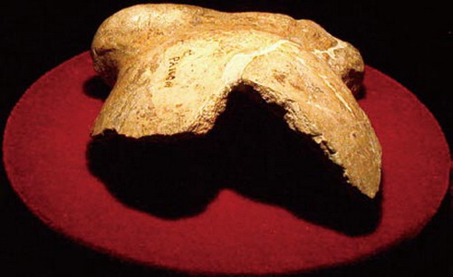
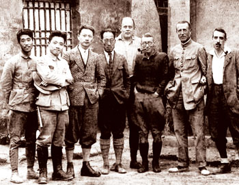
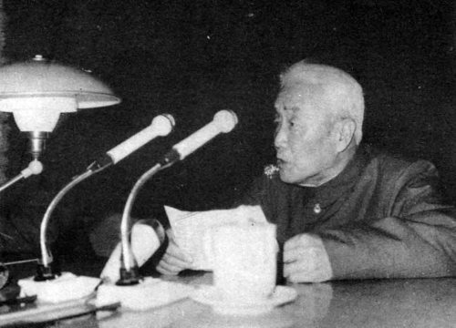
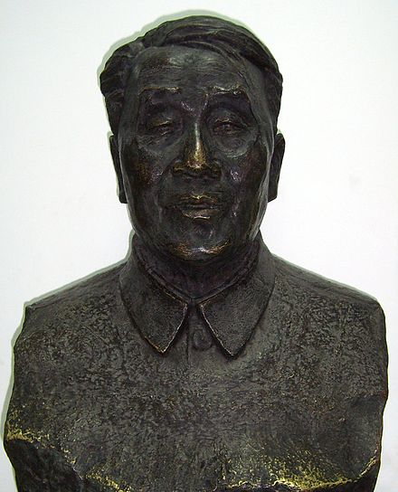
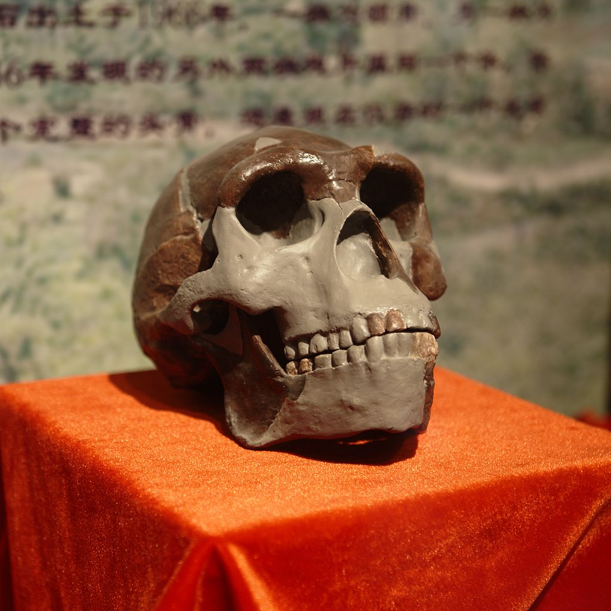
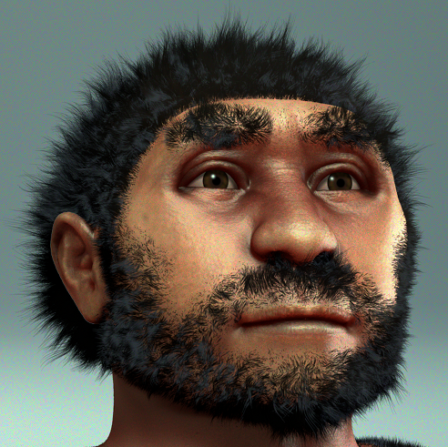
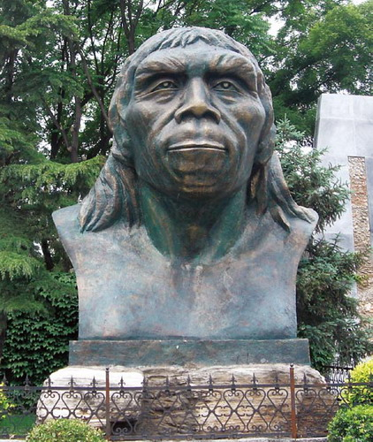

## nnnn姓名（资料）

适合所有人的历史读物。每天了解一个历史人物、积累一点历史知识。三观端正，绝不戏说，欢迎留言。  

### 成就特点

- ​
- ​

### 生平

裴文中小传：我发现了北京人，但他不是我们的祖先

【1904年1月19日】114年前的今天，发现北京人的裴文中出生

裴文中（1904年1月19日－1982年9月18日），是中国现代考古学家、古生物学家。北京人的发现者。

【发现北京人】

1904年1月19日，生于今河北唐山丰南县。1921年，考入北京大学预科，两年转入本科地质系。1927年，从北京大学地质系毕业。

1929年起（25岁），主持并参与周口店龙骨山的发掘和研究。一个冬日黄昏，在一处岩洞中，裴文中挖出了一块“著名的头盖骨”。他“像抱着一个婴儿似的”，回到办公室，发出了一封考古史上最为著名的电报：“顷得一头骨，极完整，颇似人。”

这便是轰动世界的北京猿人！

（裴文中手持北京人头盖骨化石）

【发现山顶洞人】

此后，在周口店又先后发现五个比较完整的北京人头盖骨化石和一些其他部位的骨骼化石，还有大量的石器和石片等物品，共十万件以上。北京人遗址是世界上出土古人类遗骨和遗迹最丰富的遗址。

然而在此时期所发掘出来的头盖骨却在1941年时下落不明，成为历史上的一个谜团。现存唯一真标本是1966年头顶部堆积层发现的一个北京人头盖骨的模型。

1930年，在北京人遗址顶部的山顶洞，又发现了山顶洞人。裴文中主持进行了发掘，获得大量有价值的化石及其文化遗物。

（北京人头盖骨化石-额骨发现于1966年5月）

（裴文中在周口店）

【古人类学创始人】

1935年，裴文中赴法国巴黎大学留学。回国后，先后在北京大学、燕京大学和北京师范大学讲授史前考古学。他是中国旧石器考古学和第四纪哺乳动物学的奠基人，中国古人类学创始人之一。1955年被选聘为中国科学院学部委员（院士）。

1982年9月18日，在北京病逝。

【失踪的北京人化石】

1937年卢沟桥事变之后，中日战争爆发。在周口店的挖掘工作被迫中断，化石存放在属于美国的协和医院的新生代研究室。可是，到1941年日美关系日趋紧张。经国民政府协调，美国驻华大使同意并授权，决定将这批珍贵的古人类化石运往美国保存。

1941年12月5日凌晨，一列美海军陆战队专列驶出北平，据说车上装有北京人头盖骨化石。按计划列车到秦皇岛后，化石运到“哈利逊总统”号轮船，然后运往美国。

然而第二天，也就是1941年12月8日，日本偷袭珍珠港，美国对日宣战，太平洋战争爆发了。美海军陆战队在秦皇岛的兵营被日军侵占，从此北京人头盖骨不见踪迹。

（中国古动物馆展出的北京人头骨复制品）

【我们不是北京人】

50多年来，中国考古学家先后在云南元谋、陕西蓝田、安徽和县等地发现了60多处古人类遗址。因此，有人认为，中国的现代人类起源于本土的早期智人。北京人作为现代中国人的直系祖先之一，曾被写入历史教科书。

然而基于对现代人群线粒体DNA和Y染色体的分析，现代人约于10-20万年前在非洲东部出现，并不早于6万年前进入东亚。也就是说，北京猿人和今天的中国人没有关系。

在10万年前至4万年前之间，中国存在一个明显的化石“断档”期，即这一阶段的人类遗址非常少见。很可能是因为，6万到4万年前源于非洲的智人到达中国，并逐渐取代了亚洲大地上的古人，比如北京猿人的后代。

（电脑模拟的北京人复原图）

（周口店遗址“北京人”复原像）

