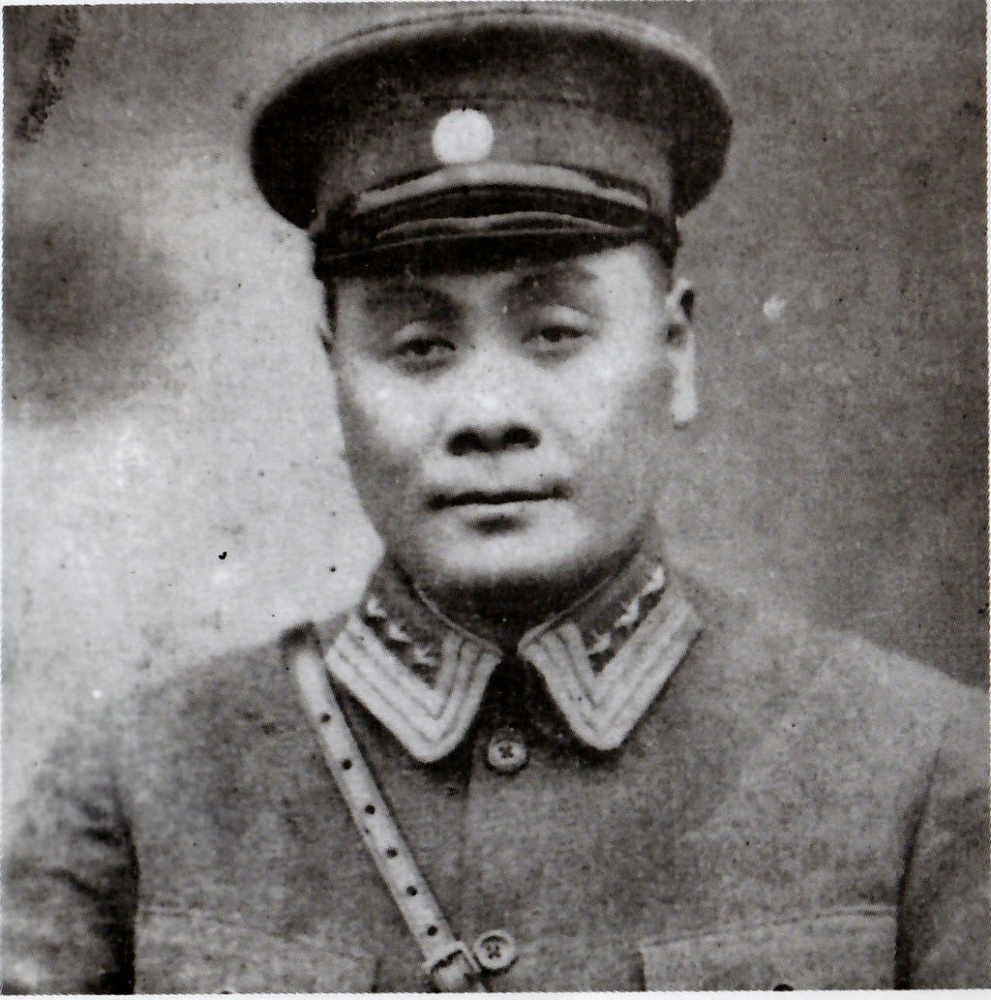
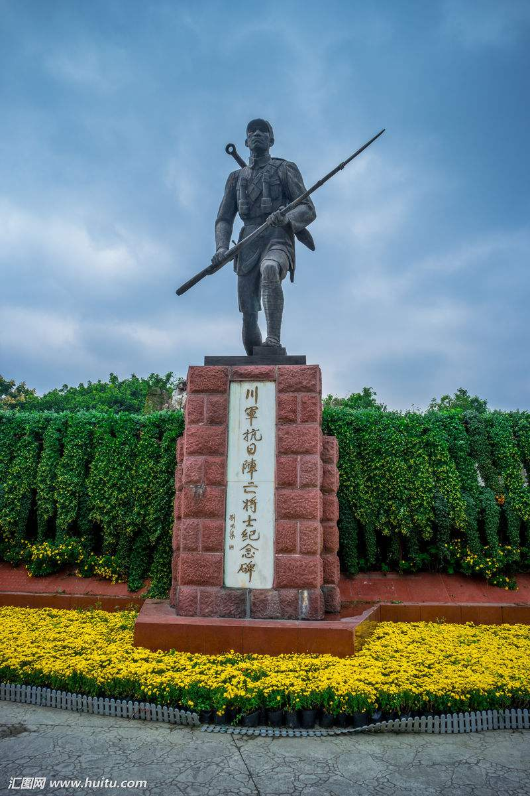
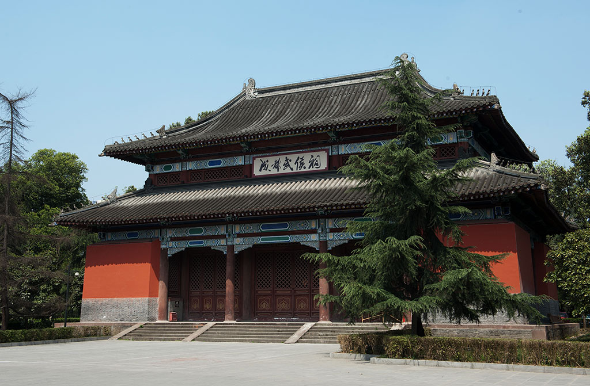
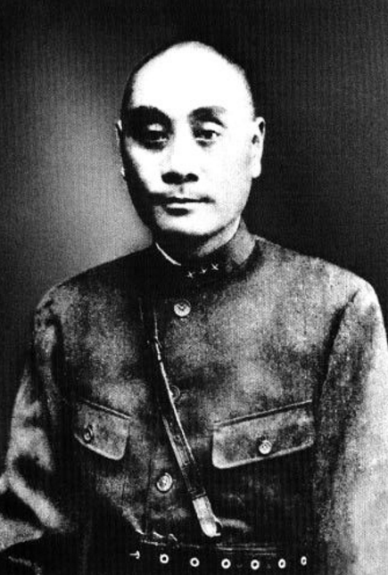
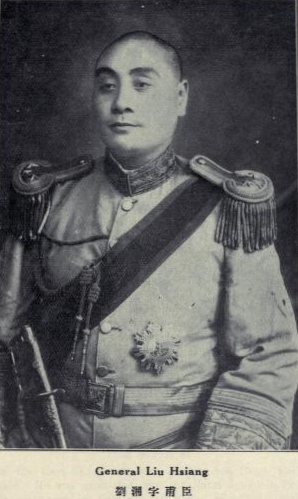
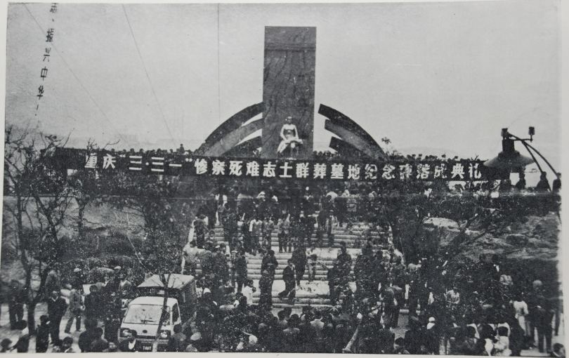
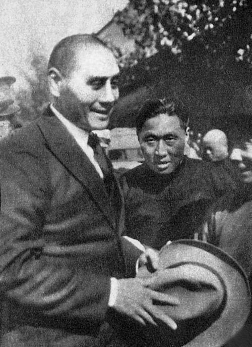
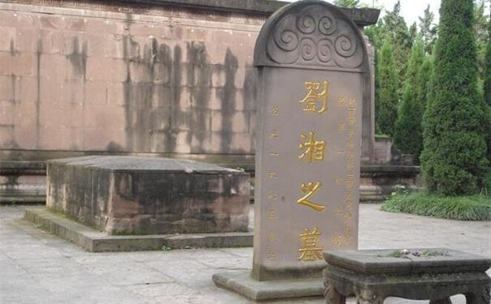

## nnnn姓名（资料）

适合所有人的历史读物。每天了解一个历史人物、积累一点历史知识。三观端正，绝不戏说，欢迎留言。  

### 成就特点

- ​
- ​

### 生平

刘湘小传：我说抗战到底，却在密谋反蒋，只是吾命休矣

【1938年1月20日】80年前的今天，抗战到底的川军老大刘湘在开战前病逝

刘湘（1890年7月1日－1938年1月20日）四川大邑人，中华民国军事将领，川军领导人之一。在纷乱的川军之争中，最终胜出。抗战爆发，率川军出击。却又在此时，与韩复渠密谋反蒋，两人一个病逝，一个被杀。

刘湘留有遗嘱：“抗战到底，始终不渝，即敌军一日不退出国境，川军则一日誓不还乡！”川军每天升旗时，官兵必同声诵读一遍，以示抗战到底的决心。

【爬起来的川军总司令】

1890年7月1日，刘湘生于四川省大邑县安仁镇。

1909年（19岁），刘湘从四川陆军速成学堂毕业，加入了川军。1916年8月，任四川第一师第二旅旅长。1918年10月，任第二师师长。1919年（29岁），作为川军指挥官，被推戴为川军总司令。

（刘湘陵园的荐馨殿，匾额被替换为“成都武侯祠”）

【走了唐继尧，来了熊克武】

1920年5月，滇军唐继尧介入四川， 熊克武策划发起军事行动。刘湘作为北路总司令，支持熊克武。7月，刘湘任四川陆军第二军军长。8月，驱逐滇军的战争开始，胜利后刘湘被任命为重庆镇守使。

1921年，四川督军刘存厚失去川军的支持而下野。刘湘接管民政，任川军总司令兼四川省长。不久，刘湘与熊克武之间爆发“一二军之战”（熊任第一军军长、刘湘任第二军军长，故名），刘湘败北，于1922年5月下野。

【驱逐杨森，赶走袁祖铭】

1923年7月，刘湘得到直系吴佩孚支持，任四川善后督办。他同川军指挥官杨森联合，击败了熊克武。1924年5月，吴佩孚任命杨森为四川督理，刘湘不满，转而接受段祺瑞的支援。

1925年7月，杨森试图统一四川，开始讨伐其他川军。刘湘联合黔军袁祖铭反击，将杨森驱逐出四川。后来，刘湘又与袁祖铭对立，与杨森和解。1926年5月，刘湘将袁祖铭驱逐出四川。

【和堂叔的双头体制】

1926年，刘湘同吴佩孚对抗，国民政府任命刘湘为国民革命军第二十一军军长。1927年3月31日，中共举行“重庆各界反对英美枪击南京市民大会”，遭到刘湘屠杀镇压，史称三・三一惨案。

此后，刘湘强化自身权力，对其他川军合纵连横或讨伐。与担省政府主席的堂叔刘文辉构筑了双头体制。1929年，重庆大学成立，刘湘为第一任校长，为其发展做出很大贡献。

【打败刘文辉，惨败于红军】

1931年，爆发了“二刘之战”，刘湘得到蒋介石支持，刘文辉则倾向新桂系。1932年2月，刘湘被蒋介石任命为四川善后督办。1933年10月，刘湘大败刘文辉，确保了四川省省政的主导权。

同时期，刘湘被任命为四川剿匪总司令，迎击红军的长征。刘湘重用身边的参谋、算命先生刘从云，同部下关系逐渐疏远。川军在红军面前遭遇惨败。1934年11月，刘湘到南京拜访蒋介石后，被任命为四川省政府主席。

【抗战到底，始终不渝】

但是此后，蒋介石想加强中央对四川的统治，与刘湘关系恶化，双方对立。1937年，抗日战争爆发，刘湘率川军出击抗日前线，任第七战区司令长官、第二十三集团军总司令。

11月，刘湘突然患病，在汉口住院治疗。其间他同山东省政府主席韩复榘秘密联络，策划反蒋活动。1月11日，韩复榘在汉口出席军事会议期间被逮捕。刘湘得知消息后，惊恐万分，1月20日疾病发作而死。死后，国民政府追赠一级上将军衔，2月14日国葬于成都市郊刘湘陵园。

去世前，刘湘留有遗嘱：“抗战到底，始终不渝，即敌军一日不退出国境，川军则一日誓不还乡！”刘湘这一遗嘱，很长一段时间里，在前线川军每天升旗时，官兵必同声诵读一遍，以示抗战到底的决心。

【】

### 照片

