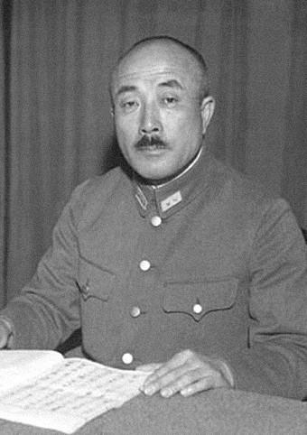
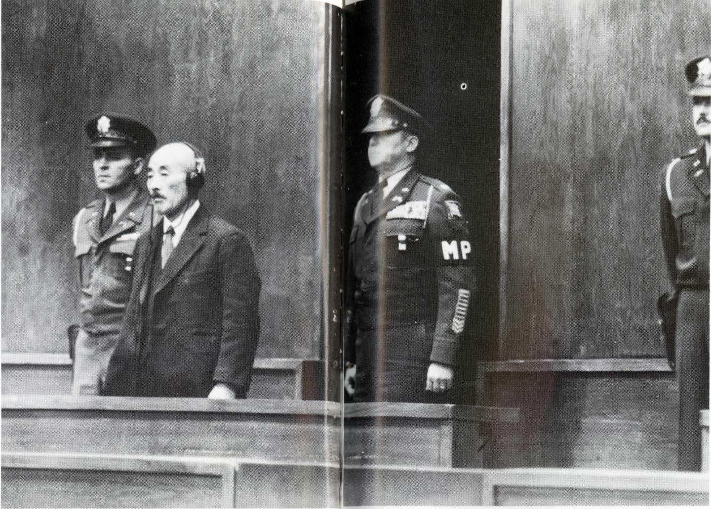
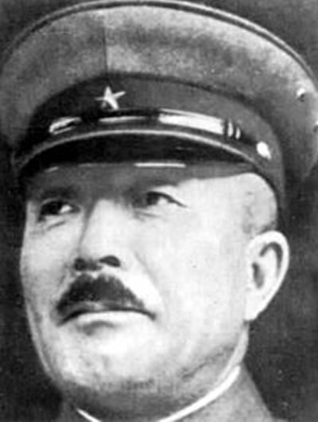
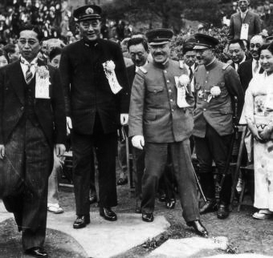
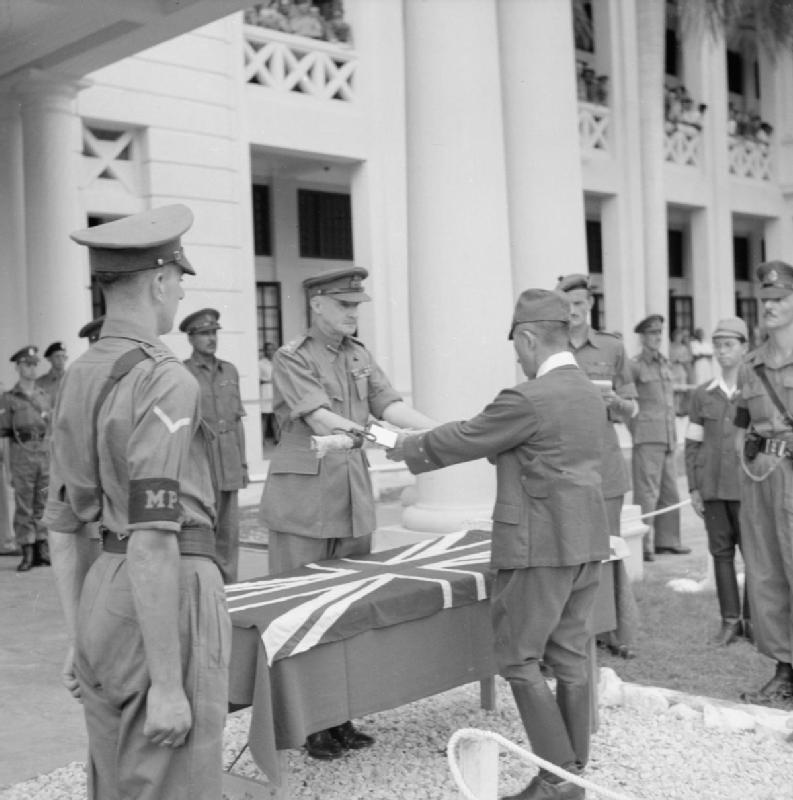

## nnnn姓名（资料）

适合所有人的历史读物。每天了解一个历史人物、积累一点历史知识。三观端正，绝不戏说，欢迎留言。  

### 成就特点

- ​
- ​

### 生平

板垣征四郎小传：是我策划了九一八，满洲国，蒙古德王和汪精卫政府

【1885年1月21日】133年前的今天，九一八、满洲国、汪精卫政府的策划者板垣征四郎出生

板垣征四郎（1885年1月21日－1948年12月23日），日本岩手人，陆军大将。与石原莞尔策划了九一八事变，与土肥原贤二策划建立了满洲国，参与扶植德王成立傀儡政权蒙古军政府，策划汪精卫伪政府的成立。

任第5军团长，在平型关战役中，被八路军击败。台儿庄战役中，打破国军的包围，救出了上万名日军。日本投降后，在远东国际军事法庭中，定为甲级战犯，执行绞刑。

（审判台上的板垣征四郎）

【标准的日本军人】

1885年1月21日，板垣征四郎出生于日本岩手县。

1899年（14岁），入仙台陆军地方幼年军校。1901年入陆军中央幼年学校。1904年，陆军士官学校第16期毕业，同期生知名者包括：永田铁山、小畑敏四郎、冈村宁次、土肥原贤二等。

1916年（31岁），陆军大学第28期毕业，同期知名者包括：木村兵太郎（大将、被远东军事法庭判处绞刑）、山下奉文（大将、被马尼拉军事法庭判处绞刑）、牛岛满（追晋大将、冲绳岛战役指挥官）、酒井隆（香港作战指挥官，被南京军事法庭判处死刑）等。

【到处搞事的中国通】

1919年（34岁），调到汉口，在支那派遣队任参谋，任职时结识了石原莞尔大尉。因为熟悉中国情况，板垣征四郎在日本陆军中，被奉为的“中国通”。

1929年（44岁），任关东军高级参谋。1931年，和石原莞尔共同策划了九一八事变。1932年，与土肥原贤二策划建立了满洲国，晋升为陆军少将，任满洲国执政顾问。1934年，任满洲国军政部最高顾问，参与扶植德王成立傀儡政权蒙古军政府。

（1938年6月，参加满洲活动的板垣征四郎（左三））

【中国战场上】

1937年，七七事变后，任第5师团长，在山西与阎锡山指挥第二战区的中国军队作战。9月，在平型关战役中，第5师团的一支辎重部队在山西灵丘被八路军歼灭。

太原会战结束后，第5师团调往山东，沿胶济铁路进攻青岛。在台儿庄会战中，第5师团的第21旅担任救援部队，打破第五战区国军的包围，救出即将被歼灭的第10师团的上万名日军。

1938年，回日本任陆军大臣两年。1939年年，任中国派遣军总参谋长，策划汪精卫伪政府的成立，继续参与对华战争的指挥。

（登上《时代周刊》上的板垣征四郎）

【被绞死的甲级战犯】

1941年，板垣晋升为陆军大将，调任日本朝鲜军司令。1945年4月，板垣接替土肥原贤二任第7方面军司令官，驻地新加坡，指挥东南亚日军作战。8月15日，日本宣布无条件投降。9月间，板垣在新加坡向英军投降。

日本战败后，板垣被远东国际军事法庭定为甲级战犯，并被判处死刑。1948年12月23日，板垣征四郎在东京巢鸭监狱内被处以绞刑。

（日本战败，板垣征四郎在新加坡向英军代表递出军刀）

