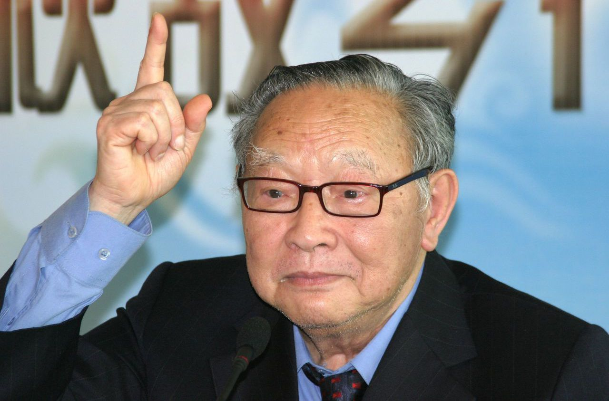
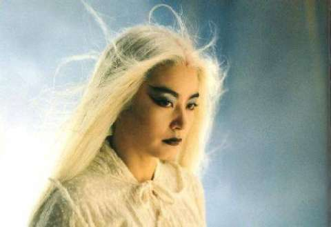
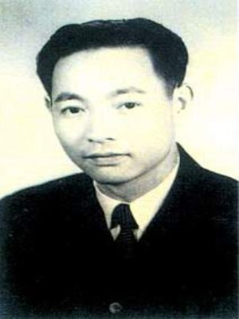
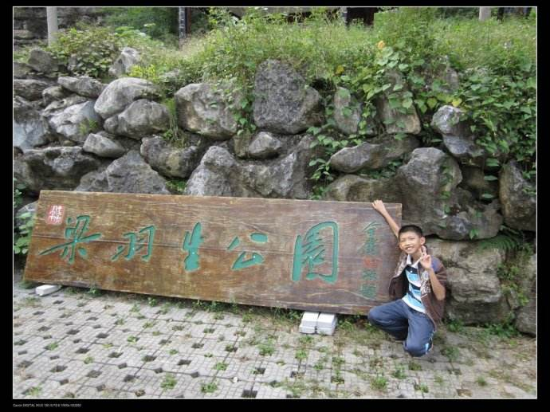
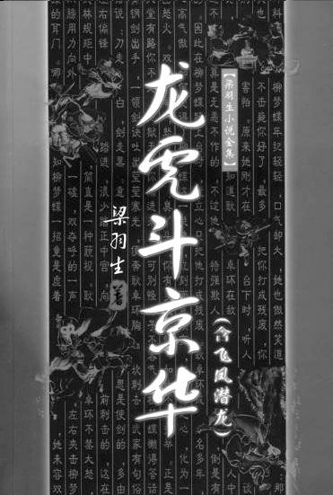
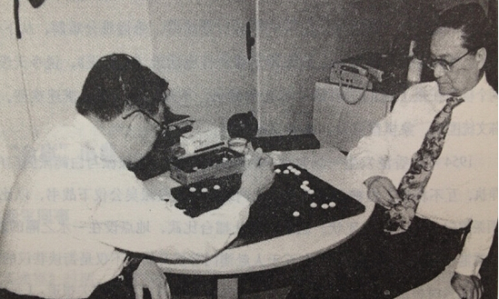
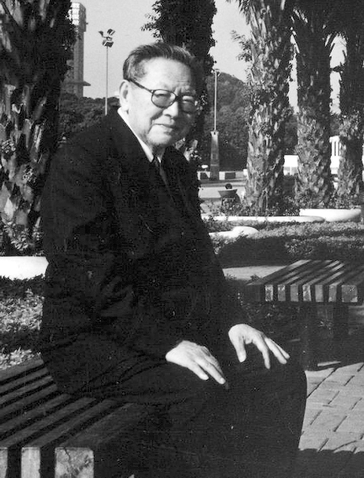
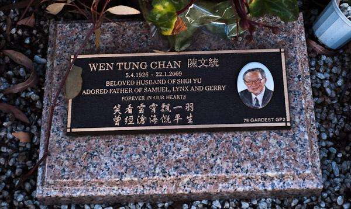

## nnnn姓名（资料）

适合所有人的历史读物。每天了解一个历史人物、积累一点历史知识。三观端正，绝不戏说，欢迎留言。  

### 成就特点

- ​
- ​

### 生平

梁羽生小传：白发魔女和七剑下天山、说不尽的萍踪侠影和云海玉弓缘

【2009年1月22日】9年前的今天，由一场约架写起的新派武侠小说开山鼻祖梁羽生逝世

梁羽生（1924年4月5日－2009年1月22日），广西蒙山人，原名陈文统。中国著名武侠小说家，与金庸、古龙并称为中国武侠小说三大宗师，被誉为“新式武侠小说开山鼻祖”。

梁羽生创作了30多部武侠佳作，无数次被搬上荧幕，成为无数华人茶余饭后的话题。代表作包括《七剑下天山》、《白发魔女传》、《萍踪侠影录》、《女帝奇英传》、《云海玉弓缘》等。

【患难中的师生】

1924年4月5日，梁羽生出生于广西蒙山县，原名陈文统。在广西桂林中学读完高中，喜爱文学。正逢日本侵略中国，多位广东学者避难广西，曾入住他家，如太平天国史专家简又文、敦煌学专家饶宗颐等。他拜简又文为师，向他们学习历史和文学。

后随老师到广东，考入岭南大学国际经济专业。1949年定居香港，在《大公报》任副刊编辑，次年调入《新晚报》工作。

（年轻时的梁羽生）

（广西蒙山的梁羽生公园）

【一场约架的意外收获】

1954年1月17日，旅居香港的吴氏太极拳宗师吴公仪在澳门迎战白鹤拳高手陈克夫，此事轰动一时。第二天，梁羽生决定创作武侠小说，20日开始在《新晚报》连载《龙虎斗京华》，署名“梁羽生”，直到8月1日刊毕。这便是新派武侠小说的开始。

梁羽生在武侠小说中，渗入了许多的中国传统文化，融和文学、历史、诗词、联语于一炉，受到广大读者的欢迎。他摒弃了旧派武侠小说一味复仇与嗜杀的倾向，将侠行建立在正义、尊严、爱民的基础上，提出“以侠胜武”的理念。

梁羽生被誉为“新式武侠小说开山鼻祖”。

【30年的武侠生涯】

此后，从1954年到1984年，30年间梁羽生共创作了30多部武侠小说。他的作品多次被改编成电影或电视剧。他自认《萍踪侠影录》（1959）、《女帝奇英传》（1961）及《云海玉弓缘》（1961）三书是代表作。其他经典作品还包括《七剑下天山》（1956）、《白发魔女传》（1957）等等。

读者常将梁羽生和金庸并称武侠两座高峰：“金梁并称，一时瑜亮”。梁羽生自己也说：“开风气也，梁羽生，发扬光大者，金庸。”

（在《新晚报》期间，梁羽生与金庸是好友，一同下棋）

【真实世界里的武侠人生】

1987年，移居澳大利亚。2006年12月，回香港参加活动时，突然中风，手脚活动不便。2009年1月22日，在悉尼去世，享年85岁。

武侠小说大师金庸在梁羽生的挽联中写道：“同行同事同年大先辈；亦狂亦侠亦文好朋友”。

著名导演张纪中说：“梁羽生文学最大的特点就是历史感很厚重，他笔下武侠世界中的人都生活在真实的历史背景和社会中，相比之下，金庸的作品往往是生活在武侠世界里的侠客，他们过着与世隔绝的生活。”

（梁羽生墓）

