## nnnn姓名（资料）

适合所有人的历史读物。每天了解一个历史人物、积累一点历史知识。三观端正，绝不戏说，欢迎留言。  

### 成就特点

- ​
- ​

### 生平

【1989年1月23日】29年前的今天，一生只爱一个女人的超现实艺术大师达利去世

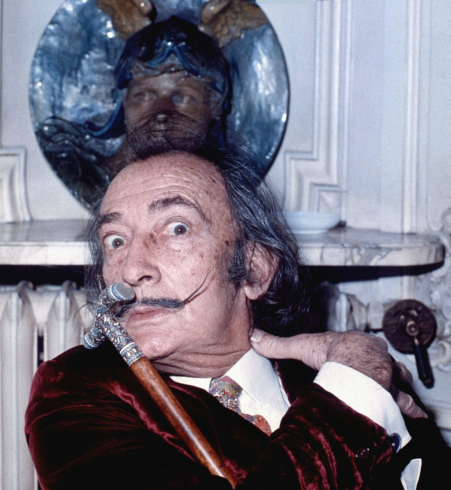

达利（1904年5月11日－1989年1月23日），是著名的西班牙画家，因其超现实主义作品而闻名，他与毕加索和马蒂斯一同被认为是20世纪最有代表性的3个画家。

达利是一位具有非凡才能和想像力的艺术家，因为触目惊心、与梦相关的超现实主义画作，被人们所熟知。他的作品将怪异梦境般的形象、卓越的绘画技巧令人惊奇地混合在一起，令人振奋人心。

他最知名的作品之一是1931年创作完成的《记忆的永恒》。他有一种对做出出格的事物而引起他人注意的狂热爱好。
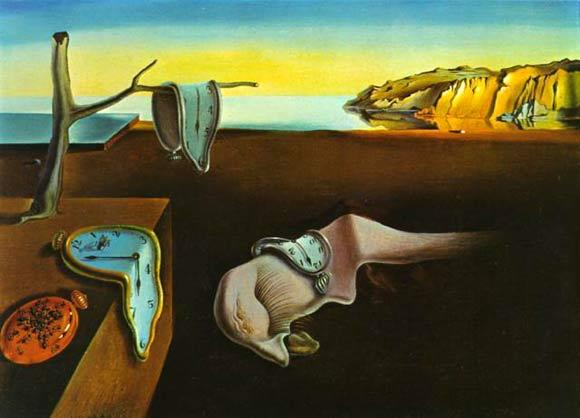

【哥哥的复制品】

1904年5月11日，达利出生于西班牙加泰罗尼亚。在达利出生9个月前，他2岁的哥哥死于感染疾病。达利5岁时，父母将他带到哥哥坟墓前，说他是死去哥哥的转世。达利相信了，对他造成很大影响。

12岁时，开始学习绘画。第二年，父亲就在家中用达利的炭笔画作品举办了一次画展。1919年（15岁），他分别在菲盖拉斯市政歌剧院和巴塞罗那参加了当地艺术家的集体画展。巴塞罗那大学校长亲自为他颁奖。

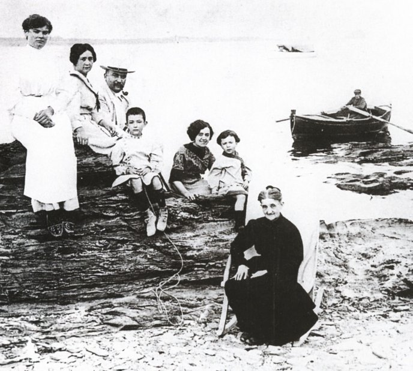

【翘胡子的“花花公子”】

1922年，达利离开了著名的马德里学生公寓，开始了在圣费尔南多皇家美术学院的学习。达利凭借他的怪诞的风格和花花公子的行径很快吸引了人们的注意。他当时留着长发和连鬓胡子，一副19世纪晚期英国社交界的打扮。同时，他在画作中探索立体主义，名声鹊起。

1926年，在期末考试不久前，达利因煽动学生闹事而被学院开除。同年，达利第一次去了巴黎，结识了令他深深敬佩的毕加索，深受影响。

1927年，达利在各地举办的画展，被人们认为是新一代画家中最有前途的天才之一。达利开始模仿文艺复兴后期的大师委拉斯开兹，蓄起了显眼的翘胡子，这成为了他的标志性特征。

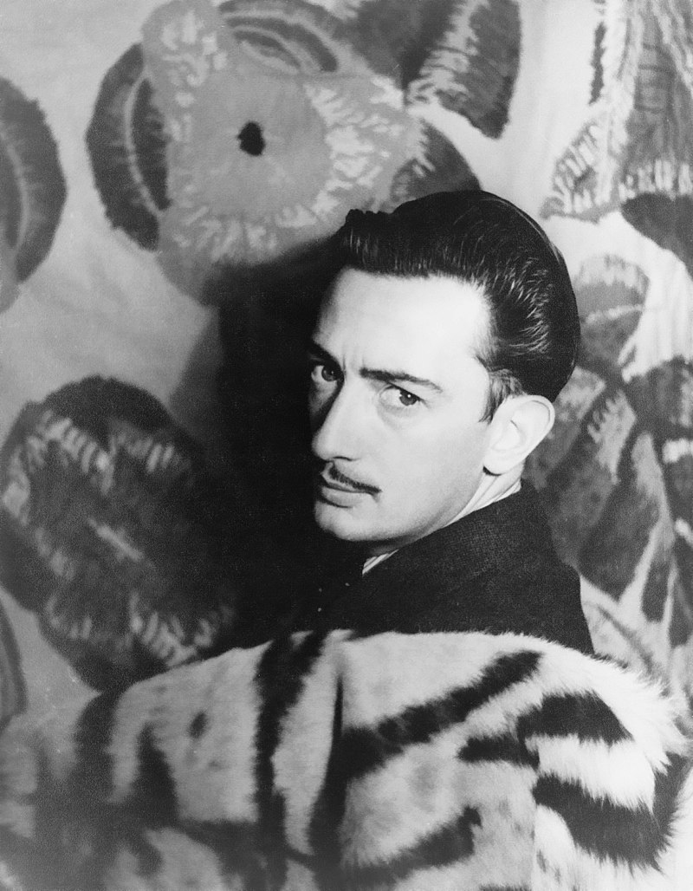

【大10岁的缪斯】

1929年8月，达利回到家乡度假，结识了比他大10岁的卡拉——他未来的妻子，也是他一生最重要的“缪斯”。达利崇拜卡拉，视她为圣母化身。在他的画里，几乎所有激情的描绘都集中在她的身上。

在现实生活中，卡拉是精明干练的总管，更是行销高手；达利噱头十足，她则能言善道，两人联手打入美国市场，如鱼得水，名利双收。

1929年12月28日，达利被父亲赶出了家门。后来，他曾描述过这场闹剧，他将一个用过的安全套拿给他父亲，并说: “拿好！现在我什么都不欠你了！”。

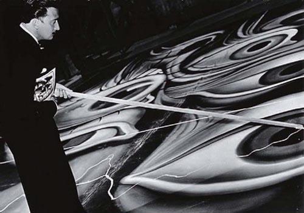

之后，达利与加拉在伯特利加特附近的一个海湾，租下了一只小船，买下附近的土地，并不断扩张成沿海山庄，即现在的达利家庭博物馆。两人于1934年举办民事婚礼，1958年又举办了天主教婚礼。

达利为何如此迷恋卡拉？答案只有达利自己知道。他曾对别人说：“她能治疗我的神经质、焦虑和暴力冲动。”她陪伴达利50余年，是达利终身的灵感泉源，并在达利的画作中持续出现。她去世后，达利失去了灵感的缪斯，从此停止创作。在艺术界，这是极为罕见的。没有卡拉就没有伟大的画家达利，这是画坛公认的事实。

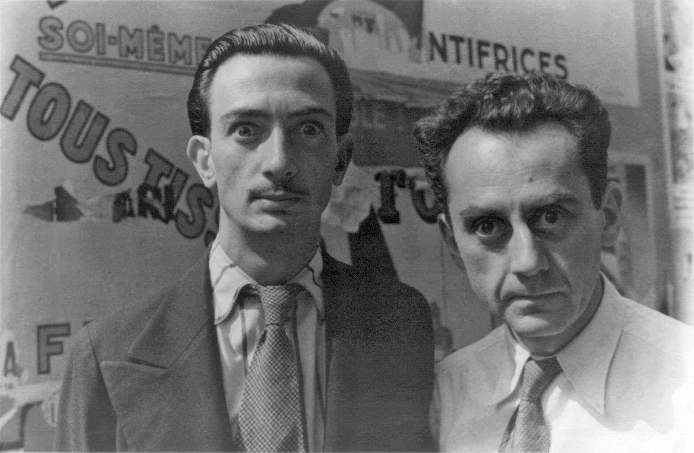

【记忆的永恒】

1931年，达利完成了他最知名的作品之一，《记忆的永恒》。

1934年，达利抵达美国。他作品展（含《记忆的永恒》）在纽约掀起了巨浪。达利和加拉在纽约举办了一场假面舞会，他们化装成林德贝格宝宝和他的绑架者。这场闹剧太过显眼，以至于达利不得不公开致歉。作为一个超现实主义者，他的所做所为总是让人触目惊心。

【超现实的公众人物】

1940年，二次世界大战的战火蔓延至欧洲，达利和加拉逃往美国，开始了八年的旅居生活，并重拾天主教信仰。

在这些年里，他负责橱窗装饰、为书籍设计插画，担任电影场景美工等。这是他生命中最多产的年代，也是备受争议的时候。这段时期达利将绘画边缘化，同时在艺术和消费品之间徘徊不定。

1949年，达利返回加泰罗尼亚，选择独裁下的西班牙居住。在艺术生涯的后期，达利没有局限于绘画，而是发展各种新的艺术体验。各种超现实的艺术活动使他成为更加知名的公众人物。

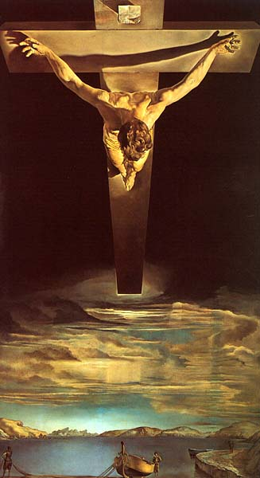

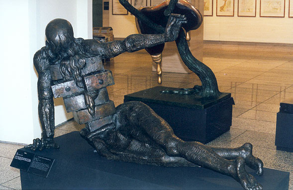

【失去的缪斯】

1980年，达利的健康状况急转直下。1982年，西班牙国王授予达利普波尔侯爵爵位。为此达利创作了画作《欧洲之首》以表谢恩。这幅画作最终成为了他的遗作。

1982年6月10日，卡拉去世。她死后，达利失去了生活的热情。他多次企图自杀。

1989年1月23日，达利因窒息性心脏病死于家中，享年84岁，埋葬在菲格雷斯故居博物馆的地下室。

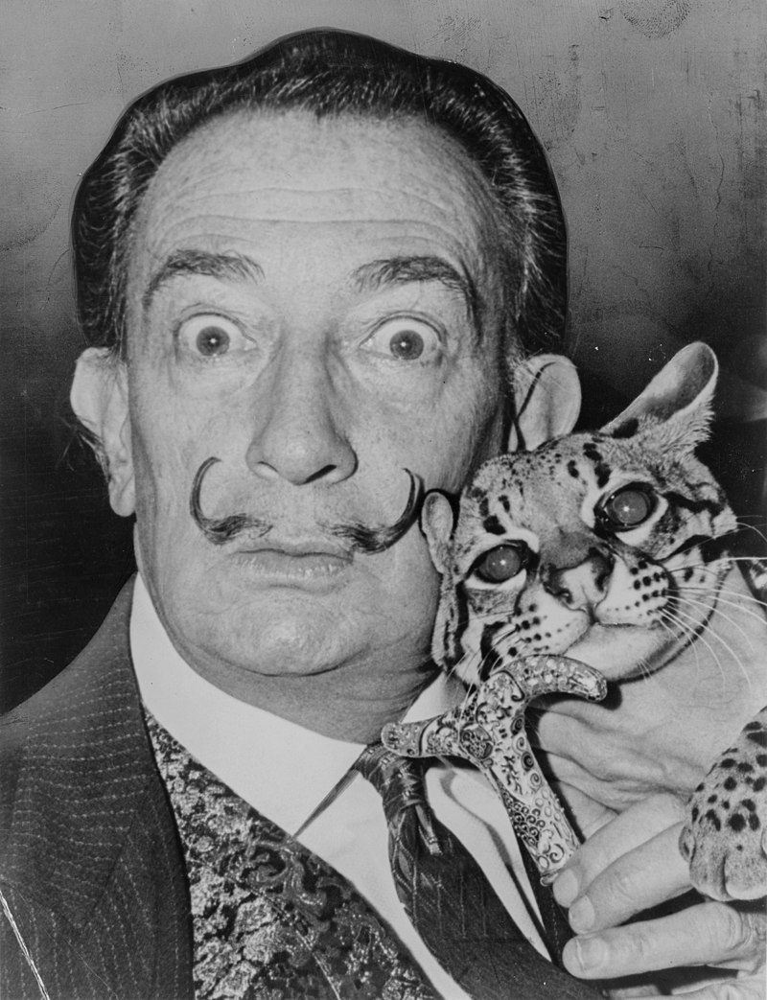

【超现实主义的大师】

他与毕加索和马蒂斯一同被认为是20世纪最有代表性的3个画家。达利是一位具有非凡才能和想像力的艺术家。他的作品将怪异梦境般的形象、卓越的绘画技巧令人惊奇地混合在一起。这种风格振奋人心，并让其他创新都相形见绌。

达利在超现实主义绘画中的影响最大，持续的时间也最长。不仅他的画，还有他的文章、口才、行动以及他的打扮，都无不在宣传他的"超现实主义"。

他的有些作品除了传达无理性、疯狂和一定程度的社会哲学观外，有时还反映着人们的时髦心态。达利赞成人应该培养真正的幻想。在他的日常生活里，他就常常故意放任自己的怪僻行为。

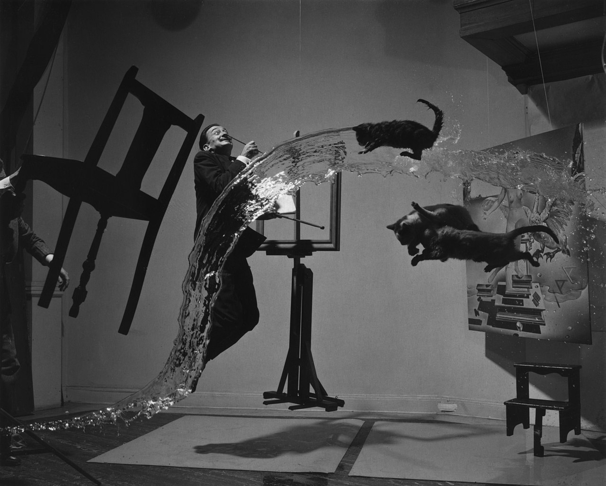

【】

### 照片

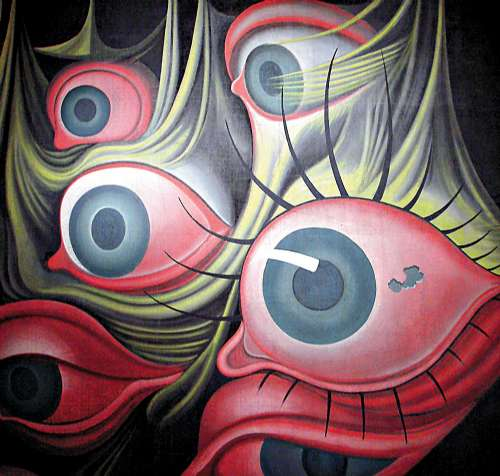

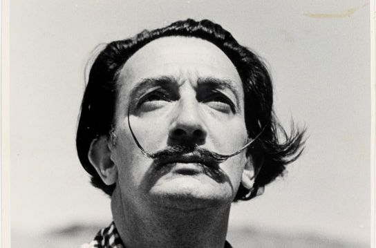

