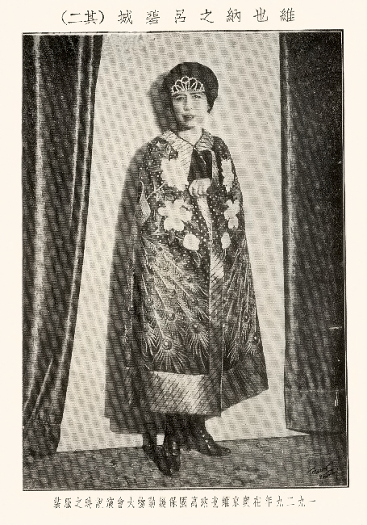
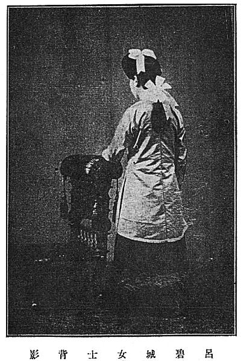
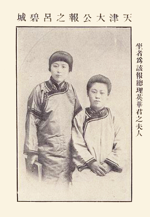
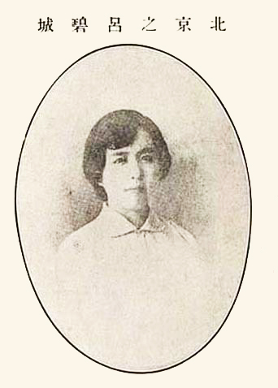
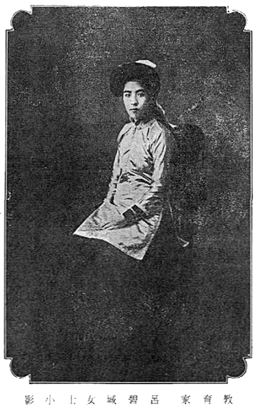
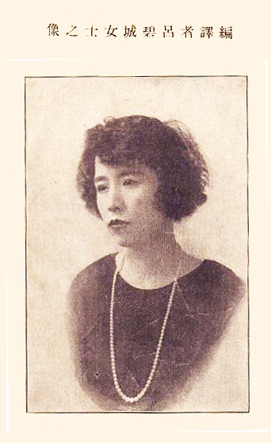
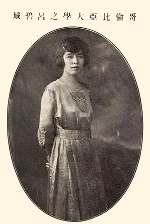
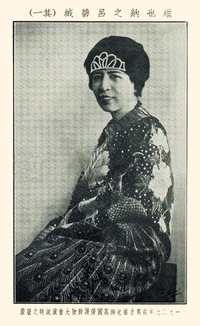
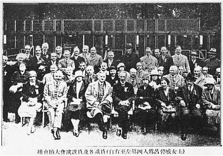
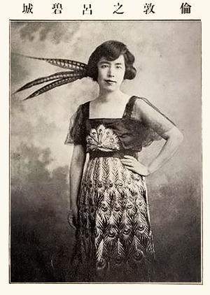

## nnnn姓名（资料）

适合所有人的历史读物。每天了解一个历史人物、积累一点历史知识。三观端正，绝不戏说，欢迎留言。  

### 成就特点

- ​
- ​

### 生平

【1943年1月24日】75年前的今天，皈依佛门的民国四大才女之首吕碧城香消玉殒

吕碧城（1883年－1943年1月24日），安徽旌德人。民国四大才女之首，被赞为“近三百年来最后一位女词人”。中国新闻史上的第一位女编辑，第一位女性撰稿人，第一位学校的女子总教习。她提倡妇女解放，与秋瑾是至交好友，两人被称为“女子双侠”。秋瑾死后，她派仆人前去收尸。

她名噪一时，各界名流争相追慕，“绛帷独拥人争羡，到处咸推吕碧城”。与袁世凯的儿子袁克文、李鸿章的侄子等来往密切。但最终都无缘，她皈依佛门，遁入空门，并成为在欧美提出禁止杀害动物的先驱者之一。

【被退婚的奇耻大辱】

1883年，吕碧城出生于安徽旌德，父亲是光绪年间的进士，官宦之家。9岁与同乡汪氏订婚。12岁，父亲去世，遗产被族侄们强行瓜分。她与母亲相依为命，到塘沽投靠舅舅，并在塘沽念书。

期间，母亲被匪徒掳去，吕碧城以侄女身份向江苏布政使求援，最终使母亲脱险。但汪家以女性被掳不名誉为名，提出退婚。当时女子被退婚，是奇耻大辱，对吕碧城的心态产生了一定影响。此后吕碧城终身未嫁。

【三百年最后一位女词人】

1903年春，吕碧城从塘沽到天津，得到天津《大公报》创办人英敛的赏识，聘为编辑。成为中国新闻史上第一位女编辑，第一位女性撰稿人。

吕碧城到《大公报》后，屡屡发表诗词作品，格律谨严，颇受诗词界前辈的赞许。词学大师龙榆生在《近三百年名家词选》中，录有66位名家词作498首，吕碧城五首殿后，因此被称为“近三百年来最后一位女词人”。

【与秋瑾结成女子双侠】

她又连续撰写倡导妇女解放、宣传女子教育的文章，如《论提倡女学之宗旨》、《敬告中国女同胞》、《兴女权贵有坚忍之志》等，她写道：“民者，国之本也；女者，家之本也。”……要通过新文明的洗礼，使旧礼教桎梏下的女子成为“对于国不失为完全之国民”、“对于家不失为完全之个人”的新女性。

吕碧城的这些观点，在社会上一石激起千层浪，引起了强烈的社会反响，成为人们街头巷尾热议的话题。她结识了大批当时妇女解放运动领袖人物，尤其与秋瑾交好，两人一时被称为“双侠”。

【北洋女学界的哥伦布】

吕碧城在文坛上声名鹊起，震动京津。她刚直率真的性情、横刀立马的气概，深为时人尤其新女性们所向往和倾慕。一时间，出现了“绛帷独拥人争羡，到处咸推吕碧城”的盛况。

袁世凯的儿子袁克文、李鸿章的侄子李经义等人纷纷投诗迎合，推崇备至，众星捧月。她以女儿之身，大方地与男人们交游，唱和诗词，赏玩琴棋，自由出入自古男性主宰的社交场所，谈笑风生，成为清末社会的一道奇谈。

1904年，唐绍仪在天津创立北洋女子公学，吕碧城任总教习。吕碧城以一个女子，执掌学校总教习一事，在社会上轰动一时。后来任总统府秘书的沈祖宪，曾称吕碧城为“北洋女学界的哥伦布”。

【革命女侠秋瑾传】

1907年1月，秋瑾在上海创办《中国女报》，该刊仅出版过两期，每期都刊登了吕碧城的文章。创刊号上刊登了她所撰的《发刊辞》，第二期刊登了她写的《女子宜急结团体论》。7月，秋瑾被清政府处决。吕碧城闻讯后，派仆人偷偷将秋瑾的尸骨收起来，安葬在杭州。

之后，吕碧城用英文写了《革命女侠秋瑾传》，发表在美国纽约、芝加哥等地的报纸上，引起颇大反响。

【信佛的女富婆】

1912年（29岁），中华民国成立后，北洋女学曾一度停办。吕碧城在袁世凯总统府任秘书，1915年辞职。

此后，她和母亲在上海安居。她继续学习英文，兼任《时报》特约记者，并因投资贸易公司而迅速致富。母亲病逝后，1918年秋，她留学美国哥伦比亚大学，为旁听生，主修美术，兼学历史和文学。

1920年春（37岁），她回国探亲，住北京饭店。当时，天台宗的谛闲法师在北京讲经说法，于是吕碧城开始信佛。

【万国保护动物大会】

1922年夏，她学成回国，住在上海，并且加入南社。1924年，她游历欧美七国，写下《欧美漫游录》（又名《鸿雪姻缘》），在北京《顺天时报》以及《半月》杂志连载，脍炙人口，传诵一时。。

1928年后，她定居瑞士，弘扬佛法，编译了《欧美之光》等书。她提出成立“中国保护动物会”的倡议，号召禁止杀害所有动物，提倡素食。

1929年5月，她应国际保护动物会的邀请，到维也纳参加大会（又称万国保护动物大会）。在会上，她发表了题为“废屠”的演说，反响强烈。维也纳六大报纸在头版发表其讲稿和个人照片，她还受到维也纳市长接见。

【皈依佛门投身大海】

1930年春，她在瑞士皈依佛门，成为在家居士，法号曼智。她曾编过中英文对照的《法华经普门品》。

1933年冬，她回中国，仍住在上海，其间完成了《观无量寿经释论》等佛学方面的著作。1936年冬，她到北京，将毕生词作进行删订，定名为《晓珠词》刊行。

1943年1月24日，她在香港病逝。亲友们遵照她的遗嘱，将其全部财产布施佛事，遗体火化，骨灰和面成丸，投入大海。

【终身未嫁的才女】

吕碧城曾被中华民国各界名流争相追慕，知名人士有民国四公子之称的袁世凯的儿子袁克文，“嵩山四友”之一李鸿章的侄子李经义、著名诗人樊增祥、易实甫等。

吕碧城曾和自己的密友说：“生平可称心的男人不多，梁启超早有家室，汪精卫太年轻，汪荣宝人不错，也已结婚，张謇曾给我介绍过诸宗元，但年届不惑，须眉皆白，也太不般配。……东不成、西不就，有失机缘……只有以文学自娱了。”

