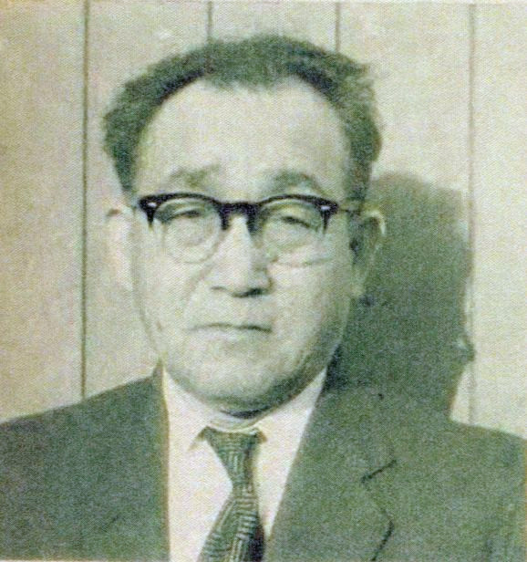
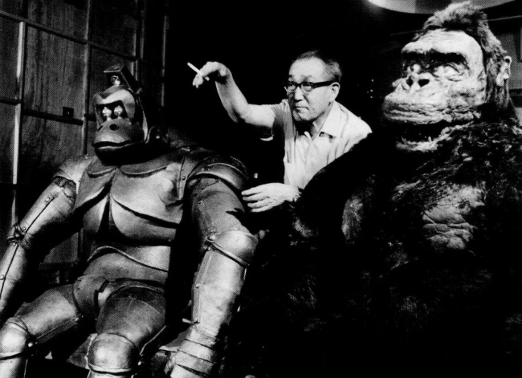
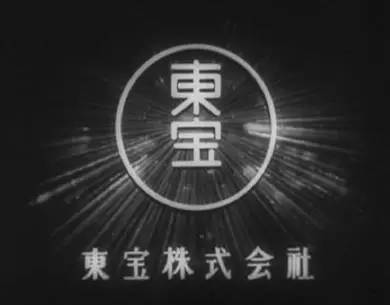
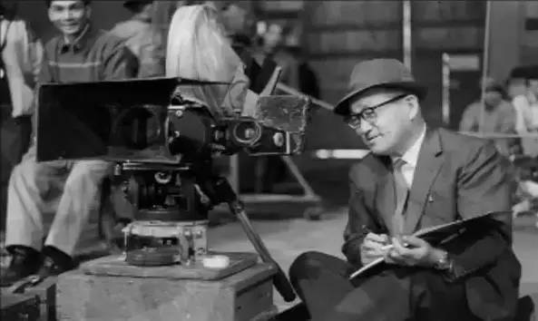
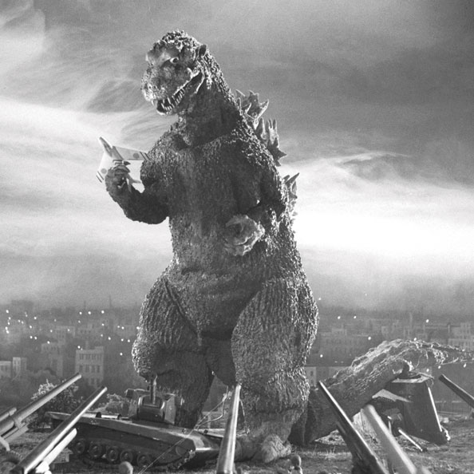
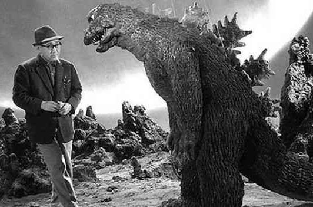
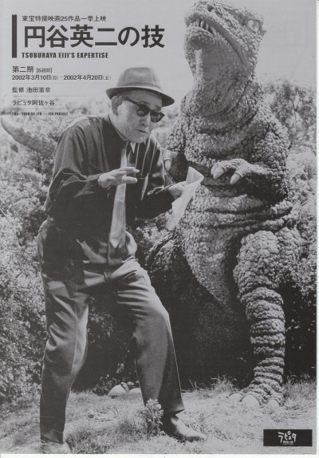
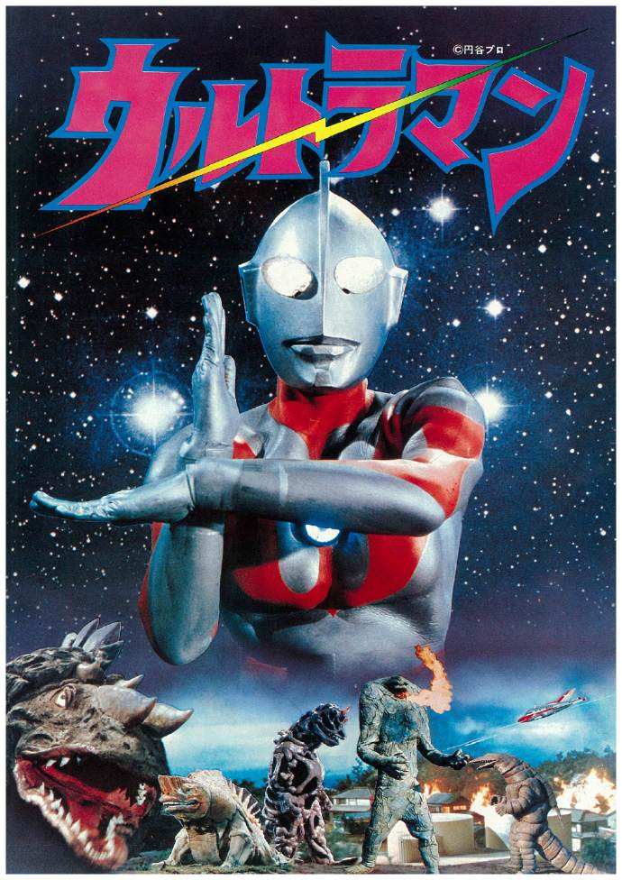
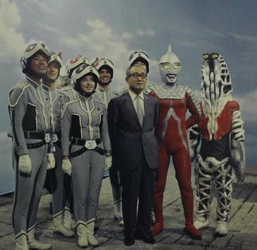

## nnnn姓名（资料）

适合所有人的历史读物。每天了解一个历史人物、积累一点历史知识。三观端正，绝不戏说，欢迎留言。  

### 成就特点

- ​
- ​

### 生平

【1970年1月25日】48年前的今天，怪兽哥斯拉、英雄奥特曼的创造者圆谷英二逝世

圆谷英二（1901年7月7日－1970年1月25日），日本福岛人，特摄电影导演。开创了戴“皮套”拍摄怪兽电影的新方法。他创造了最著名的怪兽形象——哥斯拉，同时也拍摄了风靡全球的奥特曼，被称为“特摄之神”，“奥特曼之父”。

【飞行员的理想】

1901年7月7日，圆谷英二出生于日本福岛县。3岁丧母，父亲另结新欢，由祖母一手带大。一次偶然机会，看到一张飞行员的海报，他被深深吸引，立志要成为一名飞行员。

他考入了航空学校，但在一次意外中，学校的一架飞机坠毁，教官去世，学校被迫关闭，圆谷也不得不转学。此后，圆谷四处打工。一次，圆谷和朋友赏樱后去吃饭，饭桌上朋友和对桌发生口角，圆谷上前劝架，才知道对桌是电影圈的人。从此，圆谷进入电影界。

【最著名的怪兽】

1948年，因在太平洋战争时期参与制作战争电影，被勒令从东宝公司离职后，在自己家中设立了特殊映画技术研究所。

1954年，受到美国电影《金刚》（1933年）的影响，推出了怪兽电影《哥斯拉》，描述受到辐射污染的海域中，出现了一只身高达50米的恐龙型怪兽哥斯拉。此后，哥斯拉系列共有近30集，是世界上最长寿的电影系列。

哥斯拉成为人类历史上最著名的怪兽，也成为各种类似电影、动画、漫画的怪兽原型，对于日本动漫作品有非常深远的影响。

【戴皮套的特摄之神】

由于技术限制，为了使怪兽行动更加逼真灵活。圆谷在反复尝试后，想到一个方法，那就是让人钻进怪兽模型里，于是“皮套”便被制作出来了。由人穿着皮套进行表演，虽然演员需要反复训练怪兽的动作，加上皮套闷热厚重，十分辛苦，但能够使用真实的拍摄场景，效果十分逼真。

圆谷英二被称为“特摄之神”。

【风靡全球的奥特曼】

1966年，圆谷英二拍摄了人类对抗怪兽的特摄片《奥特Q》，引起强烈反响。之后，圆谷英二又在同年拍摄了39集电视剧《奥特曼》，里面首次出现了巨大英雄，统称为奥特曼。

《奥特曼》取得空前成功，在全球刮起了一阵阵强烈无法抵挡的奥特曼旋风。90年代，正式引进中国，拥有了不计其数的中国粉丝。奥特曼以其正义、勇敢的精神，保持着长盛不衰的魅力，伴随了几代人的成长，成为儿时最美好的经典回忆。

1970年1月25日，因气喘并发心绞痛而逝世，享年68岁。

