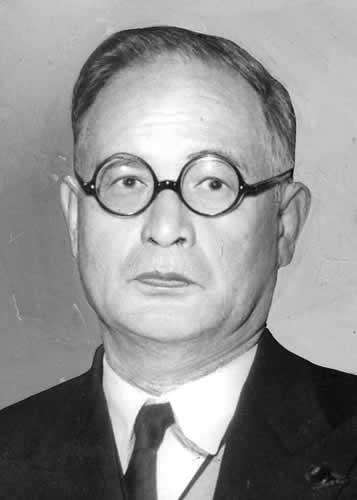
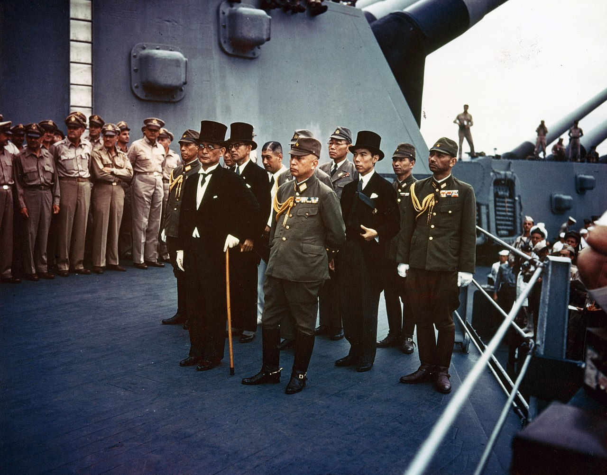
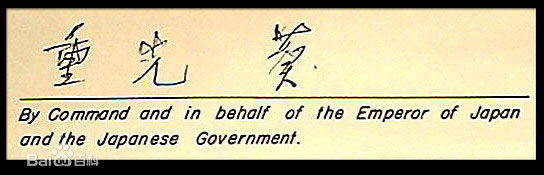
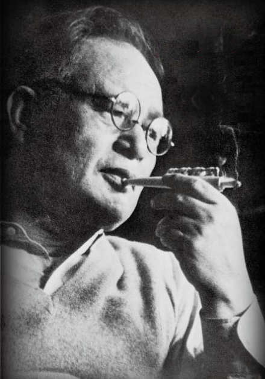
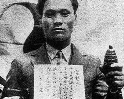
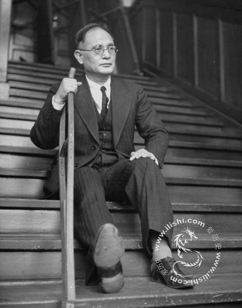
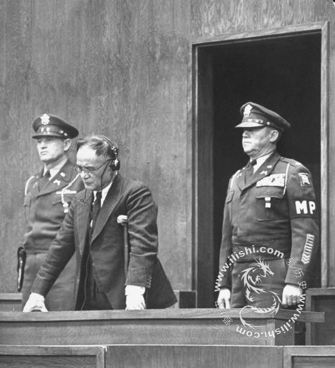
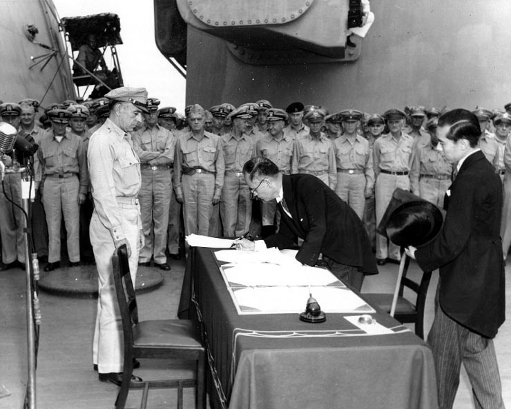
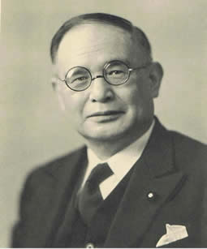

## nnnn姓名（资料）

适合所有人的历史读物。每天了解一个历史人物、积累一点历史知识。三观端正，绝不戏说，欢迎留言。  

### 成就特点

- ​
- ​

### 生平

重光葵小传：28名甲级战犯中，唯一重新进入政坛的残疾人

【1957年1月26日】61年前的今天，一只脚重新站起来的甲级战犯重光葵去世

重光葵（1887年7月29日－1957年1月26日），活跃于日本政坛长达40年的外务大臣，幕后参与主导了许多日本侵略各国的统治和外交政策。

1932年，在上海虹口公园爆炸案中，被炸成重伤，因此截肢。伤愈后，继续从政。他最著名谋略是利用溥仪建立了满州国。战败后，代表日本签署了日本投降书。后被远东国际军事法庭列为甲级战犯，判处七年有期徒刑。减刑获释后，竟再次进入政坛，担任外务大臣，堪称奇迹。

（1945年9月2日，在密苏里号上签署日本投降书，拄拐杖者为重光葵）

（日本无条件降书上重光葵的签字）

【外交官的标准路径】

1887年，重光葵出生于日本大分县。1911年，24岁的重光葵从东京帝国大学毕业，专攻德国法律。这所大学的毕业生有许多进入日本外交界，并由此踏上政坛，重光葵也不例外，进入了外务省工作。

1912年，作为外交使团的一员被派往德国。1914年，第一次世界大战爆发后，被派往英国伦敦。他对英国制度非常赞赏，与许多英国著名人士结下了友谊。

1915年，任驻华公使馆头等参赞。1919年（32岁），随日本代表团参加巴黎和会。

【被炸断腿的中国大使】

1931年，任日本驻中华民国大使。九一八事变后，他出谋划策，利用溥仪建立满州国。

1932年，在淞沪抗战中，他迫使中国军队接受了停战协议。但第二天，在上海虹口公园出席“天长节”（天皇生日）庆典时，被朝鲜抗日志士尹奉吉投弹炸伤致残。尽管如此，他还是在一星期后，在停战协议上签字确认。

1933年5月，一条腿被截肢后的他返回日本，任日本外务省次官。在这期间，由于他对中国和英国的亲善态度，他遭到军部强硬分子反对，没能出任驻中国大使。

（上海虹口公园爆炸案前，尹奉吉宣誓）

（被截肢的重光葵）

【得罪苏联的下场】

1933年—1936年，任外务副大臣，并曾任满洲国副总理。1936年8月，尽管军方反对，他还是出任日本驻苏联大使。

在苏联和日本军队，在有争议的张鼓峰地区（今中俄朝三国的交界处）发生冲突时，他的能力受到了巨大的考验，他和苏联外交部长进行了极不愉快而严峻的谈判，最终达成了停火协议。由于他的顽强、刚毅，成了战后苏联把他定为甲级战犯的重要依据。

（在审判台上的重光葵）

【签署投降书的甲级战犯】

1938年9月，他任日本驻英国大使，直到珍珠港事件爆发。1942年1月，称任驻汪精卫政权的大使。1943年4月，任日本外务大臣。只是此时已经没有外交可言，只能宣称日本对外战争的目的是“亚洲的解放与复兴”。1945年4月，重光葵辞职。8月，复任日本外务大臣兼大东亚大臣。

1945年9月2日，他和梅津美治郎代表日本天皇和政府签署日本无条件投降书。当他一瘸一拐地攀爬密苏里号战列舰时，他的军方同事把他看成是叛徒而鄙视，而盟军则带着残酷的满意心态注视着他的狼狈相。

1946年，根据苏联的建议，他作为甲级战犯被远东国际军事法庭判处有期徒刑7年。宣判后不久即减刑，1949年11月，获假释出狱。

（重光葵签署投降书）

【重返政坛的外务大臣】

1952年，返回政界，当选为众议院议员及改进党总裁。1954年，改进党和鸠山一郎的新民主党合并，任自民党副总裁。1954年12月，在鸠山内阁中复任日本外务大臣。具有讽刺意味的是，他主持了日本和苏联重建外交关系的全部活动。

1956年，作为日本政府代表出席联合国大会。在这次大会上，重光葵作了以“日本将成为连结东西方的桥梁”为题的演说，日本正式加入联合国。

1957年，突发心肌梗死于神奈川县的家中，终年69岁。

【】

### 照片

