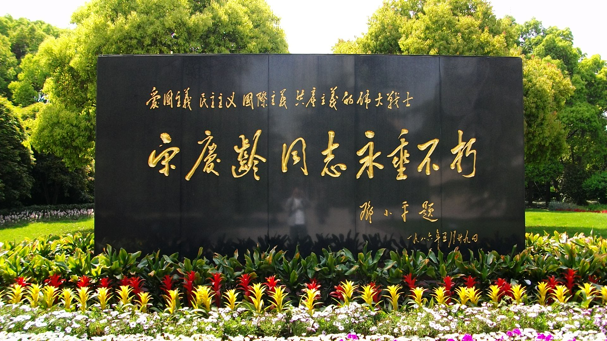

## 125年前的今天，临终前重新入党的国母宋庆龄出生

适合所有人的历史读物。每天了解一个历史人物、积累一点历史知识。三观端正，绝不戏说，欢迎留言。  

宋庆龄小传：我嫁给大27岁的孙中山，终身不孕，我亦无悔

【1893年1月27日】125年前的今天，新中国的第一位女性元首，临终入党的国母宋庆龄出生

宋庆龄（1893年1月27日－1981年5月29日），中华民国国父孙中山在中国的第二任正式妻子，被尊称为国母。孙中山此前已有元配卢慕贞以及日配大月薰。

她陪同孙中山一同走完了孙中山最后的革命人生。她坚持“联俄容共”政策，反对“清党”，反对妹妹宋美龄嫁给蒋介石。抗战爆发后，宋庆龄通电支持国共合作，宋家三姐妹一同亮相以“团结合作”的面貌示人。

她筹建了中国福利基金会，积极投身社会福利事业。中华人民共和国成立后，出任国家副主席等职务，并曾代理国家元首，成为共和国历史上首位女性国家元首。1981年5月，在她弥留之际，加入中国共产党，并被授予“中华人民共和国名誉主席”称号。

（1915年10月，宋庆龄与孙中山在日本东京结婚）

【没有父亲祝福的婚礼】

宋庆龄祖籍今海南省文昌市，1893年1月27日出生。父亲是监理会传教士及富商宋嘉澍。7岁时，她入读上海中西女塾。14岁时赴美国留学，在卫斯理安女子学院获文学学士学位。1913年6月（20岁）毕业，赴日本，接替大姐宋霭龄担任孙中山的英文秘书，两人相恋。

由于孙中山比她年长27岁，且已婚，两人的婚事遭到父亲等人极力反对。1914年底，父母将宋庆龄带回上海，软禁在家中，宋庆龄从窗口逃出，奔赴日本。孙中山离婚后，两人于1915年10月25日在东京结婚，宋嘉澍赶到日本，为时已晚，未能阻止婚礼。

（宋庆龄在卫斯理安学院的毕业照）

【为救孙中山终身不孕】

婚后，她继续担任秘书工作。1916年5月，护国战争爆发后，结束流亡，二人由日本回到上海。1917年7月，南下广东参加护法运动。1918年8月，第一次护法运动失败，又回到上海。

1920年11月，粤军攻克广州，她随孙中山再次南下，组织护法军政府，准备北伐。1922年6月，陈炯明叛变，炮轰总统府，宋庆龄坚持让孙中山先走，称“中国可以没有我，但不能没有你”。宋庆龄在逃亡过程中不幸流产，后终身未再有孕。

（1920年，宋庆龄在上海）

【陪同孙中山的一生】

1922年8月，她陪同孙中山与李大钊会晤、参与孙中山与共产国际代表越飞的会谈，这次会谈确立了孙中山“联俄容共”政策。2月，随孙中山离沪赴穗，重建大元帅府。

1924年11月，宋庆龄陪同孙中山由广州赴北京，经上海取道日本北上，与冯玉祥举行会谈。次年3月12日，孙中山在北京逝世。

（宋庆龄陵园内邓小平题词的宋庆龄纪念碑）

【秘密加入共产国际】

1927年4月，宋庆龄发表通电，谴责蒋介石，反对“清党”，坚决反对妹妹宋美龄嫁给蒋介石。在汪精卫也发动“清党”后，宋庆龄和外交部长陈友仁一同奔赴苏联莫斯科，不少报纸猜测两人“私奔”，这个谣言使得她消沉了许久。

1929年5月，回国参加在南京举行的孙中山的国葬仪式。1932年12月，与蔡元培等发起组织中国民权保障同盟，营救了大批革命者和爱国志士。1933年5月初，宋庆龄秘密加入共产国际。据廖承志回忆，宋庆龄曾代表共产国际与他秘密接头，调查叛徒名单。

（1927年的宋庆龄）

【宋氏三姐妹联合抗日】

1936年底，爆发西安事变，宋庆龄主张国共两党合作，停止内战，一致抗日。抗日战争期间，宋氏三姐妹再度联合，三姐妹曾多次共同出现在公众面前，鼓励全国军民“团结合作”。在重庆期间，宋美龄与宋庆龄之间有一条特殊电话专线“2080”。

1938年6月，在香港发起组织“保卫中国同盟”，致力于战时的医疗救济。

【民革荣誉主席】

1945年9月，毛泽东到重庆与蒋介石会谈，宋庆龄与毛泽东会见。12月，她组织中国福利基金会，从事妇幼卫生、文化教育和社会救济事业。

1948年1月1日，“中国国民党革命委员会”正式成立，宋庆龄当选为名誉主席。1949年，宋庆龄留在了中国大陆，没有和宋美龄、蒋介石等一起去台湾。

（1948年，宋庆龄在中国福利基金会的发放处）

【新中国的副主席】

1949年9月，她应中共中央邀请，到北京参加政治协商会议，被选为中央人民政府副主席。10月1日，宋庆龄作为国家副元首出席开国大典。12月，被推选为全国民主妇女联合会名誉主席。

1953年1月，宋庆龄访问苏联，在莫斯科会见斯大林。1954年9月，任第一届全国人大常委会第一副委员长，成为政治排名仅次于毛泽东、刘少奇、周恩来的党和国家主要领导人。

（1956年10月，张闻天、毛泽东、宋庆龄、周恩来、陈毅（从左至右）在北京中南海）

【被保护的国家元首】

文化大革命期间，在周恩来提议下，毛泽东批准了“一份应予保护的干部名单”，主要包括高级民主人士和国务院主要领导，宋庆龄被列为点名保护的第一位。

1976年7月，全国人大常委会委员长朱德逝世，宋庆龄接任委员长职务，成为名义上的中国国家元首。1978年2月，主持第五届全国人民代表大会，当选为第一副委员长，叶剑英任委员长。

（1957年，宋庆龄和毛泽东、邓小平在莫斯科）

【临终前追认入党】

1981年5月，宋庆龄病危。5月15日晨，前来探望的刘少奇夫人王光美询问陷入昏迷的宋庆龄，是否愿意再次申请入党，重复三遍后，得到宋庆龄的肯定。

中共中央政治局下午召开紧急会议，一致通过《关于接受宋庆龄为中国共产党正式党员的决定》，第二天，全国人大常委会决定授予宋庆龄“中华人民共和国名誉主席”的称号。

1981年5月29日20时18分，宋庆龄在其北京寓所病逝，享年88岁。

