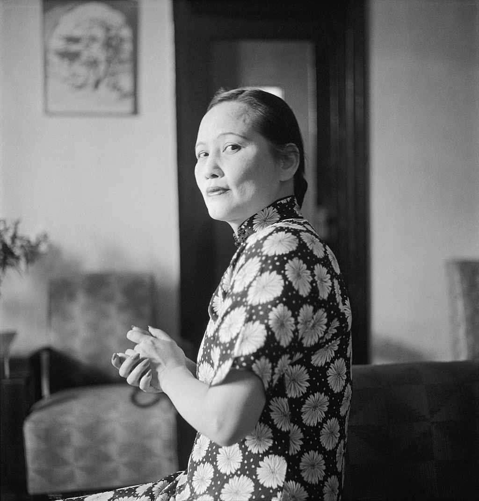
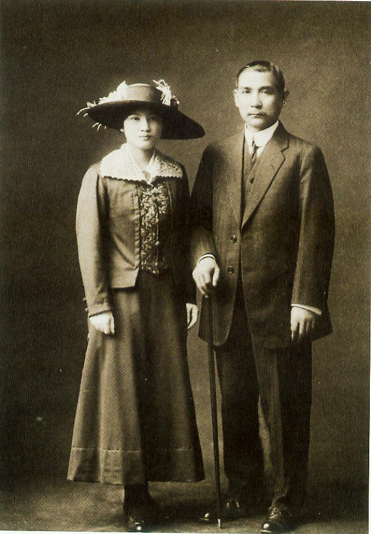
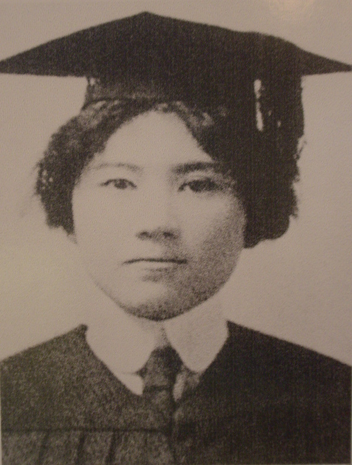
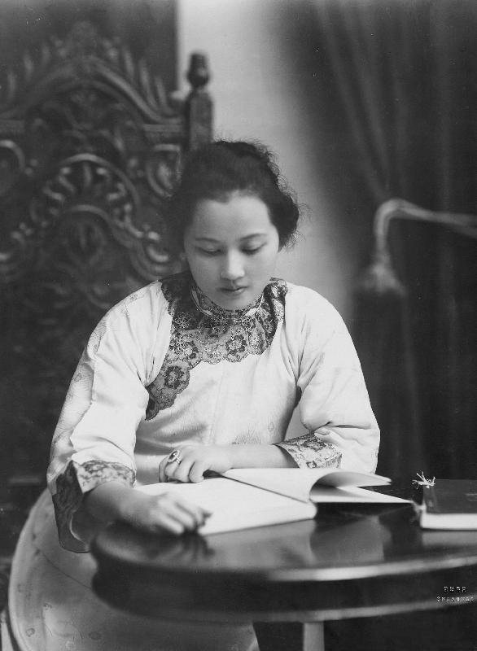
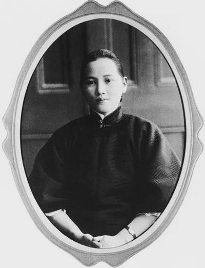
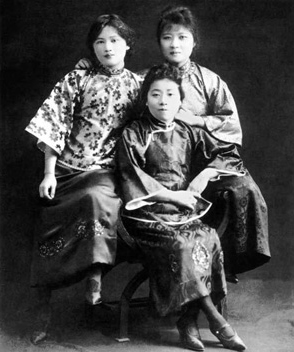
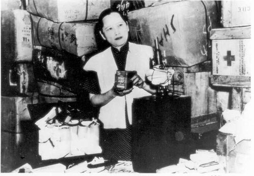
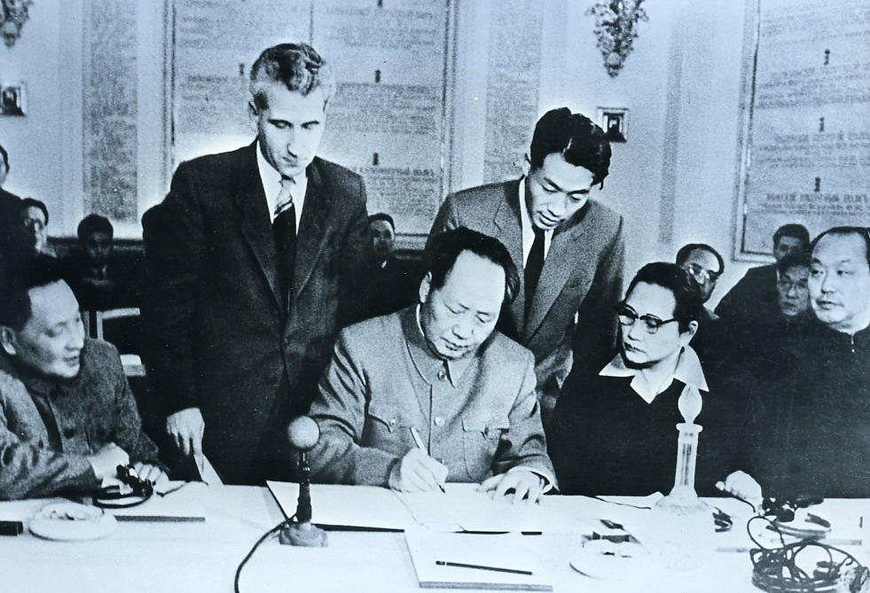
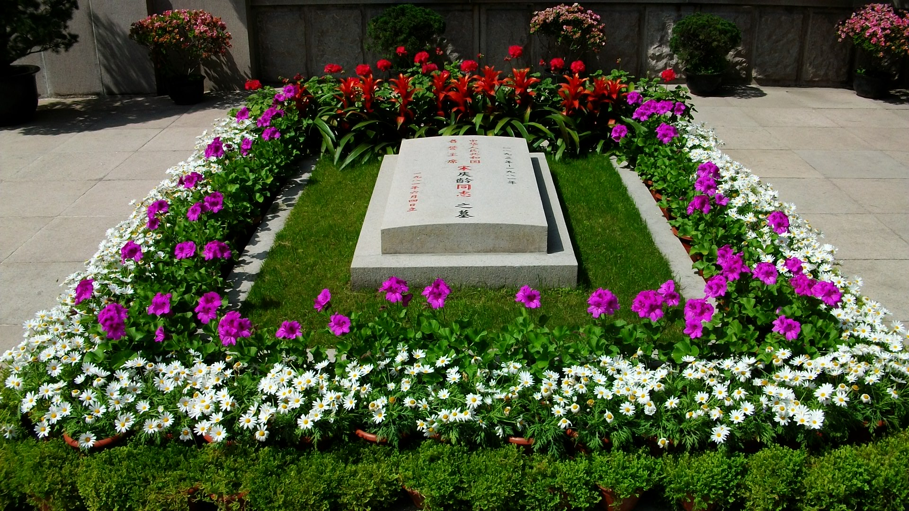

## 125年前的今天，临终前重新入党的国母宋庆龄出生

适合所有人的历史读物。每天了解一个历史人物、积累一点历史知识。三观端正，绝不戏说，欢迎留言。  

宋庆龄（英文名字：Rosamond，1893年1月27日－1981年5月29日），20世纪中国政治家、社会活动家和国际活动家，是已故中国革命家、中国国民党总理及中华民国国父孙中山先生在中国的第二任正式妻子，孙在前已有元配卢慕贞以及日配大月薰。
在国共内战时期，她坚持孙中山的“联俄容共”的政策，反对中国国民党“清党”。抗战爆发后，宋庆龄通电支持国共合作，并和宋家姐妹以“团结合作”的面貌示人，还筹建了中国福利基金会，积极投身社会福利事业。中华人民共和国成立后，先后出任中央人民政府副主席、国家副主席等职务，并曾两次代理国家元首，成为中华人民共和国历史上首位女性国家元首，亦位居党和国家主要领导人之列。1981年，她获授予国家名誉主席称号，是迄今为止唯一一位获得这一称号的人士，中共中央政治局也批准她加入中国共产党。同年，她因病于北京逝世。

宋庆龄曾经代理国家元首的职务，1981年5月，在她弥留之际，全国人大常委会决定授予宋庆龄“中华人民共和国名誉主席”称号，为至今唯一拥有“国家名誉主席”称号的人士，中共中央政治局也批准她加入中国共产党。宋庆龄被中共尊称为“(宋)庆龄先生”、“孙夫人”；被总理周恩来誉为“国之瑰宝”（后中共中央总书记江泽民正式题字；有同名纪录片）；中华人民共和国官方评价为“伟大的爱国主义、民主主义、国际主义、共产主义战士”。

没有父亲祝福的婚礼

宋庆龄祖籍广东省文昌县（现属海南省文昌市），1893年1月27日出生。父亲是监理会传教士及富商宋嘉澍，母亲倪桂珍。

7岁时，她入读上海中西女塾。1907年14岁时赴美国留学。在历史悠久、位于乔治亚州的卫斯理安女子学院获得文学系学士学位。1913年6月毕业，同年赴日本，接替大姐宋霭龄担任孙中山的英文秘书，并与孙相恋。由于孙比她年长27岁，且是已婚人士，宋庆龄和孙的婚事遭到其父宋嘉澍等人极力反对，1914年底父母将宋庆龄带回上海，并软禁在上海家中，宋庆龄从窗口逃出后，奔赴日本。孙中山离婚后，两人于1915年10月25日在东京结婚，宋嘉澍赶到日本，但未能及时阻止婚礼。

为救孙中山终身不孕

婚后，继续担任秘书工作。1916年5月护国战争爆发后结束流亡，二人由日本回上海。并于1917年7月离沪赴穗，南下参加护法运动。1918年8月，第一次护法运动失败，宋庆龄随孙中山由广州回到上海。

1920年11月，粤军攻克广州，宋随孙中山离沪赴穗，再次组织护法军政府，准备北伐，1922年5月，她偕红十字会会员多人，随孙中山从广州到韶关督师。6月，陈炯明叛变事件中，宋庆龄坚持让孙中山先走，称“中国可以没有我，但不能没有你。”宋庆龄在逃亡过程中不幸流产，后终身未再有孕。同月，离穗返沪，用英文写出《广州脱险》一文。

陪同孙中山最后的人生旅程

1922年8月，她陪同孙中山与李大钊会晤、参与孙中山与共产国际代表越飞的会谈，这次会谈确立了孙中山“联俄容共”政策。2月，随孙中山离沪赴穗，重建大元帅府。

1924年11月，宋庆龄陪同孙中山由广州赴北京，经上海取道日本北上，与冯玉祥举行会谈。次年3月12日，孙中山在北京逝世。

秘密加入共产国际

1927年4月，宋庆龄发表通电，谴责蒋介石，反对“清党”，并坚决反对其妹宋美龄嫁给蒋介石。在汪精卫也发动“清党”后，宋庆龄和陈友仁赴苏联莫斯科，被上海的主要报纸猜测宋庆龄是与陈友仁“私奔”，这个谣言使得她消沉了许久。

1929年5月，回国参加在南京举行的孙中山的国葬仪式。1931年8月因母亲去世，宋庆龄回到上海。1932年12月，与蔡元培等发起组织中国民权保障同盟，营救了大批革命者和爱国志士。
1933年5月初，宋庆龄由共产国际派驻中国代表发展秘密加入共产国际。据廖承志回忆，宋庆龄曾代表共产国际与他秘密接头，调查叛徒名单。

宋氏三姐妹联合抗日

1936年底爆发西安事变，宋庆龄主张国共两党合作，停止内战，一致抗日。但是国共再次合作后，她也没有重新加入国民党。抗日战争期间，宋氏三姐妹再度联合，在重庆期间，宋美龄与宋庆龄之间有一条特殊电话专线“2080”。宋氏三姐妹曾多次共同出现在公众面前，以“团结合作”的面貌示人。

1938年3月，发表《向全世界的妇女申诉》一文。6月，在香港发起组织“保卫中国同盟”，致力于战时医疗救济和

民革荣誉主席

1945年9月，在重庆同正与蒋介石进行和平会谈的毛泽东会见。12月，离重庆回到上海。组织中国福利基金会，从事妇幼卫生、文化教育和社会救济事业。

1948年1月1日，“中国国民党革命委员会”正式成立，宋庆龄为该党的名誉主席，李济深为主席，何香凝、冯玉祥等入选该组织的中央领导机构。

1949年，第二次国共内战即将结束之际，宋庆龄留在了中国大陆，没有和宋美龄、蒋介石等一起去台湾。

国家副元首

1949年9月，她应中共中央邀请，到北京参加中国人民政治协商会议第一届全体会议，被选为中央人民政府副主席。10月1日，宋庆龄作为国家副元首出席中华人民共和国开国大典。12月，被推选为中华全国民主妇女联合会名誉主席。

1953年1月，中央人民政府副主席宋庆龄访问苏联，在莫斯科会见苏共中央第一书记斯大林。

1954年9月，任第一届全国人大常委会第一副委员长，成为政治排名仅次于毛泽东、刘少奇、周恩来的党和国家主要领导人。

1963年4月，从上海移居北京，此后定居于后海北河沿46号官邸。

恢复和宋美龄公开往来

文化大革命期间，上海的造反派指宋家是资产阶级，故把宋庆龄父母的坟墓毁坏，并对宋庆龄进行迫害，令宋庆龄的身心受到巨大伤害。在周恩来提议下，毛泽东批准了一个“一份应予保护的干部名单”，主要包括高级民主人士和国务院组成部门主要领导，宋庆龄被列为点名保护的第一位。文革结束后，她给中共中央写了一封长信，愤怒的痛斥中共建政以来特别是文革中的错误，表示自己的不满。

文革结束后，宋庆龄开始给宋美龄写信，关于宋美龄的称呼不再直呼其名，改回“美美”，还特别关注宋美龄的新闻。宋庆龄与宋美龄姐妹在1949年以后没有公开往来，但在私下仍有联系。宋庆龄曾托人捎带过丝绸和中医药品，宋美龄也回赠过一些珍贵的国外产品。

临终前追认入党

1981年5月，宋庆龄病危。5月15日晨，前来探望的刘少奇夫人王光美询问陷入昏迷的宋庆龄是否愿意再次申请入党，重复三遍得到宋庆龄的肯定。

中共中央政治局下午召开紧急会议，一致通过《关于接受宋庆龄为中国共产党正式党员的决定》，第二天，全国人大常委会决定授予宋庆龄“中华人民共和国名誉主席”荣誉称号。

1981年5月29日20时18分，宋庆龄在其北京寓所病逝，享年88岁。

1981年6月3日，“宋庆龄同志追悼大会”在北京人民大会堂举行，邓小平致悼词。6月4日，上海市万国公墓（后辟为中华人民共和国名誉主席宋庆龄陵园）隆重举行“宋庆龄同志骨灰安葬仪式”，遵照她的遗言，骨灰安葬在她父母墓地的东侧。

