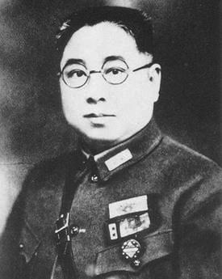
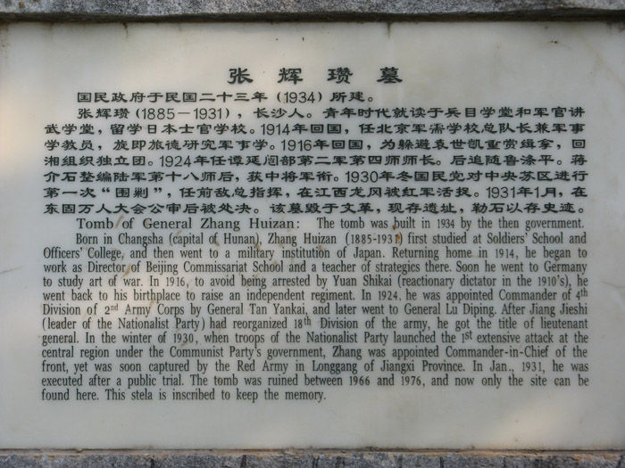
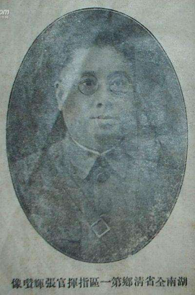
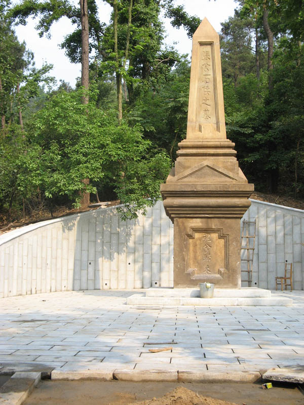
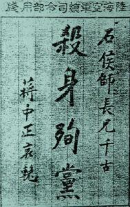
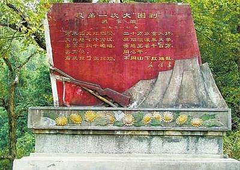

## 87年前的今天，被毛泽东写入词句的张辉瓒在万人公审大会上被砍头 

适合所有人的历史读物。每天了解一个历史人物、积累一点历史知识。三观端正，绝不戏说，欢迎留言。  

张辉瓒（1884年－1931年1月28日），字石侯，湖南长沙人，国民革命军高级将领。早期积极投身革命，参加反袁活动，参加护法战争，1921年与毛泽东等一同参加了驱逐张敬尧的驱张运动，之后参加北伐。

1930年，任陆军第18师中将师长，参加蒋介石发动的对中央苏区的第一次“大围剿”。12月27日，在江西吉安龙冈被红军活捉。随着张辉瓒的被捉，国民党对中央苏区的第一次大“围剿”宣告失败。毛泽东主席为此写了著名诗句“前头捉了张辉瓒”。

1931年1月28日，在东固万人公审大会上，发生意外，被愤怒的群众当场处决。蒋介石对其厚葬，并疯狂进行报复。工农红军被妖魔化，在反围剿的战争中，再也没能活捉到“将军衔”的国民党大官。

【早年的革命干将】

1884年，张辉瓒出生于湖南长沙。早年毕业于湖南兵目学堂，1908年留学日本陆军士官学校。辛亥革命后回国，任湖南陆军参谋，后一度前往德国进修。回国后，1920年出任湖南陆军第四混成旅旅长，与毛泽东等一同参加了驱逐张敬尧的驱张运动。

1924年，升任湖南第九师师长。1926年率部参加北伐，被任命为国民革命军第二军第四师师长，1929年改任第十八师师长，军衔中将，后随长官鲁涤平调防江西。

【公审会意外被砍头】

1930年底，被任命为前敌总指挥，统领约10万人对中国工农红军发动第一次“大围剿”。12月27日，率领第十八师在龙冈战斗中遭到红军主力围攻，兵败被俘。毛泽东主席为此写了著名诗句“前头捉了张辉瓒”。

当时鲁涤平和民国政府提出用优厚条件换回张辉瓒：向红军捐送20万元现洋、20担医药，释放由南昌所属监狱关押的100多名共产党政治犯，提供装备5000余人的枪械弹药等，但由于通讯落后，联系不便，未能沟通达成一致。毛泽东、朱德并没有杀张辉瓒的打算。

1931年1月28日，在吉安县东固召开反“围剿”胜利祝捷大会，张辉瓒被公审后，被愤怒的群众，当场遭到砍头处决。张辉瓒的头被装进一只竹笼，抛入赣江。2月2日，在吉安的神岗山附近国民党兵发现竹笼并打捞上来。

蒋介石命令，将张辉瓒厚葬于长沙岳麓山，并题字“魂兮归来”。

【红军被妖魔化的恶果】

张辉瓒被杀后，国民党对共产党进行了疯狂的报复。他们动用了大量的军警在全国各地搜捕共产党，还将囚禁在南昌下沙窝监狱的100多名共产党政治犯，用电击昏后，装进麻袋丢进了赣江。蒋介石又重新部署兵力，调集了18个师又3个旅，以20万重兵对中央苏区发动了第二次“围剿”。

由于张辉瓒的被杀，共产党、工农红军被刻意妖魔化了。国民党官兵们的仇恨情绪大大增强，这对工农红军带来了严重的影响。从第二次至第五次“围剿”，红军打了20多场大仗，再也没能活捉到“将军衔”的国民党大官，这也与张辉瓒被杀有关。

张辉瓒的被杀，给共产党、红军深刻的教训。毛泽东逐渐提出“不虐待俘虏”、“缴枪不杀”、“不许打骂、不许搜腰包”等条款，并被制度化，最后形成了著名的《三大纪律，八项注意》。

【毛泽东的渔家傲】

渔家傲·反第一次大“围剿”

万木霜天红烂漫，天兵怒气冲霄汉。

雾满龙冈千嶂暗，齐声唤，前头捉住了张辉瓒。

二十万军重入赣，风烟滚滚来天半。

唤起工农千百万，同心干，不周山下红旗乱。

