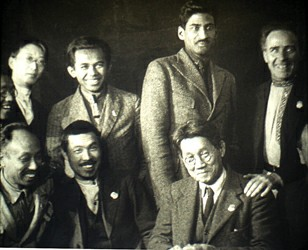
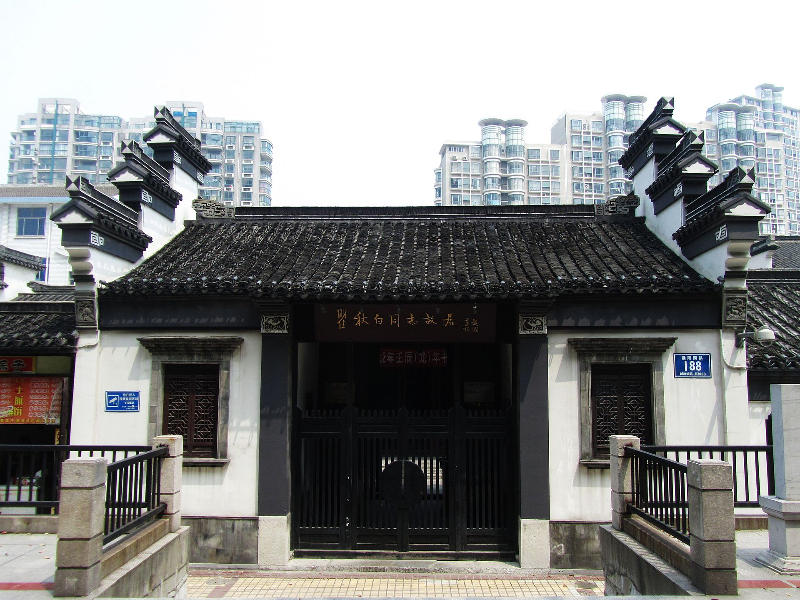
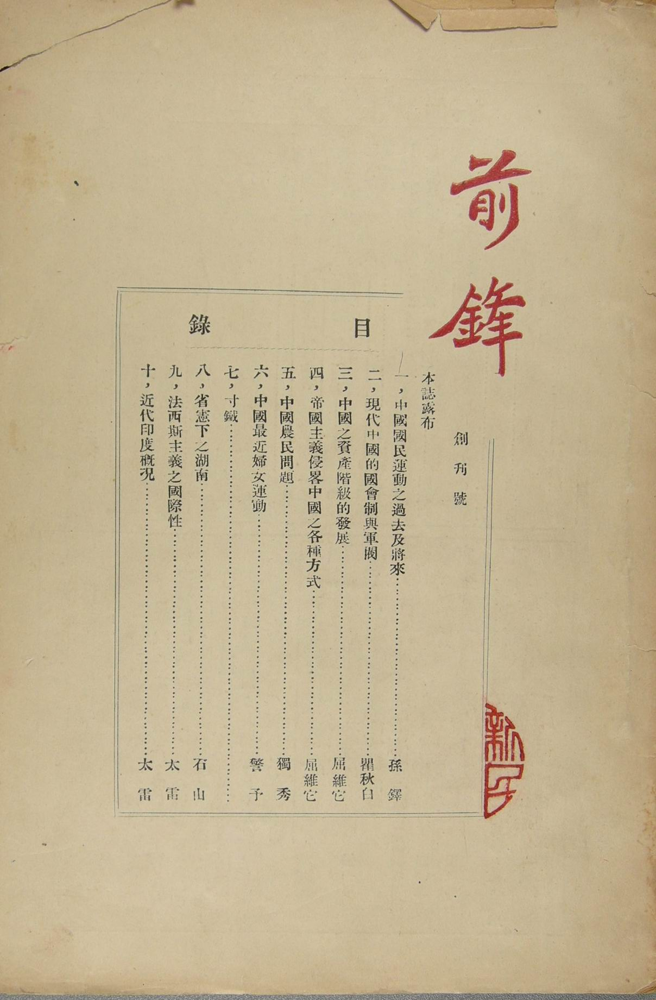
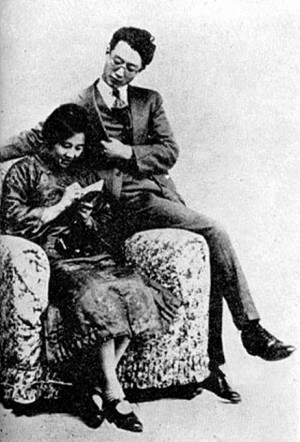
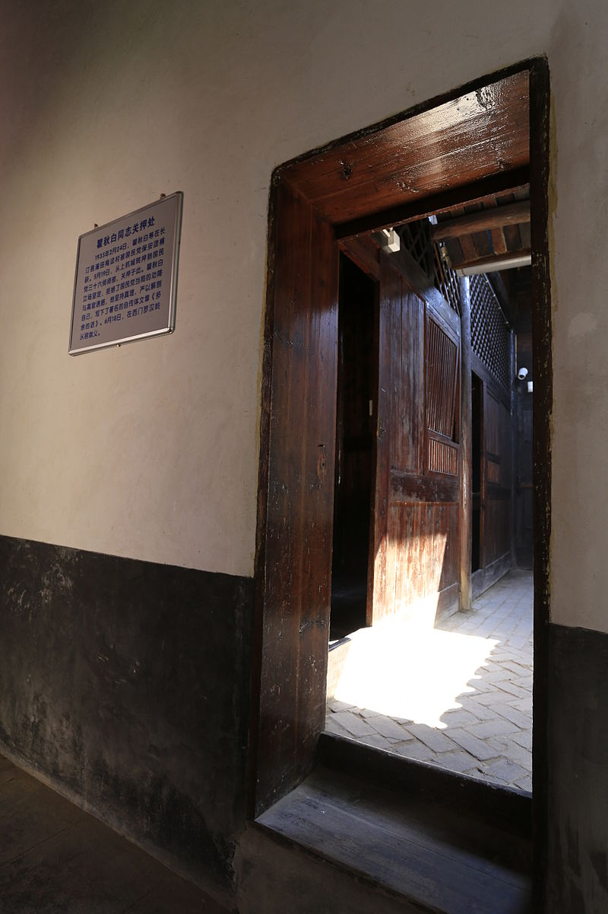
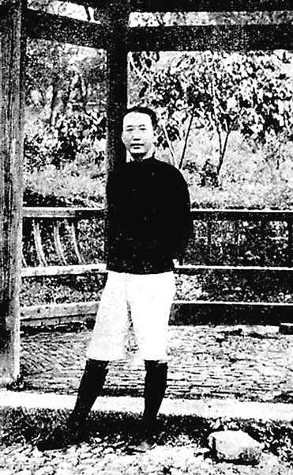
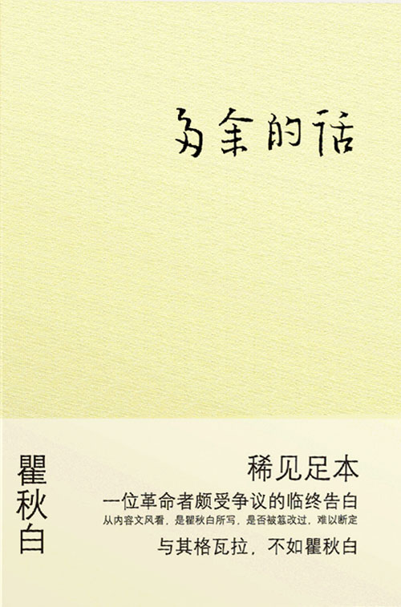

## 119年前，第一个翻译《国际歌》、认为中国豆腐是世界上第一的瞿秋白出生

适合所有人的历史读物。每天了解一个历史人物、积累一点历史知识。三观端正，绝不戏说，欢迎留言。  

瞿秋白小传：身为革命领袖，临死前我要说，中国豆腐世界第一

【1899年1月29日】119年前的今天，曾经的最高领导人，说了《多余的的话》的瞿秋白出生

### 

瞿秋白（1899年1月29日－1935年6月18日），江苏常州人，曾两度担任中国共产党实际最高领导人（1927年8月—1928年7月；1930年9月—1931年1月），是中国共产党早期领袖和缔造者之一。反围剿失败后，没有参加长征，1935年在福建长汀被逮捕并执行枪决。

瞿秋白的杂文锐利而有才气，俄语水平数一数二，他第一个把《国际歌》翻译成中文。瞿秋白作为一个典型的文人参与政治，遭到排挤冷落直至牺牲。在绝笔《多余的话》中自述，他只是一个半吊子的文人，参与政治运动，乃至成为中国共产党的领袖完全是一个“历史的误会”。

《多余的话》结尾写到： “中国的豆腐也是很好吃的东西，世界第一。永别了！”

（1922年陈独秀、瞿秋白等在共产国际四大）

【亲到贫时不算亲】

1899年1月29日，瞿秋白生于江苏常州。瞿家原本是书香门第，世代为官，但父亲生性淡泊，不治家业，家道没落。1915年，16岁的瞿秋白被迫辍学。第二年母亲自杀，无钱安葬也无亲戚援助，只好暂时寄存在当地瞿氏宗祠里，十几年后才草草掩埋。

瞿秋白含悲写下了一首七绝《哭母》：“亲到贫时不算亲，蓝衫添得泪痕新。饥寒此日无人管，落上灵前爱子身。”

【与列宁交谈的中国记者】

1917年9月，瞿秋白考入外交部办的俄文专修馆（免费入学），学习俄文。1919年5月4日，五四运动爆发，他被选为专修馆学生总代表，参加了北京大中学校学生联合会，成为北京学生运动的领导人之一。1920年初，参加了李大钊、张崧年发起的马克思主义研究会。

1920年8月，瞿秋白被北京《晨报》和上海《时事新报》聘为特约通讯员，到莫斯科采访，想“为大家辟一条光明的路”。在苏俄两年时间里，他先后撰写了《共产主义人间化》、《苏维埃俄罗斯经济问题》等数十篇通讯和《饿乡纪程》、《赤都心史》等著作，是最早向中国描绘列宁形象的人，也是中国记者中唯一与列宁交谈过的人。

【加入中国共产党的翻译】

1921年秋，东方大学开办中国班，瞿秋白进入该校任翻译和助教，开始接触马克思主义的理论书籍。1922年2月，由同乡张太雷介绍加入中国共产党。

1922年底，陈独秀代表中国共产党到达莫斯科，瞿秋白担任翻译。1923年1月，瞿秋白随同陈独秀回到北京，兼管中共宣传工作，担任中共中央机关刊物《新青年》、《前锋》主编和《向导》编辑。

1924年，中国国民党改组，瞿秋白出席中国国民党一大，参加大会宣言的起草，当选国民党中央候补执行委员。1925年1月起，瞿秋白先后在中共的第四、五、六次全国代表大会上，当选为中央委员、中央局委员和中央政治局委员，成为中共领袖之一。

【中国共产党的最高领导人】

1927年7月12日，陈独秀被停职，由张国焘临时代理主持中央工作。8月7日，新来到的共产国际代表罗明纳兹主持召开会议（八七会议），正式将陈独秀（缺席）免职，并指定瞿秋白担任临时中央政治局常委，主持中央工作，成为中国共产党第二任最高领导人。

在瞿秋白主持中央政治局的近一年期间（1927年8月-1928年5月），策划了三次起义，1927年11月11日的武汉起义、12月10日的长沙起义、12月11日的广州起义，均以失败告终。

（瞿秋白与妻子杨之华）

【与茅盾鲁迅的友谊】

1928年6月，瞿秋白在莫斯科郊外主持召开中共六大。“六大”之后，瞿秋白留在莫斯科，担任中共驻共产国际的代表团团长两年，实际国内直接领导中共的是李立三和向忠发。

1930年，瞿秋白携妻子离开苏联回国。1931年1月7日，王明等人在上海主持召开中共六届四中全会，认为瞿秋白对“李立三的路线批判不够彻底”，将他定为“左”倾教条主义，不再担任中央政治局委员。

此后，瞿秋白到了白色恐怖笼罩的上海养病（肺结核），与茅盾、鲁迅结下深厚友谊，一起领导左翼文化运动。

（瞿秋白家庭照，1929年摄于苏联莫斯科）

【留在根据地被俘虏】

1933年底，瞿秋白离开上海去中央苏区。中央红军长征前夕，瞿秋白再三请求参加长征，但当时的中央决定把他留在即将沦陷的中央苏区。

1935年2月，在中央苏区陷落前夕，中央分局书记项英派便衣队100多人护送瞿秋白、何叔衡等人向闽西突围。途中，瞿秋白因有严重肺病无力奔跑，于1935年2月24日在福建省长汀县水口镇被宋希濂部队逮捕。

（瞿秋白被俘后囚禁在福建长汀原汀州府试院（福建省苏维埃政府旧址））

【写下绝笔《多余的话》】

由于叛徒出卖，国军很快就确认了瞿秋白的身份。在被押期间（5月23日），瞿秋白写下了《多余的话》，表达其由文人从政曲折的心路历程。蒋介石劝降不成，下令处决。

6月18日，瞿秋白写下了绝笔诗：“夕阳明灭乱山中，落叶寒泉听不穷；已忍伶俜十年事，心持半偈万缘空。”瞿秋白对旁边的人说：“人生有小休息，有大休息，今后我要大休息了。”

负责羁押瞿秋白的国民党军第三十六师师长宋希濂，是瞿秋白在上海大学任教时的学生。为表示对老师的尊重，宋希濂送瞿秋白出监房后，到中山公园凉亭前拍照告别。瞿秋白到达刑场后，对刽子手微笑点头说：“此地很好！”然后平静地让刽子手从脑后开枪，时年36岁。当日下午，瞿秋白遗骸被埋葬在罗汉岭盘龙岗。

（1935年6月18日，在福建长汀将被处决的瞿秋白）

【遭到批判和平反】

1955年，瞿秋白迁葬八宝山革命烈士公墓。“文化大革命”开始后，瞿秋白遭到公开批判。1967年5月12日，瞿秋白墓被红卫兵砸毁。1972年中发12号文件称：“瞿秋白在狱中写了《多余的话》，自首叛变了。”

1980年10月19日，中共中央办公厅转发中纪委《关于瞿秋白同志被捕就义情况的调查报告》的通知。该调查报告称，“客观地全面地分析《多余的话》，它决不是叛变投降的自白书。”

1982年9月，中共十二大召开，瞿秋白获得彻底平反。

