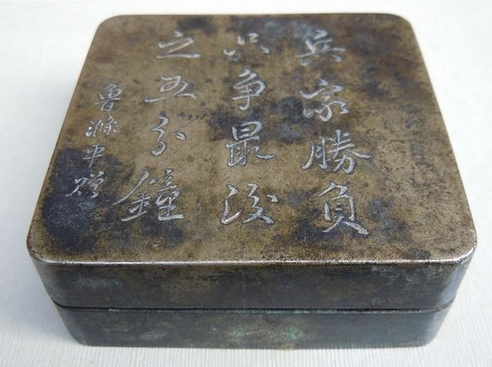
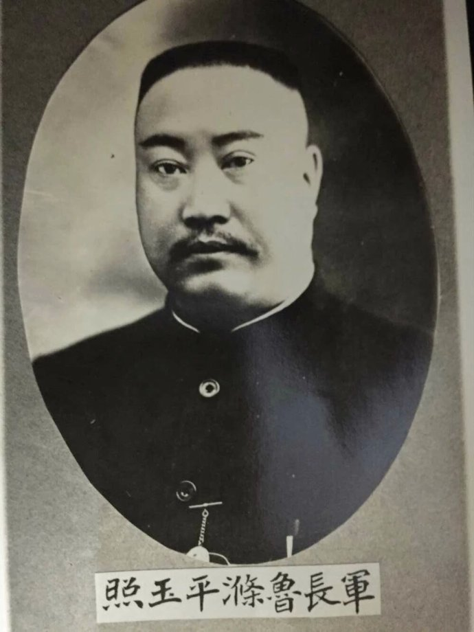
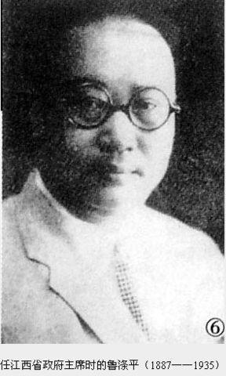
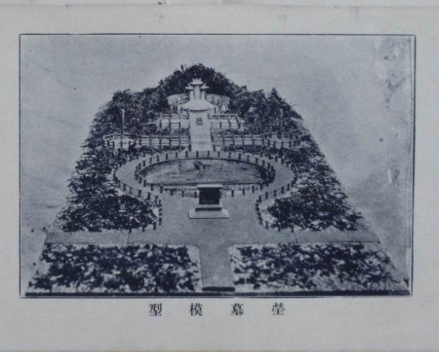

## 83年前的今天，触发蒋桂战争的刘少奇表哥鲁涤平猝死

鲁涤平小传：调查一个人被杀的疑案，结果我死了，爱妾也死了

【1935年1月31日】83年前的今天，触发蒋桂战争的刘少奇表哥鲁涤平在调查疑案中猝死

鲁涤平（1887年－1935年1月31日），湖南宁乡人，是刘少奇的表哥。

中国国民党高级将领，在新桂系当权时，为李宗仁麾下，任湖南省主席。因他投靠蒋介石，被桂系擅自驱逐，引发了蒋介石和新桂系之间的大战。最终蒋介石获胜。

后任江西省主席，指挥对红军的第一次围剿。手下张辉瓒被活捉，在公审大会中，被愤怒的群众砍头。后任浙江省主席，调查《申报》掌门人史量才被暗杀一案。不料，1935年1月31日突然病逝，爱妾沙夫人也跳楼自杀。此案是民国著名疑案。

【桂系手下的湘军】

1887年，鲁涤平出生于湖南宁乡，是刘少奇的表哥。行伍出身，曾入湖南兵目学堂。辛亥革命时为湘军排长，营管带。1915年，加入中华革命党。1923年，拥护孙中山，率部到广东。

1926年（39岁），国民党北伐中，升任为国民革命军第二军军长，后任第四集团军第一军团总指挥，序列上为第四集团军总指挥李宗仁麾下。

【触发蒋桂战争】

1928年初，新桂系控制了国民政府后，任命何键、鲁涤平等人主持湖南政务，但二人不和。1929年2月，鲁涤平暗地投向蒋介石。蒋介石并绕过武汉政治分会，接济鲁涤平部大批军械弹药，被何键查扣后上报管辖湖南的武汉政治分会。

2月21日，新桂系将领夏威、叶琪等人大惧，在未得到李宗仁、白崇禧的同意，仓促以武汉政治分会名义发报中央，擅自宣布免去鲁涤平湖南省政府主席的职位。同日，夏威、叶琪二人率部进军长沙，将鲁涤平部缴械。

蒋介石以“违反中央政治会议决议，各地政治分会不得擅自任免辖区内特定人员”为名，调集军队，准备进攻新桂系。3月21日，国民政府发表声明，免去李宗仁、白崇禧、李济深职务，蒋桂战争爆发，最终新桂系被击败，逃亡东南亚。

【前头捉了张辉瓒】

1929年，鲁涤平任武汉卫戍司令，江西省主席，辖有张辉瓒的第18师和谭道源的第50师，负责围剿中共中央苏区。围剿中被毛泽东“诱敌深入”游击战略打败，张辉瓒、谭道源一俘一逃。

鲁涤平提出优厚条件：向红军捐送20万元现洋、20担医药，释放由南昌所属监狱关押的100多名共产党政治犯，提供装备5000余人的枪械弹药等，赶往上海与中共谈判。但因为通信不便，尚未成功沟通，张辉瓒在万人公审大会上被愤怒的群众砍头，头被装入竹笼扔进赣江。

国民党兵在吉安发现了竹笼并打捞上来。得到消息后，鲁涤平立刻赶到吉安，痛哭流涕。翌日，鲁涤平一面将这个消息报告给了南京的蒋介石，一面派人赶做了楠木的假身并配以衣冠入棺。

【史量才案的神秘谜团】

1931年12月15日，鲁涤平被任命为浙江省政府主席。1934年，调到南京，任南京军事参议院副院长。

1934年11月13日，著名报业家、《申报》掌门人史量才在回上海途中，遭暗杀身亡。第二天，拥有千万发行量的《申报》刊出消息，全国舆论哗然。

鲁涤平负责追查该案件。1935年1月31日，鲁涤平突然病逝，使得史量才案成为谜团。鲁涤平的爱妾沙夫人在开丧前夕，竟然跳楼殉夫，两人合葬。使得这桩悬案更加神秘。

