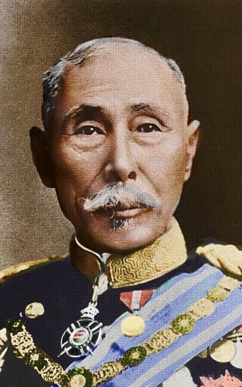
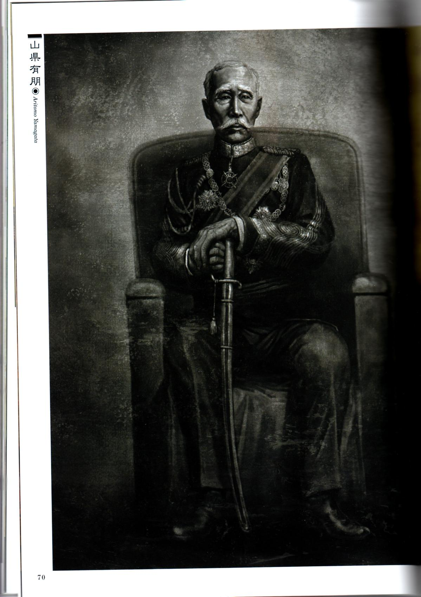
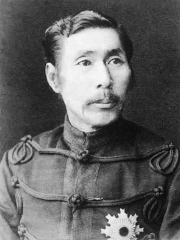
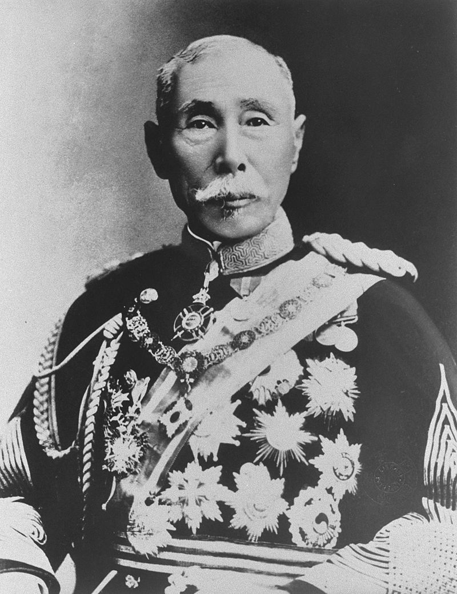
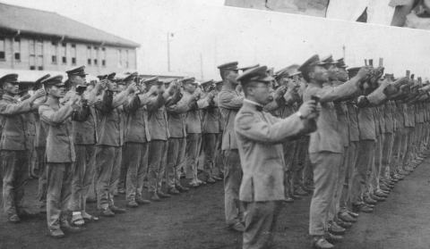
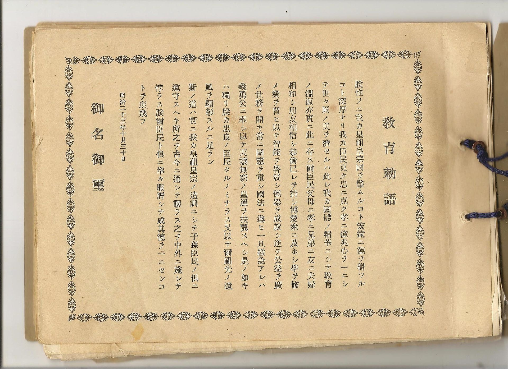
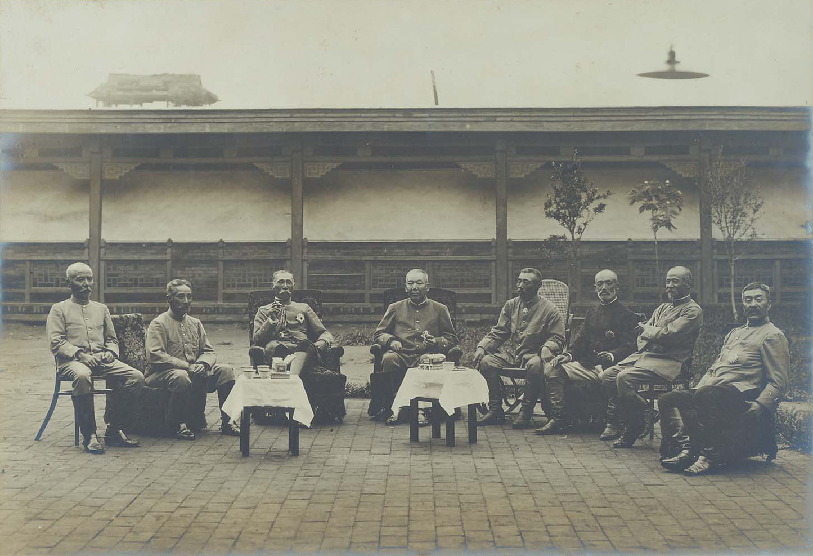
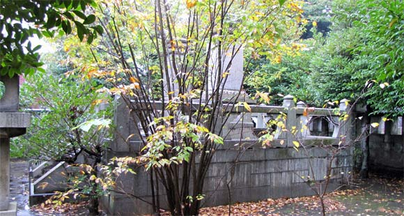

## nnnn姓名（资料）

适合所有人的历史读物。每天了解一个历史人物、积累一点历史知识。三观端正，绝不戏说，欢迎留言。  

### 成就特点

- ​
- ​

### 生平

【1922年2月1日】96年前的今天，第一个跨过鸭绿江的日本皇军之父山县有朋去世

山县有朋（1838年6月14日－1922年2月1日），日本军界首屈一指的人物，曾两任首相，三任枢密院院长。改革日本近代军队，操纵天皇发布《军人敕谕》、《教育敕语》，强制军人和平民效忠天皇，是日本走向军国主义的奠基人，因此被称为“皇军之父”。

他鼓动侵略中国和朝鲜，亲自率军入侵朝鲜，是第一个跨过鸭绿江的日本统帅。

【尊王攘夷的一介武夫】

1838年6月14日，山县有朋出生于日本长州藩（今山口县）。自幼喜爱习武，曾把“我是一介武夫”作为座右铭，擅长柔道和剑术。

1853年，17岁起任长州藩役卒，参加“尊王攘夷”活动，后任长州藩倒幕武装奇兵队军监。1864年9月，在抗击英法荷美四国联合舰队炮击下关的下关战争中，他身先士卒，右腕和腹部中弹负伤，成为攘夷运动的先锋。

【讨幕维新的大功臣】

1865年，他率奇兵队清除了长州藩中对幕府屈从的“俗论党”，夺回藩政权。1866年，他又指挥奇兵队打败了第二次征讨长州的幕府军，保卫了长州讨幕根据地。

1868年（30岁），在关系到讨幕维新运动成败的戊辰战争中，他任北道镇抚总督，亲自率军征战，先后攻占长冈、若松等战略要地，为建立明治维新政权做出了重大贡献。

【日本近代陆军之父】

明治维新后，他赴欧洲英、法、德等国考察军事。归国后历任兵部少辅、大辅、陆军大辅、陆军卿、参军、参谋本部长、内务大臣、农商大臣，直至成为军界第一无二的实力人物。

1878年，发表《告诫军人书》，强调勇敢、忠诚和服从天皇，反对民主和自由主义倾向。他制定了《征兵令》，变镇台为师团制，整顿陆军教育机构，创立军医处，逐步把日军建设成一支强大的近代军队。因此，有“日本近代陆军之父”之称。

1882年，操纵天皇发布《军人敕谕》，要求军人誓死效忠天皇。因此，他也被称为“皇军之父”。1885年，任伊藤博文内阁的内务大臣。1887年，草拟了《清国征讨策案》。

【效忠天皇的教育敕语】

1889年12月，山县有朋任首相，受命组阁。他提倡尚武精神，建立金鵄勋章，授予战功卓绝者。1890年，他强调以军刀作后盾，大力推行军国主义路线，主张出兵侵略中国和朝鲜。从而形成了日本近现代史上的大陆政策。成了日本军国主义的奠基人。

1890年，以天皇名义颁布《教育敕语》，强调国家主义、道德教育，效忠天皇。至昭和年间，《教育敕语》变得绝对化与神圣化，强制学生背诵，学校必须兴建奉安殿安置《教育敕语》。在日本于1938年通过《国家总动员法》后，《教育敕语》的内容成为日本军国主义的教典。直到二战结束，才被废除。

【跨越鸭绿江的统帅】

1894年，甲午战争爆发，他亲任第一军司令，率军入侵朝鲜。连战连捷，成为日本第一个跨越鸭绿江的统帅。

1896年，作为特使前往莫斯科，与俄国达成妥协，共同瓜分朝鲜半岛。1898年，获元帅称号，并重任首相，他派兵加入八国联军，镇压中国义和团运动。

他发布政府章程，规定只有现役军官才能担任陆军和海军大臣，从而使军队摆脱了文官的控制。日俄战争爆发后，任参谋总长，指挥作战，侵占中国辽南地区。

【宫中某重大事件】

1921年，大正天皇卧病在床，身为元老的山县有朋因为政治原因，逼迫皇太子裕仁亲王（昭和天皇）向当时内定为皇太子妃的良子女王（后来的香淳皇后）辞退婚约。但裕仁亲王没有妥协，向政府发表“不会解除婚约，一定会结婚”的旨意。历史上称为“宫中某重大事件”。

1922年2月1日，山县有朋病逝，享年83岁。

### 

