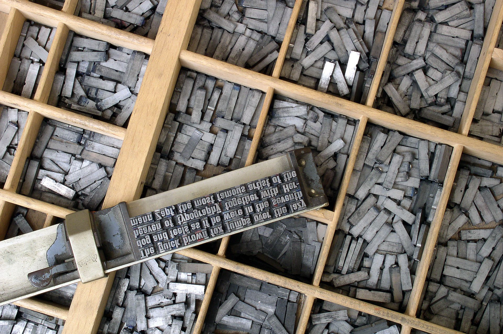
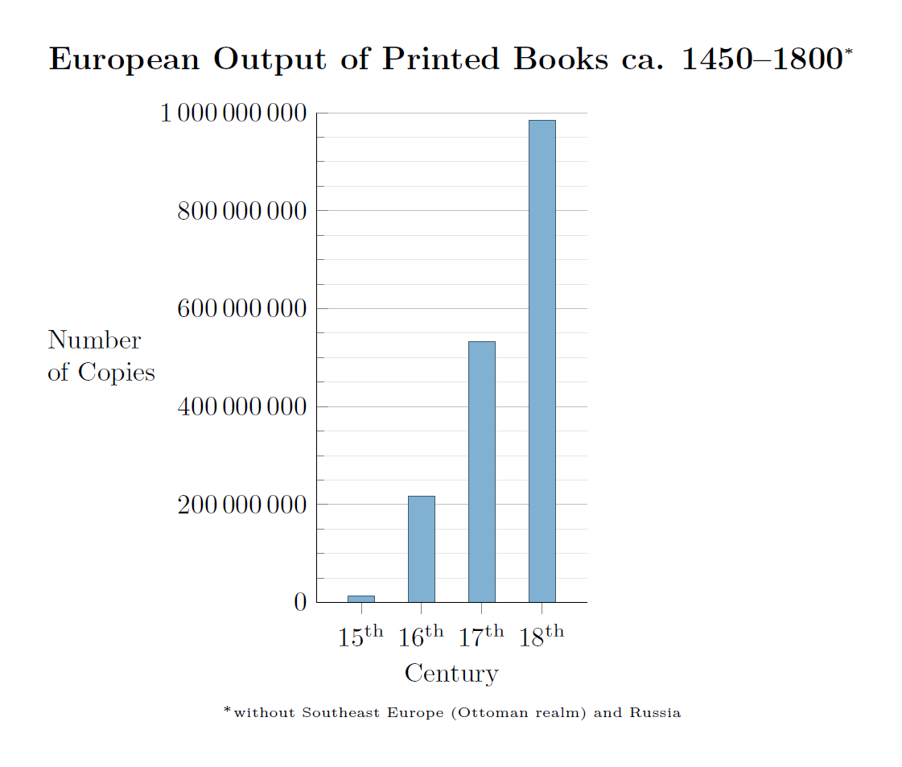

## nnnn姓名（资料）

适合所有人的历史读物。每天了解一个历史人物、积累一点历史知识。三观端正，绝不戏说，欢迎留言。  

### 成就特点

- ​
- ​

### 生平

古腾堡小传：我做了一件事，让世界走出了黑暗的中世纪

【1468年2月3日】550年前的今天，发明活字印刷，让世界走向现代的古腾堡逝世

古腾堡（1398年－1468年2月3日），第一位发明活字印刷术的欧洲人。他的发明引发了媒介革命，并被认为是现代史上的最重要的事件之一。活字印刷在欧洲迅速传播，在随后兴起的文艺复兴、宗教改革、启蒙时代和科学革命等扮演了至关重要的角色。

【发明活字印刷】

古腾堡出生于神圣罗马帝国（今德国美因茨）的一个商人贵族家庭。他的早年不为人知，出生日期不详，大约在1394年到1404年间。一般引用大英百科全书的说法，认为出生于1398年。

1434年起，古腾堡开了一家公司，生产镜子，打磨宝石等。1440年左右，他开始有了活字印刷的想法，并研究出了特别的作为字母的合金和铸造法。

1448年，他回到家乡，与福斯特开办了一个印刷厂，印刷出了举世闻名的古腾堡圣经。他创立了大批量生产金属活字的程序，合成了一种十分实用的含锌、铅和锑的合金和一种含油墨水。他创造了一套非常实用的系统，可以大批量印刷书籍，并且十分经济适用。

【印刷史上的杰作】

他印刷的第一部完整作品是著名的《古腾堡圣经》，堪称是世界印刷史上的杰作。该版圣经共两卷，合1282页，每页上有42行，因此被称为42行圣经。古腾堡圣经印刷精美，远比要耗时一年的手抄圣经快捷、便宜。

古腾堡圣经当时仅印制约180部，其中约150部印在纸上，另约30部则用更加贵重的上等皮纸印刷而成。在现存的48部，分布在德、比、法、奥、日、梵蒂冈、丹麦等国。

【被洗劫后的大传播】

1456年，古腾堡与福斯特发生分歧，导致最终双方合作的破裂。法庭将整个的生产作坊，包括正在印刷的古腾堡圣经，判定给福斯特。谷腾堡在友人的援助下，赎回了部分原有的器械，新建了一座印刷厂。

1462年，美因茨在两位大主教的冲突中，被大主教拿骚的阿道夫二世洗劫。古腾堡被流放，他的印刷厂的工人也流落各地，使得他的活字印刷术在西欧广泛传播。很多城市（如斯特拉斯堡、科隆、纽伦堡、奥格斯堡等）都出现了使用活字印刷术的印刷厂。

（1522年，马丁路德宗教改革文章，印刷了30万份）

【想象出来的肖像】

1465年，古腾堡因为其成就，被大主教授予宫廷侍臣的称号。1468年2月3日，古腾堡去世，被埋葬于美因茨的方济会教堂。该教堂和墓地后来被毁。

1504年，他在一位教授的书中，被认为是活字印刷的发明者。直到1567年，他的第一幅肖像出现在一本有关德国名人传记的书中。这幅肖像是依据想像创作的。

【和中国无关的伟大发明】

古腾堡的印刷术使得印刷品变得非常便宜，速度也提高了许多，印刷量增加。古腾堡的发明在欧洲飞快普及。它使得欧洲的文盲大量减少。维克多·雨果称印刷术为世界上最伟大的发明。

也有人认为西方的活字印刷术来源于中国，但该观点并不为国际学术界公认。国际学术界一般认为，虽然时间上略晚于中国，但西方的活字印刷为独立发明，后世所使用的活字印刷的直接源头为谷腾堡的活字印刷。目前并无文物证据证明中国的活字印刷曾传入欧洲。

### 

