## nnnn姓名（资料）

适合所有人的历史读物。每天了解一个历史人物、积累一点历史知识。三观端正，绝不戏说，欢迎留言。  

### 成就特点

- ​
- ​

### 生平

【1904年2月4日】114年前的今天，新中国第一任总理周恩来的唯一夫人邓颖超出生

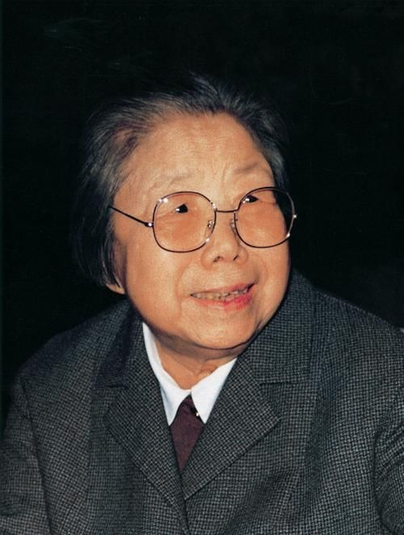

邓颖超（1904年2月4日－1992年7月11日），出生于广西南宁，祖籍河南省光山县。是中华人民共和国首任总理周恩来的妻子。

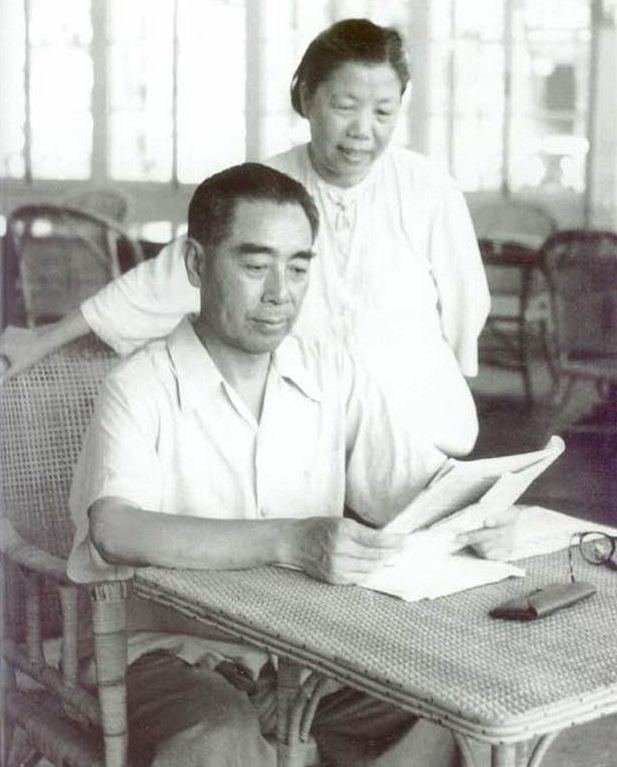

【坚强的母亲】

1904年2月4日，邓颖超出生于广西南宁的地方官吏家庭，祖籍河南省光山县。父亲官任南宁镇台，母亲也出身于官宦世家，从幼学习中医。

3岁时，父亲因得罪上司遭到陷害，被流放新疆，最终客死异乡。母亲决心独自把女儿抚养成人。她们先后辗转广州、上海等地，过着颠沛流离的日子，最后在天津落脚。母亲以行医和当家庭教师为生，日子清贫，但丝毫没有放松对女儿的教育。邓颖超深受母亲的影响。

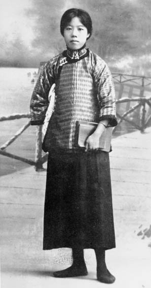

（1916年，在天津读书时的邓颖超）

【两个反串演员】

在邓文淑考入直隶第一女子师范学校（今天津美术学院）。1919年爆发五四运动，时年15岁的邓颖超积极参加到这场爱国运动中，期间与周恩来相识。

邓颖超和周恩来两人分别就读女校（直隶第一女子师范学校）和男校（天津市南开中学），并加入了学校的话剧团。可是女校没男生饰演男角，男校没女生饰演女角。邓颖超和周恩来分别在话剧团内，扮演反串的角色。

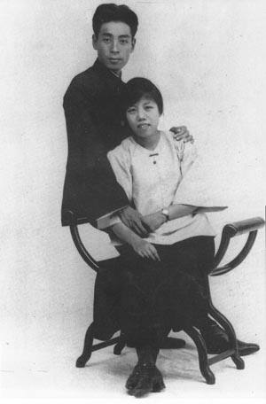

【战壕里的战友】

1920年后，邓颖超先后在北师大附小、天津达仁女子小学任教。而周恩来赴法国求学，二人保持书信往来。1923年的某天，邓颖超收到周恩来寄来的一张明信片。在这张印有德国共产党领袖卡尔·李卜克内西和罗莎·卢森堡画像的明信片上，周恩来写道：“希望我们两个人将来，也像他们两个人一样，一同上断头台……”这样，两人确定了恋爱关系。

1925年，邓颖超加入中国共产党。周恩来回国后，8月8日，两人在广州结婚。国共合作期间，她以个人身份加入中国国民党，并进入国民党中央，给妇女部部长何香凝担任秘书。

邓颖超和周恩来两人都不避讳地承认，两人的结合首先是“一个战壕里的战友”，其次才是“一个屋檐下的伴侣”。周恩来曾对家中晚辈说，当时自己在法国有一个女朋友，但是他觉得作为革命的终身伴侣，那个人不合适。

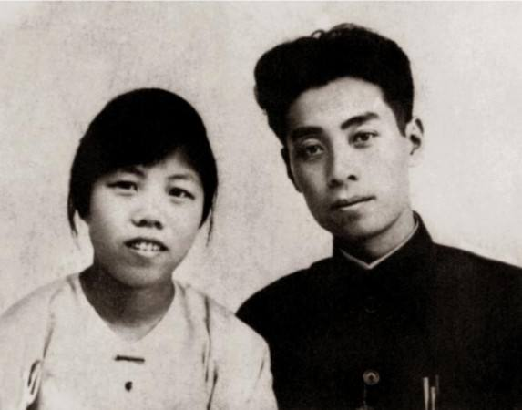

（1925年8月，周恩来和邓颖超在广州结婚时的合影）

【无法生育的难产】

婚后不久，邓颖超怀孕了，为了工作她将孩子打掉了。一年后，她再次怀孕，临近生产时发现，胎儿过大而难产，刚生下来就夭折了。这时，蒋介石发动四·一二事件，国共关系破裂。邓颖超拖着难产后尚未恢复的病体，辗转前去寻找在上海的周恩来，路途劳累，此后再也没有生育。

建国后，著名妇产科大夫林巧稚曾建议她做输卵管疏通手术，以增加生育的可能，但邓颖超最终选择了放弃。所以，她和周恩来一直没有子嗣。但是，他们收养、照顾了很多中共革命烈士的子女，其中包括艺术家孙维世、以及后来担任国务院总理的李鹏等。

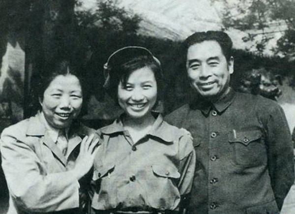

（1949年，周恩来、邓颖超与养女孙维世在西柏坡）

【周恩来的幕后助手】

来到上海后，邓颖超和周恩来一起工作。1928年，出席了在莫斯科召开的中国共产党第六次全国代表大会。在中共领导人顾顺章、向忠发相继叛变后，邓颖超协助周恩来和中共机关度过了危险，两人也被迫离开上海。1931年底，周恩来进入瑞金，邓颖超在半年后到达。

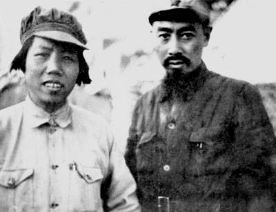

1934年，她带病随部队参加长征，抵达陕北。抗日战争爆发后，邓颖超跟随周恩来在武汉、重庆等地从事统战工作。1938年3月，和沈钧儒、郭沫若等人共同倡议组建了中国战时儿童保育会，出任常务理事。

1943年7月，邓颖超回到延安，接受了“整风运动”的考验。1945年，在中共第七次全国代表大会上，邓颖超和蔡畅、陈少敏作为仅有的三位女性，进入中共中央委员会，出任中共中央妇委副书记。

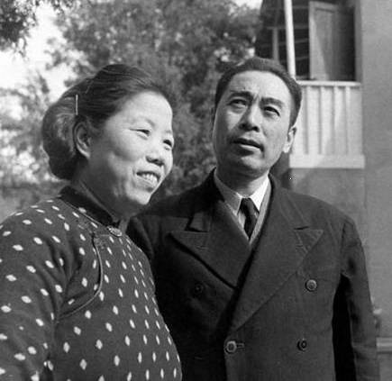

（1946年，周恩来夫妇在南京梅园新村）

【邀请宋庆龄进京】

抗战胜利后，邓颖超作为中共唯一的女代表，出席了在重庆召开的政治协商会议。1949年6月，入选全国政协筹备委员会委员，成为《共同纲领》起草小组的成员之一。后来，受毛泽东、周恩来的委托，亲赴上海，邀请宋庆龄到北京参与筹建新中国中央政府。

在中华人民共和国成立后，邓颖超先后当选为全国妇联第一至三届副主席；中国人民保卫儿童全国委员会副主席等职。邓颖超一直是中共中央委员，但始终没有担任政府职务；直到1976年周恩来逝世后，才被增补为全国人大常委会副委员长。

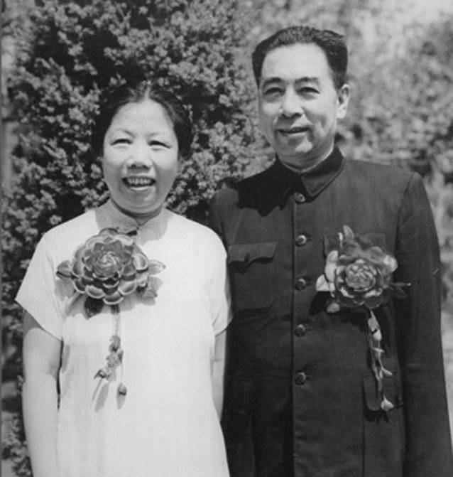

（1950年8月8日，周恩来夫妇结婚25周年纪念照）

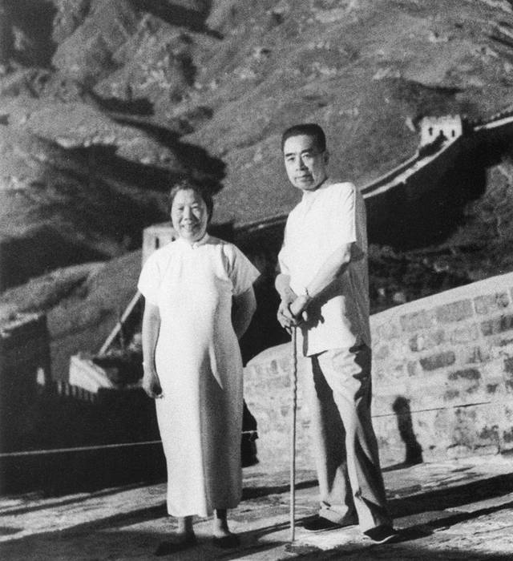

（[1955年，周恩来夫妇在八达岭长城）

【80岁的政协主席】

1983年6月，年近八十高龄的邓颖超，当选为第六届全国政协主席。1985年9月，邓颖超主动申请辞去了中共中央委员的职务；并在1988年4月，全国政协主席一职任期届满后，离职休养。

1992年7月11日的上午6时55分，邓颖超在北京医院病逝，享年88岁，火化后，骨灰撒在之前抛撒周恩来骨灰的同一个地点。

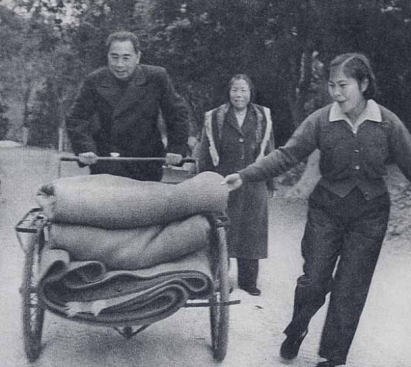

（1959年1月，周恩来在广州从化温泉休养时，帮助服务员蹬三轮车运送毛毯）

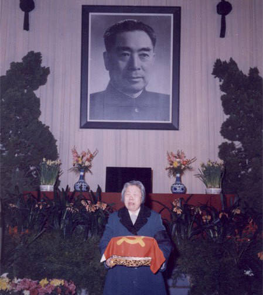

（1976年1月8日，周恩来与世长辞）

