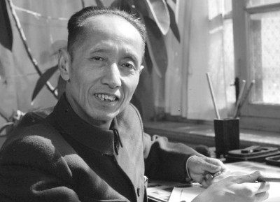
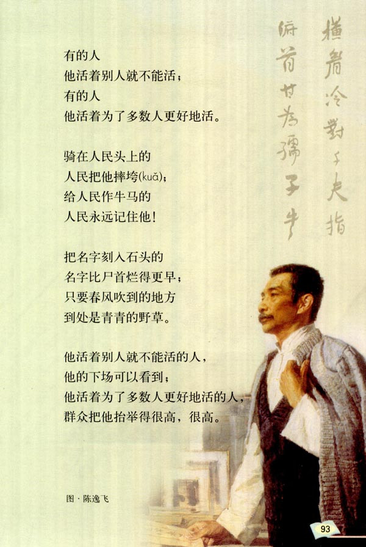
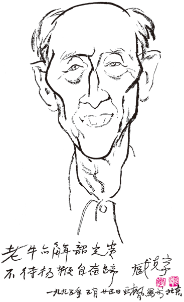
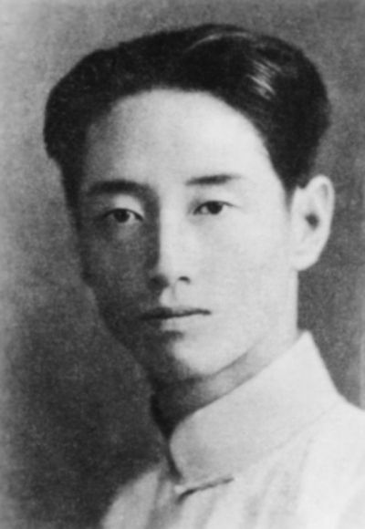
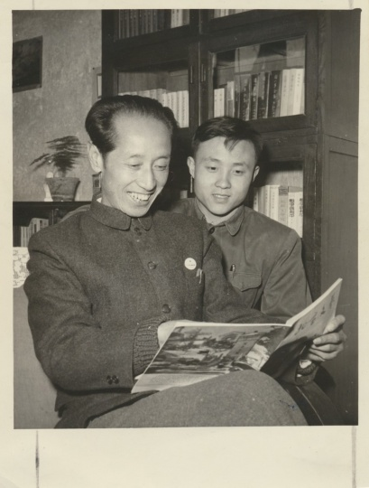
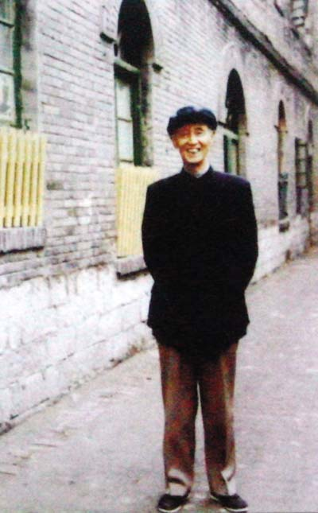
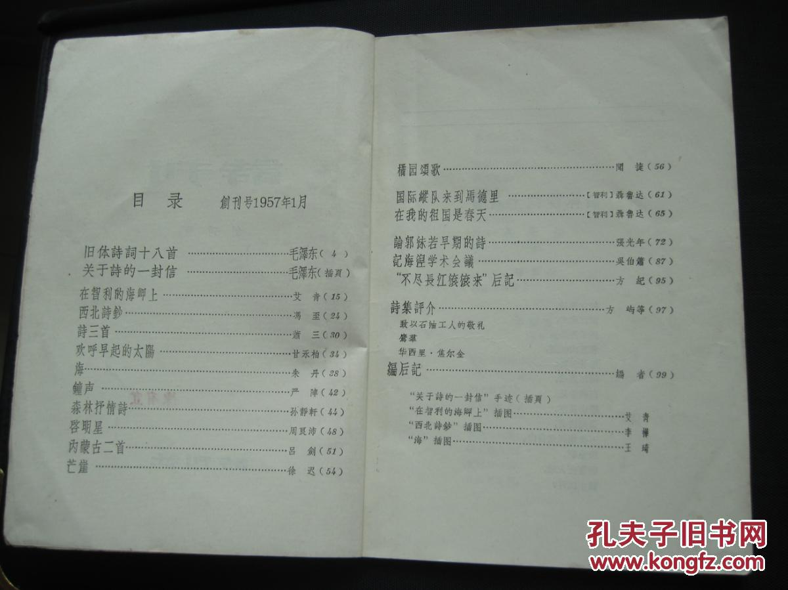
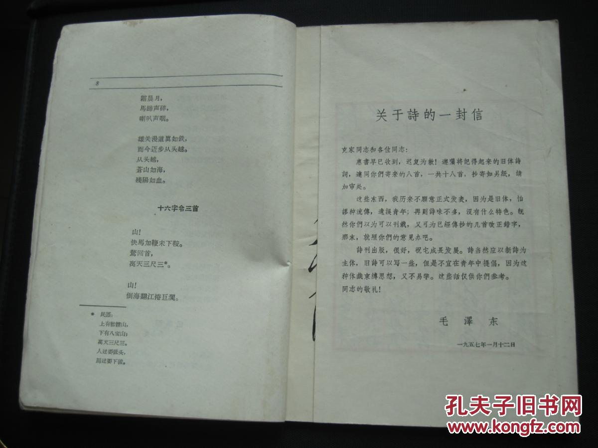
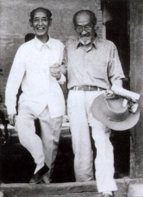
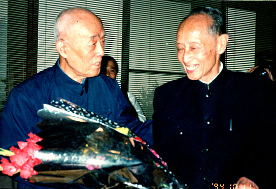

## nnnn姓名（资料）

适合所有人的历史读物。每天了解一个历史人物、积累一点历史知识。三观端正，绝不戏说，欢迎留言。  

### 成就特点

- ​
- ​

### 生平

【2004年2月5日】14年前的今天，首次公开发表毛泽东诗词的诗人臧克家逝世

臧克家 (1905年10月8日－2004年2月5日)，山东诸城人，中国现代诗人。他纪念鲁迅的短诗《有的人》，“有的人活着，他已经死了；有的人死了，他还活着”，入选了小学教材。他另一篇《闻一多先生的说和做》也曾入选了教材。

1957年，他在《诗刊》的创刊号上，首次公开发表了18首毛泽东诗词，从而使得毛泽东诗词风靡大江南北。他曾说：“毛主席诗词常读常新，毛主席诗词越挖越深。”

【北伐的逃兵】

1905年10月8日，臧克家出生于山东诸城。18岁前，一直生活在胶东半岛的农村。1923年夏，考入济南省立第一师范学校，受席卷全国的“五四运动”影响，开始习作新诗。1925年，首次在全国性刊物《语丝》上发表处女作《别十与天罡》。

1926年秋，考入中央军事政治学校武汉分校，曾参与北伐，参加讨伐夏斗寅的战役，兵败后逃亡到东北。

【中国新诗的开山人】

1930年，入读国立青岛大学中文系。在校期间，新诗创作上得到闻一多等人的鼓励。1932年，在《新月》发表诗作《难民》、《老马》等，描写旧中国农民的生活。1933年，他的第一部诗集《烙印》出版，获闻一多、茅盾等好评。1934年，出版诗集《罪恶的黑手》，并从大学毕业。

1934年至1937年，在山东省立临清中学任教，出版诗集《运河》和长诗《自己的写照》，创作了散文集《乱莠集》。1936年，参加中国文艺家协会，是中国现实主义新诗的开山人之一。

【三赴台儿庄的抗战记者】

1938年，参加中华全国文艺界抗敌协会，任第五战区战时文化工作团团长。他冒着敌机轰炸的危险，三赴台儿庄前线采访，写成长篇报告文学《津浦北线血战记》。

他率文化工作团深入河南、湖北、安徽农村及大别山区，开展抗日文艺宣传和创作活动；曾参加随枣战役。这期间，创作了《从军行》、《淮上吟》等诗集及散文集《随枣行》，歌颂抗日军民的事迹。

【写给鲁迅的《有的人》】

1943年4月，在重庆的中华全国文艺界抗敌协会任候补理事。不久，任赈济委员会专员，并负责编辑《难童教养》杂志。出版了回忆录散文集《我的诗生活》、诗集《泥土的歌》、《十年诗选》。历任上海《侨声报》文艺副刊、《文讯》月刊、《创造诗丛》主编。

1948年12月，由于国民政府在上海的白色恐怖严重，一度逃亡到香港。1949年3月，由中共党组织安排来到北平。后历任新闻出版总署、人民出版社编审，《新华月报》编委，主编《新华月报》文艺栏。

1949年11月，写下了纪念鲁迅的著名短诗《有的人》：“有的人活着，他已经死了；有的人死了，他还活着。”1951年6月，加入中国民主同盟。

【发表毛泽东诗词】

1956年，臧克家写下了第一篇毛泽东诗词赏析文章《雪天读毛主席的咏雪词》。1957年，任《诗刊》主编，并在创刊号首次发表毛泽东的诗词十八首。并和周振甫合著《毛主席诗词十八首讲解》。

在“文化大革命”中遭受迫害，停止文学创作和社会活动，下放到湖北咸宁的“五七干校”。1972年，回到北京。1976年1月，《诗刊》复刊，担任顾问兼编委。年逾古稀的臧克家恢复创作，出版了大量诗集、散文集。

【中国当代诗魂】

1990年8月，他主编的《毛泽东诗词鉴赏》获全国图书“金钥匙”奖和第五届中国图书奖一等奖。1991年10月，获国务院颁发的政府特殊津贴。

2000年1月，获首届“厦新杯中国诗人奖”终身成就奖。2002年10月，被世界诗人大会和世界艺术文化学院授予荣誉人文学博士。12月，获“中国当代诗魂”金奖。

2004年2月5日20时35分，因冠心病、尿毒症导致多脏器衰竭在北京逝世，享年98岁，安葬于北京万佛园华侨陵园。

