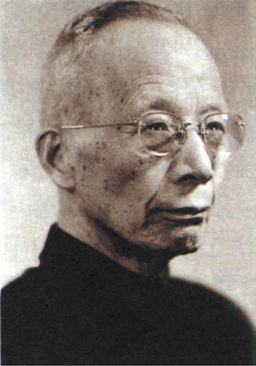
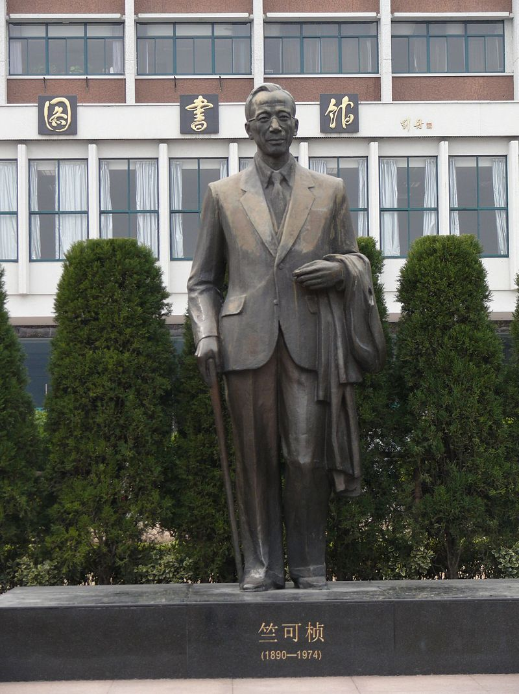
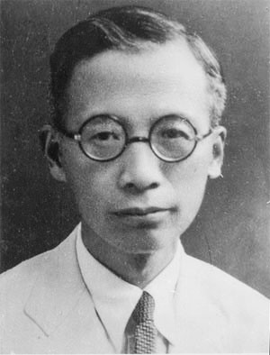
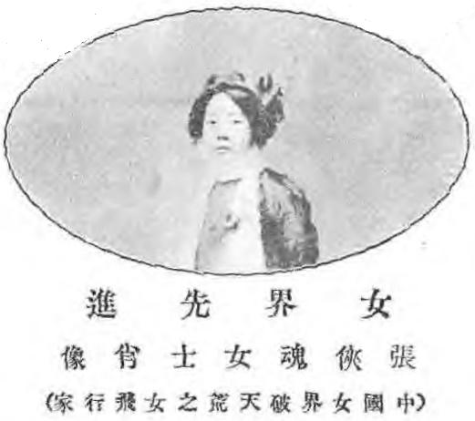
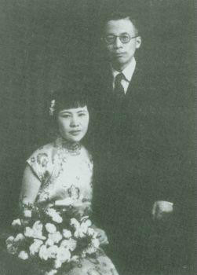
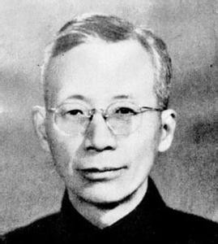
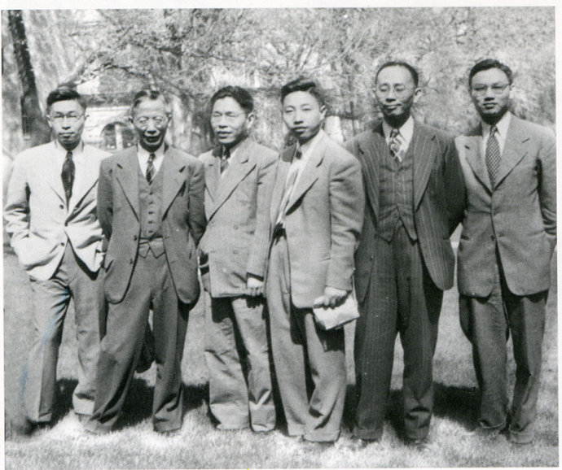
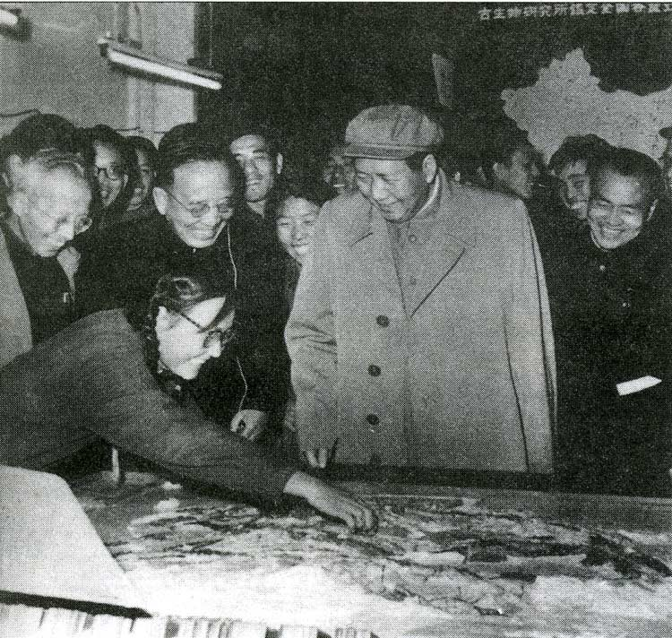

## nnnn姓名（资料）

适合所有人的历史读物。每天了解一个历史人物、积累一点历史知识。三观端正，绝不戏说，欢迎留言。  

### 成就特点

- ​
- ​

### 生平

【1974年2月7日】44年前的今天，中国物候学创始人、浙大保姆竺可桢逝世

竺可桢（1890年3月7日－1974年2月7日），浙江省绍兴人，气象学家、地理学家和教育家。曾任13年浙江大学校长，使之成为“东方剑桥”。竺可桢也被称为“浙大保姆”。

（位于浙大玉泉校区的竺可桢铜像）

【庚子赔款的留学生】

1890年3月7日，竺可桢出生于浙江绍兴东关镇的一个小商人家庭。1905年，进入复旦公学中学部学习。1908年，美国正式退还部分“庚子赔款”，引发到美国的留学潮。

1909年，竺可桢进入唐山路矿学堂（今西南交通大学）预科土木工程系学习。1910年，竺可桢考取第二期留美庚款公费生，伊利诺大学农学院学习，1913年毕业后，转入哈佛大学地学系。1915年，加入由留美学生创建的中国科学社，并成为《科学》杂志最重要的作者之一。

【中国第一个坐飞机的女人】

1918年，获美国哈佛大学博士学位，回国任教于国立武昌高等师范学校（今武汉大学）。1920年到1925年，任南京高等师范学校、国立东南大学地学系主任。

20年代的中国刚有飞机，竺可桢的夫人张侠魂竟毫不犹豫，自告奋勇，成为中国历史上第一个乘坐飞机的女性。两人于1920年在上海结婚，共同生活了十八年后，张侠魂染上痢疾病逝。

（竺可桢的结婚照）

【中国物候学的创始人】

在东南大学期间，他发表了有关气候学、地理学等一系列专著，是中国物候学的创始人，并当选为中国气象学会首届理事（1924年）、副会长（1925年）等职。

1925年，因东南大学派系斗争，竺可桢转任商务出版社编辑。1926年8月，竺可桢到天津，被张伯苓聘为私立南开大学教授。1929年到1936年，任中央研究院气象研究所所长。

【浙江大学的保姆】

1936年到1949年，他担任任国立浙江大学校长。在此期间，他广揽名师，使浙江大学迅速崛起成为世界一流大学，时人称浙大为“东方剑桥”。

在浙大的发展历程中，担任校长达13年之久的竺可桢先生可谓厥功至伟。他被公认为浙大学术事业的奠基人，浙大校训“求是”精神的典范，浙大的灵魂。

他对学生说：“诸位在校，有两个问题应该自己问问，第一，到浙大来做什么？第二，将来毕业后做什么样的人？”

和复员回杭的学生亲切见面.jpeg)

（1945年抗战结束，浙大学子纷纷回到杭州）

（1947年5月，在美国威斯康辛州，竺可桢与部分浙江大学师生合影）

【地理学界的一代宗师】

1948年，选聘为中央研究院院士。1949年，蒋经国专程到上海请竺可桢赴台湾，竺可桢拒绝了。10月16日，竺可桢任中国科学院副院长，筹建中国科学院地理研究所。

1955年，当选为中国科学院院士。文革期间，竺可桢未受到较大冲击。1972年，发表《中国近五千年来气候变迁的初步研究》，影响巨大。

1974年2月7日，因肺病在北京逝世。竺可桢被公认为是中国气象、地理学界的“一代宗师”。

（1958年10月，竺可桢（左一）随毛泽东参加中国科学院科技成果展览会）

（老年竺可桢）

