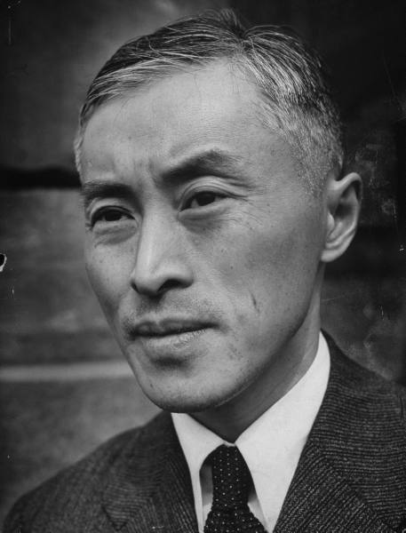
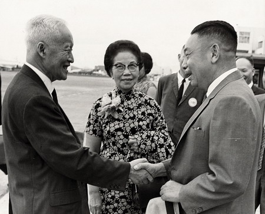
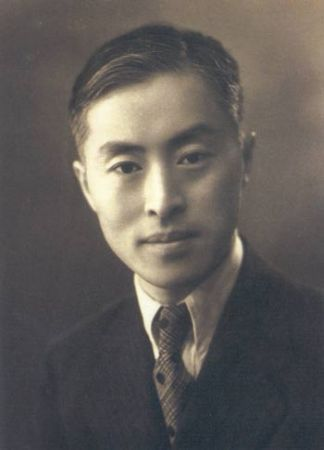
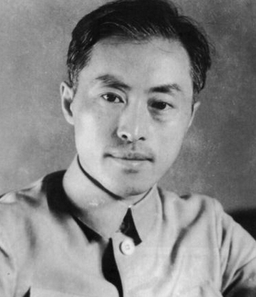
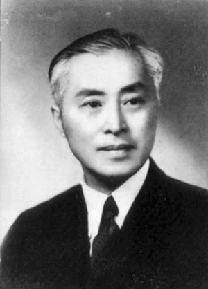
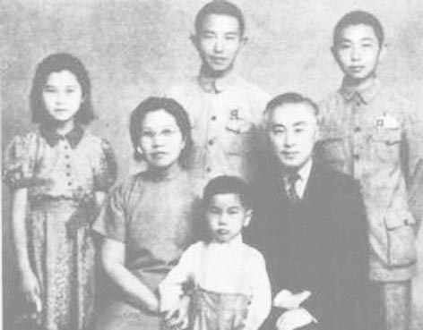
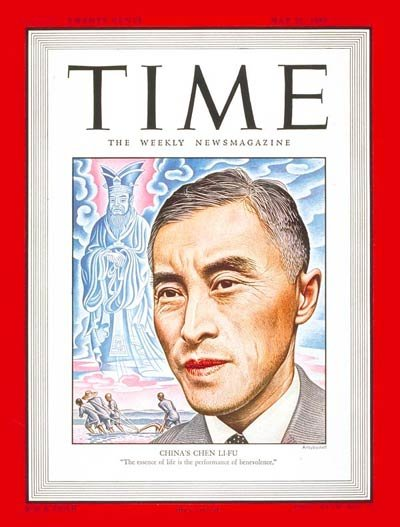
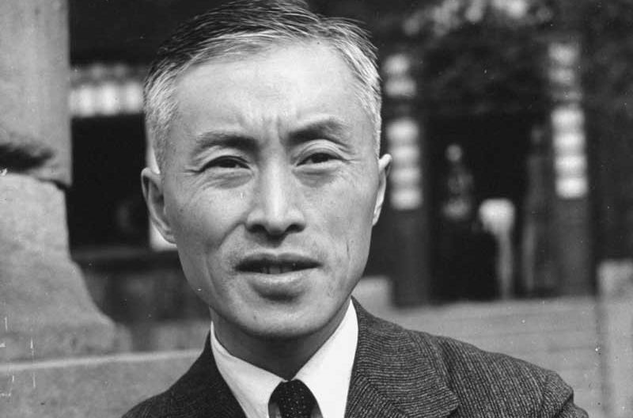
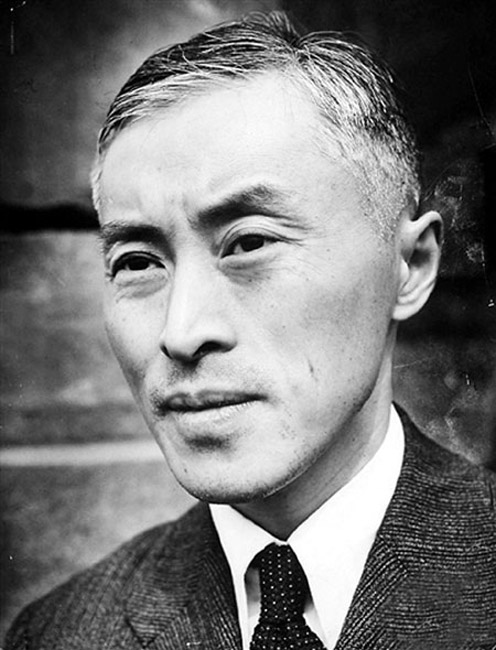
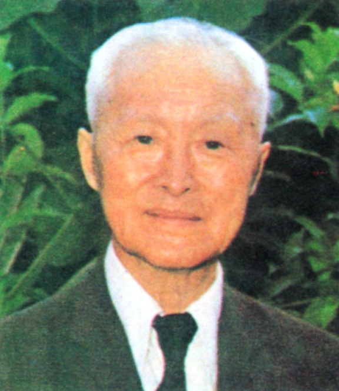

## nnnn姓名（资料）

适合所有人的历史读物。每天了解一个历史人物、积累一点历史知识。三观端正，绝不戏说，欢迎留言。  

### 成就特点

- ​
- ​

### 生平

陈立夫（1900年8月21日－2001年2月8日），中华民国政治家。他曾任国民党中央组织部部长，与哥哥陈果夫显赫一时，被称为“蒋家天下陈家党”。兄弟俩挽救了即将被强行取缔的中医，被称为“中医保镖”。后任教育部长，国家资助留学，杨振宁、李政道从中受益，得以出国留学。

败退台湾后，主动担当失败的“背锅侠”，远离政治，背井离乡去了美国。他最终跨越世纪，活到101岁。

（陈立夫和蒋经国）

【碍于面子的从政】

1900年8月21日，陈立夫出生，今浙江湖州吴兴人。与蒋介石关系密切的陈其美，是他的二叔。

1917年，陈立夫考入天津北洋大学学工矿，毕业后赴美留学。1924年，他取得美国匹兹堡大学冶矿硕士，在史克兰敦当了8个月的实习矿工后回国。

他原本准备接受中兴煤矿公司聘用，赴美工作。这时，大哥陈果夫转来蒋介石的两份电报，陈立夫碍于情面，去了广州，从此踏入政坛，没有成为工程师。

【蒋家天下陈家党】

陈立夫27岁出任蒋介石的机要秘书，29岁任国民党史上最年轻中央党部秘书长，负责人事及组织工作。1931年，任国民党中央组织部部长，负责党内安全特务工作。

中央组织部调查科下面有三个组：第一组组长是徐恩曾，第二组组长是戴笠，第三组组长为丁默邨。后来一组、二组分别发展壮大成中统局和军统局。

在国民党内，陈果夫和陈立夫的派系被称为“二陈”或者CC系。CC是当时高官聚集的中央俱乐部（Central Club）的缩写。二陈掌管国民党党务机构，时称“蒋家天下陈家党”。但二陈被公认个人品行修养良好，周恩来曾赞许陈立夫说：“陈立夫是一位值得被尊敬的敌人。”

【一手挽救了中医】

陈立夫在中医的维护与转型中，扮演过重要角色。1920年代，中国鼠疫、疟疾等传染病肆虐，中医遭到西医药物压制，被强硬取缔。

陈立夫和其兄长陈果夫挺身而出，与胡汉民等学者在1930年召开“国医馆筹备大会”，提出要“以科学方法整理中医学术”，陈立夫被推为理事长，后来这一天，也成为国医节。当时中医已要被废除，可以说中医是由二陈所拯救的。

【教育史的奇迹】

1938年，抗战最艰辛时刻，陈立夫任教育部长。他坚持教育是百年大计，喊出“战时如平时”口号。他的首要工作，是主持大学内迁，将北京大学、清华大学以及南开大学，初迁长沙，再迁蒙自和昆明，改称西南联大。西南联大创造了中国教育史的一个奇迹。

陈立夫实施“贷金”政策，由国家借钱给学生念书、出国留学。诺贝尔奖金得主杨振宁、李政道二位就是其中受惠者。另外，大学全国统一招生制度、全国各级教育、师范教育培训制度和教师退休金制度以及教师节等，也都是他在任教育部部长时创立的。

（1945年，陈立夫全家摄于公馆）

（1947年5月26日，时代杂志封面人物陈立夫）

【背井离乡的背锅侠】

1949年，中华民国搬迁台湾后，蒋介石受到陈诚掌握军权的逼迫，面临党内空前的压力。蒋介石、孙科、陈果夫三个人曾在一起商量，谁来承担丢了大陆的责任？最终决定由二陈来担。

1950年7月26日，蒋介石宣布的中央改造委员和中央评议委员名单，陈果夫只得了个虚衔，陈立夫则完全被排除在外。8月，他自愿离开政坛，带全家定居美国新泽西州的一个小镇。

陈立夫在美国十八年，过了一段清苦的岁月。为了谋生，他制作皮蛋、辣椒酱、粽子出售，在唐人街华人中小有名气。

【跨越世纪的中医保镖】

晚年陈诚去世后，陈立夫回到台湾，他拒绝其他政治职务，最后只接受总统府资政一职，致力于文化复兴运动。他对中华文化以及儒家思想也有极大贡献。

陈立夫在中国医药学院担任董事长，对中医的保存以及贡献功不可没。90岁时，成立立夫医药研究文教基金会，用以鼓励国内外中医药文化的研究和推广，极力推崇中医，因此有“中医保镖＂的称号。

2001年2月8日，陈立夫走过跨越1世纪的人生，享寿101岁。中华民国政府颁布总统褒扬令。

