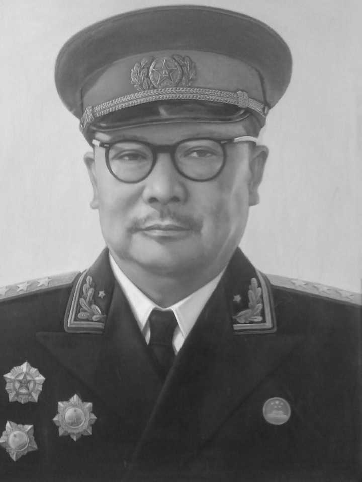
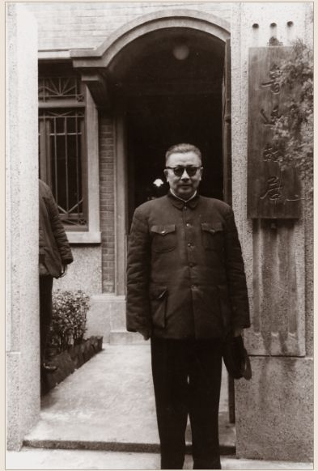
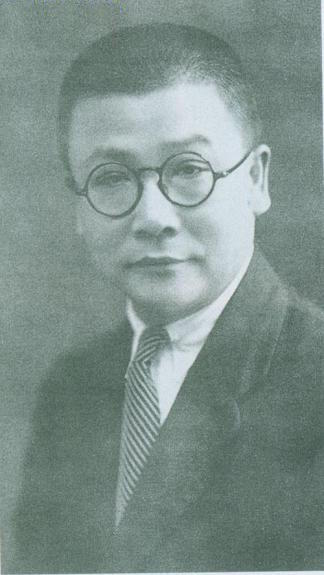
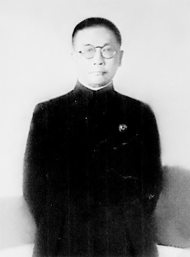
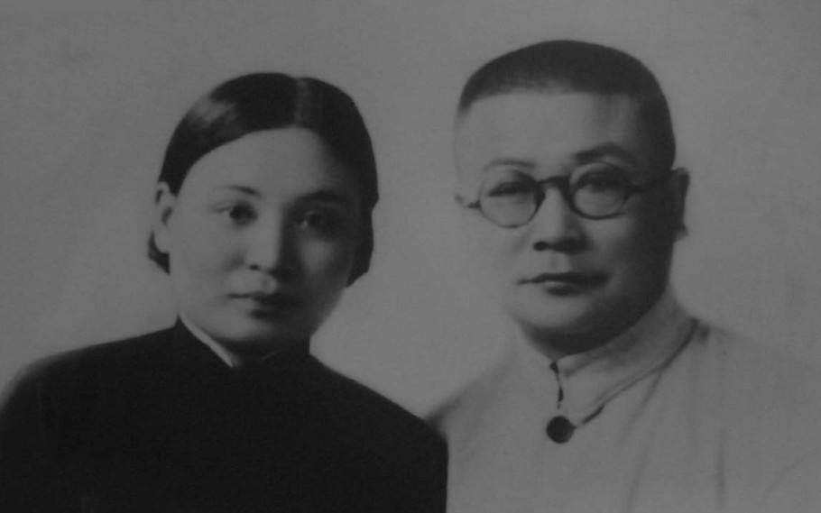
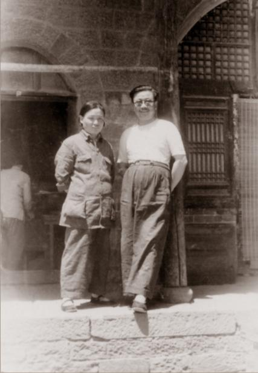
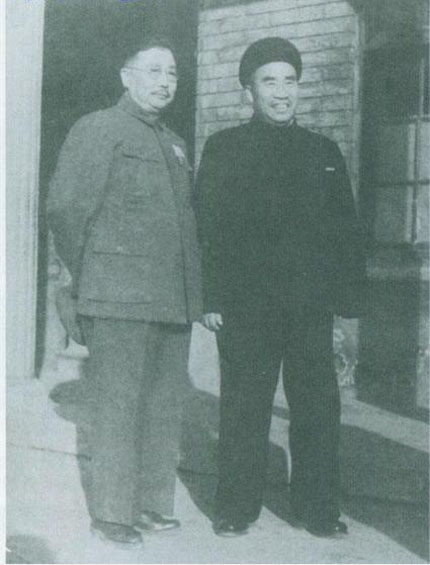

## nnnn姓名（资料）

适合所有人的历史读物。每天了解一个历史人物、积累一点历史知识。三观端正，绝不戏说，欢迎留言。  

### 成就特点

- ​
- ​

### 生平

【1962年2月9日】56年前的今天，没有带兵打过仗的开国上将，特工之王李克农病逝

李克农（1899年9月15日－1962年2月9日），安徽巢湖人。早年从事中共地下工作，在顾顺章叛变的关键时刻，帮助党中央成功转移，被称为“龙潭三杰”之一。后长期负责情报工作，被称为中共的“特工之王”。

毛泽东曾说过：“李克农是中国的大特务，只不过是共产党的特务。”这是对李克农的最好评价。他是唯一一位没有带兵打过仗的开国上将。他去世后，曾发生多起冒充他子女进行诈骗的案子。

【一位普通的报纸编辑】

1899年9月15日，李克农出生于今安徽巢湖市烔炀镇。1910年起，先后就读于芜湖安徽公学、圣雅阁书院（教会学校）。1919年（20岁），任安庆《国民日报》副刊编辑，后曾在安徽省政府、六安县政府供职。

1926年冬，加入中国共产党。1927年3月，任国民党芜湖县党部宣传部部长。国共决裂后，辗转到上海，筹办中共组织领导的《铁甲车》报、《老百姓》报。

【帮助党中央成功转移】

1929年冬，李克农化名进入上海无线电管理局，任广播新闻编辑。不久取得徐恩曾的信任，在中共中央特科领导下从事秘密情报工作。

1931年4月，中共中央政治局候补委员顾顺章在武汉被捕后投降国民党，这一消息被钱壮飞获取，并通知李克农，李克农再转报中央，使中共中央机关安全转移。

【与张学良达成停战协定】

1931年冬，李克农到中央苏区后，任苏维埃中央政府政治保卫局执行部部长，曾被选为中央候补执行委员。1934年10月参加长征，负责进行敌情侦察和保卫中共中央机关安全的工作。李克农到陕北后，任中共中央联络局局长。

1936年春，李克农作为中共代表在洛川与张学良达成停战协定。西安事变发生后，任中共代表团秘书长，协助周恩来到西安，开展国共谈判。

【扣押叛变的张国焘】

抗日战争爆发后，先后任八路军驻上海、南京办事处处长、八路军总部秘书长、中共中央长江局秘书长。1938年5月，张国焘背叛中共，来到武汉，被李克农扣住，直到中共中央决定让张国焘自选去处。

1938年11月，组建八路军驻桂林办事处，李克农任处长，开展统战工作。1941年1月皖南事变后，奉命撤回延安，任中共中央社会部副部长、情报部副部长，参与领导秘密情报组织的建设工作。

、聂鹤亭(左)在汉口八路军办事处.jpg)

（1938年1月，李克农与廖承志(右)、聂鹤亭(左)在汉口八路军办事处）

【延安整风处死王实味】

在“整风运动”中，王实味撰写杂文《野百合花》（发表于1942年3月13日《解放日报》文艺副刊），批评延安的等级制度，被定性为“反革命托派奸细分子”、“反党五人集团成员”、“暗藏的国民党特务”。1947年6月，李克农和康生下令将写《野百合花》的王实味秘密处死，引发巨大争议。

1948年8月31日，李克农就王实味问题向中共中央写了一份检讨，主动承担了王实味案的责任，并请求中央处分。毛泽东批示：“有所声明即够，不必议处。”李克农在临终前坦承“王实味案”是纠缠他多年的一段心痛。

、马海德(中)在北平.jpg)

（1946年夏，叶剑英同李克农(左)、马海德(中)在北平）

（1947年，李克农与夫人赵瑛在山西临县刘王沟）

【朝鲜停战谈判的总指挥】

中华人民共和国成立后，先后任中共中央情报委员会书记、中央情报部部长、外交部副部长、中央军委总情报部部长。1950年初，李克农曾领导破获了一起国民党特工密谋刺杀毛泽东的案件。1951年7月，李克农任特派代表，赴朝鲜参加停战谈判，是中方代表团的总指挥和最高负责人。

1953年，李克农任中国人民解放军副总参谋长。1955年，李克农兼任中共中央调查部部长，同年被授予上将军衔。1957年10月25日，李克农摔伤造成脑溢血。1962年2月9日，因患脑软化在北京病逝。

在朝鲜停战谈判中.jpg)

（李克农(左三)在朝鲜停战谈判中）

（[1950年初，李克农与朱德）

【共产党的特工之王】

李克农长期负责中共的情报工作，被称为中共的“特工之王”。毛泽东曾说过：“李克农是中国的大特务，只不过是共产党的特务。”这是对被誉为“特务王”的李克农的最好评价。

李克农去世后，曾发生过多次冒充其子女诈骗钱财案件，被骗对象甚至包括原北京市委书记陈希同和首钢董事长周北方等高官，案情之曲折，匪夷所思。

刘亚楼(右3)邓华(左3)黄永胜(左1)赖传珠(右1)等在天安门.jpg)

（李克农与陈赓(左2)刘亚楼(右3)邓华(左3)黄永胜(左1)赖传珠(右1)等在天安门）

### 

