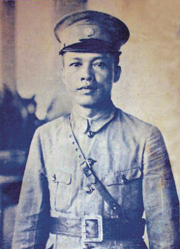
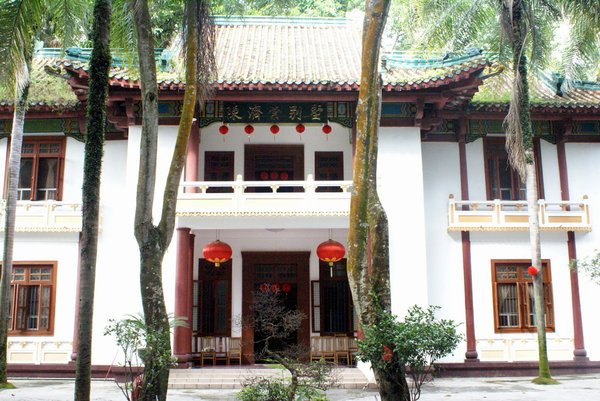
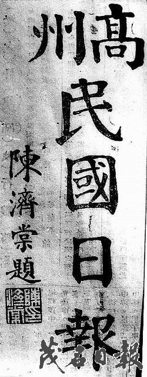
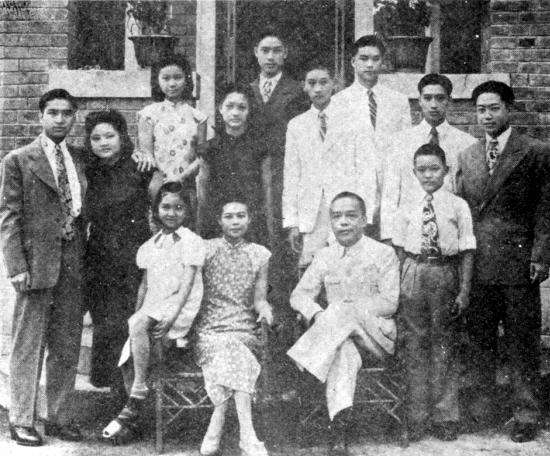
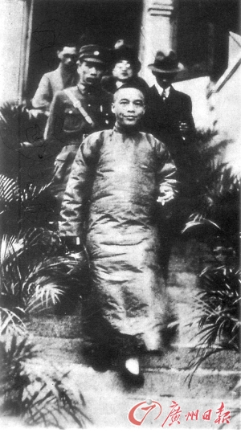
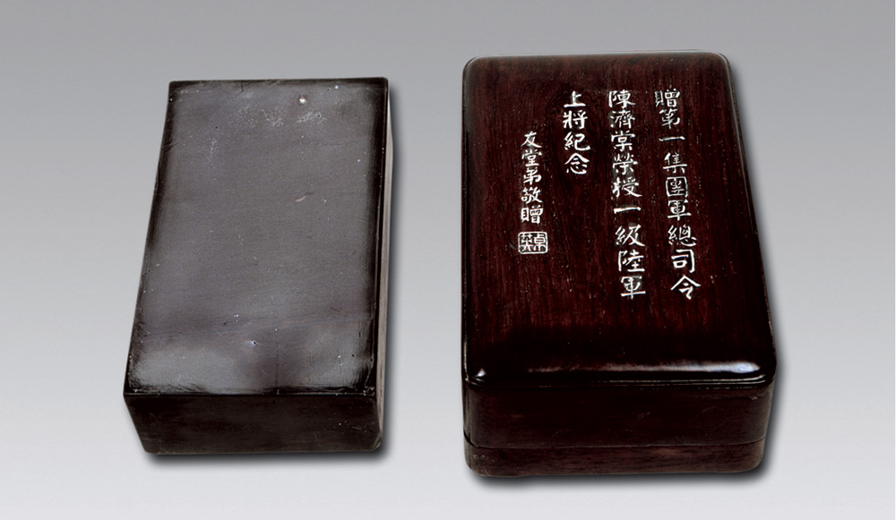
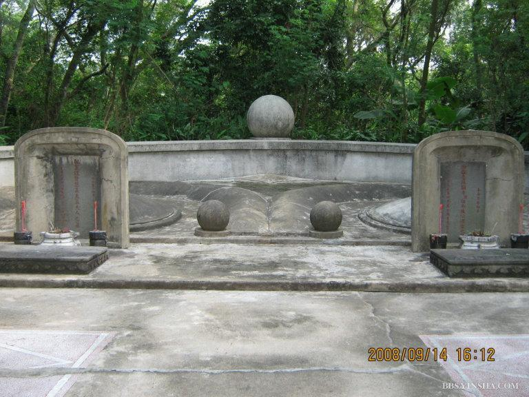

## nnnn姓名（资料）

适合所有人的历史读物。每天了解一个历史人物、积累一点历史知识。三观端正，绝不戏说，欢迎留言。  

### 成就特点

- ​
- ​

### 生平

【1890年1月23日】128年前的今天，差点触发大内战、建设广州黄金时代的南天王陈济棠出生

陈济棠（1890年1月23日－1954年11月3日）

【打上来的粤军师长】

1890年1月23日，陈济棠出生于今广西防城港。1907年，考入广州黄埔陆军小学。在学期间，由教官邓仲元介绍，与同班同学邓演达等秘密加入同盟会。1912年，陈济棠考入广东陆军速成学校，次年毕业。

毕业后，加入粤军，先后参加孙中山领导的护国战争、护法战争和讨伐陈炯明战争。1923年春（33岁），升任粤军第一师第二旅旅长。1925年7月，国民政府在广州成立，粤军第一师扩编为国民革命军第四军，陈济棠升任第十一师师长。

（陈济棠别墅）

【阻击南昌起义】

1927年春，陈济棠前往苏联，洽商购买军火及训练飞行员事宜。1927年4月，清党后不久，两广当局便将第十一师调回广州，担任警卫工作。6月，陈济棠回国，复任第十一师师长。

8月，中国共产党领导南昌起义。10月，陈济棠率部参加阻击从南昌南下的叶挺、贺龙军队，两军交战，战况极为激烈，叶挺、贺龙军因弹尽败退海陆丰。

随后，陈济棠把张发奎部队驱逐出广东，支持李济深出任广东省政府主席。1928年3月，陈济棠任第八路军第一师师长。

【闹独立的广州政府】

1929年，蒋桂战争起，李济深被蒋介石扣押在南京汤山，陈济棠支持蒋介石。陈济棠升任第四军军长兼广东绥靖委员，驻扎广州，然后再任第八集团军总司令。

1931年2月28日，蒋介石软禁胡汉民于汤山。5月中旬以后，汪精卫、孙科、李宗仁等人陆续来到广州，成立广州国民政府，与南京国民政府对抗，出现宁粤分裂。陈济棠将第八路军扩编为第一集团军，自任总司令。

同年9月，发生九一八事变，南京释放胡汉民（于10月初恢复自由）。11月初，宁粤互派代表到上海议和，决定在广州成立中央执行委员会西南执行部和国民政府西南政务委员会，保持一定的独立性，陈济棠和李宗仁均任常务委员。

（陈济棠一家合影）

【广州的黄金时代】

从此，陈济棠集广东党政军大权于一身，人称“南天王”。

陈济棠主政期间，对广东发展大有建树，先后兴建各类工厂、港口、公路、学校等。市政建设成绩显著，如海珠桥、中山纪念堂、中山大学、爱群大厦等等，广州更一跃而成为南中国的“首善之区”和繁华大都市(人口达112万)。后人称此时为广州的黄金时代。

陈济棠完成粤汉铁路建设，在广州珠江沿岸建码头数十座，建成天河机场，建成广东第一条公路干线广汕公路，与广西合办西南航空公司，设长途电话管理处，统一办理全省电话业务等等。

1980年9月10日，邓小平在接见陈济棠的第十子陈树柏教授时，说：“令尊（陈济棠）治粤8年，确有建树，有些老一辈的广东人还在怀念他。”

（治粤八年的陈济棠）

【差点爆发的大内战】

陈济棠曾暗中收购中共苏区的钨矿砂，在香港转手倒卖，帮助红军度过了经济封锁难关。1935年，晋任为一级上将 。

1936年6月，陈济棠与新桂系联合，以“抗日救国军”名义反蒋，史称“两广事变”。该事件历经3个多月，双方出动高达80万部队对峙，几乎触发了一场大规模内战。

但陈济棠手下的空军大队被蒋介石重金收买，司令黄光锐于7月带领48架飞机飞往南昌，投奔南京。他手下的其他大将，如余汉谋等也投靠蒋介石。陈济棠被迫出走香港，事件不发一枪一弹而告终。

（陈济棠纪念砚）

【平静的晚年】

陈济棠到香港后，蒋介石派人送他出洋考察。1937年（47岁），全面抗战爆发后，陈济棠由欧洲回国，任国民政府委员及最高国防委员和战略委员会委员。1940年春，任国民政府农林部长。

1949年，任海南行政长官兼海南警备司令。1950年到台湾，任总统府战略顾问。1954年11月3日（64岁），卒于台北，厚葬于阳明山，后迁葬大陆。

（位于广东湛江“湖光岩”风景区的陈济棠墓）

