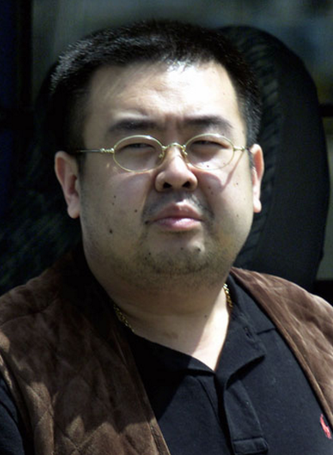
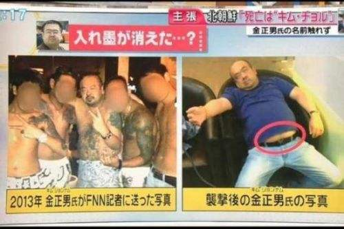
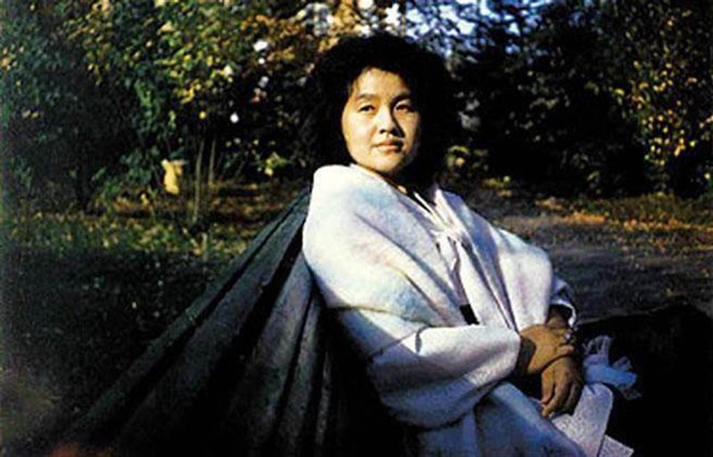
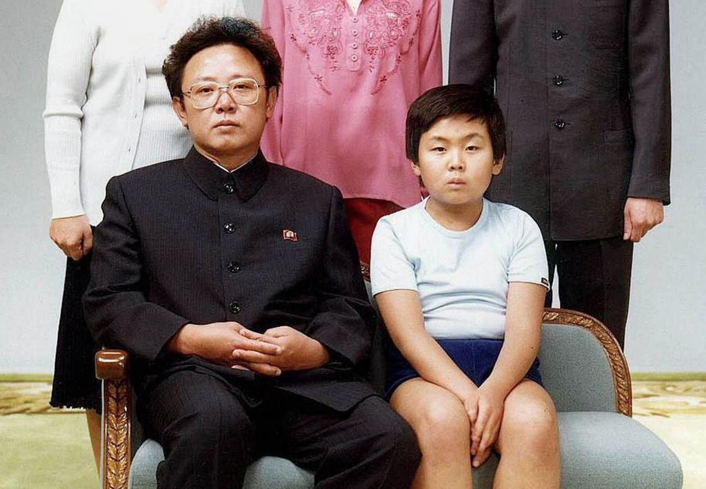
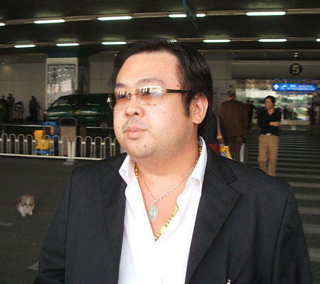
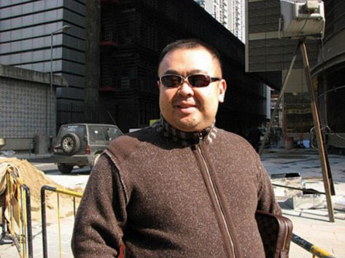
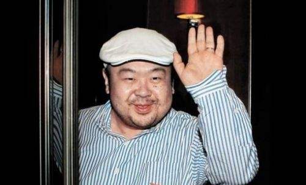

## nnnn姓名（资料）

适合所有人的历史读物。每天了解一个历史人物、积累一点历史知识。三观端正，绝不戏说，欢迎留言。  

### 成就特点

- ​
- ​

### 生平

【2017年2月13日】去年的今天，金正日的长子金正男在机场被5秒钟的整人游戏刺杀而死

金正男（1971年5月10日－2017年2月13日），金正日的长子，在马来西亚机场离奇被刺杀。

【被冷落的婚姻】

1971年5月10日，金正男出生于朝鲜平壤，是金正日的长子。母亲成蕙琳是朝鲜电影演员，之前已有一段婚姻，并有两个子女。

1968年，金正日登上白头山，和同学的大嫂成蕙琳相遇，顿时被迷住。1970年10月，金正日与元配洪一天离婚，成蕙琳也离婚，两人开始同居。然而，金日成反对这段婚姻，成蕙琳不准在公众场合露面。

1970年代中期，金正日在晚会上，见到比他小11岁的演员高容姬，并被她吸引。从此，成蕙琳被冷落，健康每况愈下。80年代，赴莫斯科治疗，金正男交给金正日的妹妹抚养。成蕙琳一直在莫斯科孤独生活，直至2002年去世。

【中国的改革开发】

由于金正男的特殊身份，他不能公开身份到学校读书和出外活动。他曾在莫斯科和日内瓦学习，精通电脑，能掌握流利日语、英语、俄语、中文（粤语）等。

2000年（29岁），金正男曾表示“不实行中国式改革开放，朝鲜就无从发展”。有人向金正日报告，金正男被指为“革命的叛徒”，遭到排挤。2001年后，他离开朝鲜，在欧洲秘密隐居。

2001年5月，他被发现持假的多米尼加共和国护照企图非法入境日本，目的是携妻子、儿女畅游东京迪士尼乐园，后来被驱逐出境到中国。

（金正男与金正日合影）

【不能接班的长子】

2007年（36岁），他长居澳门，他的三名妻子和孩子也都到澳门居住。6月，金正男返回平壤，并在朝鲜劳动党组织指导部工作。

2009年1月，金正男说他“没兴趣”接管朝鲜的领导权。2010年10月，金正日在朝鲜劳动党党庆时，准备让幼子金正恩接位。同时，在北京的金正男接受日本朝日新闻的采访，表示愿意在海外帮助其弟，但是也公开表示对世袭的反感。

【被暗杀笼罩的秘密生活】

2011年12月，同父异母的弟弟金正恩正式掌权。金正男就从澳门消失，后来有记者报道他在新加坡秘密生活。于2012年9月被韩国拘留的脱北者、朝鲜保卫部要员陈述，曾接到寻找、劫持、暗杀金正男的指令。

在朝鲜劳动党中央政治局委员张成泽被执行处决后，据和金正男有逾150封电邮来往的日本《东京新闻》编辑五味洋治透露，北京当局对金正男的保安级别提升，安排的贴身警卫和汽车都增加了两倍。

【5秒钟的整人游戏】

2017年2月6日，一名持有名为“Kim Chol”（金哲）的朝鲜外交护照的男子搭机抵达马来西亚。2月13日早晨，该男子在吉隆坡国际机场准备登机前往澳门，突然遭到两名身份不明的女子袭击，过程仅5秒，随后该男子感觉不适，向机场人员求救，后于送医过程中死亡。

2月24日，马来西亚警方发布公告称死亡男子眼部黏膜与脸部的擦拭物是VX神经毒剂。被逮捕的印尼籍女嫌犯表示，是受雇参与拍摄整人电视节目，并为此收取了400林吉特酬金，她以为自己拿的液体是婴儿油。

3月10日，马来西亚通过DNA样本，正式确认死者为金正男。3月31日，金正男的遗体从马来西亚运抵北京，再送返朝鲜。

