## nnnn姓名（资料）

适合所有人的历史读物。每天了解一个历史人物、积累一点历史知识。三观端正，绝不戏说，欢迎留言。  

### 成就特点

- ​
- ​

### 生平

【1962年2月14日】56年前的今天，黄埔军校的5个第一，蒋介石的十三太保之首胡宗南去世

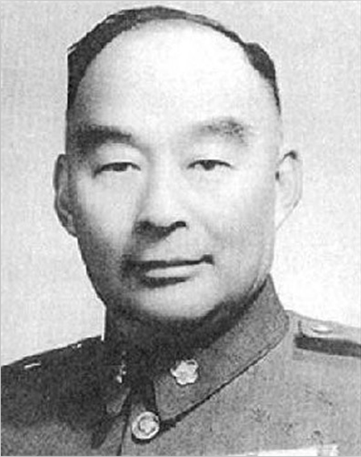

胡宗南 （1896年5月12日－1962年2月14日），浙江宁波镇海人，黄埔军校第一期学生。因身高不足1米6，差点未能录取。从此成为黄埔系的头领，是蒋介石的“十三太保”之首。

胡宗南先后参加了东征、北伐、统一、平乱、抗战、剿共、保台等战役，是唯一全程参与的黄埔学生。他是黄埔学生中的第一个军长、第一个兵团总指挥、第一个集团军总司令、第一个战区司令长官、第一个将军、也是唯一一个在离开大陆以前获得第三颗将星的人。

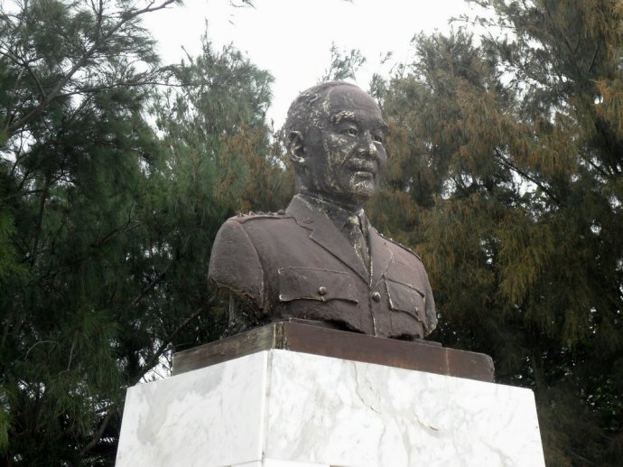

【黄埔军校的矮个子】

1896年5月12日，胡宗南出生，祖籍浙江宁波镇海，3岁时随家迁到浙江湖州安吉县。青年时代曾追随民国著名杀手、斧头帮王亚樵。

1920年（24岁），入读南京高等师范学校。1924年6月（28岁），报考黄埔军官学校第一期，因身高不到1.6米未被录取，经军校党代表廖仲恺特许才得以入校。他是黄埔军校年龄最大的学生，备受尊敬，为他以后的发展铺平了道路。

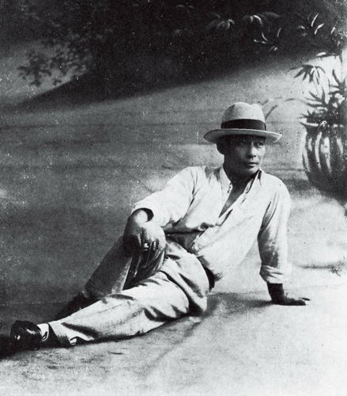

【黄埔的第一个将军】

1925年毕业后，不久就升任营长。7月，他把同乡戴笠推荐给蒋介石，成为蒋介石的左臂右膀。不久参加北伐战争，升任团长。1927年3月20日，攻克上海；5月任第1军第1师少将副师长，成为黄埔学生的第1个将军。

8月，飞驰南京参加龙潭战役，击败孙传芳军，奠定了南京国民政府的基业；10月，升任第1军（刘峙）第22师师长；11月击毁直鲁联军白俄雇佣兵装甲车队。

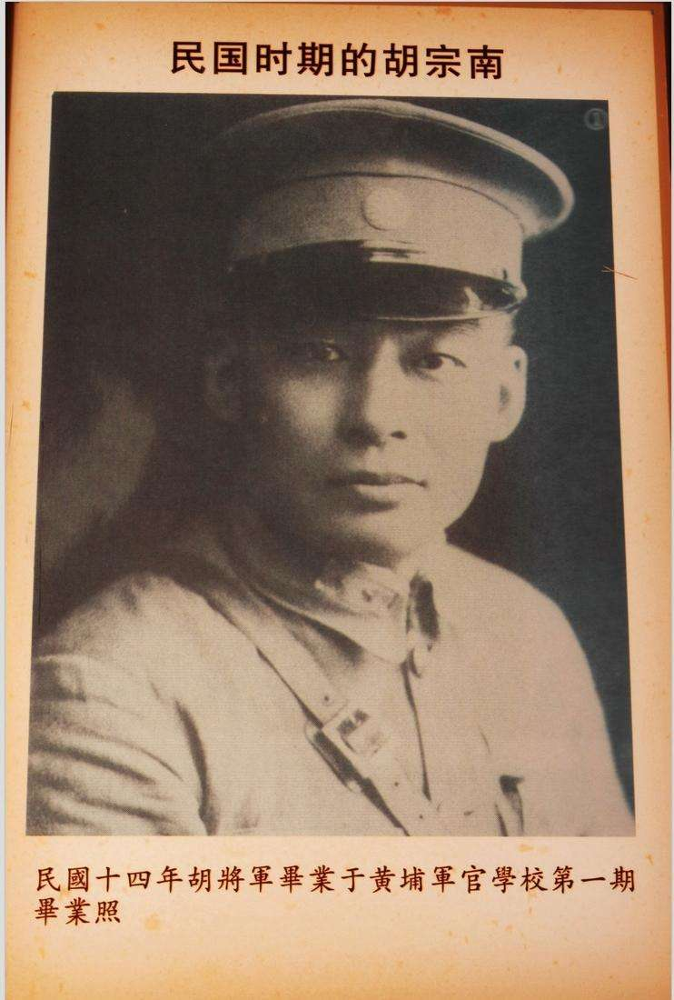

【十三太保之首】

1928年参加第二次北伐，一举攻占蚌埠、济南。10月，第1军第22师整编为陆军第1师（刘峙）第2旅，胡宗南任少将旅长。1929年，蒋桂战争爆发，胡宗南率军警戒武汉。1930年，参加中原大战。1931年，胡宗南升任第1师中将师长，开始形成黄埔系的“少壮派集团”。

1932年3月，胡宗南、戴笠等参与组织“复兴社”。“复兴社”强调“一个主义、一个政党、一个领袖”，推行对领袖蒋介石的个人崇拜；是以黄埔系精英军人为核心，带有情报性质的军事团体。

复兴社成员模仿意大利黑衫军和纳粹德国褐衫军，均穿蓝衣黄裤，又称“蓝衣社”。胡宗南居蒋介石“十三太保”之首，以黄埔系“太子”自诩。

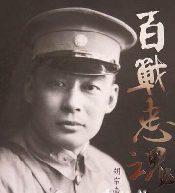

【对红军的多次交手】

1932年5月，参加“围剿”大别山的红4方面军，将红军第10师和第12师拦截包围，造成红军巨大伤亡。

1935年，任“剿匪”第3路第2纵队司令官，积极拦截围攻长征中的红军，结果在松潘战败，差点被活捉，部队伤亡过半；9月任“西北剿匪”第1路军第2纵队司令，继续在川西北地区阻击红军。11月，当选为国民党中央监察委员，标志黄埔系势力开始进入中央决策机构。

1936年4月，胡宗南为第1军军长，进攻陕北红军，被彭德怀率领红军大败。12月12日，“西安事变”爆发，胡宗南得知蒋介石被扣，立即赶到天水，支持戴笠赴西安营救蒋介石。

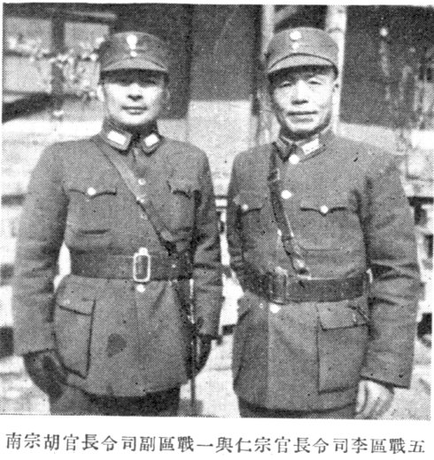

【抗战的集团军总司令】

7月7日，全国抗战爆发。9月，胡宗南率部参加淞沪会战，升任第17军团军团长，这是黄埔学生中第1个军团长。由于第1军仓促上阵，参战部队损失很大，11月第17军团撤出战斗，回到关中。

1938年，参加对日的开封会战、武汉会战。1939年，任第34集团军总司令，成为黄埔系学生的第1个集团军总司令。

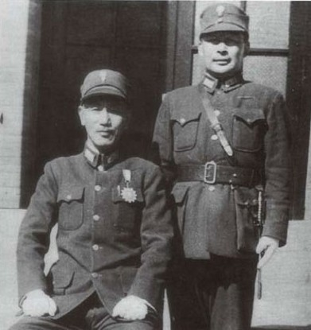

【接受日本投降的战区司令】

1942年7月23日，胡宗南升任第8战区（朱绍良）副司令长官兼第34集团军总司令，掌握第8战区实权，屯兵西北，封锁陕甘宁边区，号称“西北王”。

1945年1月，就任第1战区代理司令长官，辖4个集团军、16个军、42个师、5个特种兵团，计45万人；7月31日被正式任命为第1战区司令长官，成为黄埔系学生中唯一的战区司令长官。9月22日，在郑州接受日本第12军团司令官鹰森孝投降，共6万余人；10月3日特加陆军上将衔。

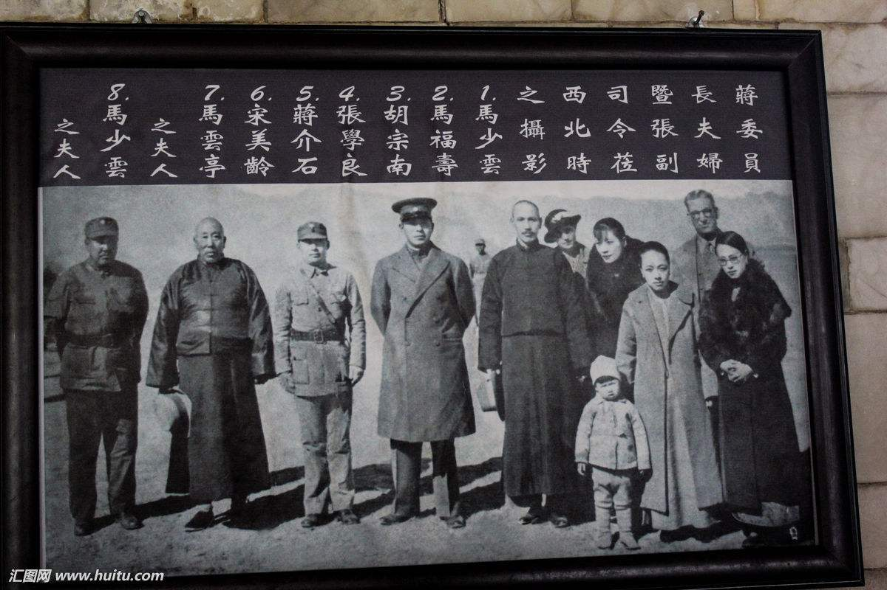

【延安的空城计】

1947年3月，被任命为西安绥靖公署主任；并指挥15个旅（14万人）攻占空城延安，被授二等大绶云麾勋章。但随后在青化砭、蟠龙、沙家店、清涧、瓦子街等地被解放军大败，多支军队被歼灭，节节败退。1948年4月21日，被迫撤出延安。新华社公布43名战犯名单，胡宗南名列其中。

1949年5月，西安解放，7月宝鸡解放，胡宗南集团遭到毁灭性打击，退入汉中。11月向成都转移，12月迁往西昌。1950年3月，解放军逼近西昌，胡宗南只好飞逃台湾。

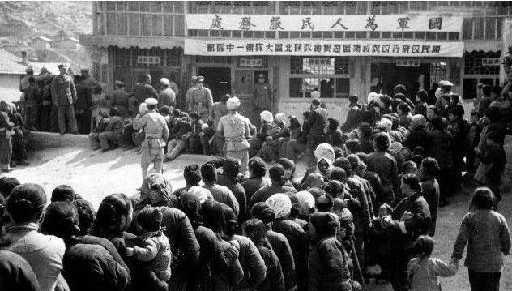

【反攻大陆的浙江省主席】

1950年5月，台北“监察院”联名弹劾胡宗南，历数了他在西北、四川的一连串败绩，认为国民党政府之所以会“失去大陆江山”，胡宗南“应负重大之罪责”。最终，弹劾案移交“国防部”处理，“应免议处”。

1951年9月，胡宗南化名为“秦东昌”，就任“江浙人民反共游击总指挥”，驻守大陈岛，指挥部队骚扰大陆沿海。1952年10月，当选为国民党第七届中央评议委员，兼任“浙江省政府主席”。

1953年，解放军进军大陈岛，胡宗南飞回台湾；1955年，胡宗南就任“澎湖防守司令部”司令官，晋任陆军二级上将。1959年，胡宗南在澎湖任期四年后正式退休，结束了长达三十五年的军旅生活。

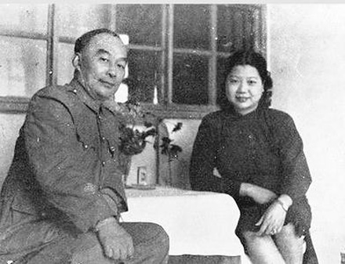

【五个第一的天子门生】

1962年2月14日，胡宗南因心脏病突发病逝，终年67岁。17日公祭，蒋介石亲自参加祭奠。3月13日颁发“褒扬令”；6月9日安葬于台北阳明山纱帽山麓。

胡宗南可称得“天子门生”第一人，受到蒋介石的器重。他是黄埔学生在国民党陆军中的第一个军长、第一个兵团总指挥、第一个集团军总司令、第一个战区司令长官、第一个将军、也是唯一一个在离开大陆以前获得第三颗将星的人。

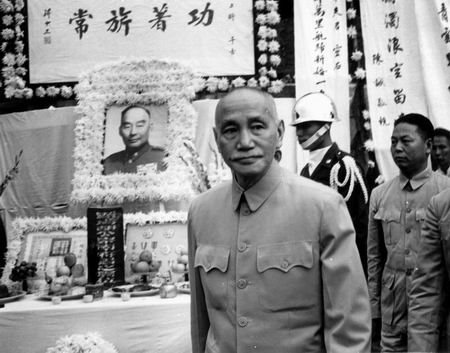

【】

### 照片

