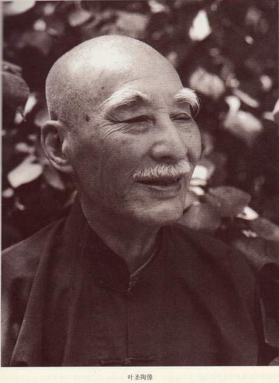
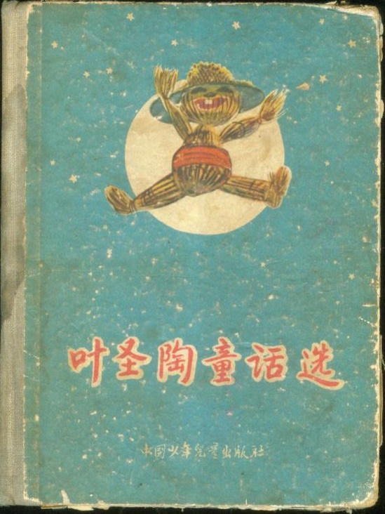
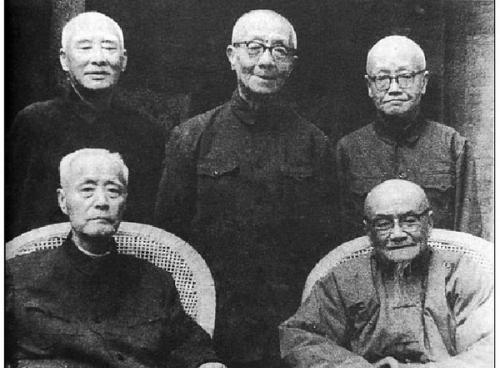
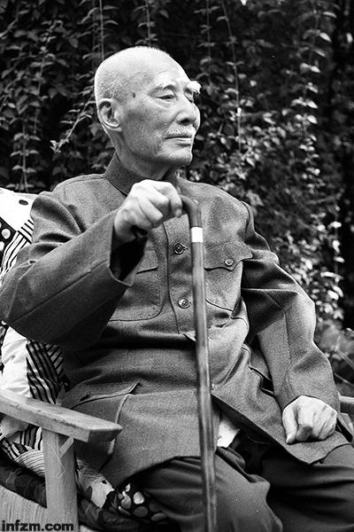
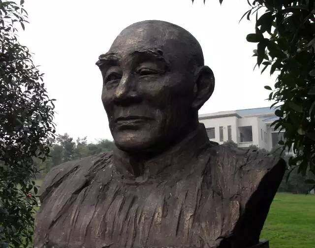

## nnnn姓名（资料）

适合所有人的历史读物。每天了解一个历史人物、积累一点历史知识。三观端正，绝不戏说，欢迎留言。  

### 成就特点

- ​
- ​

### 生平

【1988年2月16日】30年前的今天，写稻草人，文学为人生的叶圣陶逝世

叶圣陶（1894年10月28日－1988年2月16日）

【失业的小学教师】

1894年10月28日，叶圣陶出生于今江苏苏州。父亲给当地地主做帐房，家境清苦。1907年，考入草桥中学，毕业后任小学教师。1914年，他被排挤出学校而失业，全心投入到文言文小说的创作。

1915年，到上海商务印书馆的尚公学校任国文教员，并为商务印书馆编小学国文课本。1917年，应聘到吴县第五高等小学，任教5年，进行教育改革，编新的教科书，开始了他的写作生活。

1918年，发表他的第一篇白话小说《春宴琐谭》。1919年，加入了北京大学的新潮社，开始白话文学的创作。1921年，与茅盾、郑振铎等人发起组织五四运动首个新文学社团“文学研究会”，提倡“文学为人生”。

【稻草人的童话故事】

1923年，进入商务印书馆，从事编辑出版工作。同年，发表中国的第一个童话故事《稻草人》。该故事曾入选教材，影响很广。后来又写了另一部童话：《古代英雄的石像》。

1929年，发表了长篇小说《倪焕之》。这是中国的早期白话小说，述说了一个抱有理想青年，在寻求梦想的道路上遇到的许多事情，包括爱情，但最后梦想破灭，他也死了。倪焕之的身上有叶圣陶的影子，此后他再也没有写过长篇小说。

【抗日的教育家】

1930年，转入开明书店，主办《中学生》杂志。1931年，九一八事变后，他作为始创者，发起成立“文艺界反帝抗日大联盟”。抗战期间，他前往四川，继续主持开明书店编辑工作，同时还参加发起成立“文艺界抗敌后援会”。

1946年，抗战胜利后，回到上海后，担任了全国文艺界协会总务部主任、中学教育研究会的顾问。

他编辑了很多著名的杂志和报纸，大力提倡使用白话文。 叶圣陶是一位杰出的教育家，同时他也是一位伯乐。他教育和发掘了许多杰出的作家如巴金、丁玲、戴望舒等。

（苏州五老：顾颉刚,王伯祥,叶圣陶,章元善,俞平伯）

【民进中央的副主席】

1949年，到达北平，先后出任教育部副部长、人民教育出版社社长和总编、教科书编审委员会主任、中央文史研究馆馆长、政协副主席等重要职位。

1962年，叶圣陶加入中国民主促进会。1979年，当选为民进中央副主席。1984年12月，在民进七届二中全会上被推选为主席。

1988年2月16日，叶圣陶于北京逝世，享年94岁。

【教是为了不教】

叶圣陶对改进现代中文教育有重要影响。他认为：“教是为了不教”。他给中文教育引入了一个全新的观念，“应当教给学生学习的方法，而不是长期详细的灌输书本知识。”

他认为文学作品不仅是用来供人消遣，而且也是反映生活和鼓舞读者思考现实的工具。他感觉有义务去让读者知道在他们周围真实发生的事情。叶圣陶也以记者为毕生职业。

易读性是叶圣陶作品的一个显著特征。叶圣陶认为一个人只有把文章写得实际且易于理解，他才能够去写一些风雅作品。如果读者不理解文章内容，文章就毫无用处。

