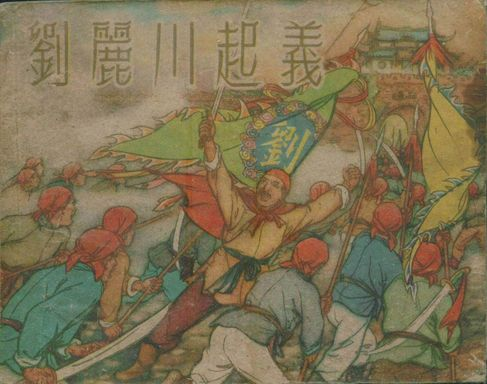
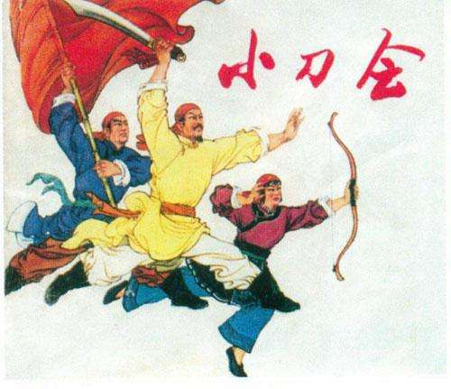
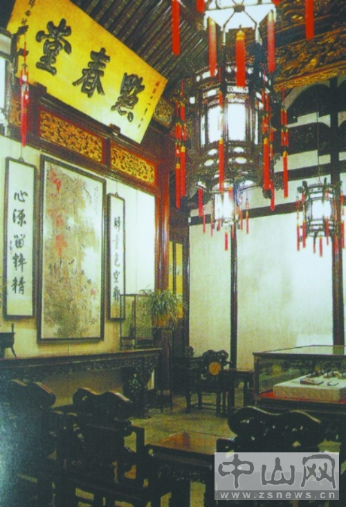
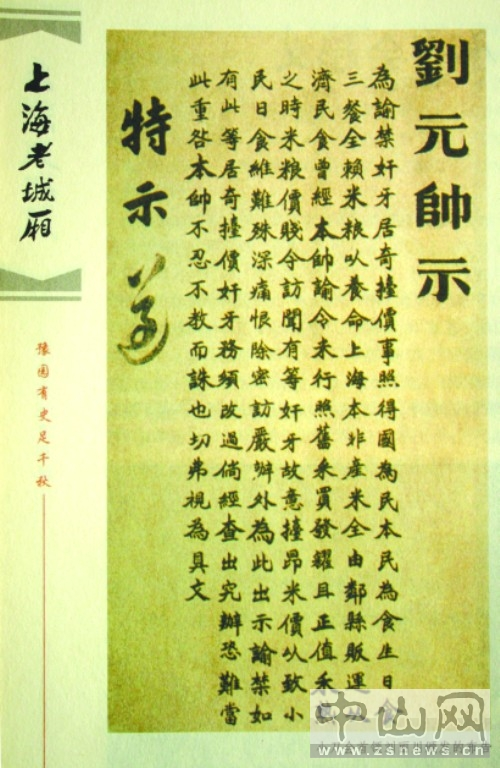
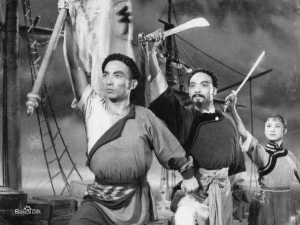

## nnnn姓名（资料）

适合所有人的历史读物。每天了解一个历史人物、积累一点历史知识。三观端正，绝不戏说，欢迎留言。  

### 成就特点

- ​
- ​

### 生平

【1855年2月17日】163年前的今天，反清复明、带领广东人占领上海的小刀会首领刘丽川牺牲

【加入小刀会的广东仔】

1820年，刘丽川出生于今广东中山市的一家富裕的农民家庭。自幼习武，通英语，知接骨医术，曾经是茶叶行及丝绸店店员。

1845年（25岁），于香港参加洪门三合会，成为洪门骨干。1849年，到上海经商，组织及成立广肇会馆，加入小刀会，集结广东人在上海的势力。

【攻占上海县城】

1853年（33岁），小刀会头目潘启祥因教案被逮捕。刘丽川积极组织营救，成为小刀会首领。9月7日上午，刘丽川联合青浦天地会、嘉定天地会、福建天地会等两千人，大多是上海广东人，在上海县城北门外，成功劫刑场，救出死刑囚潘启祥。

然后，攻占上海县城衙门，杀死知县，释放狱囚，活捉上海道兼海关监督吴健彰。吴健彰不愿加入起义，刘丽川将其监禁于广东会馆。9日，吴健彰得到传教士的帮助，化装翻越城墙逃走。

（小刀会商议大事的点春堂）

【建立大明国】

刘丽川自称“大明国统领政教招讨大元帅”，随即攻占青浦、宝山、南汇、川沙厅，队伍扩增至万人。刘丽川打出反清复明的口号，赢得了许多人的支持。

逃走后的吴健彰，得到英军的协助，自陆、海两路围攻上海。刘丽川派出潘启祥至天京，向太平天国的洪秀全请求支援。洪秀全以“小刀会不信仰上帝”而拒绝，使得太平天国失去了夺取上海的最好机会。

（刘丽川发布的告示）

【难过的年关】

刘丽川守上海城，坚持与清军、外国军队作战。1854年夏，吴健彰因贪污渎职被参革职，从此上海租界行政权和海关管理权沦落到外国人手里。清廷改命江苏巡抚率军围攻上海。

当年除夕，清军在城墙底埋炸药，轰塌了城墙二十余丈。正月初一，清军涌入城内，与小刀会展开巷战。1855年2月17日（35岁），刘丽川率死党奋力逃出，在虹桥被清军追上，被杀牺牲。

坚持了一年多的“大明国”，失败了。但小刀会的抗清行动，仍持续了多年。

（舞台上的小刀会）

### 

