## nnnn姓名（资料）

适合所有人的历史读物。每天了解一个历史人物、积累一点历史知识。三观端正，绝不戏说，欢迎留言。  

### 成就特点

- ​
- ​

### 生平

【1946年2月20日】72年前的今天，送5个儿子参加抗战的辛亥革命总司令李烈钧逝世

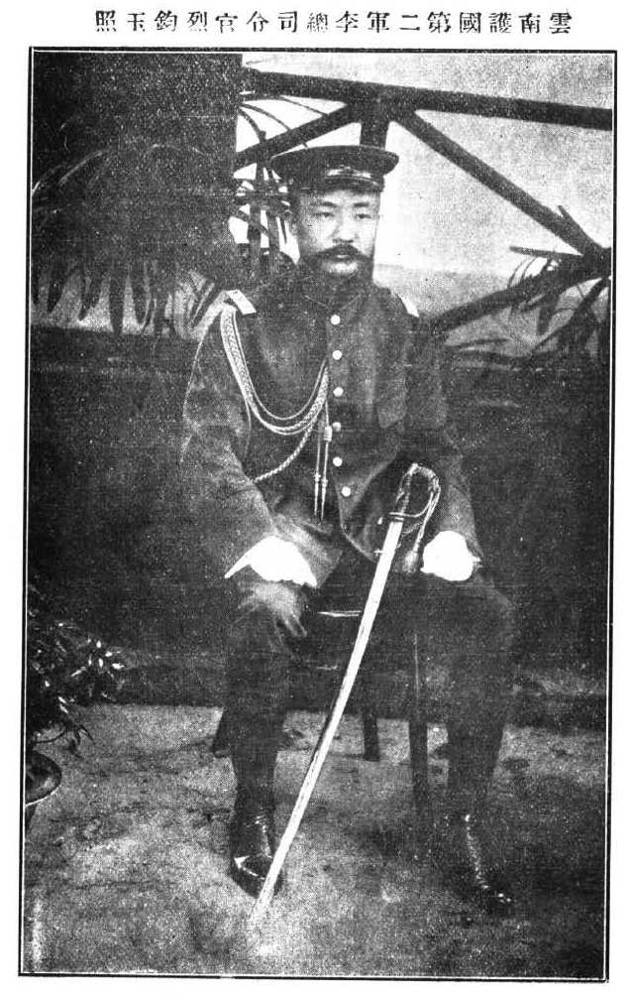

李烈钧（1882年2月23日－1946年2月20日）

【打砸县长的不良少年】

1882年2月23日，李烈钧出生于今江西武宁县。他自幼学文习武，交游广泛，豪放不羁。1900年（18岁），武宁新任知县上任，要求乡民缴纳历年拖欠的田赋，全县民众怨声载道。李烈钧聚众，趁知县回衙门时，蜂拥而上，打砸官轿，最终将知县赶走。

1902年（20岁），进入江西武备学堂。1904年，赴日本留学，入东京振武学校。1907年（25岁），入陆军士官学校学习炮术，同期的留学生有阎锡山、唐继尧、程潜等人。期间，加入中国同盟会，成为孙中山的拥护者。

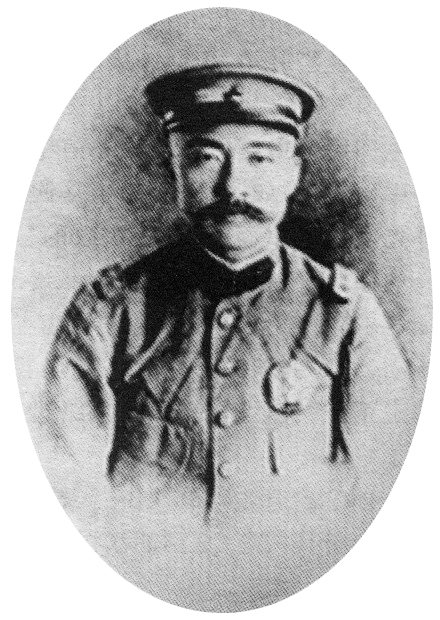

【辛亥革命的总司令】

1908年，毕业归国后，进入江西新军。1909年，赴昆明，任云南陆军讲武堂教官、陆军小学堂总办。

1911年武昌起义，李烈钧应革命派的邀请回到江西，被推举为九江军政府的总参谋长。他派林森、吴铁城成功劝说北洋海军起义，李烈钧遂被推举为九江海陆军总司令。不久武昌被围攻，李烈钧派兵救援成功，被任命为五省联军总司令兼中央军总司令。

1912年1月（30岁），李烈钧派兵光复了当时的安徽省省会安庆。李烈钧被江西省议会选举为江西都督。

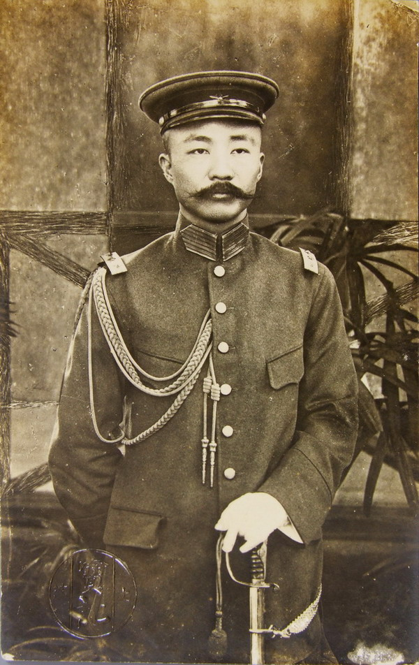

【二次革命和护国战争】

1913年，袁世凯下令将其免职，李烈钧与孙中山策划发动二次革命。5月，李烈钧同湖南都督谭延闿、安徽都督柏文蔚、广东都督胡汉民联名反对袁世凯。袁世凯派兵征讨，9月二次革命失败，李烈钧逃亡日本。

1915年，李烈钧加入中华革命党。赴云南，与唐继尧、蔡锷策划发动反袁世凯的护国战争。12月25日，李烈钧任护国军第2军总司令（第1军总司令为蔡锷，第3军总司令为唐继尧），进军广西省。

1916年3月，广西将军陆荣廷发表独立宣言，倒向护国军。李烈钧协助其进攻广东省，击败广东将军龙济光。6月，袁世凯去世。

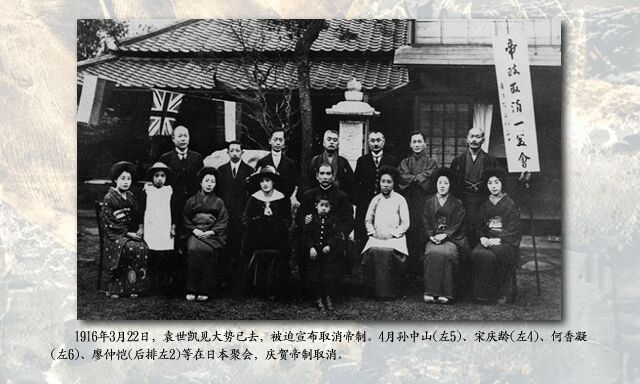

【北伐的第一路总司令】

1917年9月，孙中山在广州成立中华民国军政府，李烈钧任大元帅府总参谋长。1919年10月，孙中山在上海将中华革命党改组为中国国民党，李烈钧被任命为代理大元帅，负责管理广州的事务。

1920年12月，孙中山为北伐而设立大本营，李烈钧任大本营总参谋长。1922年2月3日，孙中山在桂林发出北伐动员令，任命李烈钧为北伐军第一路总司令，率滇军、黔军、赣军自桂林出发进攻江西；任命许崇智为北伐军第二路总司令，率粤军并联合湘军自桂林出发，经岳州进攻武汉。

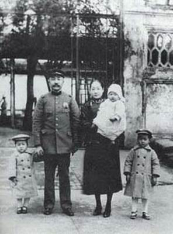

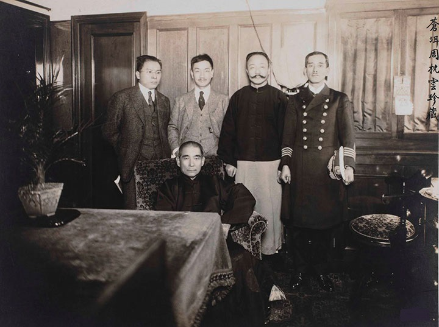

【南京政府的奠基人】

1925年，孙中山逝世。李烈钧应冯玉祥的邀请，任国民军总参议，指导国民军同奉军作战。

1927年4月（45岁），蒋介石在南京成立国民政府，李烈钧支持并参加，任国民政府常务委员、军事委员会常务委员。8月，蒋介石下野，孙传芳趁机偷袭南京，李烈钧坐镇南京，指挥各军击败了孙传芳，为南京政府奠定了基础。

9月，宁汉合流，中国国民党宁、汉、沪各方取得统一，组织了中央特别委员会，由三方各派六人参加，李烈钧是宁方代表之一。

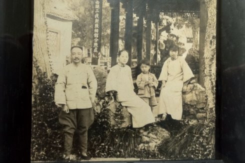

【5个儿子抗战的英雄父亲】

1928年后，李烈钧离开南京，在上海养病。1931年，九一八事变爆发后，李烈钧提出应当“贯彻对日经济绝交”。1932年，满洲国成立，热河抗战、长城抗战先后爆发。他数次致电蒋介石，支持抗日。

西安事变后，李烈钧被委派为审判张学良的高等军事法庭审判长。1937年，全面抗战爆发，李烈钧将身边达到服役年龄的五个儿子全都送入军队，其中包括两个正在大学读书的儿子。

1946年2月20日，李烈钧在重庆逝世，享年64岁。1947年5月9日，国民政府明令国葬。

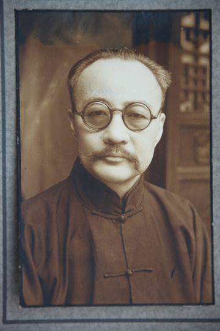

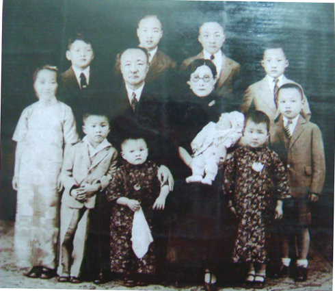

【】

### 照片

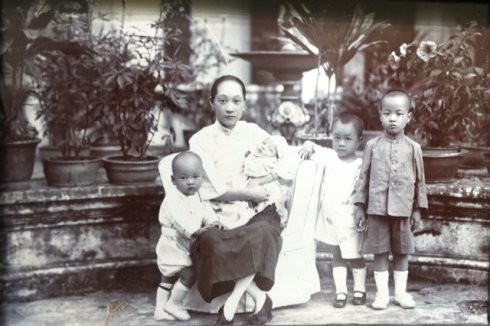

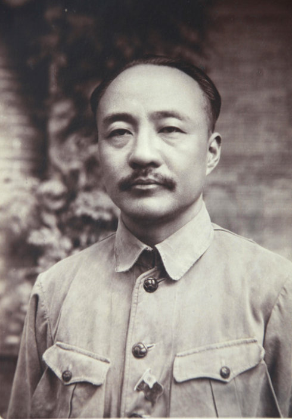

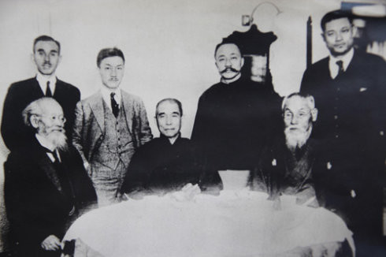

