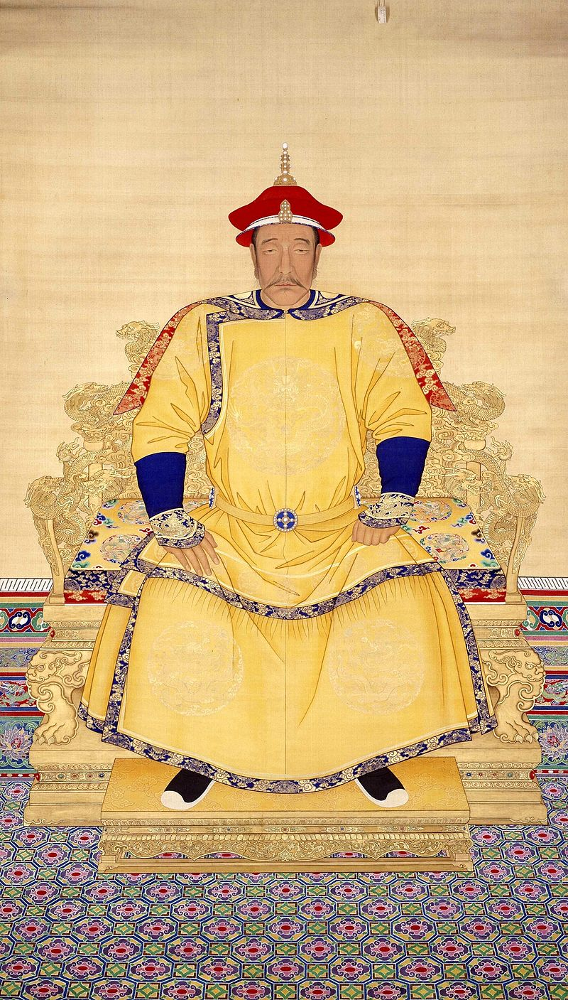
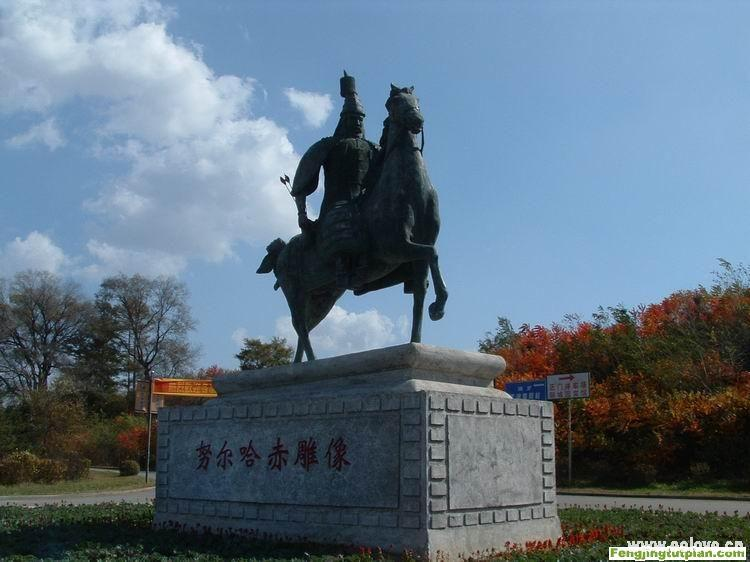
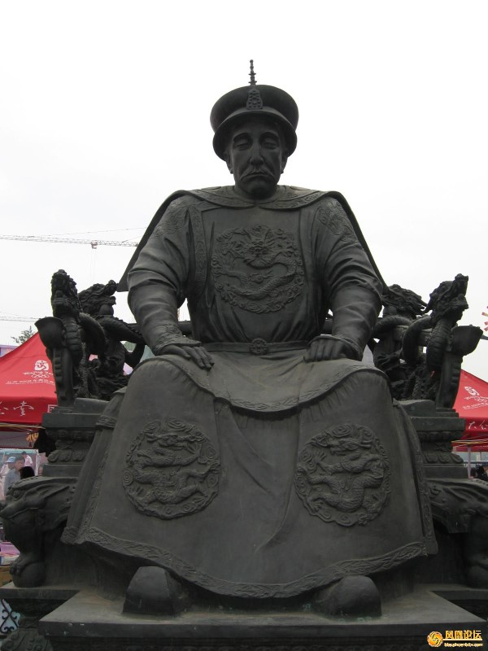
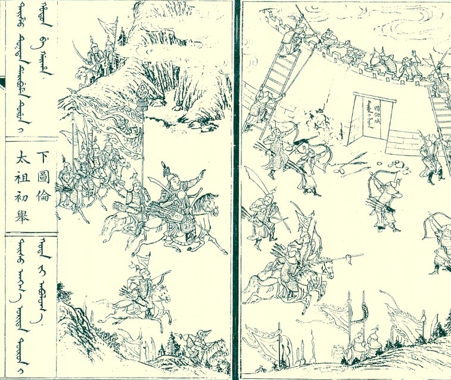
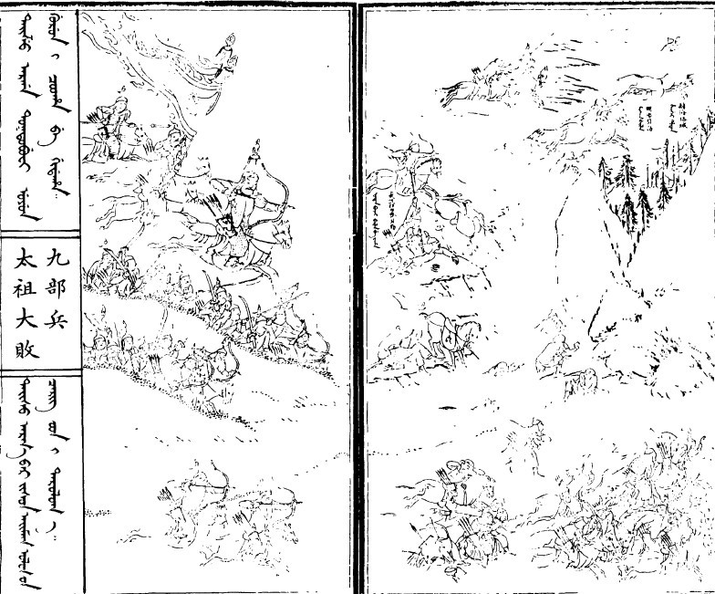
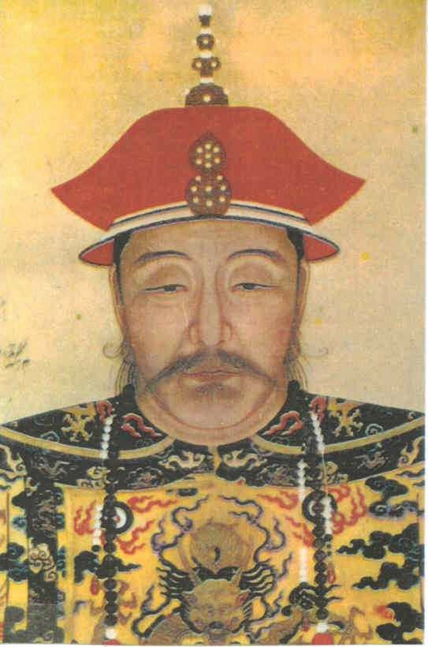
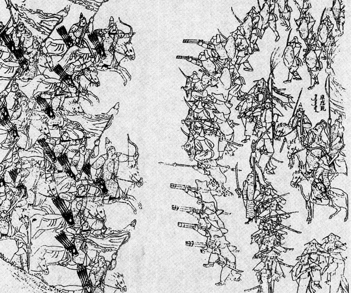
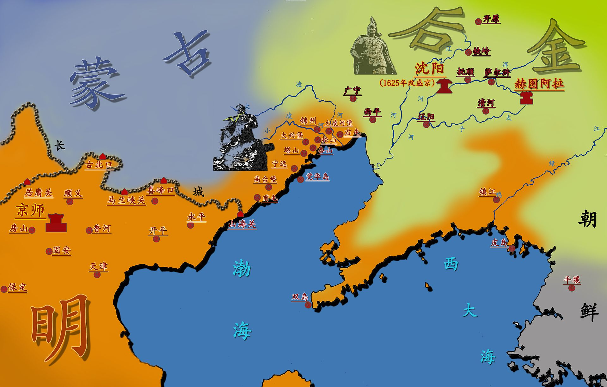
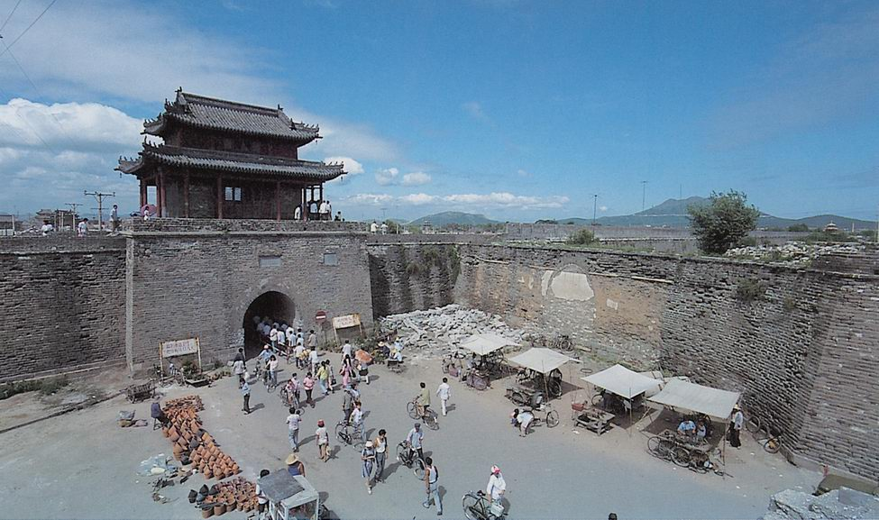
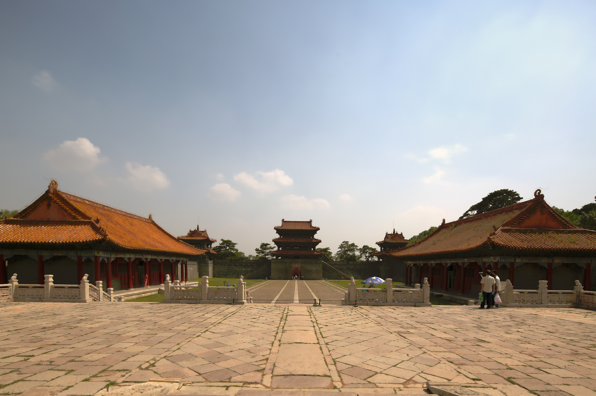

## nnnn姓名（资料）

适合所有人的历史读物。每天了解一个历史人物、积累一点历史知识。三观端正，绝不戏说，欢迎留言。  

### 成就特点

- ​
- ​

### 生平

【1559年2月21日】459年前的今天，白手起家、杀尽东北的清朝第一帝努尔哈赤出生

努尔哈赤（1559年2月21日－1626年9月30日），建州女真人，爱新觉罗氏，后金的创建者、清朝的主要奠基人。

他以十三甲起兵，征战多年，统一了建州女真部落。他建立了以奴隶制为基础的、军国主义的八旗制度，以重骑兵为核心，所向无敌，屠戮了整个东北地区。再加上后来清朝以“龙兴之地”实施管制，在几百年里，东北几乎就是无人之境！

他以弹丸之地（今辽宁新宾县）、仅仅数万八旗兵打败了明朝军队，并攻占辽东，建立后金，创立满语，奠定了清朝的基础。虽然他没有亲自建立清朝，却被称为“清朝第一帝”。

【后妈不喜欢的野小子】

1559年2月21日（明嘉靖三十八年），努尔哈赤生于今辽宁新宾满族自治县永陵镇赫图阿拉村，家里是建州女真一个小部落头领的旁支。10岁时，母亲去世，继母对他和弟弟很刻薄。19岁，被迫分家生活，只分得少量阿哈（奴隶）和牲畜。

他和弟弟以挖人参、采松子等方式为生，常到明朝的抚顺关马市进行贸易。喜欢读《三国演义》和《水浒传》，自谓有谋略。

【13副盔甲开启的复仇之路】

1583年（24岁），明朝攻打女真人阿台的古勒城。阿台的妻子是努尔哈赤大伯的女儿。因此，努尔哈赤的父亲和爷爷，一同进城劝降阿台。谁知明朝在另一个女真人尼堪外兰的帮助下，攻入了古勒城，努尔哈赤的父亲和爷爷也死在乱军之中。

努尔哈赤暴怒，以父亲留下的盔甲十三副、部众数十人起兵，进攻尼堪外兰，开启了复仇之旅。尼堪外兰被迫逃到明朝的抚顺城附近。虽然，家族极力反对努尔哈赤，但他的队伍越来越大，与附近的其他女真部落，也不断发生冲突。

1586年（27岁），努尔哈赤再次击败尼堪外兰，在明朝的边墙内将其斩杀，报了杀父之仇。1587年，他击败吞并了哲陈部。1588年，苏完部、董鄂部等归附，开国的“五大臣”到位。不久，又消灭完颜部，完成了对建州女真的统一。

（太祖初举下图伦）

【抗日中崛起的龙虎将军】

1592年（33岁），日本在丰臣秀吉的统领下，入侵朝鲜，数月内席卷朝鲜全境。宗主国明朝派援兵入朝作战。努尔哈赤上书明朝，请求出兵援助，却遭拒绝。经过6年时间，明朝把日本赶出了朝鲜，但自己也损失惨重，兵力空虚，而努尔哈赤得以发展壮大。

1593年（34岁），叶赫、哈达、乌拉、辉发等女真大部落组成九部联军，进攻建州。努尔哈赤一举将其击败，军威大震，确立了建州女真之主的地位。明朝也封他为龙虎将军。努尔哈赤继续征服附近的女真部落，将长白山女真也纳入了统治范围。

（太祖大败九部兵）

【横扫女真部落的后金天子】

1599年（40岁），努尔哈赤打败哈达部，并在两年后将其灭亡。1601年，随着军队人数增多，努尔哈赤进行整编，以三百人为一牛录，作为基本单位，以黄、白、红、蓝四色为四旗。八旗制度雏形开始形成。

1607年（48岁），灭亡辉发部。1613年，经过多次征战，灭亡了最大的乌拉部。1915年，增加镶黄、镶白、镶红、镶蓝四旗，成为八旗。

1616年（56岁），努尔哈赤在赫图阿拉正式建国，国号“后金”，建元天命。称明朝为“南朝”，正式分庭抗礼，但此时并未大肆声张。这时，女真没有文字。努尔哈赤命令，以蒙古文为基础，创建了满文。到他儿子皇太极时，对满文再次改进完善，完成定型。

【打败明朝屠尽东北】

1618年（59岁），努尔哈赤发布“七大恨”誓师告天，正式向明朝宣战。四月，努尔哈赤攻入抚顺，焚毁城镇，俘虏人畜三十万。大量的缴获，极大地刺激了努尔哈赤的欲望，从此不断地劫掠明朝城堡。

1619年，经十个月的准备，明朝调集十余万军队，兵分四路围攻努尔哈赤。努尔哈赤表示“恁尔几路来，我只一路去”，集中优势兵力，在5天内先后歼灭了明朝3路军队，获得了萨尔浒之战的大胜。从此，明朝由攻转守，且再也无力发动大规模战争。

两个月后，努尔哈赤攻入开原，大肆劫掠焚城，又进占铁岭，迁都萨尔浒山城。再两个月后，消灭了叶赫部，吞并了东北的所有女真部落。努尔哈赤对于其他部族，基本都是劫掠和屠杀，而不是统治。他的大本营只是新宾县的弹丸之地，八旗兵也只有数万人而已，辽阔的东北几乎成了无人之境。

【辽东辽西的大奴隶主】

1621年（62岁），努尔哈赤率全部八旗兵攻入沈阳，并在短短几天后，又南下攻入辽东首府辽阳。努尔哈赤数日间连下金州、复州、海州、盖州等地，迅速占领了整个辽东。这次，没有大肆屠城，努尔哈赤迁都辽阳。他将劫掠的大量平民全都纳为奴隶，引发了大面积的反抗。

1622年，努尔哈赤率军攻入广宁（今辽宁北镇），明朝的辽西也沦陷了。努尔哈赤将辽西的老百姓迁走，编为农奴，并焚毁城池，制造出一片广阔的无人区。1625年，努尔哈赤迁都沈阳。

【红衣大炮下的遗憾】

1626年（67岁），努尔哈赤率十三万大军，西渡辽河，进攻宁远（今辽宁兴城）。只有一万人的宁远，在袁崇焕的镇守下，使用红衣大炮守城，给后金军队造成了巨大伤害。

十几天后，努尔哈赤带着忿恨和遗憾，撤军回到沈阳。四月，他率军征讨蒙古喀尔喀巴林部，大获全胜。七月，赤疽病突发，八月病逝，最终葬于沈阳东陵。

（宁远城）

（沈阳东陵）

