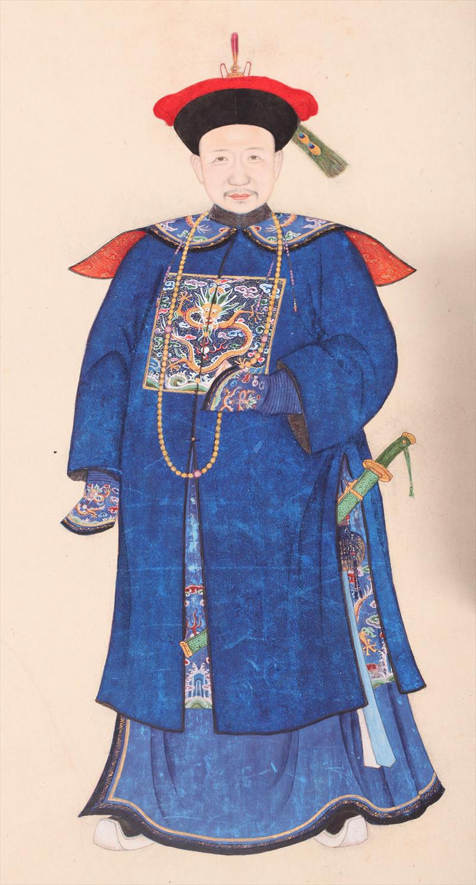
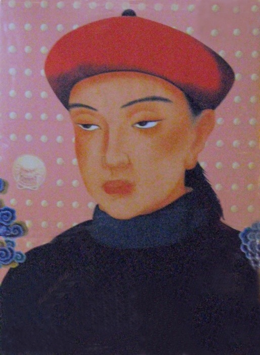
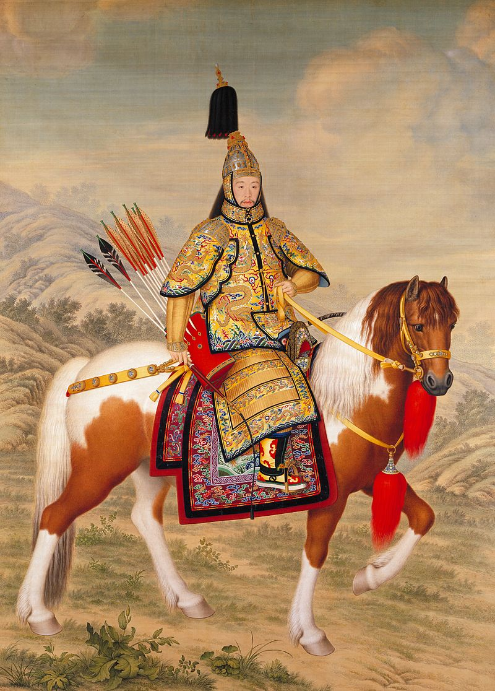
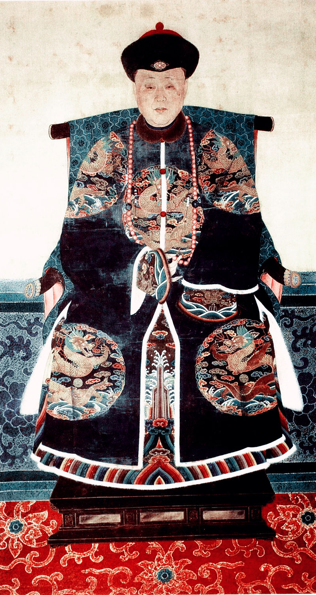
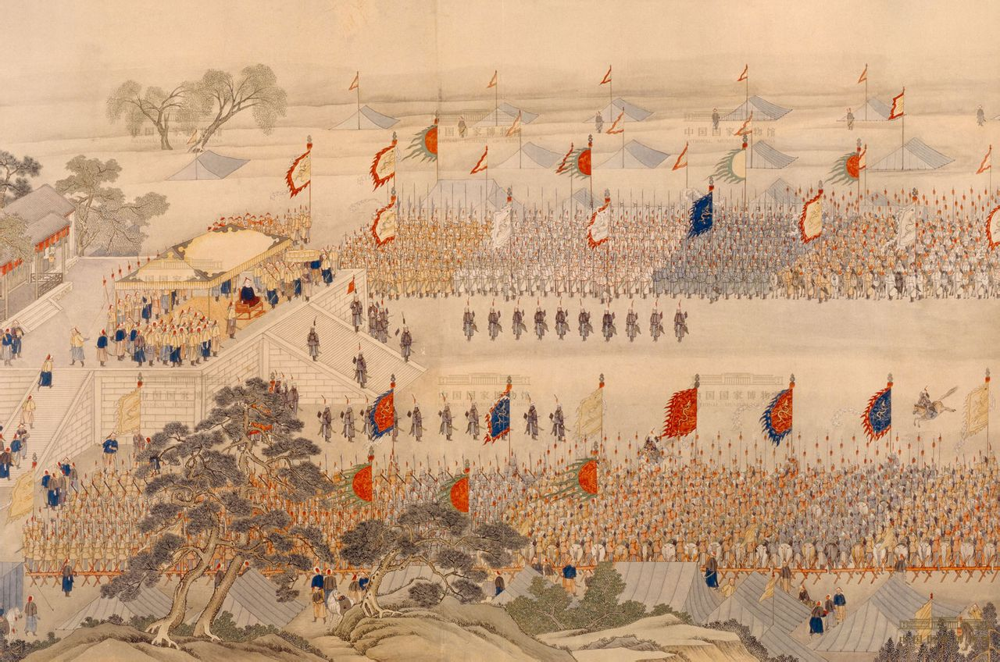
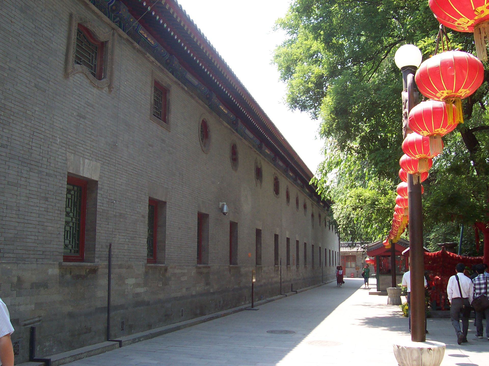
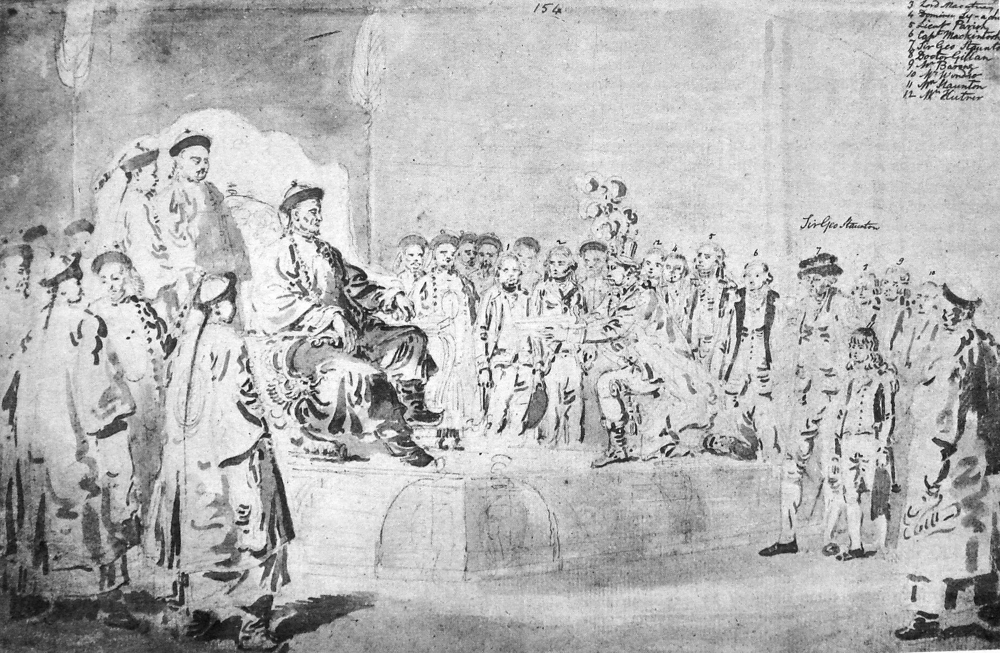
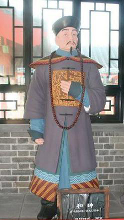

## nnnn姓名（资料）

适合所有人的历史读物。每天了解一个历史人物、积累一点历史知识。三观端正，绝不戏说，欢迎留言。  

### 成就特点

- ​
- ​

### 生平

【1799年2月22日】219年前的今天，打老虎起来的大老虎、世界首富和珅白绫自尽

和珅（1750年7月1日－1799年2月22日），著名的清朝贪官。

【改变人生的婚姻】

1750年7月1日（乾隆十五年），和珅出生于北京西城驴肉胡同，满洲正红旗人，父亲是福建副都统。3岁时，母亲难产去世，临终时产下弟弟和琳。9岁时，父亲因病去世，在刘全和偏房王氏的保护下，和珅兄弟才免于被赶出家门。

10岁，考上咸安宫官学，因为地位低微而备受欺凌。15岁得到资助，情况改善。和珅一表人才，精通四书五经，颇受老师器重。18岁，迎娶直隶总督的孙女冯氏，两人恩爱一生。

19岁，参加科举，名落孙山。只好以文生员，世袭三等轻车都尉世职。22岁，补授三等侍卫；25岁，升为乾清门侍卫，御前侍卫，兼授正蓝旗满洲副都统。1776年（26岁），任户部右侍郎、军机大臣上行走、总管内务府大臣、镶黄旗满洲副都统、国史馆副总裁、赏戴一品朝冠、赏赐紫禁城骑马，迅速飙升。

（少年和珅）

【逃过一劫的安明案】

1776年，一位叫安明的官员，想要升职，贿赂和珅。和珅拒绝贿赂，但向尚书推荐安明。于是，安明带和珅到处花天酒地，阿谀奉承，和珅十分快乐。但安明刚升职，父亲离世，按清朝体制，要回家守三年丧，安明便隐瞒下来。

但被户部尚书查出，上书弹劾和珅包庇安明。和珅得到消息，赶紧提前上奏，说自己失察，请求处罚，而不是蓄意包庇。乾隆将和珅降两级留用，安明凌迟处死，全家籍没。和珅逃过一劫。

（《乾隆大阅图》，郎世宁绘）

【打老虎的大老虎】

1780年（30岁），云贵总督李侍尧贪污，和珅奉旨前往云南查办。李侍尧手握军权，很有才干。和珅到了云南，表面上到处游山玩水，暗中拘审李侍尧的前管家，获得罪证。再传来李侍尧的重要属下，宣告罪证。李侍尧的力量被瓦解，只好低头认罪，押解京师，被判斩监候。

和珅立了大功，被乾隆提升为户部尚书，成为红人。李侍尧的一部分财产被和珅私吞，再加上乾隆的赏赐，和珅初尝权力和财富的游戏。1780年，5岁的长子丰绅殷德被乾隆赐婚，为十公主额驸。和珅更加显贵，百官争相巴结，曾对和珅百般羞辱的李侍尧，也成为和珅的党羽。

（乾隆的十公主：固伦和孝公主）

【千叟宴上的火锅】

1783年，乾隆帝在乾清宫办千叟宴，由内务府总管和珅与礼部尚书主办。和珅考虑到菜肴容易凉冷的问题，在下面用木炭加热，中间加上烟囱，也就是现在火锅的雏形。乾隆很高兴。

1784年（34岁），乾隆开始第六次南巡。在和珅的安排下，各府进献资金，国库未花一毛钱，便完成南巡的各种开支。乾隆非常欣赏和珅如此出众的理财能力，更为倚重。

不久，和珅就任四库全书馆正总裁，大兴文字狱，肆意打击政敌。同时，也控制了科举，垄断朝廷士子，培植私党。

（乾隆南巡图）

【权倾朝野的世界首富】

1788年，和珅将大部分朝中反对势力打倒，独揽大权。他的政治力量十分巨大，党羽遍及全国。弟弟和琳是大将军，掌控军权。

和珅还经营工商业，开设当铺七十五间，设大小银号三百多间，且和英国东印度公司、广东十三行有商业往来。是18世纪世界首富，超越了同时期的梅耶·罗斯柴尔德。

1790年，和珅创立议罪银制度，假如官员犯罪，可通过交纳一定的银两来免罪，收入进内务府库，供乾隆使用。

（和珅府邸恭王府的藏宝楼）

【乾隆身边的二皇帝】

1793年，英国特使马戛尔尼到达清朝。和珅和他6次会面，进行了一场有关礼仪之争的讨论。马戛尔尼拒绝行中国的三跪九叩之礼，而要“单膝跪地，执国王之手轻吻”的英国礼。和珅灵活处理了争议，但没有继续来往。

1796年，乾隆退居二线，嘉庆新登基为帝，再次由和珅主办，举办千叟宴。同年，弟弟和琳在战争中染病身亡。

1797年，领班军机大臣阿桂去世。乾隆帝老态龙钟，上朝时命令和珅和嘉庆分立两旁。但只有和珅才能听明白乾隆在说什么。所以每天上朝满朝文武三跪九叩后，和珅就等同摄政，许多人称他为“二皇帝”。而坐在一旁的嘉庆没有实权。

（马戛尔尼晋见乾隆）

【夜色月如水的白绫自尽】

1799年正月初三，乾隆驾崩。长年故作老态的刘墉突然上奏嘉庆帝，弹劾和珅贪污。嘉庆帝把和珅安排为首席治丧大臣，不准离开宫中，同时没收军权。初八，嘉庆宣布将和珅革职，逮捕入狱。

正月十一，嘉庆帝下旨抄家。两天后抄家完毕，公布和珅的二十条大罪，抄得白银八亿至十一亿两，等于当时清政府十五年收入，时人称“和珅跌倒，嘉庆吃饱”。大约折合现在300亿美元，和珅可说是当时的世界首富。

正月十八（2月22日），和珅在自己家以一条白绫自尽，享年49岁。

和珅作绝命诗一首：“夜色月如水，嗟而困不伸。百年原是梦，卅载枉费神。暗室难换算，墙高不见春。星辰环冷月，缧绁泣孤臣。对景伤前事，怀才误此身。余生料无几，空负九重仁。”

（和珅塑像）

