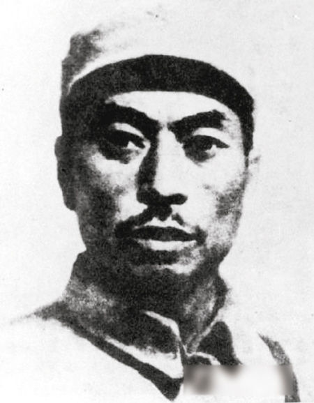
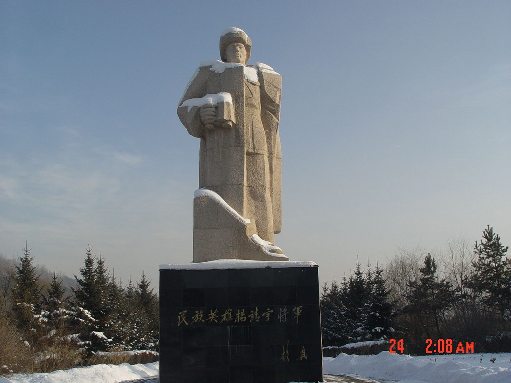
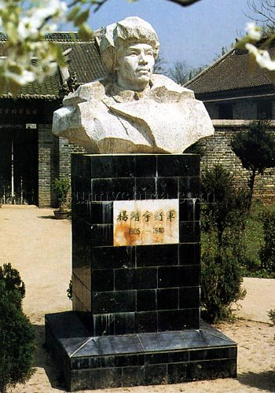
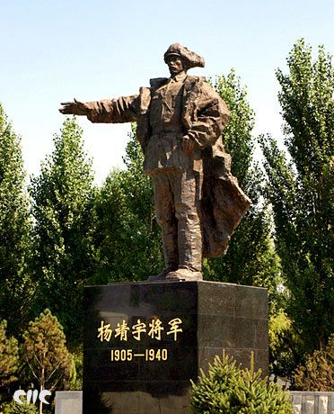
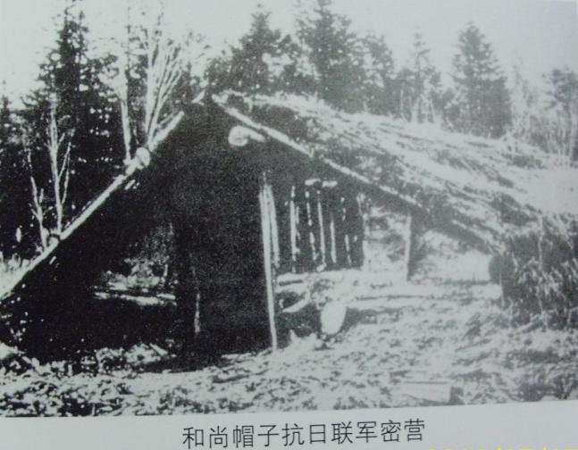
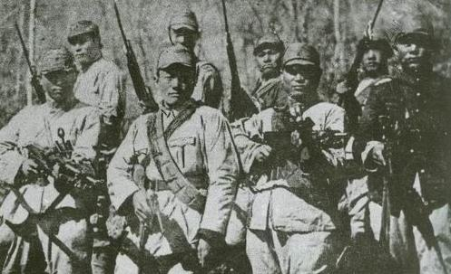
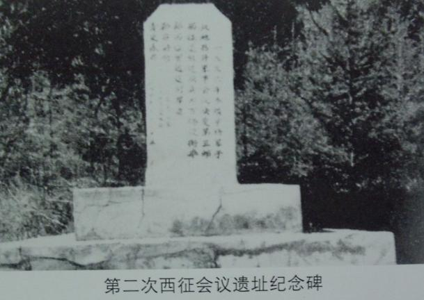
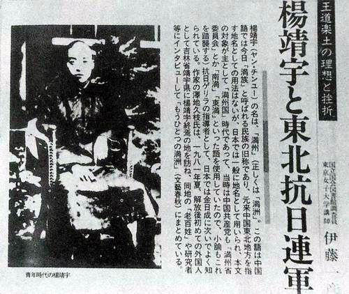
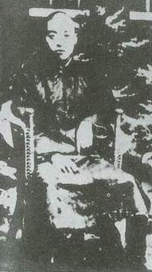
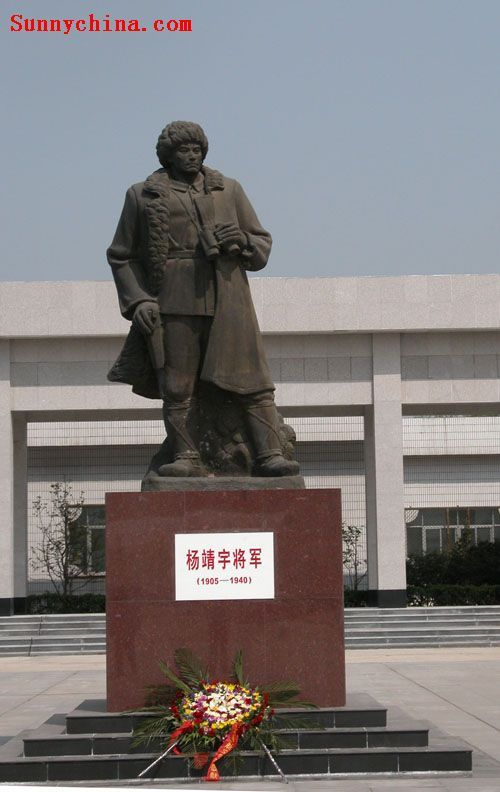

## nnnn姓名（资料）

适合所有人的历史读物。每天了解一个历史人物、积累一点历史知识。三观端正，绝不戏说，欢迎留言。  

### 成就特点

- ​
- ​

### 生平

【1940年2月23日】78年前的今天，日军砍下其头颅、又为其下葬的抗日将领杨靖宇牺牲

杨靖宇（1905年2月13日－1940年2月23日）东北抗联的最高领导人之一，是少数得到日军高度评价的中国军人。

【辍学闹革命的不孝子】

1905年2月13日，杨靖宇出生于今河南驻马店市驿城区（原确山县）的一个农民家庭，本名马尚德。4岁时，父亲病逝。8岁，入读私塾，15岁考入确山县县立高级小学。17岁，与来自汝南的农村姑娘结婚。

1923年（18岁），考入河南省立第一工业学校。受学校老师影响，接触到共产主义思想。1926年，儿子出生，马尚德辍学回家四处传播共产主义。母亲担心马尚德会闯大祸，但讲大道理又说不过他。

【只看了一眼的女儿】

1927年，加入中国共产党，在确山领导农民起义，成立中共的第一个县工农政权。起义失败后，马尚德被通缉，转而从事地下工作。1928年3月23日，女儿出生。5天后，马尚德回到家里，给女儿取名“马躲”，跟妻子告别说：“真是苦了你了。明天我要出远门，也许几年不回来，这个家就交给你了！”从此，再也没能回家。

1928年8月，马尚德被安排到开封和洛阳等地从事地下工作。1928年底，到上海参加第一期军政干部培训班，周恩来曾讲过课。

【大赦也不肯自首】

1929年3月，马尚德坐火车到沈阳，准备去苏联学习。7月，在满洲省委书记刘少奇的要求下，马尚德改名张贯一（取一贯忠诚之意），留下任中共抚顺特别支部书记，省委常委，组织抚顺煤矿的工人运动。

8月30日，张贯一因带领工人罢工，被日本煤矿上的两名持枪的日本警察抓捕。张贯一被逼供折磨，但始终否认是共产党员。12月，辽宁高等法院以反革命嫌疑罪对他起诉，判处有期徒刑一年半。1931年1月，张学良在东北实行大赦。张贯一仍然不承认，没有自首，不在赦免之列。

4月下旬，张贯一刑满出狱。张贯一出狱才3日，接触中共的外围组织互济会，结果再次被捕，与赵尚志都关押在同一监狱。

【抗日联军的总司令】

918事变发生后，11月张贯一经组织营救出狱，任中共哈尔滨市委书记。1932年，他不再做地下工作，担任满洲省委军委代理书记，改名杨靖宇，朝鲜话“驱除外敌”的意思。

1932年秋，杨靖宇创建中国工农红军第32军南满游击队，任政委，并建立游击根据地。1933年9月，组成东北人民革命军第一独立师，任师长兼政委。1934年4月，他联合17支抗日武装，成立抗日联合军总指挥部，任总指挥。

1936年，多支抗日部队组成东北抗日联军，他任第一路军总司令兼政委。抗联组织游击战，取得了不少胜利，牵制了大量日军，当时有“南有杨靖宇，北有赵尚志”的说法。

（杨靖宇领导的抗联第一路军警卫旅部分官兵）

【不去苏联留下艰苦作战】

1937年七七事变后，关东军司令部制定了三年消灭抗联的“肃整计划”。日军集结了5万兵力，进行“三江省大讨伐”。东北抗日联军第2路军和第3路军，被迫西征，朝苏联方向败退。

杨靖宇选择了留下艰苦作战，转战长白山区。可是迫于日军压力，许多抗日武装大多瓦解或投敌，到1940年，抗日联军只剩下不到1000人。

1940年，杨靖宇所率部队在蒙江县（今靖宇县）被日军围困。因被叛徒出卖，他所率的60多人被发现。杨靖宇断粮5日，坚持作战。1940年2月23日，杨靖宇孤身一人，与日伪军交战20分钟，身中数弹英勇牺牲。

【赢得对手的尊敬】

杨靖宇的遗体运到县城，经叛徒确认后，将他的头颅用铡刀铡下。经医生解剖，他的胃肠里一粒粮食也没有，只有未能消化的草根、树皮和棉絮。在场的日军都觉得不可思议，非常敬佩。

3月5日，蒙江县警务厅长岸古隆一郎，请人雕刻一颗假的头颅，搭建起祭祀灵棚，为杨靖宇主祭安葬。安葬仪式按日本习俗，用榆木做碑，请来一位日本僧人礼拜念经。

杨靖宇的头颅装在一个安有玻璃的木箱里，运到通化省城，在各学校、街道示众，之后送到满洲国首都长春，存放在日本关东军司令部医务课，装在盛满福尔马林药水的玻璃缸内。

（日本人打死杨靖宇之后为其拍照以验明正身）

【头颅可断腹可剖的英雄】

1946年，东北民主联军通化支队改名为杨靖宇支队，濛江县改名为靖宇县。1948年10月19日，长春解放。中共地下工作者获取头颅，并护送至哈尔滨市，存放于东北烈士纪念馆中。

1957年9月25，在通化举行万人公祭大会，将杨靖宇的遗首与遗骨，合葬于杨靖宇烈士陵园。朱德题词：“人民英雄杨靖宇同志永垂不朽”。郭沫若赋诗：“头颅可断腹可剖，烈忾难消志不磨，碧血青篙两千古，于今赤饰满山河”。

杨靖宇去世后，没有人知道他的身世，只知道原名马尚德。马尚德的家人，也不知道杨靖宇就是自己的亲人。直到1951年，调查组找出杨靖宇离家前留下的唯一照片，才得以确认。此时，马尚德的妻子在等待了18年已经于1945年病故。

（20岁出头的马尚德，摄于1926年。这是马尚德留给家里人唯一的照片）

【】

### 照片

