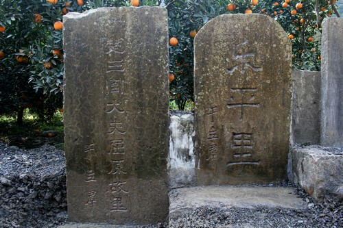
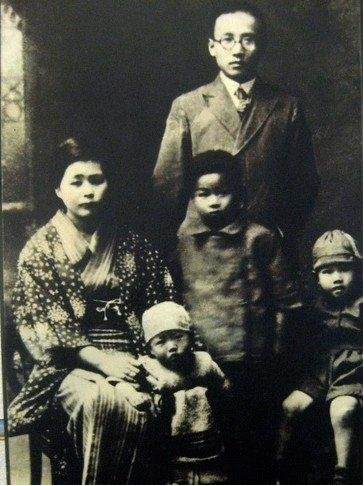
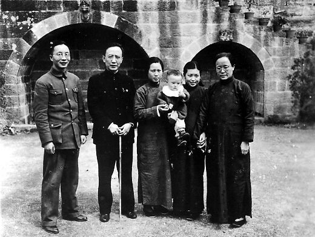
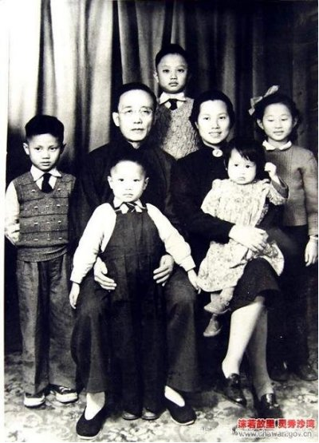
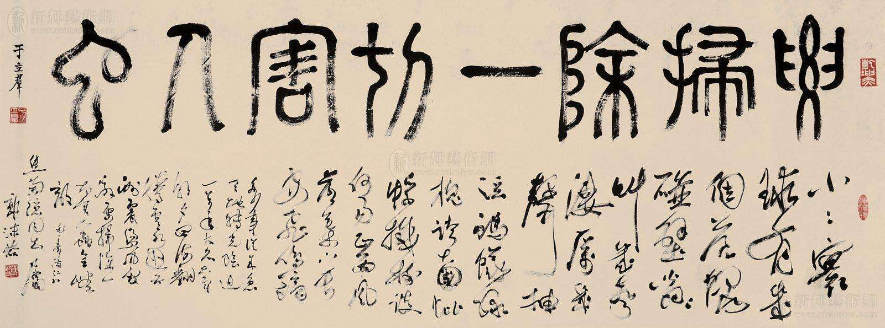
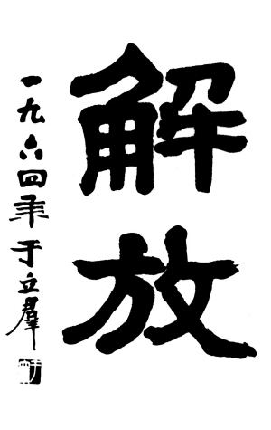
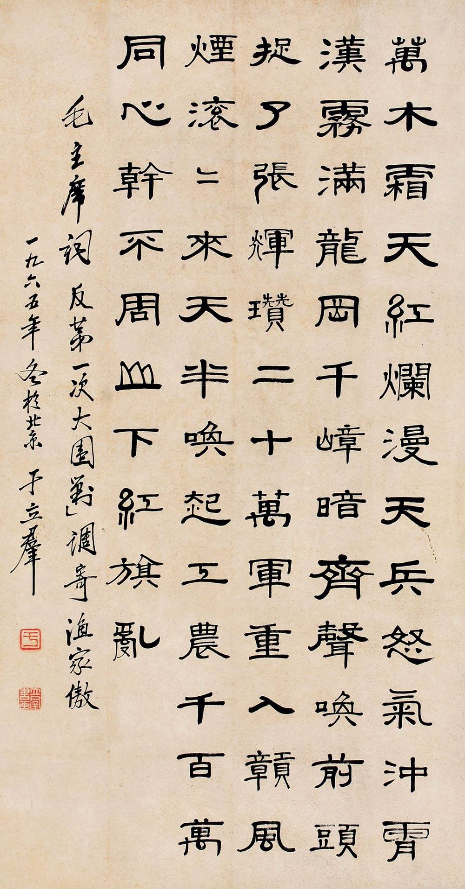

## nnnn姓名（资料）

适合所有人的历史读物。每天了解一个历史人物、积累一点历史知识。三观端正，绝不戏说，欢迎留言。  

### 成就特点

- ​
- ​

### 生平

【1979年2月25日】39年前的今天，姐妹都痴情郭沫若的书法家于立群自缢而亡

（1930年代，在上海拍摄的于立群）

于立群（1916年－1979年2月25日），今广西贺州人，郭沫若的妻子，演员、书法家。

【衰落的名门之后】

1916年，于立群出生于北京，祖籍今广西贺州人。她的爷爷是清朝同治年间的“榜眼”，长期任李鸿章幕僚，官至从一品。她爷爷笃信佛教，没有结婚，于是将侄子收为养子，也就是于立群的父亲。于立群的母亲是两广总督的女儿，一共生育了五女一男，于立群排行第三。

民国后，于家逐渐衰落。母亲带着最小的一子一女，迁居上海的娘家。父亲无正当职业，靠遗产与于立群姐妹四人一同生活。幸好，于立群的大姐于佩琛（于立忱）书法很好，长得也漂亮，每逢春节代人写春联，补充家用。

（于立群的碑文手迹）

【自缢的姐姐与郭沫若】

1930年，于家生活日益困难，14岁的于立群到上海投靠母亲。不久，于立群考入上海明月歌舞剧社，后又进入上海电影学校，艺名黎明健，成为颇有名气的演员。

大姐于佩琛则考入国立北平师范大学后，非常活跃，善演话剧。大三时，她的共产党党员身份遭国民党特务发现，一度被捕。获释后，受《大公报》社长张季鸾的青睐，聘请到该报任职。

1934年，于佩琛患肺病，《大公报》派她到日本治病，兼任驻东京特派记者。在日本期间，她与流亡日本的郭沫若，一见钟情，来往频繁。郭沫若的日本妻子郭安娜，对此十分不安。1937年初，于佩琛回到上海，5月因疾病和忧郁困扰，自缢身亡。

（郭沫若与日本妻子安娜及孩子）

【相差24岁的婚姻】

1937年，郭沫若从日本回到上海，于立群将姐姐写的情诗交给郭沫若，两人相识。因抗战爆发，郭沫若与夏衍在上海创办的《救亡日报》，先后迁到广州、桂林。于立群加入中共地下党员，在报社担任编辑，与郭沫若感情渐深。

1938年，郭沫若赴武汉任国民政府军委政治部第三厅厅长，原本打算去延安的于立群，将行李搬到郭沫若租住的新亚酒楼，两人开始同居。随着，日军攻占武汉、广州，于立群跟随郭沫若一同来到重庆。

1939年1月，周恩来在重庆主持了于立群（23岁）与郭沫若（47岁）的婚礼。婚后，于立群就成为郭沫若的秘书。

、于立群(右二)、郁风(右一)在广州合影.png)

（1938年1月，郭沫若与《救亡日报》同事合影，左3为于立群）

（1940年，郭沫若（左2）、于立群（左3）在重庆张家花园）

【儿子、丈夫和自己】

中华人民共和国成立后，于立群曾任中华全国妇女联合会执委、第四、五届全国人大代表。她身体状况一度堪忧，患有严重的神经官能症，长期同郭沫若及子女分开，在外地医院静养。

文化大革命爆发后，1967年，在中国音乐学院的儿子郭民英自杀。1968年，在北京大学的儿子郭世英被红卫兵殴打致死。于立群悲痛欲绝，精神严重受创。

1974年，郭沫若遭打击，一年连住7次医院，于立群也多次住院。1978年6月12日，郭沫若逝世。半年后，1979年2月25日，于立群自缢身亡，享年63岁。

（1948年，郭沫若与于立群及子女在香港合影）

（1962年，郭沫若与于立群夫妇合影）

【颇有建树的书法家】

于立群一生喜爱书法，尤擅长颜体与隶书，擅写大字。她与郭沫若共育有六个子女，四儿二女。

（于立群与郭沫若合作书法：要扫除一切害人虫）

