## nnnn姓名（资料）

适合所有人的历史读物。每天了解一个历史人物、积累一点历史知识。三观端正，绝不戏说，欢迎留言。  

### 成就特点

- ​
- ​

### 生平

【1982年2月26日】36年前的今天，捐献无数顶级国宝的民间收藏第一人张伯驹逝世

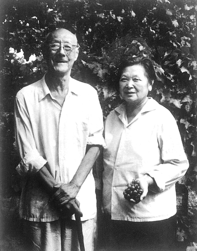

（张伯驹夫妇合影）

【显赫的民国四公子】

1898年，张伯驹出生，祖籍河南项城。幼年过继给伯父、清末直隶总督及河南都督张镇芳。袁世凯也是他表叔。19岁，考入中央陆军混成模范团骑科，毕业后先后在军阀曹锟、吴佩孚、张作霖等部任职。时人称为民国四公子之一。

1927年（29岁），退出军界，投身金融界，历任盐业银行经理、常务董事等职，积累了丰厚的财富。

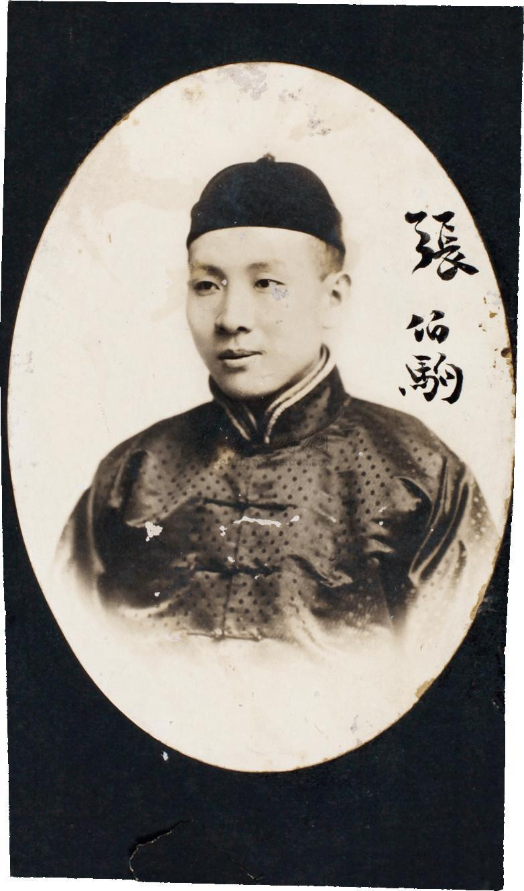

（年轻时的张伯驹）

【艺坛最后一次绝唱】

在公务之余，张伯驹常常写诗、填词，对戏剧、书法非常喜爱。1930年，与李石曾、齐如山、梅兰芳等人组织了“国剧学会”。

1937年，张伯驹40岁生日，他组织一大帮名角，举办了轰动全国的河南旱灾筹款义演《失空斩》。其中，张伯驹饰孔明、余叔岩饰王平、杨小楼饰马谡、王凤卿饰赵云、程继仙饰马岱、陈香雪饰司马懿、钱宝森饰张郃。演出后不久，抗日战争爆发。这次义演，被称为“艺坛最后一次绝唱”。

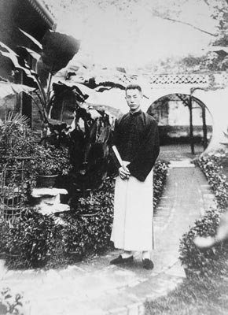

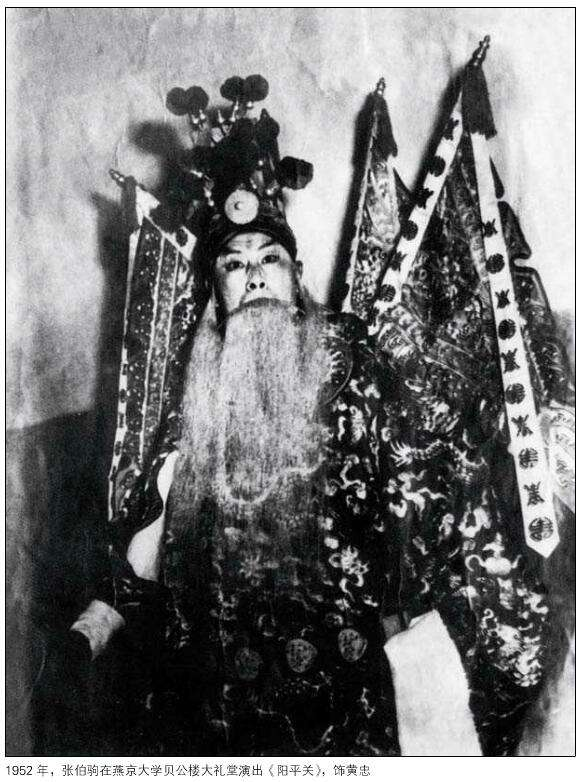

【变卖家产收藏国宝】

张伯驹也热衷于收藏文物，收藏大量中国字画。

张伯驹最早是在湖北一次赈灾书画会上见到《平复帖》的，当时所有者是道光皇帝的曾孙溥儒（溥心畲）。1936年，溥儒将所藏的唐代韩干的《照夜白图》卖出，流落海外。这件事情让张伯驹久久不能释怀。

张伯驹深恐《平复帖》蹈此覆辙，委托琉璃厂一家老板代为求购，但溥儒索价20万元，未能成交。第二年，又请张大千代为求购，同样未成。后来，偶然得知溥儒丧母，急需钱财，经傅增湘斡旋，以4万元购得。张伯驹后来得知，有日本人也打算购买《平复帖》。

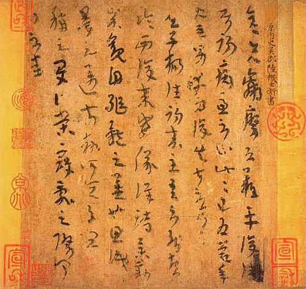

（国宝：陆机《平复帖》）

【不卖国宝的绑架案】

1941年6月，盐业银行副经理勾结汪精卫政权76号特务组织，在上海绑架张伯驹，勒索赎金200万（一说200根金条）。当时，最简单可行的办法是变卖字画，拿钱赎人。但张伯驹暗示家人，不可以变卖国宝。

于是，僵持了近八个月，张伯驹冒着可能被“撕票”的危险，也不肯变卖藏品。直到绑匪妥协，将赎金下降到40万，张家人经多方筹借，才将张伯驹救出。

是年秋，全家迁居内地，家人将国宝《平复帖》缝入被套中带走。

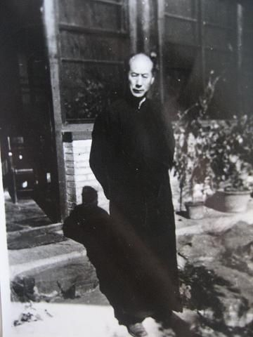

【没有股票的盐业银行董事】

抗战胜利后，曾任河北省政府顾问、故宫博物院专门委员等职。1947年6月，加入中国民主同盟。

1949年以后，盐业银行公私合营，张伯驹以董事身份参与财产评估后，以个人无股票不能再任董事为由，退出了公私合营银行。

1952年，经郑振铎推荐任文化部顾问。

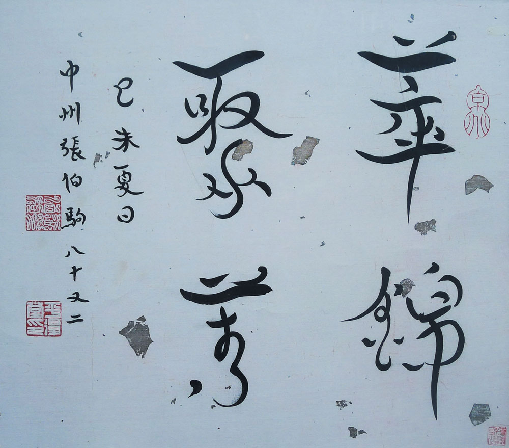

（张伯驹独创的鸟羽体书法：萃锦聚箐）

【捐给国家8件顶级国宝】

1956年，张伯驹将其收藏的部分文物捐给了国家，包括西晋陆机《平复帖》、隋展子虔《游春图》、唐李白《上阳台帖》、杜牧《赠张好好诗》、宋范仲淹《道服赞》、蔡襄《自书诗帖》、黄庭坚《诸上座帖》、元赵孟頫《千字文》等。每一件都是价值连城的顶级国宝。

1956年7月，时任文化部部长茅盾亲笔为张伯驹颁发了褒奖令。

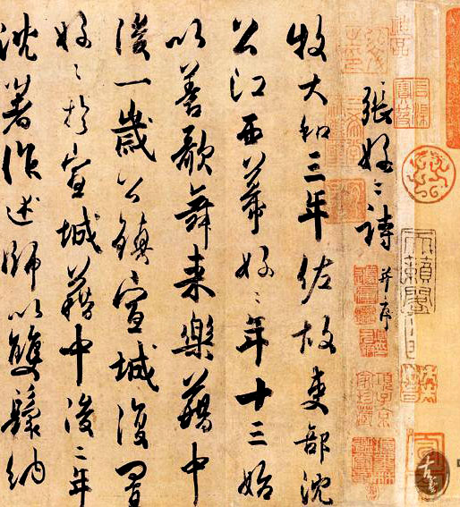

（唐杜牧《张好好诗》）

（宋范仲淹《道服赞》）

《平复帖》为西晋大文人陆机手书真迹，距今已有近1700年，是现今传世墨迹中的“开篇鼻祖”。它长不足一尺，只有9行字，盖满了历代名家的收藏章记，朱印累累，满纸生辉，被收藏界尊为 “中华第一帖”。

《游春图》为隋代大画家展子虔所绘，距今1400多年，被认为是中国现存最早的一幅画作，历代书画界都将其奉为绝无仅有的极品，称它是“国宝中的国宝”。

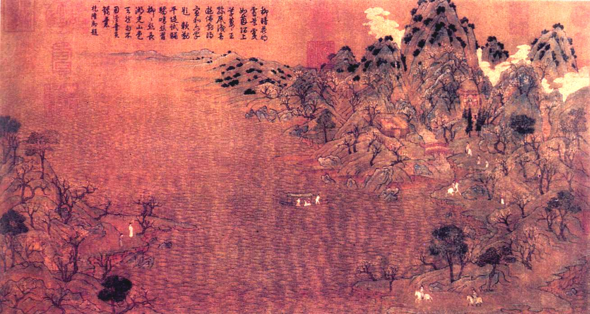

（隋展子虔《游春图》）

《上阳台帖》是李白所书四言诗：“山高水长，物象千万，非有老笔，清壮可穷。十八日，上阳台书，太白。”这是李白传世的唯一书迹。

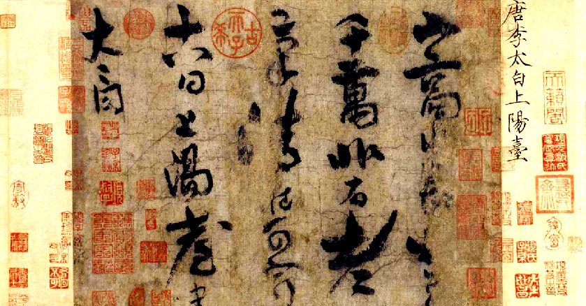

（唐李白《上阳台帖》）

【不能住单人病房的老头】

1958年，张伯驹划为右派分子。1961年，在陈毅的干预下，张伯驹夫妇到吉林省博物馆工作。文革期间，张伯驹被批斗、抄家、隔离审查，送往吉林舒兰县插队，因年龄太大遭公社拒收。夫妻俩只好回到北京，靠亲友接济勉强度日。

1972年，在周恩来的指示下，张伯驹被聘任为中央文史研究馆馆员。1980年，张伯驹获得平反，恢复名誉。

1982年正月，赴宴归来的张伯驹突患感冒，被送进北大医院，因“级别不够”不能住单人病房，只能和七八位病人挤在一个病房。不时有重病号抬进来，死人被拉出去，心绪不安的张伯驹要求回家。2月26日，张伯驹不幸离开人世，终年84岁。

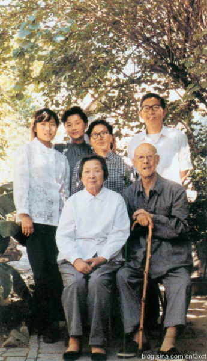

（1981年，张伯驹、潘素与女儿一家合影）

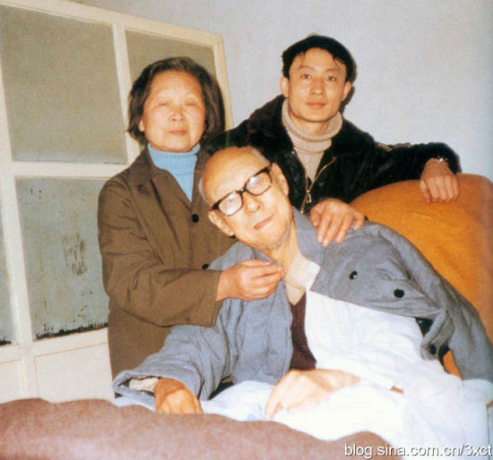

（1982年2月25日，张伯驹最后的合影）

