## nnnn姓名（资料）

适合所有人的历史读物。每天了解一个历史人物、积累一点历史知识。三观端正，绝不戏说，欢迎留言。  

### 成就特点

- ​
- ​

### 生平

【1903年2月27日】115年前的今天，曾救过蒋介石的共和国大将、黄埔三杰之一陈赓出生

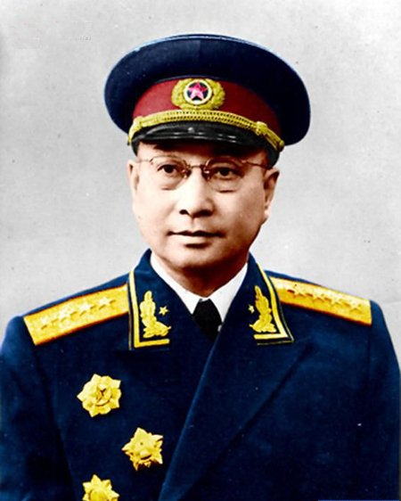

陈赓（1903年2月27日－1961年3月16日），湖南湘乡人。黄埔军校三杰之一，曾救过蒋介石。参加南昌起义，长征、抗日战争、淮海战役、渡江战役，攻下华中、华南、西南直至云南全境，并支援越南胡志明抗击法国。1951年，任志愿军副司令指挥抗美援朝战争。1955年，被授予共和国大将军衔。

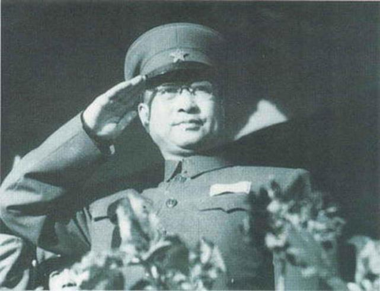

【救过蒋介石的黄埔三杰】

1903年2月27日，陈赓出生于湖南湘乡。祖父是湘军将领，曾参加平定太平天国、收复新疆、甲午战争等，官至从二品武显将军。陈赓14岁读完小学后，就加入湘军鲁涤平部，开始从军。

1922年（19岁），加入中国共产党。1924年5月，与同乡宋希濂一起考入黄埔军校，成为第一期学生，被誉为“黄埔三杰”之一。曾担任孙中山的侍卫，平定广州商团暴动。

1925年，参加了东征陈炯明的战斗，并任蒋介石侍卫参谋，期间曾经救过蒋介石。1926年，参加国民革命军誓师北伐。不久，被派往苏联学习，次年回国在第2方面军任特务营营长。

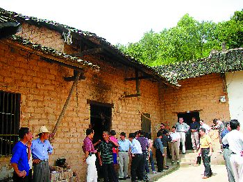

（陈赓故居）

【两度在上海遇险】

1927年8月1日（24岁），陈赓参加南昌起义，在会昌战斗中负伤，被送往上海秘密治疗。此后留在上海，在周恩来领导下负责中共中央特科工作。

1931年，因顾顺章被捕，陈赓被迫离开上海，赴鄂豫皖苏区。11月，红四方面军成立，陈赓任第12师师长，率部参加鄂豫皖苏区的第三次反围剿战争。1932年，在战斗中右腿负伤，再赴上海治疗。

1933年（30岁），在上海被捕。因曾对蒋介石有救命之恩，没有执行枪毙。此后，在宋庆龄等人帮助下，营救出狱，被调往中央苏区，任彭杨步兵学校校长。

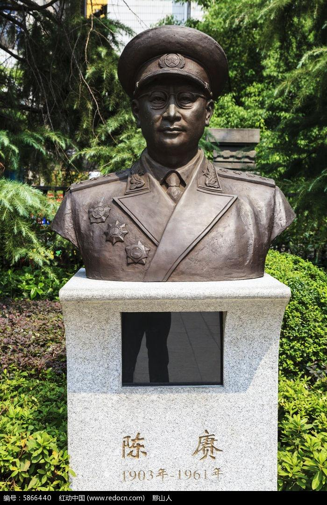

（八一南昌起义纪念馆的陈赓塑像）

【在山西抗日的司令员】

1934年10月，陈赓随中央红军主力长征，任红军干部团团长，掩护中央军委强渡乌江、攻占遵义城等。

1935年底，任红军第1师师长。1936年3月，红军东征，陈赓率部进军山西，转战同蒲铁路沿线。6月，返回陕西西征，攻占甘肃、宁夏等地。1937年2月，进延安抗日军政大学学习。

1937年，西安事变和平解决，第二次国共合作开始，陈赓任八路军第129师第386旅旅长。10月，率部渡黄河进入山西抗击日军。1939年，成立太岳军区（山西中南部），陈赓任军区司令员。9月，参加百团大战。

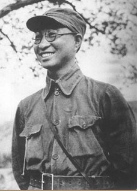

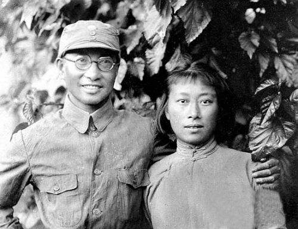

（陈赓及夫人傅涯）

【保卫延安的主力】

1945年8月，日本宣布无条件投降。9月，陈赓率部参加上党战役，该部队共歼灭国军1万4千余人，活捉国军第19军军长。

1946年7月，陈赓与谢富治配合，全歼胡宗南部第31旅。8月，全歼国军第39师、第69师共一万余人。9月底，在临浮战役中，全歼胡宗南部精锐部队、号称“天下第一旅”的国民革命军第1军第1师第1旅，活捉旅长黄正诚。

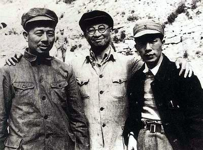

【所向无敌的挥师南下】

1947年7月，组成陈谢兵团，南下黄河进入河南。8月，截断陇海铁路。年底，配合华东野战军出击平汉线。1948年，两次易手后，最终占领河南洛阳。10月，率部占领郑州。11月，参加淮海战役，全歼国军第12兵团。

1949年1月，任第二野战军第4兵团司令员。4月22日，渡江战役爆发，陈赓率部在九江以东突破国军长江防线，进入江西、福建。5月22日，攻占江西省会南昌。陈赓兵团经赣州南进，于10月占领广东省会广州。年底，陈赓兵团协同第四野战军在雷州半岛附近作战，全歼国民党军队共十六万余人。

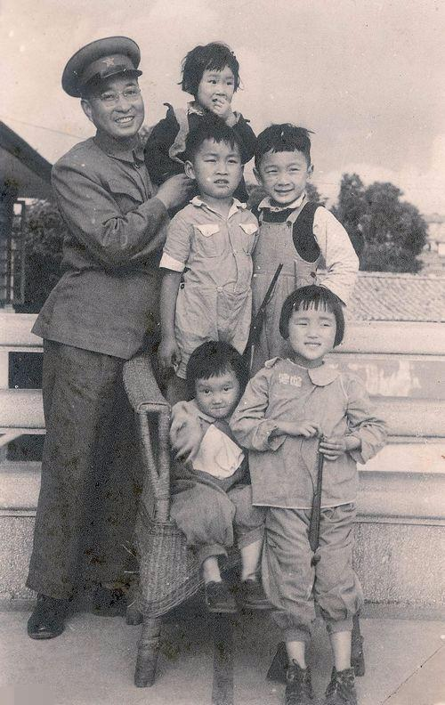

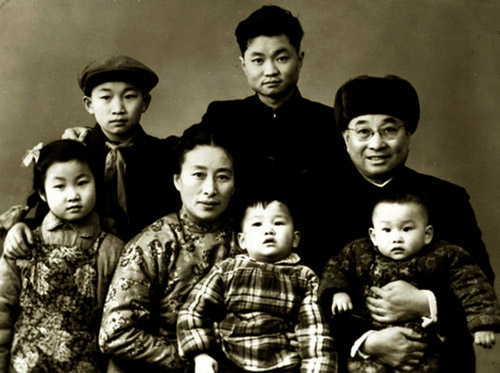

【支援越南和朝鲜】

1950年1月，陈赓率部进入云南，全歼滇南国军第8军、第26军，共两万余人。陈赓任西南军区副司令员，云南省人民政府主席，攻占西昌，之后担任云南军区司令员。7月，前往越南，与越南主席胡志明就法越战争会面。之后，陈赓部署越共部队，于9月发动边界战役，歼灭法国部队八千余人。

1951年4月，陈赓担任人民志愿军副司令员、第3兵团司令员赴朝作战，并获朝鲜一级独立自由勋章。

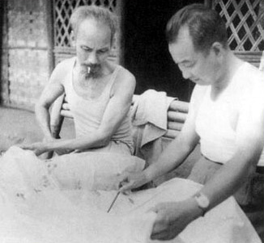

（1950年，陈赓与越南胡志明部署行动计划）

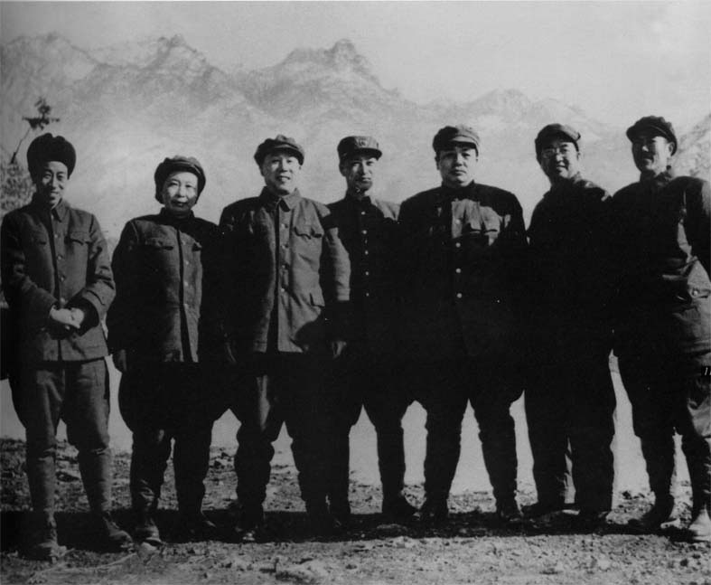

（1951年，陈赓和彭德怀等人在朝鲜合影）

【病逝上海的共和国大将】

1952年7月，调任中国人民解放军军事工程学院院长，负责培养军事工程师，直到逝世。1954年10月，担任中国人民解放军副总参谋长。1955年，被授予中国人民解放军大将军衔。

1958年，出任中华人民共和国国防部副部长。1961年3月16日，因心脏病，陈赓于上海病逝，葬于八宝山。2011年3月16日，陈赓逝世50周年，后人将陈赓夫妇的骨灰从北京八宝山革命公墓迁出，接回故乡安装。

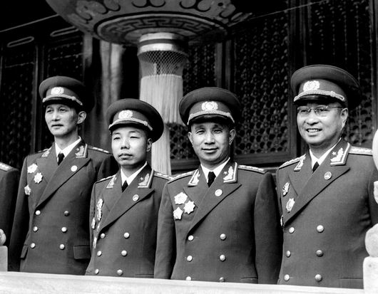

（1955年，国庆节陈赓与粟裕等在天安门城楼上）

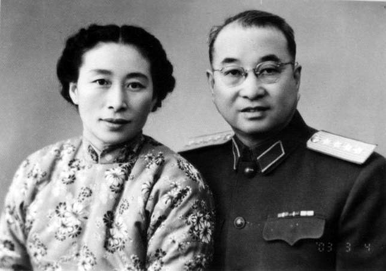

（陈赓与夫人傅涯）

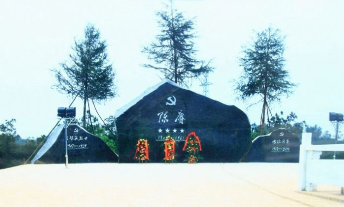

（2011年，陈赓迁葬湖南湘乡）

