## nnnn姓名（资料）

适合所有人的历史读物。每天了解一个历史人物、积累一点历史知识。三观端正，绝不戏说，欢迎留言。  

### 成就特点

- ​
- ​

### 生平

溥杰小传：两段婚姻，不一样的开始，不一样的结局

【1994年2月28日】24年前的今天，差点搞出中日混血皇帝的末代皇弟溥杰病逝

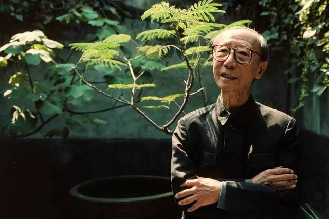

溥杰（1907年4月16日－1994年2月28日），清朝末代皇帝溥仪的胞弟。

【不美满的亲上加亲】

1907年4月16日，溥杰出生，父亲是醇亲王载沣，哥哥是末代皇帝溥仪。1924年，17岁的溥杰与满族女子唐怡莹成婚，她是珍妃和瑾妃的侄女，亲上加亲。

然而，婚后夫妇关系不和睦。1926年，唐怡莹成为张学良的情妇。1928年，北伐军进入北京前夕，载沣全家由张学良安排，赴天津租界避难，溥杰夫妇就住在张学良小妾的公馆中。傅杰被鼓动秘密前往奉天（沈阳）讲武堂求学，溥仪知道后，通过日本警察在大连将他扣留，送返天津。

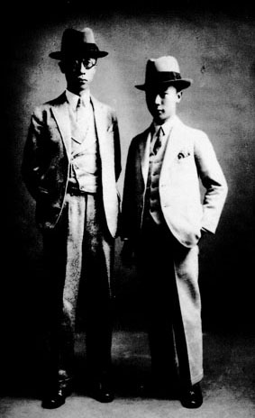

（溥杰与溥仪的合影）

【不顺利的离婚争议】

1929年3月，溥仪安排溥杰到日本学习军事，另起名金秉藩。他到日本东京学习院、日本陆军士官学校学习。溥杰在日本读书期间，唐怡莹又成为皖系军阀卢永祥之子卢筱嘉的情妇，并将北平醇亲王府的大批财物盗走。随后两人分居，陷入长期离婚争议中。

1935年，溥杰回到满洲国，任满洲国宫内府侍从武官。溥仪曾为其物色了一满族女子王敏彤，但最终未能成婚。

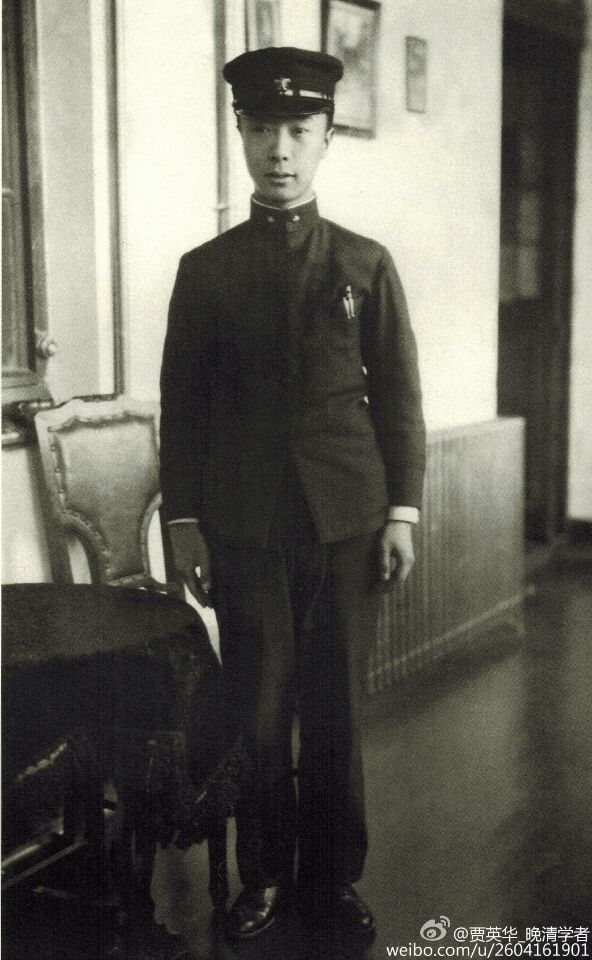

（溥杰的青年照）

【中日混血皇帝的阴谋】

因为溥仪无后，日本军方为溥杰物色了一名日本妻子：日本华族女子嵯峨浩。1937年4月3日，两人在东京结婚。数日后，溥仪新娶谭玉龄，但与此前所娶婉容、文绣一样，没有生育子女。

同年，满洲国国务院通过《帝位继承法》，规定：皇帝死后由子继之，如无子则由孙继之，如无子无孙则由弟继之，如无弟则由弟之子继之。但是，溥杰与嵯峨浩在1938年、1940年先后生下了两个女儿，也没能留下有日本血统的儿子。

另有说法则认为，日方并未承认溥杰“帝族”身份，他无权继承满洲国帝位。另根据1937年溥仪与日本关东军司令签署的备忘录规定，满洲国皇位继承人由日本天皇选定，溥仪无权干涉。

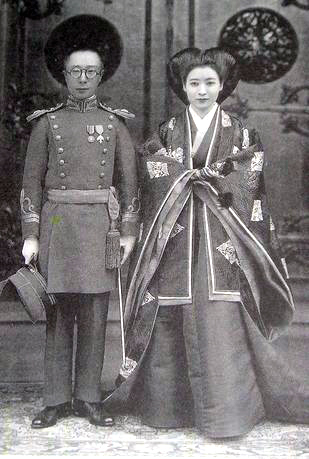

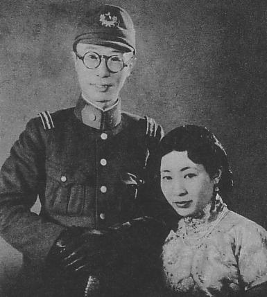

【不得已的夫妻分离】

1943年，溥杰进入日本陆军大学学习，成为唯一一位从日本陆军大学毕业的中国人。1945年8月，日本投降，苏联红军进入东北，满洲国灭亡。溥杰和溥仪逃到沈阳，打算乘飞机前往日本，在机场被苏联军队俘虏，被押到苏联拘留了5年。1950年8月，被移交给中华人民共和国政府羁押，关押在抚顺战犯管理所。

而嵯峨浩被八路军关押，辗转长春、、吉林、延吉、佳木斯，1946年7月被释放。本打算由陆路经朝鲜，再转海路回到日本。但途中被国军抓到，送往上海。在上海得到日本人的营救，回到日本。

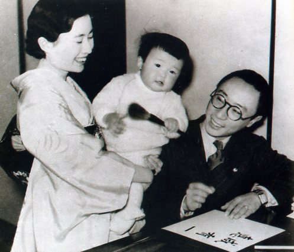

【爱女的天城山心中】

1957年12月10日，长女慧生在日本伊豆半岛天城山遭枪击身亡，现场有另一名男大学生的尸体。被发现时，慧生头上有弹孔，左手无名指上戴著婚戒，枕在男生的左臂上。两人还有剪下的指甲与头发被包在白纸里，埋在附近。于是判定这是一起殉情事件。

但母方的嵯峨家，认为慧生并不爱该男生，应该是被胁迫而死。这个案件，后来被称为“天城山心中”，甚至被拍成爱情电影。日语的「心中」是男女一齐殉情自杀的意思。

溥杰听闻噩耗，伤心欲绝，写下哭女三首：“呜呼慧儿！吾为汝父，负汝实深。死者已矣，生者何堪？有母飘零；有妹无告，罪咸在我，苦汝深矣！负汝深矣！！呜呼慧儿，偏有此父。已矣已矣，恨何有极！！！”

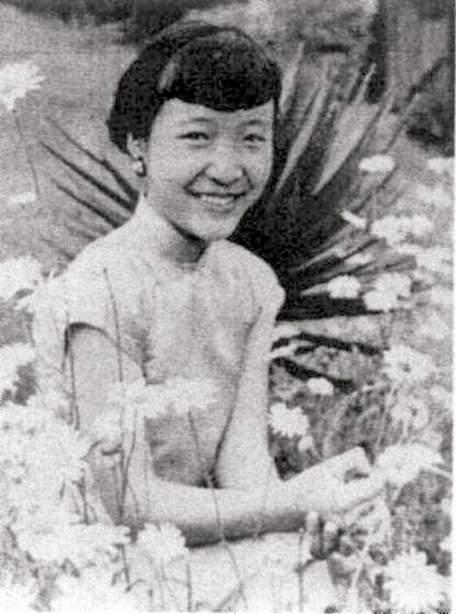

（爱新觉罗·慧生）

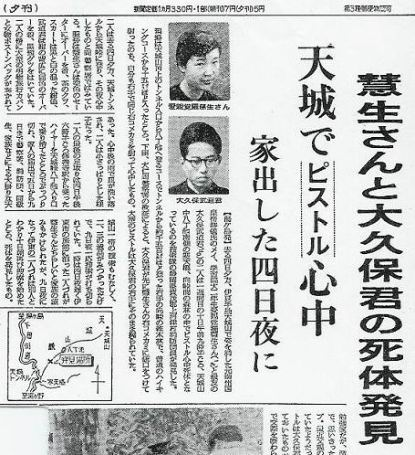

（日本报纸对天城山心中的报道）

【16年后夫妻重聚首】

1960年，溥杰获得特赦。周恩来主张把嵯峨浩从日本接过来。1961年5月12日，嵯峨浩自东京经香港，到达广州与溥杰团聚。随后，嵯峨浩加入中华人民共和国国籍。

文化大革命期间，受到的干扰较小，只是从日本带来的照相机被红卫兵给抄走。1987年6月20日，嵯峨浩病逝于北京，享寿73岁。

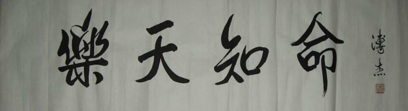

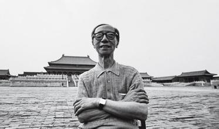

（溥杰重回故宫）

【一半中国一半日本】

80年代后，溥杰任全国人民代表大会常务委员会委员。1988年3月至4月，在七届人大一次会议上，溥杰对其中一项议案提出了不同意见，表决时，他坐在主席台上，高高地举起右手，投了引人注目的唯一一张反对票！

1994年2月28日，因病于北京逝世，享年87岁。死后骨灰一半葬于日本山口县下关市中山神社（嵯峨家的神社）的爱新觉罗分社内，另一半葬于北京。

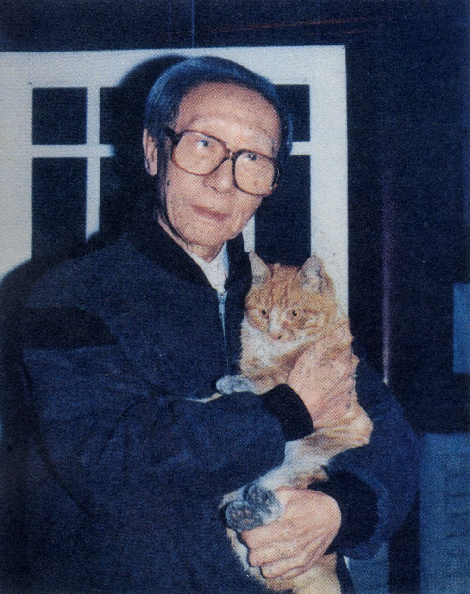

### 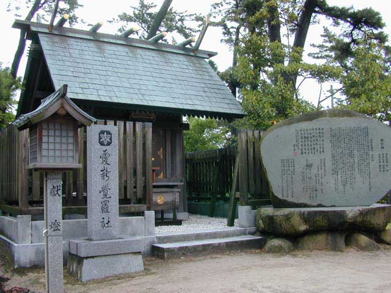

（在日本的爱新觉罗神社）

