## nnnn姓名（资料）

适合所有人的历史读物。每天了解一个历史人物、积累一点历史知识。三观端正，绝不戏说，欢迎留言。  

### 成就特点

- ​
- ​

### 生平

【1932年3月1日】86年前的今天，中国的东北、曾经的亚洲第一强国伪满洲国宣布建国

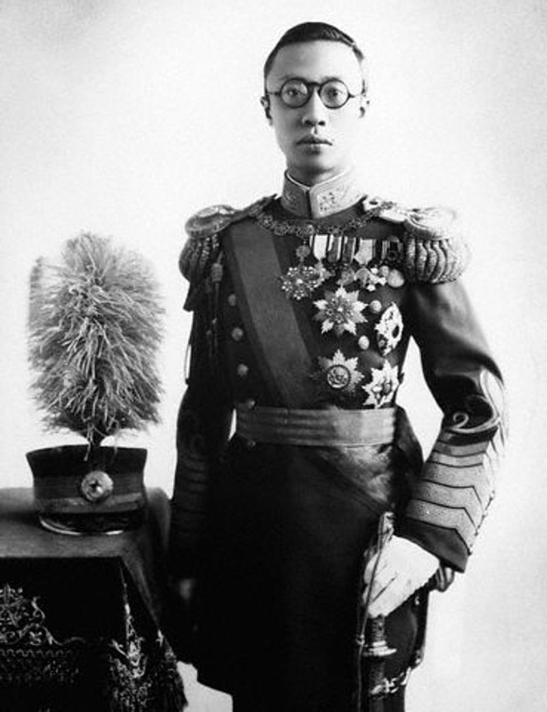

伪满洲国（1932年3月1日－1945年8月18日），日本在九一八事变后，占领了中国东北（满洲），以清朝逊帝溥仪为元首，建立共和制的满洲国。两年后，1934年改为帝制，溥仪称皇帝，国号满洲帝国。1945年8月，日本投降，苏联红军攻入满洲。8月17日午夜至18日凌晨，溥仪在通化临江县举行退位仪式，宣读《退位诏书》，历经13年的满洲国正式灭亡。

满洲国得到日本的大力投资，一度经济强大，甚至超过了陷入二战的日本本土，成为亚洲第一强国。到1945年，满洲国共得到23个国家的承认，包括苏联、不少东欧国家。但中华民国和中华人民共和国都不予承认，称之为“伪满洲国”。

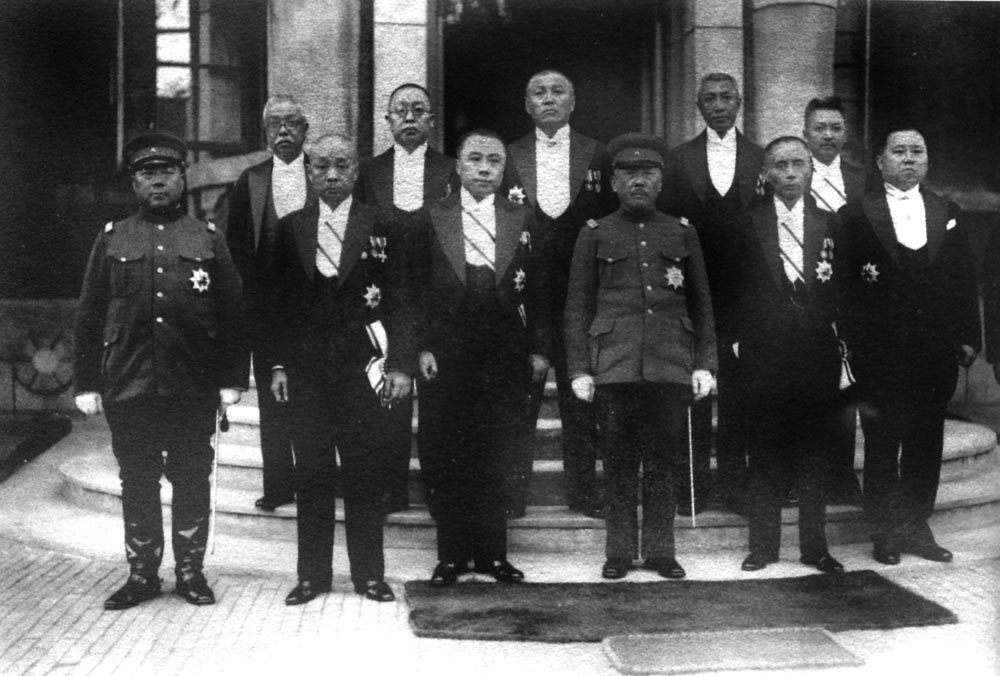

（满洲国内阁成员合影）

【九一八东北沦陷】

1931年9月18日，日本关东军在沈阳发动九一八事变，东北守军在“ 不抵抗”政策下溃不成军；第二天，日军占领沈阳，年底占领东北三省。

日本关东军一直试图建立亲日本的政权，扶植各地的亲日力量——如辽宁的臧式毅，吉林的熙洽，黑龙江的马占山等。以熙洽为首的满洲贵族投降后，向日本提出建议：迎接溥仪、另建新国家。日本关东军方面也认为溥仪是合适的执政人选。

1931年11月8日，奉天特务机关长土肥原贤二，将溥仪从天津日租界的住所秘密带出，经大沽口、营口、旅顺，抵达抚顺。

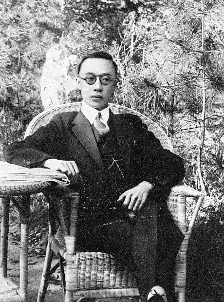

（1934年3月，为满州帝国皇帝的溥仪）

【建国前的准备】

1932年1月28日，原日本陆军大臣南次郎在满洲考察后，向日本天皇作了《满洲近况》的报告，建议建立“新国家”。他指出，如此可以方便日本今后进攻苏联“向北发展”，可使日本得到足够的资源，也可向满洲移民解决日本地狭人稠的问题。

1932年2月16日，关东军司令本庄繁召集臧式毅、熙洽、马占山等人，在沈阳大和旅馆召开“东北政务会议”，决定迎接溥仪为满洲国“执政”，并分配各人在政权中的职务。

2月18日，“东北行政委员会”发布《独立宣言》：“从即日起宣布满蒙地区同中国中央政府脱离关系，根据满蒙居民的自由选择与呼吁，满蒙地区从此实行完全独立，成立完全独立自主之政府。”

2月23日，板垣在抚顺与溥仪会面，告知溥仪出任满洲国“执政”。原本以为能够重登帝位的溥仪尽管对于“执政”的安排甚为失望，但只能接受。同时，日军攻占热河省，也纳入满洲国。

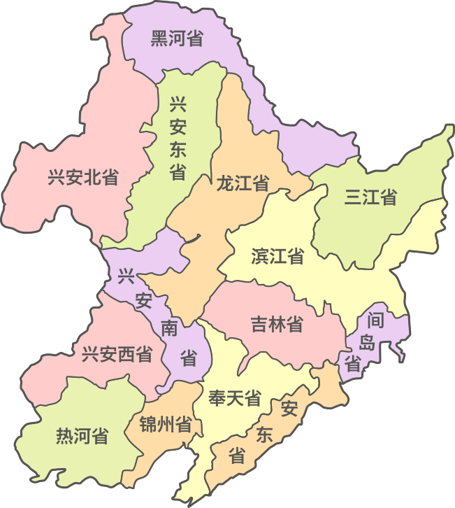

（满洲国行政区划（1934-1939））

【正式建立满洲国】

3月1日，发布《建国宣言》，成立满洲国，首都长春（后改名新京）。领土范围包括今辽宁、吉林和黑龙江3省全境（不含日据关东州，即今日大连），以及内蒙古东部、河北承德。

3月6日，溥仪从旅顺出发。3月9日，在长春吉长道尹公署旧址大堂举行就任仪式，宣布就任满洲国“执政”，年号“大同”。同时任命该国各府、院、部的负责官员，满洲国正式建立。

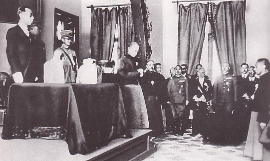

（溥仪参加满洲国执政就任式）

【称帝的日本傀儡】

1932年9月15日，日本与满洲签署《日满议定书》。《日满议定书》规定日本正式承认满洲国，并在满洲国驻军，负责满洲国的国防。同时规定由日本管理满洲国的铁路、港湾、航路、航空线等。此外，日本有权开发矿山，有权担任满洲国官吏，有权向满洲国移民等等。满洲国沦为日本的傀儡。

1934年3月1日，发布“满洲国组织法”。溥仪在长春由“执政”改称“皇帝”，改年号为“康德”，改“满洲国”为“大满洲帝国”，并在新京南郊杏花村举行登基典礼。

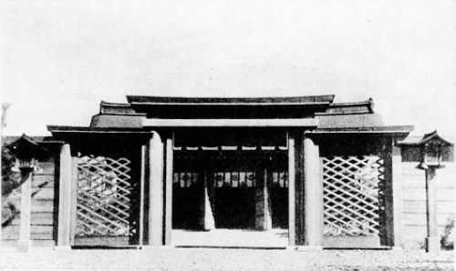

（满洲国的建国神庙）

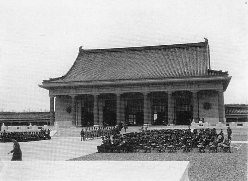

（满洲国的建国忠灵庙）

【14岁的短命鬼】

1945年8月8日，苏联对日本宣战。随后苏联红军攻入满洲，以绝对优势击败关东军和满洲国军。8月9日，溥仪迁都通化。8月11日，溥仪及满洲国政府官员开始乘火车撤退。8月13日晨到达通化市临江县（今临江市）大栗子车站。8月15日，日本天皇裕仁宣布无条件投降。

8月17日午夜至18日凌晨，溥仪在大栗子沟举行退位仪式，宣读《满洲国皇帝退位诏书》，不到14年的满洲国政府解散。19日，溥仪等人从通化乘小飞机飞往沈阳准备转飞日本，飞机在奉天机场降落后，溥仪等人被苏联红军俘虏，满洲国政权彻底终结。

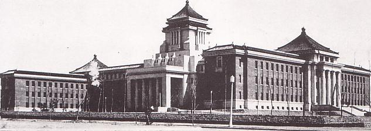

（满洲国的国务院）

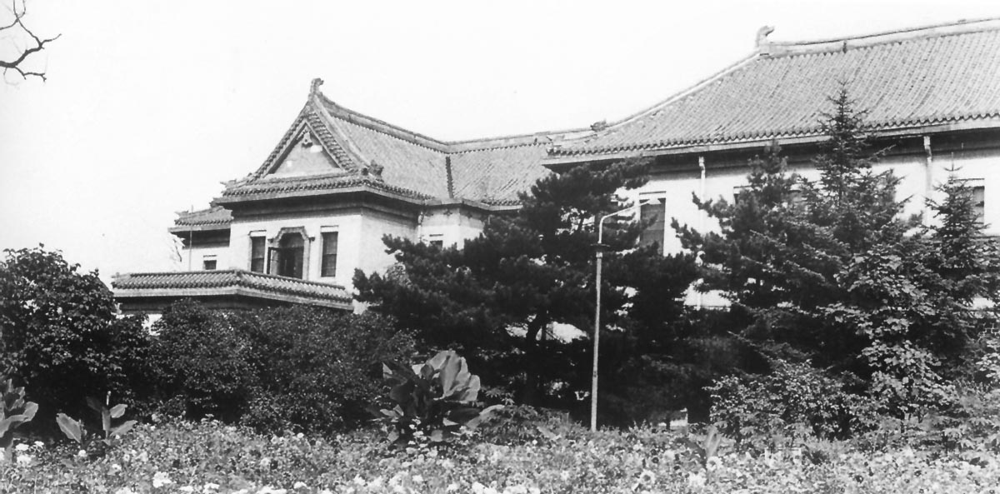

（满洲国帝宫）

【日本移民的天堂】

1932年，满洲国建立时总人口有3千4百万人，当中汉人占83%，满洲人与蒙古人合计占15%，日本人和朝鲜人则合计占2%。1932年，日本人在中国包含关东州在内有24万人。

日本“国策移民”活动计划20年内从日本向满洲移民100万户、500万日本人。到1945年终战之际，满洲国有150万日本人。在1945年后，大部分日本移民被遣返。

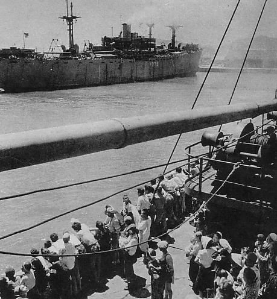

（从葫芦岛被遣返的日本人）

【王道乐土五族协和】

满洲国以“王道乐土，五族协和”为建国方针。根据《国本奠定诏书》，满洲国官方供奉日本神道教的天照大神，国家设有“建国神庙”和“建国忠灵庙”，被称为“满洲的靖国神社”。满洲国帝宫内设有祭祀府，负责国家的祭祀事宜。

满洲国国旗是五色旗，青色代表东方，红色代表南方，白色代表西方，黑色代表北方，黄色代表中央，寓意以中央行政统御四方。后来也解释为“红、蓝、白、黑、满地黄”象征满、汉、和、朝、蒙五族协和。

根据1943年出版的《满洲建国十年史》，当时世界上约有80个国家或政权，承认满洲国的共23个，包括：日本、苏联和东欧国家。

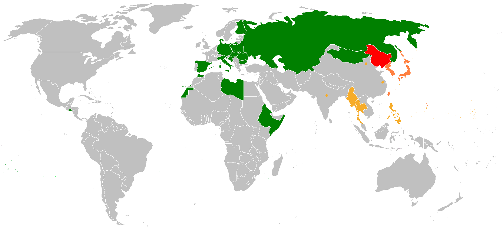

（承认满洲国的国家及政权（1943年））

【亚洲最强大的国家】

满洲地区物产丰富。自然资源匮乏的日本，为满足战争需要，实行“日满一体”政策。满洲国成立后，成为当时亚洲乃至世界经济成长最快的国家之一。

1933年至1936年，日本对满洲投资总计11亿6千万圆，80%都是投资满铁。1937年至1941年，进行第一次产业开发五年计划，日本投资达到50亿圆。1941年起，推行第二次产业开发五年计划，发展重点为钢铁、煤炭与农产品。到1945年时，由于中国和日本被战争拖累，偏安一方的满洲国的工业规模超越日本跃居亚洲第一。

满洲国的工业产值，在1936年为8.07亿元，1940年达到26.47亿元，年增长幅度超过60%。满洲国形成了较完整的工业体系，是亚洲工业最发达的地区之一，制造业一度超越日本。

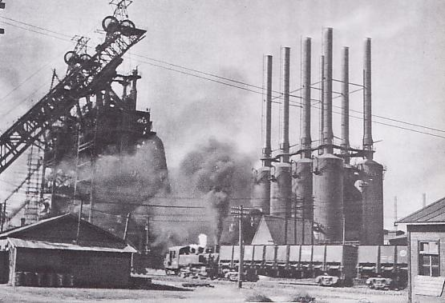

（鞍山昭和制钢所）

（满洲大量种植的鸦片）

【便利的交通路线】

满洲国境内铁路线稠密，最主要的干线为南满铁路（长春至大连）。到1939年，路线全长已超过一万公里，成为当时世界铁道运输最发达的国家之一。相较之下，1949年时全中国铁路总里程也只有22000公里。当时，在大连与哈尔滨之间运营的“超特急”列车“亚细亚号”，是满铁的象征。

1943年，满洲国公路总里程近6万公里，而1949年，中国（含满洲）公路总里程仅有8.09万公里。1932年，满洲国航空线总里程为1.5万公里，而1950年的中国民用航空线总里程才1.14万公里。

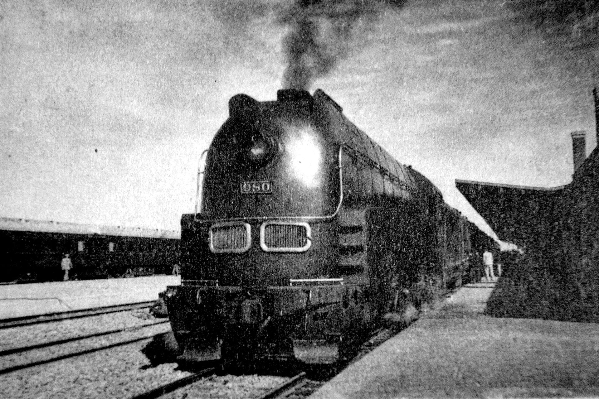

（“超特急”列车“亚细亚号”为当时满铁的象征）

【虚假的民族协和】

满洲作为傀儡政权，明显受到日本人的民族压迫。如：满洲国的电车，设置日本人搭乘的特等车厢，中国人不许进入。同样的工作，满洲人的工资不到日本人的30%。

日本人所倡导的“民族协和”，被东北人自嘲地解释成，‘协即协助’，‘和即大和’，就是‘协助大和民族侵略中国’的意思。
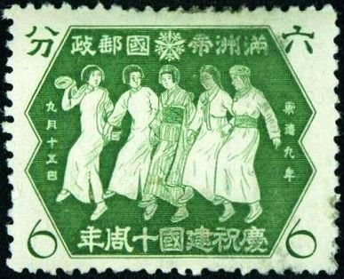

（1942年9月15日，发行的“庆祝建国十周年”纪念邮票，汉满日朝蒙五族少女携手行进）

【】

### 照片

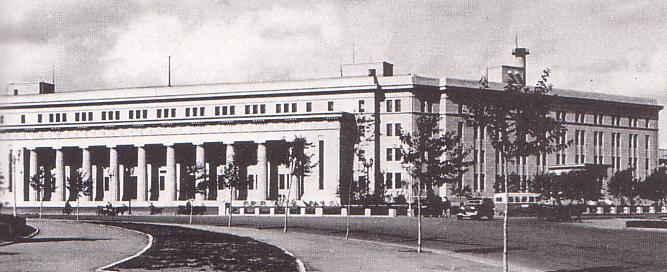

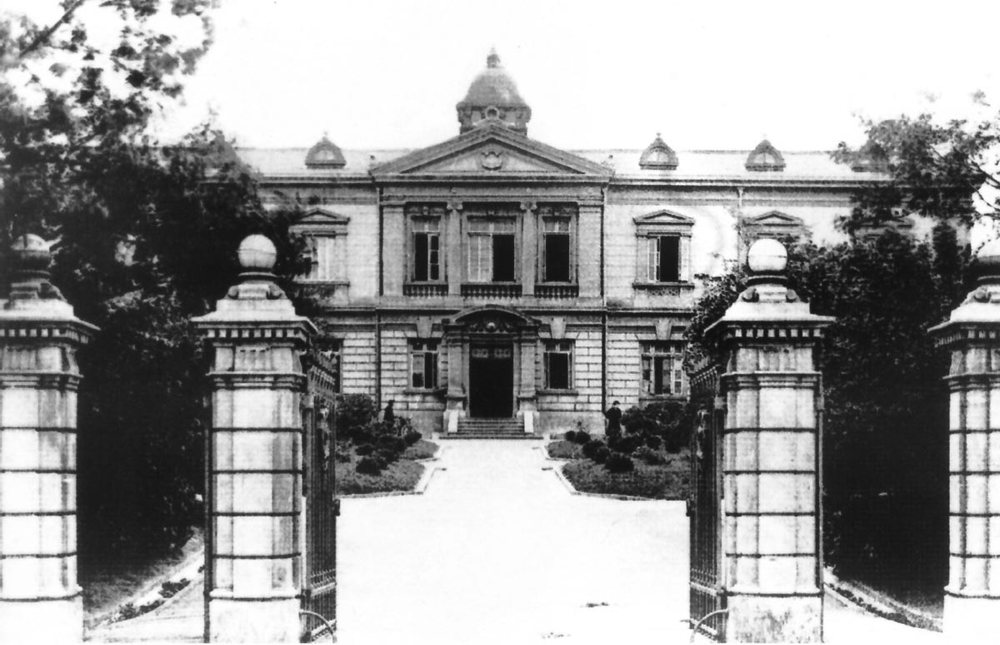