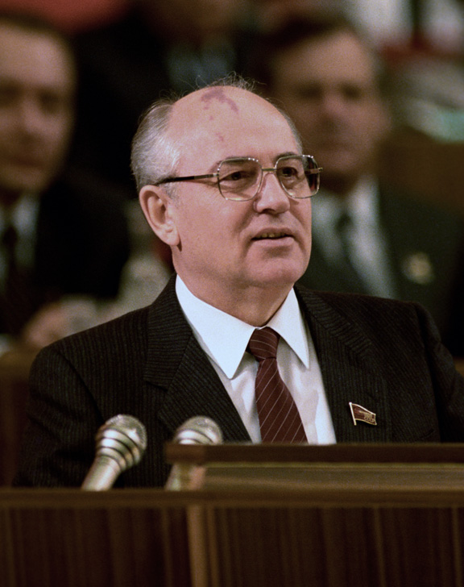
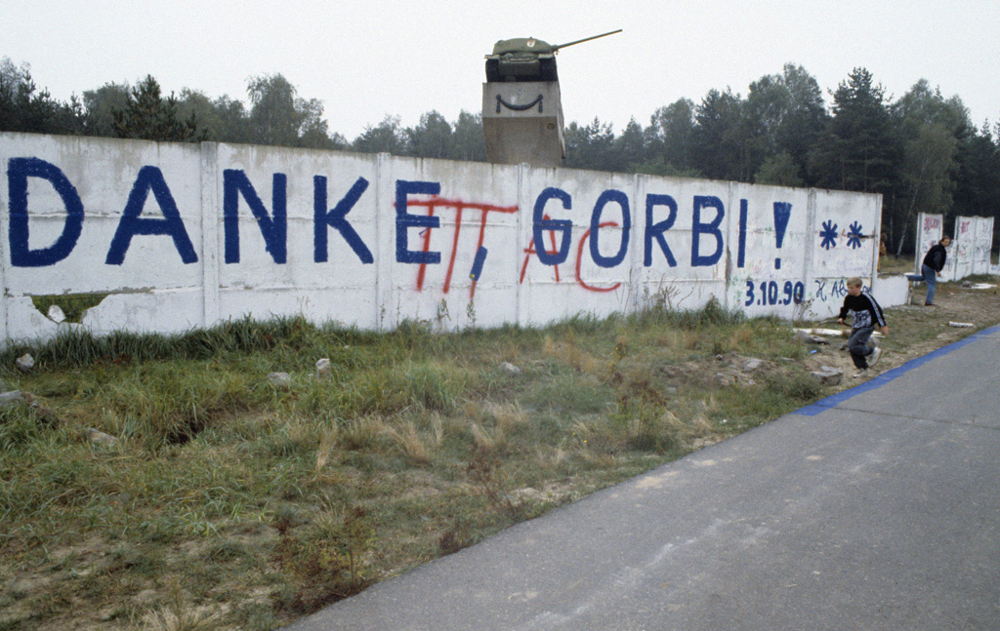
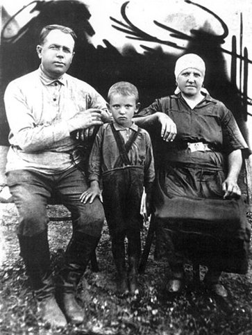
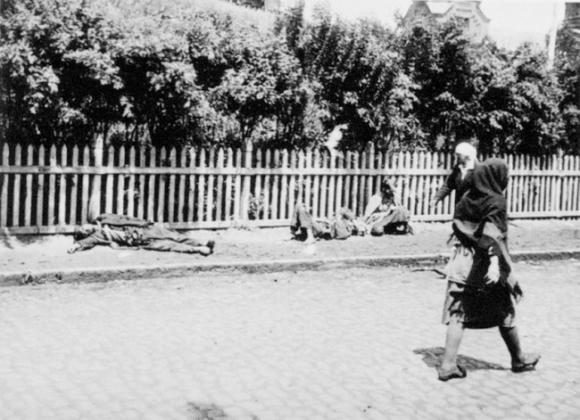
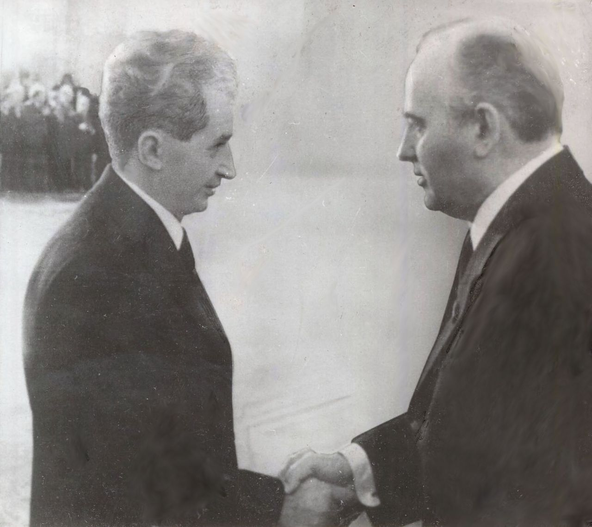
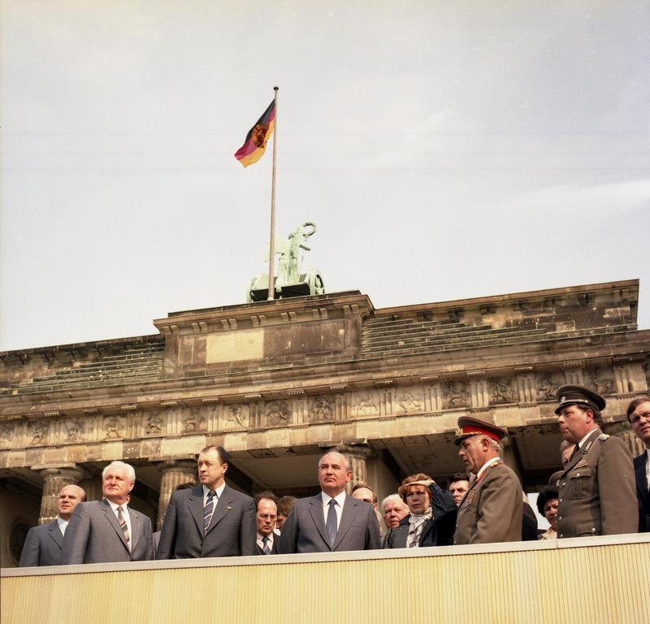
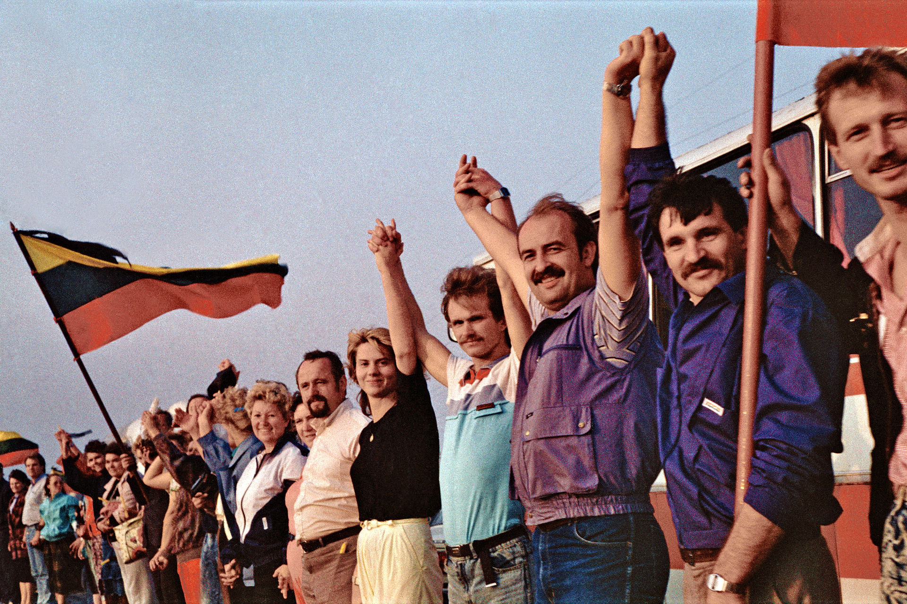
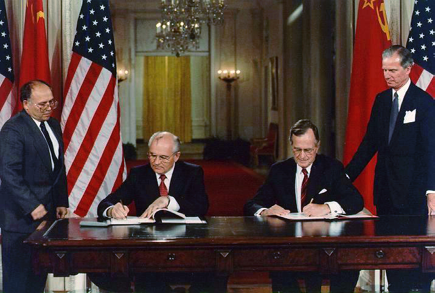
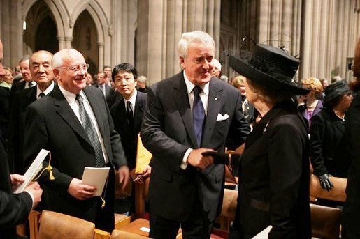
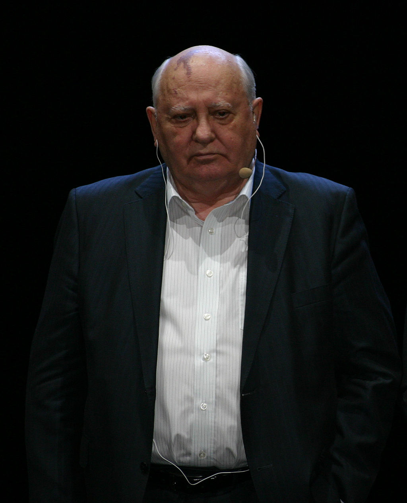

## nnnn姓名（资料）

适合所有人的历史读物。每天了解一个历史人物、积累一点历史知识。三观端正，绝不戏说，欢迎留言。  

### 成就特点

- ​
- ​

### 生平

戈尔巴乔夫小传：我搞改革开放，却搞垮了苏联，这是个教训

【1931年3月2日】87年前的今天，为100万冤案平反，终结冷战，终结苏联的戈尔巴乔夫出生

戈尔巴乔夫（1931年3月2日－），前苏联政治家，诺贝尔和平奖获得者。

他出任苏联总书记，进行改革开放。对斯大林时期的上百万人的冤案进行平反，开放媒体出版自由，并放弃苏联共产党的法定领导位置，演变为多党。结果导致东欧剧变，冷战结束，苏联也因此终结。

1990年，获得诺贝尔和平奖。戈尔巴乔夫的头上有一个显著的胎记，被中国网友戏称为“地图头”。

（1990年10月，柏林墙写出，谢谢你，戈比）

【经历大饥荒的农家少年】

1931年3月2日，戈尔巴乔夫出生于苏联斯塔夫罗波尔边疆区的一个农家。幼年时，经历了1932年苏联大饥荒，村里的人接近一半饿死。

14岁，戈尔巴乔夫加入共青团。1955年（24岁），从莫斯科国立大学的法学专业毕业，在大学期间结婚。毕业后，回到斯塔夫罗波尔，成为斯塔夫罗波尔市第一书记。

（1930年代，戈尔巴乔夫与他的外祖父母）

（1933年，苏联大饥荒时期路边的饿殍）

【苏联最年轻的总书记】

1961年（30岁），戈尔巴乔夫参加苏共二十二大。1970年（39岁），戈尔巴乔夫被任命为斯塔夫罗波尔边疆区党委第一书记，成为苏联最年轻的地方党委领导人之一。

1971年，他进入了苏联共产党中央委员会。1980年，成为中央政治局委员。在安德罗波夫统治期间（1982至1984年），戈尔巴乔夫已然成为最活跃的政治局委员之一。

1984年，苏共中央总书记安德罗波夫去世，虽然他曾表示希望戈尔巴乔夫继任总书记，然而，最后继任者却是高龄重病的契尔年科。1985年3月11日，在契尔年科死后三个小时，54岁的戈尔巴乔夫当选为总书记，成为苏联最高领导人，苏联最年轻的总书记。

（1985年，戈尔巴乔夫访问罗马尼亚）

【为百万人平反的大改革】

1986年2月，召开的第27次苏联共产党全国代表大会，他开始推行改革。首先削减军费，主动放弃了对军队的领导。当苏联军队从阿富汗撤军回国，居然没有得到任何领导人的接见。

鉴于斯大林时期的众多冤假错案，1987年9月，苏共中央政治局建立了一个委员会重审历史案件。在一年半的时间里，委员会为约100万公民平反。斯大林的政治反对派几十年沉冤得到平反昭雪。

接着，戈尔巴乔夫又开始政治体制改革。媒体审查机制和禁忌逐渐解除。原来被出版检查打入冷宫的作品纷纷出笼，数千部以前被称为特殊作品的著作得以出版。同时废除档案的禁令，使历史文献得以公开。

（1986年，戈尔巴乔夫访问东德）

（1987年12月9日，戈尔巴乔夫和里根夫妇在华盛顿）

【结束45年的冷战格局】

1988年，戈尔巴乔夫宣布苏联减少对东欧国家内政的干涉。这个政策导致东欧社会主义国家于1989年内发生了一系列剧烈的“政治地震”（大多是和平革命，但罗马尼亚发生了暴力事件），史称为“东欧剧变”。东欧剧变从实际上结束了从二战以后长达四十五年的全世界范围内冷战格局。

1990年3月，苏联人民代表大会通过决议，正式废除了宪法第六条关于“苏联共产党是苏联社会的领导力量和指导力量，是苏联社会政治制度以及国家和社会组织的核心”等规定，苏共不再有法定的领导地位。1990年3月15日，戈尔巴乔夫就任苏联首任，也是唯一一任总统。

1990年10月15日，戈尔巴乔夫于获诺贝尔和平奖。

（1989年8月23日，波罗的海之路中示威者的人链）

（1990年，戈尔巴乔夫和布什）

【苏联的终结者】

但是随著共产主义制度的崩溃，各加盟共和国的纷纷独立。1991年8月19日，一些保守派政治家和一部分军人趁戈尔巴乔夫在克里米亚度假时，发动了“八一九事件”，戈尔巴乔夫被软禁了三天。当他被释放后，时任俄罗斯加盟共和国总统的叶利钦已取代他成为全国领袖。

1991年12月25日，独立国家联合体成立，他被迫宣布辞职，苏联正式解体。

在苏联解体后的一段期间，俄罗斯人的生活水平大幅度倒退，卢布贬值，社会治安很糟糕。有好几年俄国人的平均寿命都缩短了，这是世界罕见的状况。有人认为，戈尔巴乔夫的改革应该为此负责。

.gif)

（戈尔巴乔夫的苏联共产党党证）

【对中国改革的忠告】

2006年2月28日（75岁），戈尔巴乔夫接受中国大陆《环球人物》杂志采访时候称：“我给中国朋友的忠告是：不要搞什么‘民主化’，那样不会有好结果！千万不要让局势混乱，稳定是第一位的。”

戈尔巴乔夫称：“我深深体会到，改革时期，加强党对国家和改革进程的领导，是所有问题的重中之重。在这里，我想通过我们的惨痛失误来提醒中国朋友：如果党失去对社会和改革的领导，就会出现混乱，那将是非常危险的。”

（2004年6月11日，戈尔巴乔夫出席里根的葬礼）

戈尔巴乔夫又称：“我们在没有做好准备的情况下，使苏联社会大开放。在残酷的国际竞争下，国内工业受到了致命打击。极少数人一夜暴富，敛财数额之巨仅次于美国的大亨，而赤贫的人数却远远超过了苏联时期。在这个方面，中国处理得很好。”

2011年，戈尔巴乔夫过80岁生日时，俄罗斯总统梅德韦杰夫宣布颁给他俄罗斯最高荣誉的“圣安德烈勋章”。3月2日，俄罗斯民间出现了自发的“感谢戈尔巴乔夫”运动，用各种形式对戈尔巴乔夫表示感谢。

（2013年的戈尔巴乔夫）

